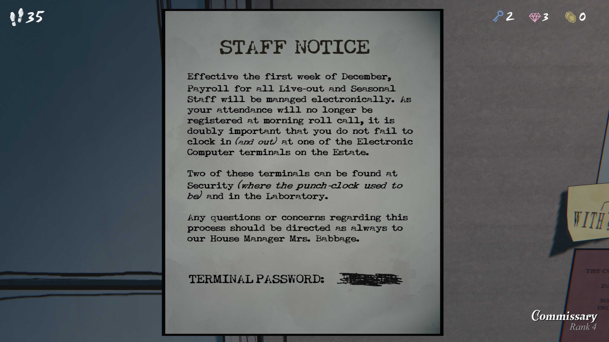

직원 공지 (STAFF NOTICE)

12월 첫째 주부터, 외부 거주 직원(Live-out) 및 계절직(Seasonal Staff) 의 급여는 전자 방식으로 관리됩니다.
출근 시 아침 점호에서 출석이 기록되지 않으므로, 반드시 전자 컴퓨터 단말기(Electronic Computer terminals) 에서 출근(Clock in) 및 퇴근(Clock out) 을 잊지 말고 기록해야 합니다.

이 단말기 중 두 대는 보안실(Security) — (예전 펀치 시계가 있던 곳) — 과 연구소(Laboratory) 에 위치해 있습니다.

이 과정과 관련된 문의사항이 있을 경우, 평소처럼 하우스 매니저 배비지 부인(Mrs. Babbage) 에게 문의하시기 바랍니다.

⸻

터미널 비밀번호 (TERMINAL PASSWORD): (검열됨 / 가려짐)

