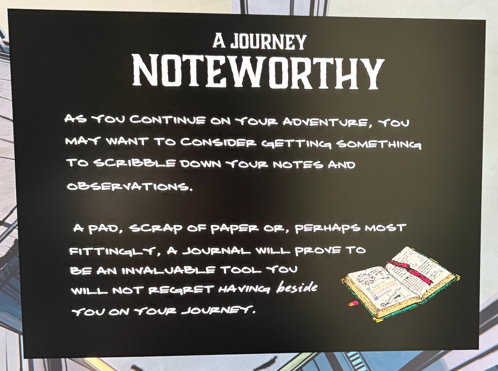

물론입니다. 이미지 속 영어 문장을 자연스럽게 한국어로 번역하면 다음과 같습니다.

⸻

A Journey — NOTEWORTHY

(여정 — 기록할 가치가 있는 것)

모험을 계속하다 보면,
자신의 메모나 관찰 내용을 끄적여 둘 무언가를 마련하는 게 좋을지도 모릅니다.

수첩이나 종이쪽,
혹은 가장 알맞게는 일기장(journal) 이
대단히 유용한 도구가 되어줄 겁니다.

그것을 곁에 두고 여행하는 걸 후회하지 않게 될 것입니다.

⸻

톤을 보면 플레이어에게 “노트를 써서 단서를 기록하라”는 게임 내 가이드 메시지로 보이네요.
즉, 앞으로 직접 메모하며 퍼즐이나 단서를 추적해야 할 시점을 암시하고 있습니다.

