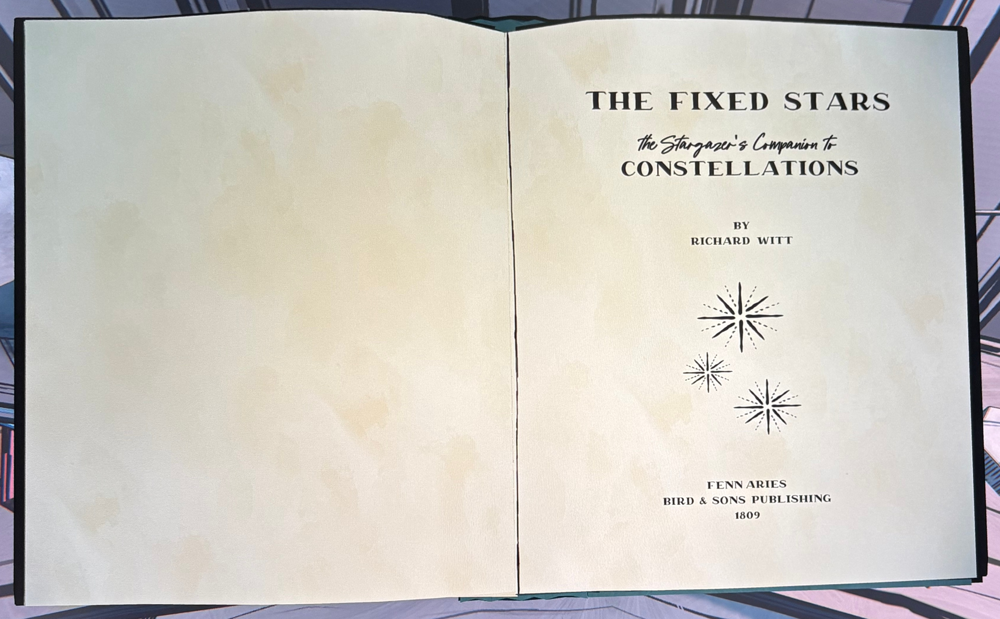
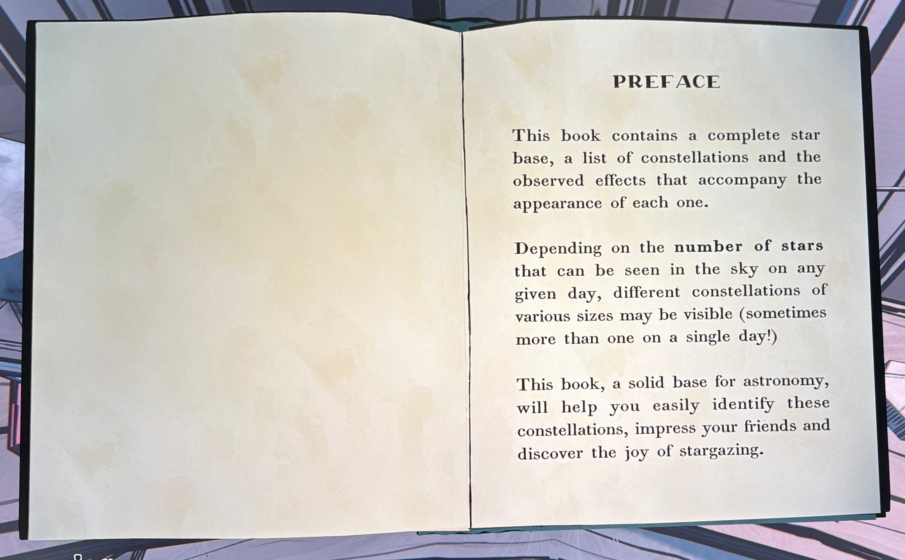
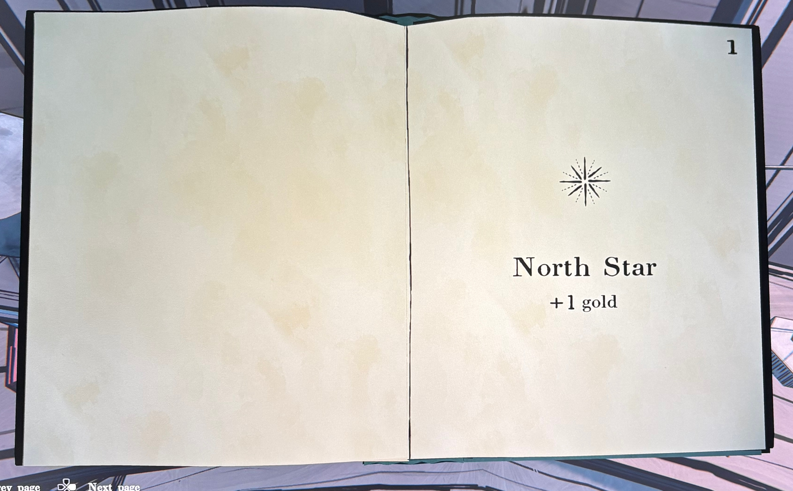
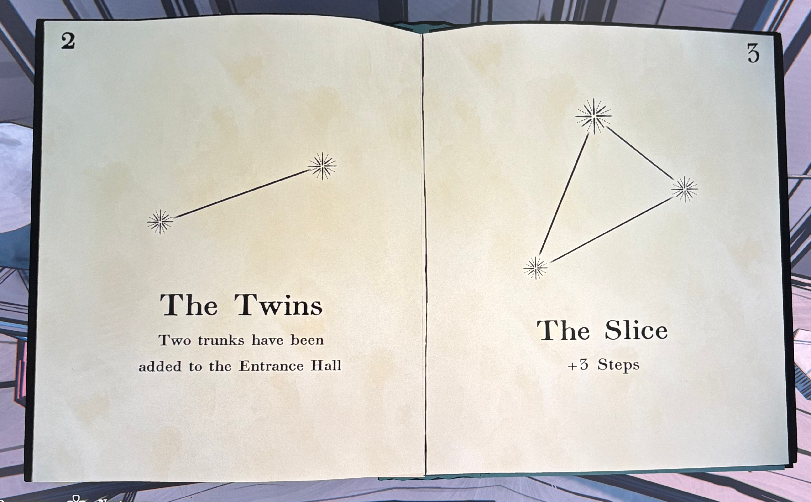
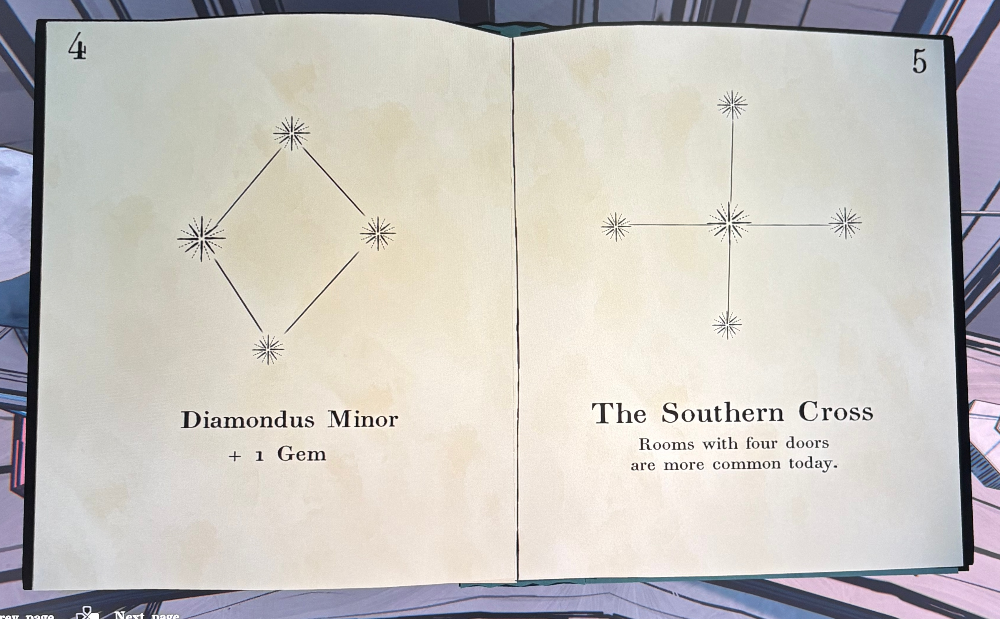
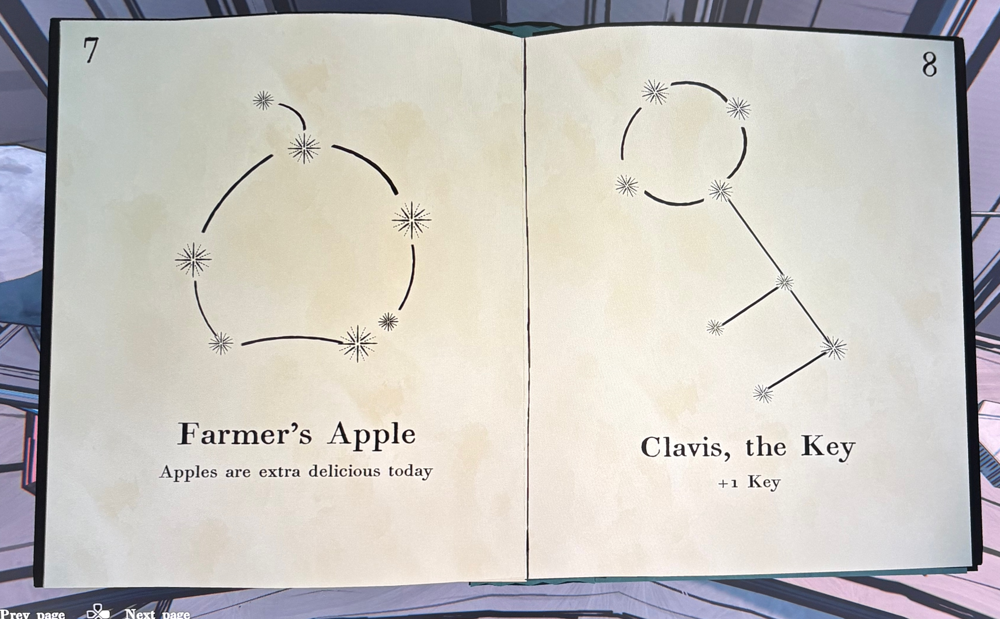
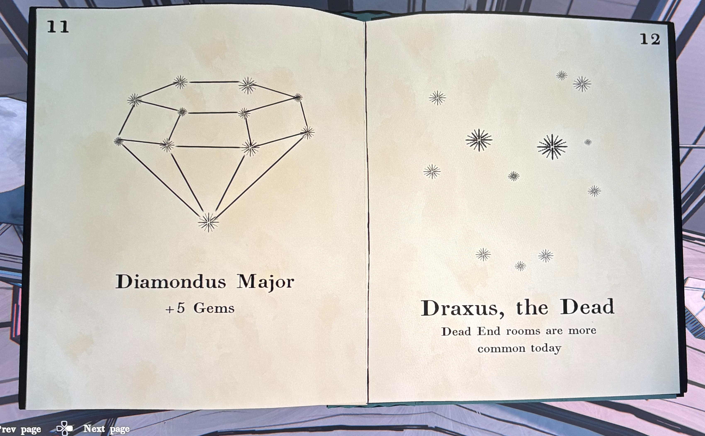
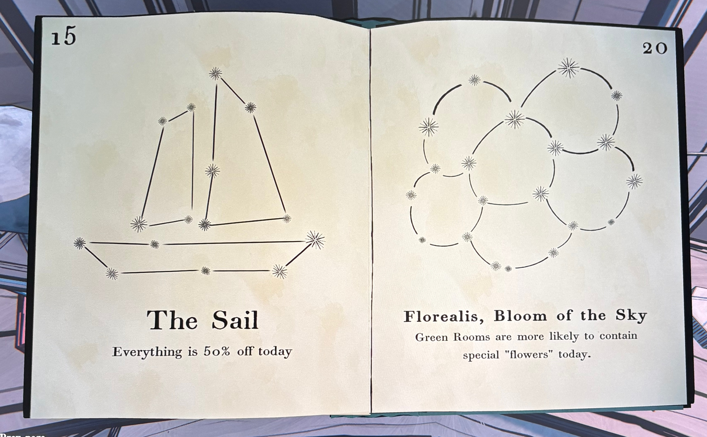

물론입니다 😊

이미지들에 나온 책 내용 전체를 순서대로 자연스럽게 한국어로 번역해드릴게요.

---

### **📘** 

### **THE FIXED STARS**

  

**별의 항성 — 천문 관측가의 별자리 안내서**

저자: **리처드 위트 (Richard Witt)**

출판: **펜 아리에스 (Fenn Aries), 버드 & 선즈 출판사 (Bird & Sons Publishing), 1809년**

---

### **📖** 

### **서문 (Preface)**

  

이 책은 완전한 별자리 목록을 포함하고 있으며,

각 별자리가 나타날 때 함께 관찰되는 **효과들**을 기록하고 있습니다.

  

날마다 하늘에서 보이는 **별의 개수**에 따라

크기가 다른 여러 별자리를 볼 수 있습니다.

(하루에도 두 개 이상 보이는 경우도 있습니다!)

  

이 책은 천문학의 훌륭한 입문서로,

당신이 별자리를 손쉽게 식별하고,

친구들에게 깊은 인상을 주며,

별을 바라보는 즐거움을 발견하도록 도와줄 것입니다.

---

### **⭐** 

### **1. North Star (북극성)**

  

**+1 골드**

---

### **⭐** 

### **2. The Twins (쌍둥이자리)**

  

현관 홀(Entrance Hall)에 **여행용 트렁크 두 개**가 추가되었습니다.

---

### **⭐** 

### **3. The Slice (조각선)**

  

**+3 걸음(Steps)**

---

### **💎** 

### **4. Diamondus Minor (작은 다이아몬드자리)**

  

**+1 보석(Gem)**

---

### **✝️** 

### **5. The Southern Cross (남십자성)**

  

**네 개의 문이 있는 방이 오늘 더 자주 나타납니다.**

---

### **🍎** 

### **7. Farmer’s Apple (농부의 사과자리)**

  

**오늘은 사과가 유난히 맛있습니다.**

---

### **🔑** 

### **8. Clavis, the Key (열쇠자리)**

  

**+1 열쇠(Key)**

---

### **💎** 

### **11. Diamondus Major (큰 다이아몬드자리)**

  

**+5 보석(Gems)**

---

### **☠️** 

### **12. Draxus, the Dead (죽은 자 드락서스 자리)**

  

**막다른 방(Dead End rooms)이 오늘 더 자주 나타납니다.**

---

### **⛵** 

### **15. The Sail (돛단배자리)**

  

**오늘은 모든 것이 50% 할인됩니다.**

---

### **🌸** 

### **20. Florealis, Bloom of the Sky (하늘의 꽃자리)**

  

**오늘은 초록색 방(Green Rooms)에서**

**특별한 ‘꽃(Flowers)’을 발견할 가능성이 더 높습니다.**

---

이 책은 게임 내에서 **별자리(Constellations)**를 발견할 때마다

특정한 **보너스나 환경 변화**를 알려주는 설정 자료로 보입니다.

예를 들어, ‘북극성’은 금화 보너스,

‘남십자성’은 네 개의 문이 있는 방 출현 확률 증가처럼

플레이어의 탐험 환경에 영향을 주는 천문 달력 역할을 합니다.

