# L2 Character Controller

M4 강의인 _To Space and Beyond_ 에서는 8방향으로 움직일 수 있고 영역을 감지할 수 있는 우주선을 만들었습니다.
하지만 이 우주선은 어떤 것에도 부딪힐 필요가 없었지요. 이렇게 작동하는 게임은 거의 없습니다!


게임에는 장애물, 부딪힐 수 있는 요소들, 그리고 움직임을 제한할 벽이 필요합니다. 그렇지 않으면 레벨 디자인 자체가 불가능해집니다!

이번 강의에서는 CharacterBody2D 노드를 사용하여 캐릭터를 위한 탑다운 방식의 컨트롤러를 직접 코딩해보시게 됩니다. 
우리 캐릭터는 M4에서 만든 우주선처럼 움직이지만, 몇 강의 뒤에 벽과 장애물을 추가하게 되면 그 차이가 분명히 드러날 것입니다.


이번 강의에서는 다음과 같은 내용을 배우시게 됩니다:

- 탑다운 방식의 캐릭터 컨트롤러 만들기
    
- 캐릭터를 여러 방향으로 움직이기
    
- CharacterBody2D 노드가 무엇이며, 이를 어떻게 사용하는지 학습하기
    
우선, **충돌(collision)** 에 대해 이야기해보겠습니다.

---

## P1 What the computer sees

게임에서 캐릭터를 움직일 때는 보통 두 개의 평행한 객체가 함께 움직입니다. 하나는 플레이어가 보게 되는 **시각적 레이어**,
다른 하나는 컴퓨터가 플레이어가 이동할 수 있는지 없는지를 판단하는 **물리 레이어**입니다. 예를 들어, 플레이어가 보는 화면이 다음과 같다고 가정해봅시다:


컴퓨터가 보는 화면은 다음과 같을 수 있습니다:

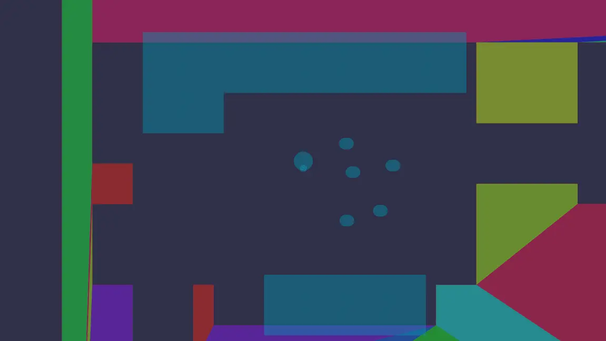
  
**물리 레이어**는 일반적으로 원이나 사각형과 같은 기하학적 도형들로 구성되어 있어, 컴퓨터가
[Collisions](../../Glossary/Collisions.md)을 효율적으로 감지할 수 있게 해줍니다.

충돌이란 두 개의 기하학적 도형이 겹쳐졌을 때 발생합니다. 이 경우, 물리 엔진은 도형들이 더 이상 겹치지 않도록 서로 밀어내는 처리를 합니다.
이 연산은 렌더링 전에 한 프레임 안에 처리되므로, 플레이어는 이를 시각적으로 인식하지 못합니다. 예를 들어, 플레이어가 벽에 부딪히면
캐릭터가 벽에서 멈춘 것처럼 보이게 됩니다.

개발자인 우리는, **게임의 물리 레이어와 시각적 레이어가 잘 맞아떨어지는 듯한 착각을 줄 수 있는 도형들** 을 찾아내는 역할을 하게 됩니다.

>[!info]- 컴퓨터는 왜 충돌을 감지할 때 기하학적 도형을 사용할까요?
>컴퓨터가 충돌을 감지할 때 기하학적 도형을 사용하는 이유는 **성능 때문** 입니다.
>
>가장 간단한 도형인 **원(circle)** 을 예로 들어보겠습니다. 두 원이 겹쳐지는지를 알아내기 위해서는 각 원의 중심 좌표와 반지름만 알면 됩니다. 두 중심 사이의 거리가 반지름의 합보다 작다면, 두 원은 겹친 것입니다.
> 
> 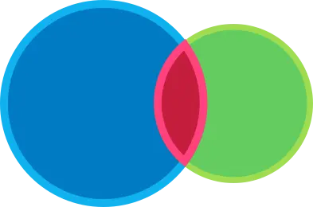
> 
> 이것은 컴퓨터가 매우 빠르게 계산할 수 있는 간단한 공식입니다.
>
> 그런데 만약 충돌 감지를 위해 **스프라이트 자체** 를 사용한다고 상상해보세요. 스프라이트는 수만 개에서 수십만 개의 픽셀로 이루어져 있을 수 있습니다. 두 객체가 충돌했는지 알아내려면, 한 스프라이트의 외곽에 있는 거의 모든 픽셀을 다른 객체의 픽셀과 비교해야 합니다. 이는 엄청난 양의 연산이 필요합니다! 반면 기하학적 도형을 사용하는 방식은 훨씬 빠릅니다.
>
> 또 다른 이유는, **단순한 기하학적 도형이 더 부드러운 상호작용을 만들어내기 때문** 입니다. 예를 들어, 원 형태는 벽이나 경사면을 따라 자연스럽게 미끄러지듯 움직일 수 있지만, 픽셀 단위의 완벽한 충돌 감지는 각이 많은 구조로 인해 객체가 떨리거나 끼어 있는 것처럼 보일 수 있습니다.

좋습니다. 그러니까 게임 엔진은 객체들이 겹쳤는지를 감지하고 충돌을 처리하기 위해 **물리 도형(physics shapes)** 을 사용합니다. 그렇다면 Godot에서는
이러한 충돌을 어떻게 설정할 수 있을까요? 플레이어가 조작하는 캐릭터의 경우, CharacterBody2D 노드를 사용할 수 있습니다.

---

## P2 The CharacterBody2D node

Godot에는 게임 세계와 충돌해야 하는 캐릭터를 위해 특별히 설계된 노드인 CharacterBody2D가 있습니다. 이 노드는 캐릭터를 움직이고 충돌을 처리하기
위한 다양한 기능을 갖추고 있으며, move_and_slide() 함수는 많은 기술적인 세부 사항을 자동으로 처리해줍니다. 이 함수 덕분에 캐릭터는 경사면이나 벽에
부딪힐 때도 부드럽게 움직일 수 있습니다.

CharacterBody2D는 2D 게임에서 플레이어 캐릭터를 구현할 때 아마도 가장 일반적으로 사용되는 노드입니다. 이 노드를 사용하면 _The Binding of Isaac_ ,
_Celeste_ , _Dead Cells_ 같은 게임에서 볼 수 있는 캐릭터나 몬스터도 구현할 수 있습니다.

>[!info]- 다른 종류의 물리 노드는 무엇이 있을까요?
> 대부분의 게임 엔진과 마찬가지로, Godot에는 네 가지 주요 물리 노드가 있습니다:
> 
> - **Area2D 노드** 는 다른 물리 노드와의 겹침(overlap)을 감지하지만 충돌은 처리하지 않습니다. 특정 영역에 진입했는지 감지하거나, 상호작용을 유발하거나, 아이템을 습득하거나, 총알을 발사할 때 등에 사용됩니다.
>
> - **CharacterBody2D 노드**는 충돌을 감지하고, 울퉁불퉁한 지형에서도 캐릭터를 부드럽게 움직일 수 있게 해줍니다. 특수한 함수를 통해 움직임을 정밀하게 제어할 수 있어, 캐릭터 컨트롤러를 만드는 데 매우 적합합니다. 캐릭터, 차량, 적, 그 외 이동이 필요한 오브젝트에 잘 어울립니다.
>
> - **RigidBody2D 노드**는 현실 세계의 물리 현상을 시뮬레이션하는 오브젝트입니다. 충돌하고, 튕기고, 떨어지고 등 다양한 물리 반응을 보여줍니다. 힘(force), 충격(impulse) 등을 설정해야 하므로 다른 노드보다 다루기 까다롭습니다. 공, 나무 상자, 파편처럼 현실적인 반응이 필요한 오브젝트에 적합하며, _Angry Birds_ 같은 게임의 새나 차량에도 사용됩니다.
>
> - **StaticBody2D 노드**는 CharacterBody2D나 RigidBody2D 노드의 **정적인 장애물** 역할을 합니다. 움직이지 않는 벽이나 바닥 등에 사용할 수 있습니다. 움직이는 발판이나 장애물처럼 플레이어나 적을 막아야 하는 움직이는 오브젝트를 만들고 싶다면, 이 노드의 변형인 AnimatableBody2D 노드를 사용하시면 됩니다.
> 
> 이번 모듈에서는 CharacterBody2D를 사용해 캐릭터 컨트롤러를 만들고, StaticBody2D를 사용해 벽을 구현할 예정입니다.

>[!info]- 그렇다면 캐릭터에는 보통 CharacterBody2D 노드를 사용하는데, 왜 이전에는 Area2D 노드를 사용했을까요?
> 아하! 그건 모두 하나의 **복선**이었습니다!
>
> 초반에 Area2D 노드를 사용했던 이유는, 엔티티 간의 간단한 물리 상호작용을 소개하기 위함이었습니다. M4에서 우주선을 Area2D 노드로 만든 것은 이후 두 모듈에서 소개된 수집 아이템과 보물 상자를 준비하기 위한 과정이었습니다. 또한, 캐릭터 컨트롤러나 충돌 설정과 같은 약간의 복잡함 없이도 **물리 상호작용과 속도 개념**을 소개할 수 있는 좋은 방법이기도 했습니다.
>
> 이러한 흐름 덕분에 이제 CharacterBody2D 노드를 배우는 것이 더 쉬워질 것이며, 캐릭터 애니메이션과 보는 방향을 다루는 방법도 자연스럽게 배울 수 있게 됩니다. 그리고 실제로 여러분은 종종 움직이는 영역(Area)을 만들거나, 플레이어 캐릭터에 Area를 붙여 함께 움직이게 해야 할 때가 많기 때문에, 지금까지 배운 내용은 여전히 유용합니다!

이제 코딩을 시작할 시간입니다! 아직 열지 않으셨다면, 이번 프로젝트의 워크북인 **M09. Top Down Movement (Workbook)** 을 열어주시고 함께 시작해봅시다.

---

## P3 Building the runner scene

우선, 플레이어 캐릭터를 위한 씬을 설정하겠습니다. 여러분은 다음과 같은 작업을 하게 됩니다:

- 캐릭터를 움직이기 위해 CharacterBody2D를 루트 노드로 하는 씬을 생성합니다.
    
- CharacterBody2D의 자식으로 CollisionShape2D 노드를 추가합니다.
    
- 캐릭터의 모습을 그리기 위해 Sprite2D 노드를 CharacterBody2D의 자식으로 추가합니다.

새로운 씬을 생성하고 루트 노드를 CharacterBody2D로 설정한 후, 씬의 이름을 **Runner** 로 지정해 주세요. 그러면 노드 옆에 경고 아이콘이 표시되는
것을 볼 수 있습니다. 경고 메시지는 다음과 같습니다: “이 노드에는 모양(shape)이 없기 때문에 다른 객체와 충돌하거나 상호작용할 수 없습니다.
자식 노드로 CollisionShape2D 또는 CollisionPolygon2D를 추가하는 것을 고려해보세요.”

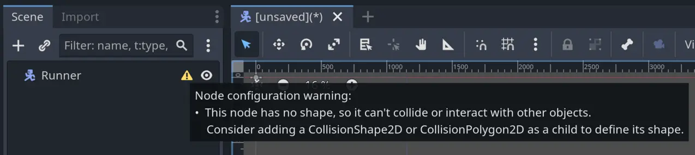

M4, M5, M6에서 만들었던 Area 노드들과 마찬가지로, **모든 물리 노드**는 게임의 물리 엔진과 상호작용하기 위해 **충돌 모양(Collision Shape)** 이
필요합니다. 물리 엔진은 이 모양을 기준으로 충돌을 감지합니다. Godot는 하나의 객체에 여러 모양을 사용할 수 있도록 [Composition](../../Glossary/Composition.md) 방식을 사용하기 
때문에, 충돌 모양은 전용 노드인 CollisionShape2D를 통해 설정됩니다.

CharacterBody2D의 자식으로 CollisionShape2D 노드를 추가하세요. 그런 다음 **인스펙터(Inspector)** 에서 **Shape** 속성에 CircleShape2D를
할당해 주세요. 씬의 가운데로 줌인해보면, 아주 작은 파란색 원이 보일 것입니다. 곧 이 원을 더 크게 조정하게 될 것입니다.

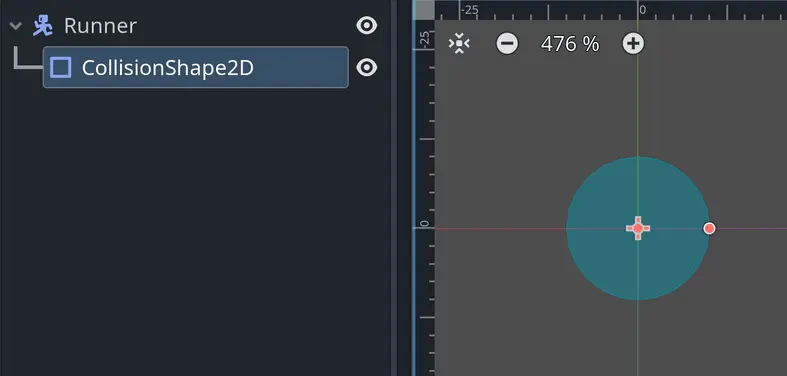

Godot에서는 물리 노드와 충돌 모양만 있으면 상호작용을 만들 수 있습니다. 하지만 플레이어를 위해서는 시각적인 요소가 필요합니다.
CharacterBody2D의 자식 노드로 Sprite2D 노드를 추가해주시고, 해당 Sprite2D의 이름을 Skin으로 변경해주십시오.


그 다음, res://assets 디렉터리에 있는 runner_down.png 텍스처를 Skin 노드의 Texture 속성으로 끌어다 놓아주시기 바랍니다.
나중에는 코드를 통해 이 이미지를 변경하겠지만, 지금은 충돌 모양의 크기를 올바르게 조정하기 위해 시각적인 참조가 필요합니다.

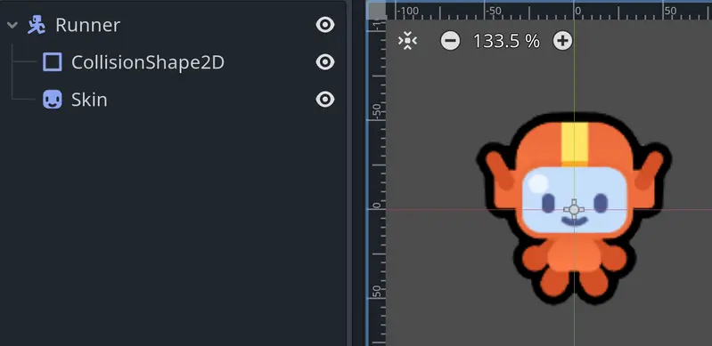

**참고:** 지금처럼 하나의 이미지만으로 게임을 프로토타입하는 경우가 자주 있습니다. 우리는 현재 게임잼 상황을 가정하고 있으므로,
임시 아트를 사용하고 있는 것입니다. 이 모듈의 뒷부분에서는, 아직 캐릭터 애니메이션을 완성 중인 아티스트로부터 완전한 애니메이션 캐릭터를 받게 될 예정입니다.

이제 충돌 모양을 스프라이트에 맞게 크기 조절할 수 있습니다… 잠깐만요! 스프라이트 뒤에 숨어 있네요!

노드들은 씬 트리에서 위에서 아래 순서로 그려집니다. 충돌 원이 스프라이트 앞에 보이도록 하려면, Scene 독에서 Sprite2D 노드가 CollisionShape2D 
노드보다 위에 있어야 합니다. Skin 노드를 CollisionShape2D 노드 위로 끌어올려 주십시오. 그러면 스프라이트 위에 충돌 원이 그려지는 것이 보이실 겁니다.

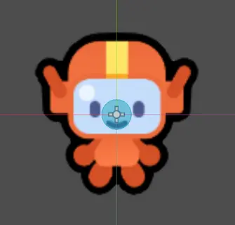

탑다운 게임에서는 충돌 모양이 캐릭터의 발 주위에 위치할 때 충돌이 훨씬 자연스럽게 느껴집니다. 그렇지 않으면 캐릭터가 벽에서 멀리 떨어진 곳에서 멈추는 것처럼
보일 수 있습니다.

CollisionShape2D 노드를 아래쪽으로 조금 이동시켜서 캐릭터의 다리 부분에 오도록 해주십시오. Select 또는 Move 도구를 선택한 상태에서 Shift
키를 누른 채 클릭하고 드래그하시면 한 축으로만 이동할 수 있습니다. 또한 키보드의 ↓ 키를 눌러 선택한 노드를 조금씩 이동할 수도 있습니다.

그런 다음 Inspector에서 CircleShape2D 리소스를 확장하고, 반지름(Radius)을 늘려서 발을 대략적으로 덮을 수 있도록 조정해주십시오. 
저는 23픽셀로 설정했습니다. 또한 씬 뷰 안의 주황색 원을 클릭하고 드래그해서 시각적으로 크기를 조정하실 수도 있습니다.

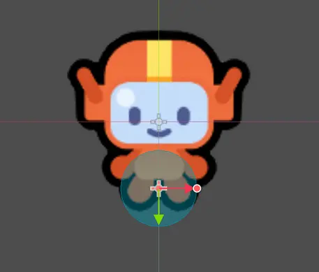

>[!info]- 충돌 모양의 적절한 크기는 얼마인가요?
>상황에 따라 다릅니다! 충돌 모양이 작을수록 캐릭터가 무언가에 부딪힐 가능성이 줄어듭니다. 적절한 크기는 보통 시행착오를 통해 찾게 됩니다. 보기에도 괜찮아 보이는 크기를 먼저 설정한 뒤, 플레이 테스트를 하면서 조금씩 조정해보시기 바랍니다.

최종적으로 완성된 씬은 다음과 같은 모습이어야 합니다:

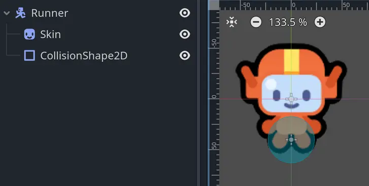
 
이제 캐릭터 설정이 완료되었습니다!  씬을 res://lessons 폴더에 runner.tscn이라는 이름으로 저장해주시기 바랍니다. 
이제 캐릭터를 움직이게 만들어보겠습니다.

---

## P4 Moving the character

이 프로젝트에는 제가 미리 입력 액션(Input Action)을 설정해 두었으니, 바로 코딩으로 들어가실 수 있습니다! 해당 입력 액션은
**Project > Project Settings… > Input Map** 메뉴에서 확인하실 수 있습니다.

Runner 노드에 스크립트를 연결해 주십시오. 기본적으로 에디터는 CharacterBody2D 노드에 맞춘 템플릿을 사용할 것입니다. 
기본 옵션을 그대로 수락하고 저장하시면 됩니다.

Godot이 기본 템플릿에서 자동으로 채운 코드를 살펴보실 수 있습니다. 이 기본 스크립트는 많은 플랫폼 게임에서 유용한 출발점이 되는 코드입니다.
해당 스크립트는 캐릭터에 중력을 적용하고, 좌우 방향키로 움직이며, 스페이스 바를 누르면 점프할 수 있게 해 줍니다. 하지만 지금 바로 실행해 보면
캐릭터가 아래로 떨어지기만 할 것입니다. 왜냐하면 아직 바닥이 없기 때문입니다.


>[!info]- 내 캐릭터는 게임 창의 왼쪽 위에서 떨어지는데, 왜 선생님의 화면과 다른가요?
>강의를 작성할 때에는 여러분이 내용을 더 쉽게 이해하실 수 있도록, 노드의 위치를 옮기거나 임시로 Camera2D를 추가하여 이미지나 영상 클립을 만듭니다. 영상과 동일한 장면을 재현하고 싶다면, Runner 노드를 **일시적으로 게임 창 중앙으로 이동**시키면 됩니다. 단, 나중에 원래 위치로 다시 돌려놓는 것을 잊지 마세요.

하지만 우리는 플랫폼 게임을 만드는 것이 아닙니다! 이것은 탑다운(top-down) 방식의 게임 캐릭터입니다.
그러므로 원하신다면 코드를 읽어보셔도 되지만, **첫 번째 줄인 extends CharacterBody2D를 제외하고는 모두 삭제하셔도 괜찮습니다.**

>[!info]- 템플릿의 점프 메커니즘을 테스트해보고 싶다면 어떻게 하나요?
>플랫포머 캐릭터 템플릿을 완전히 시험해보고 싶으시다면, 다음과 같이 하실 수 있습니다:
>
>- 새 씬을 생성합니다.
>- 새 씬에 러너 씬을 인스턴스화합니다.
>- 씬에 StaticBody2D 노드를 추가하고, 그 자식으로 CollisionShape2D 노드와 RectangleShape2D 리소스를 추가하여 게임 창 하단을 덮는 바닥 역할을 하도록 합니다.
> 
>씬은 다음과 같은 모습이 되어야 합니다:
> 
>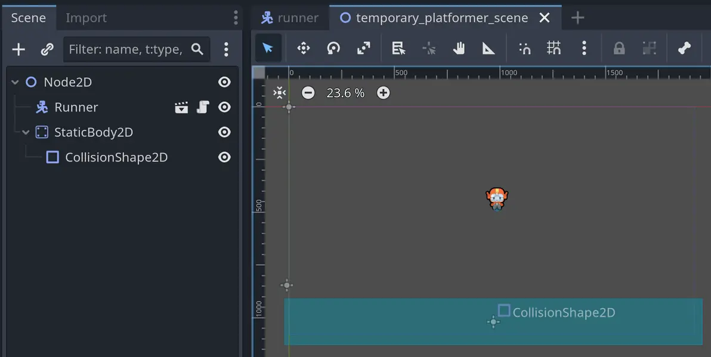
>
>그런 다음, 메뉴 항목에서 **Debug > Visible Collision Shapes** 체크박스를 켜주시기 바랍니다. 이 옵션을 활성화하면 실행 중인 게임에서 콜리전 쉐이프가 보이게 됩니다. 이 옵션을 켜지 않으면, 방금 만든 바닥이 보이지 않게 됩니다.
>
>마지막으로, 씬을 실행하시면 캐릭터를 움직이고 점프해보며 재미있게 테스트하실 수 있습니다!
>
>
>
>작업을 마치신 후에는, 이 임시 씬과 코드를 꼭 삭제하시고 러너 씬으로 돌아가시기 바랍니다.

템플릿 코드를 삭제하신 후에는 max_speed 변수를 추가해보겠습니다:

```gdscript
var max_speed := 600.0
```

**참고:** 이 변수 이름은 max_speed이지만, 아직 속도 변화는 없습니다. 나중에 속도 변화 기능을 추가하실 예정입니다. 현재로서는 캐릭터의
이동 속도를 의미합니다.

마지막으로, 캐릭터의 움직임을 코드로 구현해보겠습니다. 먼저 코드를 읽어보신 후, 곧바로 설명을 드리겠습니다:

```gdscript
func _physics_process(_delta: float) -> void:
	var direction := Input.get_vector("move_left", "move_right", "move_up", "move_down")
	velocity = direction * max_speed
	move_and_slide()
```

좋습니다, 이제 하나씩 설명드리겠습니다:

1. 우선, process() 대신 Godot의 \_physics_process() 함수를 사용합니다. 충돌, 물리, 움직임과 관련된 모든 동작은 이 [[Physics Process Function]] 안에서 이루어져야 합니다. 이에 대해서는 아래에서 더 자세히 설명드리겠습니다.
   
2. 다음으로, 플레이어가 움직이려는 방향을 계산하기 위해 Godot의 편리한 Input.get_vector() 함수를 사용합니다. 이 함수는 이미 정규화된 방향 벡터를 반환해 줍니다. 이 함수는 네 개의 인자를 받는데, 각각 왼쪽, 오른쪽, 위쪽, 아래쪽 이동을 위한 입력 액션의 이름입니다. 이는 M4에서 사용했던 방향 계산 코드를 간단하게 만들어 주는 단축 방법입니다.
   
3. 속도 벡터는 방향 벡터에 max_speed 변수를 곱해서 계산합니다. CharacterBody2D 노드에는 velocity라는 내장 속성이 있어서, 캐릭터가 얼마나 빠르게 움직일지를 정의할 수 있습니다.
   
4. 마지막으로, move_and_slide() 함수를 호출합니다. 이 함수는 CharacterBody2D 노드에 기본적으로 포함된 함수로, 설정된 속도 벡터에 따라 캐릭터를 이동시키고 환경과의 충돌도 처리해 줍니다. 이 함수의 효과는 L4에서 장애물을 추가했을 때 확인하실 수 있습니다.

>[!info]- 왜 이번 강의 초반에는 Input.get_vector()를 사용하지 않았을까요?
>이전 프로젝트에서는 Input.get_axis()를 사용했는데, 그 이유는 더 범용적이기 때문입니다. Input.get_axis()는 사이드 스크롤 게임이나 다양한 조작 방식이 있는 게임에서도 사용할 수 있습니다. 반면에 Input.get_vector()는 주로 탑다운 방식의 게임에 특화되어 있습니다.
>
>또한 Input.get_axis()를 사용함으로써 입력 방향을 계산하는 방법을 설명할 기회가 되었습니다. 이 과정에서 벡터를 정규화하는 개념을 배우실 수 있었고, 이는 게임 개발에서 매우 중요한 기초 개념입니다. 정규화는 입력 방향 계산뿐만 아니라, 예를 들어 충돌한 표면의 각도를 감지하거나, 오브젝트의 방향을 계산하거나, 3D 모델에 빛과 그림자를 적용할 때 등 다양한 상황에서 사용됩니다.

이번 레슨에서 새롭게 등장한 함수가 \_physics_process()입니다. 앞서 언급한 것처럼, 물리와 관련된 코드는 \_process() 대신 
\_physics_process()에서 처리해야 합니다. 그 이유는 무엇일까요?

그 이유는 CharacterBody2D 노드가 게임 세계의 다른 물리 오브젝트들과 동기화되어야 하기 때문입니다.
또한, 물리 엔진은 버그를 방지하기 위해 물리 시뮬레이션을 일정한 시간 간격으로 실행해야 합니다.

\_process() 함수는 프레임마다 Godot이 계산하는 데 걸리는 시간에 따라 계속 변하는 delta 값을 받습니다. 
만약 게임이 일시적으로 멈추거나 느려지면 delta 값이 매우 커질 수 있습니다. 그 결과, \_process()에서 움직이는 게임 오브젝트들이 벽이나 바닥을
뚫고 지나가는 현상이 발생할 수 있습니다. 반면에 \_physics_process() 함수는 기본적으로 1/60초의 고정된 delta 값으로 실행되므로,
이런 종류의 버그를 예방할 수 있습니다.

따라서 \_physics_process() 함수는 물리 엔진과의 동기화를 가능하게 해줄 뿐만 아니라, 변동하는 delta 값으로 인해 생길 수 있는 버그도 방지해줍니다.
앞으로는 Area2D 노드의 이동을 포함하여, 물리와 관련된 모든 코드는 이 함수 안에서 처리하셔야 합니다.

>[!info]- 하지만 이전 모듈들에서는 Area에 대해 \_physics_process()를 사용하지 않았는데도 잘 작동했잖아요. 정말 꼭 사용해야 하나요?
>좋은 지적이십니다! 실제로 많은 경우, \_process() 함수에서 물리 오브젝트를 움직이더라도 겉보기에는 잘 작동하는 것처럼 보일 수 있습니다. 그러나 컴퓨터의 다른 프로그램 때문에 게임이 일시적으로 멈출 수 있기 때문에, 오브젝트가 게임 세계 밖으로 벗어나는 것을 방지하려면 항상 \_physics_process()를 사용하는 것이 좋습니다.
>
>또한, 물리 오브젝트에 대해 \_process()를 사용할 경우 발생하는 문제는 보다 미묘할 수 있습니다. \_process()를 사용하면 물리 오브젝트의 위치 변화가 물리 엔진과 동기화되지 않을 수 있으며, 이로 인해 작은 오차나 약간의 입력 지연이 생길 수 있습니다. 이러한 문제는 눈치채기 어려운 경우가 많지만, 실제로는 캐릭터가 입력에 비해 한 프레임 늦게 움직이거나 충돌을 처리하는 경우가 생기기도 합니다.

### move_and_slide() 함수

캐릭터를 이동시키기 위해 우리는 move_and_slide() 함수를 사용하고 있습니다. 이 함수는 CharacterBody2D 노드의 강력한 기능 중 하나입니다.
캐릭터를 이동시키고 delta 값을 자동으로 처리해줄 뿐만 아니라, 충돌까지 함께 처리해줍니다. 캐릭터가 장애물에 부딪히면, 물리 엔진은 캐릭터의 위치를
자동으로 조정하여 장애물을 따라 미끄러지듯 이동하게 합니다.

다음은 캐릭터가 기울어진 벽을 향해 움직이는 상황을 나타낸 그림입니다. 초록색 원은 캐릭터를 나타내며, 분홍색 화살표는 이번 프레임에서 캐릭터가
이동하려는 방향을 나타냅니다. 이 예시에서는 캐릭터가 벽과 충돌하게 됩니다.

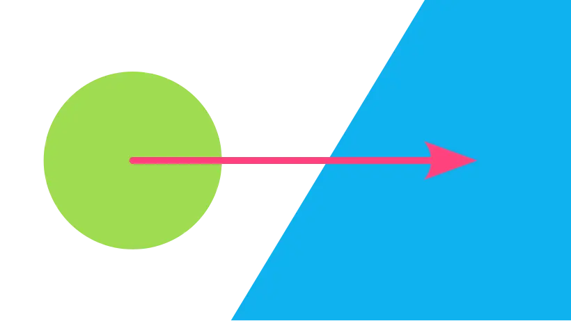

move_and_slide()를 사용하면 캐릭터의 벡터가 가상으로 두 부분으로 나뉘게 됩니다. 엔진은 먼저 캐릭터를 벽에 닿도록 이동시키고,
그 다음 벽을 따라 미끄러지듯 이동시킵니다. 캐릭터의 속도에 따라, 최종 위치는 벽을 따라 이동한 어느 지점이 될 것입니다. 이 모든 동작은
한 프레임 안에 일어나게 됩니다.

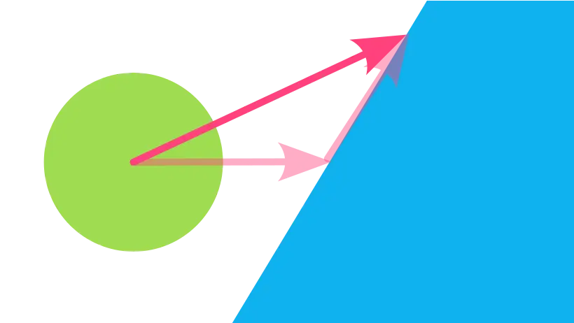

>[!info]- 캐릭터가 벽에 부딪혔을 때 미끄러지지 않고 멈추게 하려면 어떻게 하나요?
>보통은 벽을 따라 미끄러지는 동작이 필요한 경우가 많기 때문에, 처음에는 move_and_slide()를 사용하는 것이 일반적입니다. 캐릭터가 충돌 시 갑자기 멈추는 것을 원하는 게임은 드물지만, 만약 충돌 시 멈추게 하고 싶다면 move_and_collide() 메서드를 사용할 수 있습니다. 이 메서드는 충돌이 발생했을 때의 동작을 훨씬 더 세밀하게 제어할 수 있게 해줍니다.
>
>다음은 어떤 오브젝트에든 충돌하면 캐릭터를 멈추게 하는 코드 예시입니다:
>
>```gdscript
>var collision := move_and_collide(velocity * delta)
>if collision != null:
>	velocity = Vector2.ZERO
>```
>
>move_and_collide() 함수는 충돌이 발생하면 KinematicCollision2D 객체를 반환합니다. 이 객체는 캐릭터가 무엇과 충돌했는지, 충돌 지점은 어디인지 등의 정보를 담고 있습니다. 반환값이 null이 아니라면 충돌이 발생한 것이므로, velocity를 Vector2.ZERO로 설정하여 캐릭터를 멈출 수 있습니다.
>
>아래 코드 조각은 move_and_slide()가 내부적으로 어떻게 동작하여 캐릭터를 벽을 따라 미끄러지게 하는지를 보여줍니다. 단순화된 예시이지만, 어떤 방식으로 동작하는지 이해하는 데 도움이 됩니다:
>
>```gdscript
>var collision := move_and_collide(velocity * delta)
>if collision != null:
>	velocity = velocity.slide(collision.get_normal())
>```

이제 캐릭터를 직접 움직여보실 수 있습니다! 씬을 실행하고 방향키 또는 W, A, S, D 키로 캐릭터를 이동시켜 보세요. 장애물이 없어서 재미는 덜하지만,
캐릭터가 움직이는 모습을 확인하실 수 있습니다.


 
**한 가지 마지막으로 해야 할 일이 남았습니다:** 캐릭터의 **Motion Mode**를 설정하는 것입니다. CharacterBody2D 노드에는 캐릭터의 이동
방식을 정의하는 **Motion Mode**라는 속성이 있습니다. 이 속성은 Grounded 또는 Floating 중 하나로 설정할 수 있으며, 기본값은 Grounded입니다.
이 모드는 캐릭터가 지면에 있다는 전제를 가지고 있어, 특정 각도에서는 미끄러지듯 움직이게 하고, 다른 각도에서는 멈추도록 속도를 조정합니다. 이러한 설정은
플랫포머 게임에 적합합니다. 하지만 저희가 만드는 게임에서는 이로 인해 이상한 동작이 발생할 수 있습니다. 예를 들어, 캐릭터가 경사진 곳에 닿으면 미끄러지지
않고 멈춰버리는 등의 문제가 생길 수 있습니다.

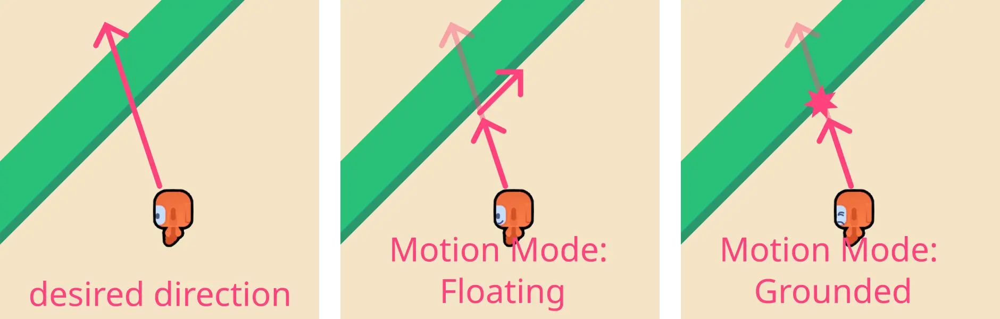

이 문제를 해결하려면, **Motion Mode** 속성을 **Floating**으로 설정해주시기 바랍니다.

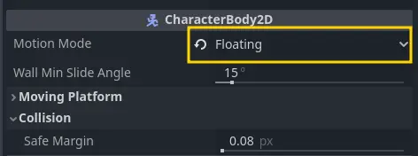

이제 기반 작업이 모두 완료되었습니다! CharacterBody2D 노드를 설정하고, 콜리전 쉐이프를 추가하고, 캐릭터가 움직이도록 만들었습니다. 잠시 시간을
내어 이번에 작성한 코드와 M4에서 작성했던 우주선 코드와 비교해보겠습니다.

M4에서 우주선을 위해 작성했던 코드가 기억나시나요? 방금 작성한 러너 코드와 비교해 보겠습니다:

```gdscript
func _process(delta: float) -> void:
	var direction := Vector2(0, 0)
	direction.x = Input.get_axis("move_left", "move_right")
	direction.y = Input.get_axis("move_up", "move_down")
	if direction.length() > 1.0:
		direction = direction.normalized()

	velocity = direction * max_speed
	position += velocity * delta
```

세부적인 코드는 다르지만, 개념적으로는 매우 유사합니다. 플레이어의 입력 방향을 계산하고, 속도를 계산한 다음, 그에 따라 우주선을 이동시켰습니다.

2~6번째 줄은 러너 코드에서 Input.get_vector()를 사용하는 것과 동일한 역할을 합니다. 즉, 이 새로운 입력 함수는 몇 줄의 코드를 줄여주는
효과가 있습니다! 8번째 줄에서는 속도를 계산하고, 마지막 9번째 줄에서는 위치를 직접 변경하여 우주선을 이동시켰습니다.

> [!example] 연습이 완벽을 만듭니다.
> 이제 새롭게 익힌 기술을 잘 활용해볼 시간입니다. Godot에서 워크북 프로젝트를 열어 따라해 보세요.
> <br>
> **미션: 우주선을 운석 지대 사이로 조종하세요**
> 
> **L2.P1**
> 
> **기술:** 입력 방향 계산, 캐릭터 바디 이동, 충돌 처리

충돌할 장애물을 추가하기에 앞서, 캐릭터가 움직이는 방향을 바라보도록 표시되는 텍스처를 동적으로 변경해보겠습니다.

---

## P5 Recap

이번 레슨에서는 다음과 같은 내용을 배우셨습니다:

- CharacterBody2D 노드를 설정하는 방법
    
- 고정된 간격으로 실행되어야 하는 물리 관련 코드를 처리하기 위해 \_physics_process()를 사용하는 방법
    
- move_and_slide()가 무엇이며, 그것을 어떻게 사용하는지
    

  <br>

이미 꽤 많은 내용을 다루셨습니다! 이제 캐릭터는 모든 방향으로 움직일 수 있게 되었지만, 항상 아래쪽만 바라보며 움직이고 있어요.
보기에는 그다지 자연스럽지 않죠. 다음 레슨에서는 캐릭터가 움직이는 방향을 바라보도록 만드는 방법을 배우시게 됩니다.

**코드 참조**

다음은 이번 레슨 마지막에 완성된 runner.gd 스크립트의 전체 코드입니다:

```gdscript
extends CharacterBody2D

var max_speed := 600.0

func _physics_process(_delta: float) -> void:
	var direction := Input.get_vector("move_left", "move_right", "move_up", "move_down")
	velocity = direction * max_speed
	move_and_slide()
```