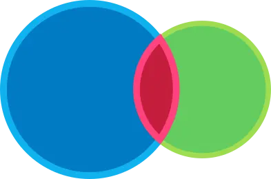

# L2 Character Controller

M4 강의인 _To Space and Beyond_ 에서는 8방향으로 움직일 수 있고 영역을 감지할 수 있는 우주선을 만들었습니다.
하지만 이 우주선은 어떤 것에도 부딪힐 필요가 없었지요. 이렇게 작동하는 게임은 거의 없습니다!

<video controls width="800" preload="metadata" playsinline>
  <source src="/GDQUEST/2D/M9_Top_Down_Movement/L2_Character_Controller/videos/050_ship_with_steering 3.mp4" type="video/mp4">
  동영상을 보려면 브라우저가 video 태그를 지원해야 합니다.
</video>

게임에는 장애물, 부딪힐 수 있는 요소들, 그리고 움직임을 제한할 벽이 필요합니다. 그렇지 않으면 레벨 디자인 자체가 불가능해집니다!

이번 강의에서는 CharacterBody2D 노드를 사용하여 캐릭터를 위한 탑다운 방식의 컨트롤러를 직접 코딩해보시게 됩니다. 
우리 캐릭터는 M4에서 만든 우주선처럼 움직이지만, 몇 강의 뒤에 벽과 장애물을 추가하게 되면 그 차이가 분명히 드러날 것입니다.

<video controls width="800" preload="metadata" playsinline>
  <source src="/GDQUEST/2D/M9_Top_Down_Movement/L2_Character_Controller/videos/020_character_010_runner.mp4" type="video/mp4">
  동영상을 보려면 브라우저가 video 태그를 지원해야 합니다.
</video>

이번 강의에서는 다음과 같은 내용을 배우시게 됩니다:

- 탑다운 방식의 캐릭터 컨트롤러 만들기
    
- 캐릭터를 여러 방향으로 움직이기
    
- CharacterBody2D 노드가 무엇이며, 이를 어떻게 사용하는지 학습하기
    
우선, **충돌(collision)** 에 대해 이야기해보겠습니다.

---

## P1 What the computer sees

게임에서 캐릭터를 움직일 때는 보통 두 개의 평행한 객체가 함께 움직입니다. 하나는 플레이어가 보게 되는 **시각적 레이어**,
다른 하나는 컴퓨터가 플레이어가 이동할 수 있는지 없는지를 판단하는 **물리 레이어**입니다. 예를 들어, 플레이어가 보는 화면이 다음과 같다고 가정해봅시다:

컴퓨터가 보는 화면은 다음과 같을 수 있습니다:

  
**물리 레이어**는 일반적으로 원이나 사각형과 같은 기하학적 도형들로 구성되어 있어, 컴퓨터가
[Collisions](../../../Glossary/Collisions/Collisions.md)을 효율적으로 감지할 수 있게 해줍니다.

충돌이란 두 개의 기하학적 도형이 겹쳐졌을 때 발생합니다. 이 경우, 물리 엔진은 도형들이 더 이상 겹치지 않도록 서로 밀어내는 처리를 합니다.
이 연산은 렌더링 전에 한 프레임 안에 처리되므로, 플레이어는 이를 시각적으로 인식하지 못합니다. 예를 들어, 플레이어가 벽에 부딪히면
캐릭터가 벽에서 멈춘 것처럼 보이게 됩니다.

개발자인 우리는, **게임의 물리 레이어와 시각적 레이어가 잘 맞아떨어지는 듯한 착각을 줄 수 있는 도형들** 을 찾아내는 역할을 하게 됩니다.

>[!info]- 컴퓨터는 왜 충돌을 감지할 때 기하학적 도형을 사용할까요?
>컴퓨터가 충돌을 감지할 때 기하학적 도형을 사용하는 이유는 **성능 때문** 입니다.
>
>가장 간단한 도형인 **원(circle)** 을 예로 들어보겠습니다. 두 원이 겹쳐지는지를 알아내기 위해서는 각 원의 중심 좌표와 반지름만 알면 됩니다.
> 두 중심 사이의 거리가 반지름의 합보다 작다면, 두 원은 겹친 것입니다.
> 
> 이것은 컴퓨터가 매우 빠르게 계산할 수 있는 간단한 공식입니다.
>
> 그런데 만약 충돌 감지를 위해 **스프라이트 자체** 를 사용한다고 상상해보세요. 스프라이트는 수만 개에서 수십만 개의 픽셀로 이루어져 있을 수 있습니다.
> 두 객체가 충돌했는지 알아내려면, 한 스프라이트의 외곽에 있는 거의 모든 픽셀을 다른 객체의 픽셀과 비교해야 합니다. 이는 엄청난 양의 연산이 필요합니다!
> 반면 기하학적 도형을 사용하는 방식은 훨씬 빠릅니다.
>
>또 다른 이유는, **단순한 기하학적 도형이 더 부드러운 상호작용을 만들어내기 때문** 입니다. 예를 들어, 원 형태는 벽이나 경사면을 따라 자연스럽게 미끄러지듯
> 움직일 수 있지만, 픽셀 단위의 완벽한 충돌 감지는 각이 많은 구조로 인해 객체가 떨리거나 끼어 있는 것처럼 보일 수 있습니다.

좋습니다. 그러니까 게임 엔진은 객체들이 겹쳤는지를 감지하고 충돌을 처리하기 위해 **물리 도형(physics shapes)** 을 사용합니다. 그렇다면 Godot에서는
이러한 충돌을 어떻게 설정할 수 있을까요? 플레이어가 조작하는 캐릭터의 경우, CharacterBody2D 노드를 사용할 수 있습니다.

