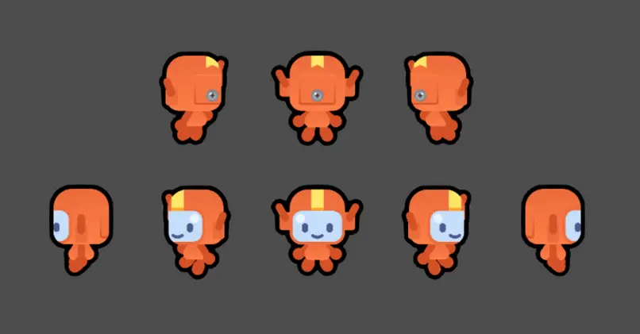
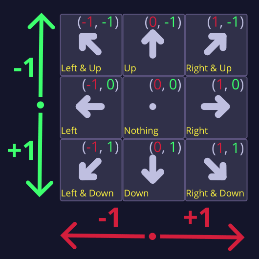
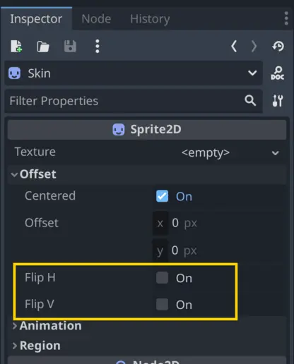

M4에서는 우리 우주선 스프라이트가 위에서 내려다보는 시점이었기 때문에, 움직이는 방향에 맞춰 노드의 회전을 변경할 수 있었습니다.


하지만 여기서 우리의 캐릭터는 사선(¾) 시점에서 보이기 때문에 스프라이트를 회전시킬 수는 없습니다.
아티스트가 이미 캐릭터가 여러 방향을 바라보는 이미지를 몇 장 제공해주었기 때문에, 코드에서 이동 방향에 맞춰 스프라이트의 텍스처 이미지를 변경해줄 예정입니다.



그래서 이번 강의에서는 플레이어가 누르는 키에 따라 캐릭터가 다른 방향을 바라보도록 만들겠습니다. 이를 구현하는 여러 가지 기법을 설명해드릴 예정이며,
먼저 간단한 if와 elif 문부터 시작해서 GDScript의 match 키워드를 사용하는 방법까지 차례대로 안내해드리겠습니다.


---

## P1 The straightforward approach

캐릭터의 방향에 따라 스프라이트를 선택하는 데에는 매우 간단한 방법이 있습니다. 바로 일련의 if와 elif 문을 사용하는 것입니다.
캐릭터가 움직이는 방향을 확인한 후, 그에 따라 스프라이트를 변경해주면 됩니다.

좋습니다, 이제 시작해보겠습니다!

먼저 코드에서 표시 이미지를 변경하기 위해 Skin 노드에 대한 참조가 필요합니다. 씬 독(Scene Dock)에서 해당 노드를 우클릭한 후
**Access as Unique Name**을 선택하여 해당 노드에 씬 고유 이름을 지정해줍니다.

그 다음, Skin 노드를 선택한 상태에서 **Ctrl 키(Mac에서는 ⌘ 키)**를 누른 채로 스크립트 창으로 드래그하면, skin이라는 이름의
onready 변수로 자동 삽입됩니다.

### 의사(private) 변수

이제 Godot 커뮤니티에서 자주 사용하는 새로운 관례를 소개해드릴 때가 된 것 같습니다. 바로 **의사-프라이빗 변수(pseudo-private variables)**
입니다. skin 변수를 \_skin으로 이름을 바꿔주세요. 그러면 다음과 같은 코드가 됩니다:

```
@onready var _skin: Sprite2D = %Skin
```

우리는 속성 이름 앞에 밑줄(\_)을 붙여 이 속성이 **우리 스크립트 내부용** 이며, 다른 스크립트에서 접근해서는 안 된다는 것을 나타냅니다.
이는 Python과 같은 프로그래밍 언어에서 사용하는 표준적인 관례입니다.

이러한 변수를 **“의사-프라이빗(pseudo-private)” 변수**라고 부릅니다. 그런데 왜 “의사(pseudo)“일까요? C++ 같은 일부 다른 언어에서는
속성을 [private](../../Glossary/Private_Public_Properties.md)으로 명시하면, 다른 개발자가 그 속성에 접근하는 것을 
**엄격히 막을 수 있습니다**. 그런 언어에서는 코드의 다른 부분에서 private 속성에 접근하려 하면 오류가 발생합니다.

하지만 Python이나 GDScript 같은 언어에서는 앞에 밑줄이 붙은 변수도 코드의 다른 부분에서 여전히 **에러 없이 접근이 가능합니다**.
그렇기 때문에 엄밀한 의미의 private은 아니며, 단지 관례일 뿐입니다. 그래도 이런 변수들은 자동 완성 목록에 표시되지 않기 때문에, 
내부용임을 암묵적으로 구분하기에 좋은 방식입니다.

>[!info]- 변수를 왜 private(비공개)로 유지해야 할까요?
>이는 **코드에서 의도하지 않은 사용이나 변경을 방지하는 데 도움이 되기 때문**입니다.
>
>코드를 나중에 쉽게 변경할 수 있도록 하기 위한 일반적인 지침 중 하나는, **명확한 목적을 가진 코드 사용을 위해 [API(Application Programming Interface)](../../Glossary/API_Application_Programming_Interface.md)를 제공하고, 다른 부분에 노출할 의도가 없는 요소는 사용하지 못하도록 막는 것**입니다. 이러한 방식은 코드의 안정성과 유지보수성을 높여줍니다.
>
>다른 스크립트에서 여러분의 스크립트를 참조하는 팀원이 **의도하지 않은 요소를 사용해서 프로그램을 망가뜨릴 위험을 걱정하지 않아도 되도록** 해야 합니다. 그래서 개발자들은 객체의 내부 구조나 코드를 **숨기거나 보호** 하는 경우가 많습니다. 이것을 [Encapsulation](../../Glossary/Encapsulation.md) 라고 합니다.
>
>자동차를 운전할 때, 우리는 **엔진이 어떻게 작동하는지를 몰라도 핸들과 가속 페달을 사용할 수 있습니다.** 캡슐화는 이러한 **“블랙 박스” 원칙** 을 지향합니다. 즉, **다른 사람들이 사용하길 원하는 속성만 공개하고, 나머지는 숨기는 방식** 입니다.
>
>대기업에서는 **원치 않는 변경을 방지하기 위해** 이러한 규율이 존재합니다. 실제로는 어떤 코드를 최대한 잘 활용하려면 **그 코드가 어떻게 동작하는지 어느 정도는 알아야** 할 때가 많습니다. 하지만 그럼에도 불구하고, **의도되지 않은 접근을 줄이고, 어떤 부분의 코드를 사용해야 하는지를 명확히 전달하는 것은 좋은 습관**입니다.
>
>예를 들어, 몇 달 후에 어떤 변수가 더 이상 필요 없어져서 삭제하고 싶다고 가정해보겠습니다. 그 변수에 지금은 규모가 커진 프로젝트 내의 **다른 스크립트가 접근하고 있는지 어떻게 확인할 수 있을까요?** “의사-프라이빗(pseudo-private)” 관례를 따랐다면, 그 변수는 **오직 하나의 스크립트**—즉, 그 변수를 정의한 스크립트에서만 접근하고 있다는 것을 알 수 있습니다. 다른 곳에서 그 변수를 사용하지 않고 있다면, **안전하고 빠르게 삭제할 수 있습니다.**

다음으로, 캐릭터가 여러 방향을 바라보는 텍스처들을 모두 미리 불러올 수 있습니다. res://assets 디렉토리에서 runner_\*.png
파일들(runner_up.png, runner_down_left.png, runner_down_right.png, … runner_up_right.png까지)을 Shift 키를 누른 채로
모두 선택해 주세요. 그런 다음 Ctrl 키(맥에서는 ⌘ 키)를 누른 상태로 이 파일들을 runner 스크립트로 끌어다 놓으시면 됩니다. 이렇게 하면 상수들이
자동으로 생성되고, 모든 텍스처가 한 번에 미리 불러와집니다.

```gdscript
const RUNNER_DOWN = preload("res://assets/runner_down.png")
const RUNNER_DOWN_RIGHT = preload("res://assets/runner_down_right.png")
const RUNNER_RIGHT = preload("res://assets/runner_right.png")
const RUNNER_UP = preload("res://assets/runner_up.png")
const RUNNER_UP_RIGHT = preload("res://assets/runner_up_right.png")
const RUNNER_DOWN_LEFT = preload("res://assets/runner_down_left.png")
const RUNNER_LEFT = preload("res://assets/runner_left.png")
const RUNNER_UP_LEFT = preload("res://assets/runner_up_left.png")
```

변하지 않는 값을 사용할 때는, 이를 [Constant](../../Glossary/Constant.md)로 선언해 두는 것이 유용합니다.

이제 캐릭터의 방향에 따라 스프라이트를 변경하기 위해 if와 elif 조건문을 추가해 보겠습니다. 시작하실 수 있도록 처음 두 방향에 대한 예시를 보여드리겠습니다.
다음 코드를 \_physics_process() 함수 안에 추가해 주세요:

```gdscript
func _physics_process(_delta: float) -> void:
	# ...
	if direction.x > 0.0 and direction.y > 0.0:
		_skin.texture = RUNNER_DOWN_RIGHT
	elif direction.x < 0.0 and direction.y > 0.0:
		_skin.texture = RUNNER_DOWN_LEFT
```

첫 번째 조건문은 캐릭터가 오른쪽 아래 방향에 있는지를 확인합니다. 그렇다면 스프라이트를 RUNNER_DOWN_RIGHT 텍스처로 변경하게 됩니다.

x 방향이 양수이면 캐릭터는 오른쪽으로 이동하고 있는 것입니다. y 방향이 양수이면 캐릭터는 아래쪽으로 이동하고 있는 것입니다. 둘 다 양수라면
캐릭터는 오른쪽 아래 방향으로 이동 중이라는 뜻입니다. 따라서 그에 맞는 텍스처를 스프라이트에 할당할 수 있습니다.

두 번째 조건은 캐릭터가 왼쪽 아래 방향으로 이동하고 있는지를 확인합니다. 그렇다면 스프라이트를 RUNNER_DOWN_LEFT 텍스처로 변경합니다.

이제 캐릭터가 두 방향을 바라볼 수 있게 되었습니다. 직접 테스트해 보시기 바랍니다!


> [!note] 직접 시도해 보세요
> 나머지 여섯 가지 조건—위, 아래, 왼쪽, 오른쪽, 왼쪽 위, 오른쪽 위—를 \_physics_process() 함수에 추가해 보시기 바랍니다.
> 
> 먼저 대각선 방향부터 처리하는 것이 좋습니다. 그렇지 않으면 수평이나 수직 방향의 조건이 대각선 조건보다 우선되어 적용될 수 있습니다.
> 
> 직접 시도해 보시고, 아래에 있는 정답도 참고해 보세요.

다음은 나머지 여섯 가지 방향에 대한 코드입니다. 오른쪽 위와 왼쪽 위 방향에 대한 첫 두 조건과 동일한 패턴을 따릅니다.
나머지 네 방향의 경우에는 방향 벡터의 한 구성 요소만 확인하면 됩니다.

```gdscript
func _physics_process(_delta: float) -> void:
	# ...
	elif direction.x > 0.0 and direction.y < 0.0:
		_skin.texture = RUNNER_UP_RIGHT
	elif direction.x < 0.0 and direction.y < 0.0:
		_skin.texture = RUNNER_UP_LEFT
	elif direction.x > 0.0:
		_skin.texture = RUNNER_RIGHT
	elif direction.x < 0.0:
		_skin.texture = RUNNER_LEFT
	elif direction.y > 0.0:
		_skin.texture = RUNNER_DOWN
	elif direction.y < 0.0:
		_skin.texture = RUNNER_UP
```

이제 캐릭터가 이동할 때마다 방향에 맞게 스프라이트가 바뀌는 모습을 확인하실 수 있을 겁니다. 간단하고 직관적이며, 현재 문제를 잘 해결해 줍니다.
다만 아쉬운 점이 있다면, 조건문의 순서를 주의해서 작성해야 한다는 것입니다. 그래도 잘 작동하고, 코드도 이해하기 쉬운 구조입니다.


좋은 수업이었습니다. 뭐라구요, 너무 짧았다고요? 더 원하시나요? 알겠습니다, 그럼 좀 더 흥미롭게 만들어 보도록 하죠.

---

## P2 Matching the direction with... match!

이번에는 GDScript에서 제공하는 또 다른 도구인 match 키워드를 사용하여 이 코드를 [Refactoring](../../Glossary/Refactoring.md) 해보겠습니다.
이는 여러 개의 if와 elif 문을 더 읽기 쉽게 대체할 수 있습니다.

다음은 match가 어떻게 동작하는지를 보여주는 예시입니다. 아래 코드는 item 변수의 값을 확인하고, 그 값에 따라 메시지를 출력합니다.

```gdscript
func _ready() -> void:
	var item := "apple"
	match item:
		"apple":
			print("It's an apple!")
		"banana":
			print("It's a banana!")
```

> [!example] 다음 질문에 답해보세요
> 이 코드는 어떤 내용을 출력할 것 같으신가요?
> 
> - “It’s an apple!”
> - 
> - “It’s a banana!” 
> - 
> - 이 코드는 아무 것도 출력하지 않습니다.
> - 
> > [!example]- 정답
> > item 변수에 "apple"이 설정되어 있으므로, 첫 번째 조건이 일치하게 되어 "It's an apple!"이 출력됩니다.

위의 코드는 아래의 if와 elif 문으로 작성한 것과 동일한 의미를 가집니다:

```gdscript
func _ready() -> void:
	var item := "apple"
	if item == "apple":
		print("It's an apple!")
	elif item == "banana":
		print("It's a banana!")
```

match 문은 여러 개의 if와 elif 문을 사용하는 것보다 조금 더 읽기 쉽고 간결합니다. 특히 하나의 값을 여러 가능한 경우와 비교해야 할 때 유용합니다… 
예를 들면 캐릭터가 여덟 방향을 바라보게 할 때처럼요!

우선, 방금 \_physics_process() 함수에 작성하신 코드를 삭제해 주세요. 다시 처음부터 시작하는 겁니다!

```gdscript
func _physics_process(_delta: float) -> void:
	# ...
	# if direction.x > 0.0 and direction.y > 0.0:
	# 	_skin.texture = RUNNER_DOWN_RIGHT
	# elif direction.x < 0.0 and direction.y > 0.0:
	# 	_skin.texture = RUNNER_DOWN_LEFT
	# elif direction.x > 0.0 and direction.y < 0.0:
	# 	_skin.texture = RUNNER_UP_RIGHT
	# elif direction.x < 0.0 and direction.y < 0.0:
	# 	_skin.texture = RUNNER_UP_LEFT
	# elif direction.x > 0.0:
	# 	_skin.texture = RUNNER_RIGHT
	# elif direction.x < 0.0:
	# 	_skin.texture = RUNNER_LEFT
	# elif direction.y > 0.0:
	# 	_skin.texture = RUNNER_DOWN
	# elif direction.y < 0.0:
	# 	_skin.texture = RUNNER_UP
```

match 문의 어려운 점은 이 구문이 “패턴” 또는 명확히 구분되는 값들을 기준으로 작동한다는 것입니다. 
즉, 서로 분리되고 구별되는 값들(예: 1, 2, 3과 같은 각각의 정수)을 비교하는 데 사용된다는 뜻입니다.

하지만 조이스틱을 사용할 경우, 입력 방향 벡터는 사실상 무한한 범위의 소수값을 가질 수 있습니다.
따라서 캐릭터가 움직이는 방향을 match에 사용할 수 있는 신뢰할 수 있는 값으로 변환해 주어야 합니다.

예를 들어, 플레이어가 왼쪽으로 이동할 때 조이스틱 입력은 Vector2(-0.98, 0.0), Vector2(-0.74, 0.0) 또는 이와 유사한 다양한 값이 될 수 있습니다.
이러한 값들을 다음의 아홉 가지 중 하나로 변환해 줄 필요가 있습니다: 위, 아래, 왼쪽, 오른쪽, 왼쪽 위, 오른쪽 위, 왼쪽 아래, 오른쪽 아래, 그리고 정지 상태입니다.

Vector2(-0.98, 0.0), Vector2(-0.74, 0.0) 등과 같은 다양한 값을 Vector2(-1.0, 0.0)으로 변환해 줄 수 있는 함수가 필요합니다.
이렇게 변환된 값을 사용하여, 캐릭터가 왼쪽을 바라보는 텍스처를 선택할 수 있게 됩니다.

벡터에 익숙하지 않으시다면 입력 방향을 이해하는 것이 다소 복잡하게 느껴질 수 있으니, 간단히 정리해 드리겠습니다:

- 방향 벡터의 **y 값**은 위쪽이 -1.0, 아래쪽이 1.0입니다.
- 방향 벡터의 **x 값**은 왼쪽이 -1.0, 오른쪽이 1.0입니다.

이 이미지는 캐릭터가 바라볼 수 있는 여덟 가지 방향에 대해 우리가 매칭하고자 하는 벡터들과, 캐릭터가 정지 상태일 때를 나타내는 (0, 0) 벡터의 사용을 보여줍니다.



>[!info]- 대각선 벡터들이 정규화(normalized)되지 않았다는 뜻 아닌가요? 그게 문제가 되지는 않나요?
>네, 맞습니다. 하지만 여기서는 이동 방향을 계산하려는 것이 아니라, 스프라이트가 바라보는 방향을 정하기 위한 것입니다. match 키워드를 사용해서 코드의 가독성을 높이려는 목적이기 때문에, 가능한 모든 방향 벡터를 한정된 몇 가지 값으로 좁혀 줄 필요가 있습니다.
>
>플레이어는 아날로그 조이스틱을 사용할 수 있기 때문에 direction 변수에는 다양한 소수값들이 들어올 수 있습니다. 하지만 스프라이트가 바라볼 수 있는 방향은 여덟 가지뿐입니다. 따라서 위 이미지에서 보여준 것처럼, 입력으로 들어오는 광범위한 방향 벡터를 아홉 가지 값(정지 상태 포함)으로 변환해 줄 필요가 있습니다.
>
>이렇게 얻은 아홉 가지 값 중 하나를 가진 새 벡터는 캐릭터를 실제로 이동시키는 데에는 사용하지 않을 것입니다. 단지 스프라이트가 이동 방향에 맞춰 바라보도록 바꿔주는 용도로만 사용할 예정입니다. 물론 원하신다면, 이 벡터를 활용해 조이스틱을 사용하더라도 플레이어의 이동을 여덟 방향으로 제한할 수도 있습니다.

Godot에는 코드의 가독성을 높이기 위해 사용할 수 있는 미리 정의된 Vector2 상수들이 있습니다.
예를 들어, 상수 Vector2.DOWN은 Vector2(0, 1)과 동일한 값을 가집니다. 이러한 상수들은 match 문과 함께 다음과 같이 사용할 수 있습니다:

```gdscript
func _physics_process(_delta: float) -> void:
	# ...
	match direction_discrete:
		Vector2.DOWN:
			# 아래 방향 텍스처로 스프라이트 변경
		Vector2.RIGHT:
			# 오른쪽 방향 텍스처로 스프라이트 변경
		# ...
```

하지만 대각선 방향에 대해서는 미리 정의된 상수가 존재하지 않으므로, 직접 상수를 만들어야 합니다.
대각선 방향을 나타내기 위해 두 개의 방향 상수를 더한 새로운 상수를 만들 수 있습니다.
예를 들어, Vector2.DOWN + Vector2.RIGHT을 통해 오른쪽 아래 방향을 나타낼 수 있습니다. 이 연산은 Vector2(1, 1)과 동일한 값을 생성합니다.

스크립트 상단에 다음 네 가지 상수를 추가해 주세요:

```gdscript
const UP_LEFT = Vector2.UP + Vector2.LEFT
const UP_RIGHT = Vector2.UP + Vector2.RIGHT
const DOWN_LEFT = Vector2.DOWN + Vector2.LEFT
const DOWN_RIGHT = Vector2.DOWN + Vector2.RIGHT
```

>[!info]- Vector2는 x와 y 구성 요소에 소수 값을 사용하잖아요. 그렇다면 Vector2 값을 비교할 때 정밀도 오류가 발생할 수도 있지 않나요?
>컴퓨터에서 소수는 한정된 정밀도로 표현됩니다. 작은 숫자의 경우 약 소수점 아래 15자리까지 정확하게 표현할 수 있지만, 숫자가 커질수록 정밀도는 떨어집니다.
>
>이 때문에 일반적으로 두 소수 값을 정확히 같은지 비교하는 것은 안전하지 않습니다. 하지만 1.0이나 -1.0처럼 작고 정수인 소수 값의 경우에는 비교해도 괜찮습니다. 컴퓨터가 이러한 값들은 정확하게 표현할 수 있기 때문입니다. 따라서 이 경우에는 정밀도 오류에 대해 걱정하지 않으셔도 됩니다.

방향 벡터를 한정된 값의 집합으로 변환하기 위해 Vector2.sign() 메서드를 사용할 수 있습니다. \_physics_process() 함수 안에 다음 변수를 추가해 주세요:

```gdscript
func _physics_process(_delta: float) -> void:
	# ...
	var direction_discrete := direction.sign()
```

Vector2.sign()을 호출하면, x와 y 구성 요소가 -1.0, 0.0, 또는 1.0 중 하나로 설정된 Vector2 값을 반환합니다.
이를 통해 벡터는 총 9가지 가능한 값으로 제한됩니다.

<br>

Vector2.sign() 메서드는 다음과 같이 작동합니다:

- 입력 값이 음수이면 -1.0을 반환합니다.
    
- 입력 값이 0이면 0.0을 반환합니다.
    
- 입력 값이 양수이면 1.0을 반환합니다.
    

  <br>

이 규칙은 벡터의 x와 y 구성 요소 모두에 적용되며, 그 결과로 방향은 동일하지만 각 구성 요소가 -1.0, 0.0, 또는 1.0 중 하나인 새로운 벡터가 만들어집니다.
이를 통해 우리가 match에 사용할 수 있는 아홉 가지 가능한 값이 만들어집니다:


그 다음에는 이 벡터를 사용하여 match 문을 통해 방향에 해당하는 텍스처와 매칭하게 됩니다. 아래는 처음 두 가지 경우입니다.
다음 코드를 \_physics_process() 함수에 추가해 주세요:

```gdscript
func _physics_process(_delta: float) -> void:
	# ...
	match direction_discrete:
		Vector2.LEFT:
			_skin.texture = RUNNER_LEFT
		Vector2.RIGHT:
			_skin.texture = RUNNER_RIGHT
```

이 코드로 캐릭터가 왼쪽과 오른쪽을 바라볼 수 있게 됩니다! 직접 시험해 보세요!


> [!note] 직접 시도해 보세요
> 좋아요, 이제 당신 차례입니다! 나머지 여섯 가지 경우를 \_physics_process() 함수에 추가해 보시기 바랍니다. 이번에는 match 문을 사용하므로, 각 경우의 순서는 중요하지 않습니다. 이것이 if와 elif 문에 비해 match 문이 가지는 장점 중 하나입니다.
> 
> 완료하시면 캐릭터가 여덟 방향 모두를 바라볼 수 있게 될 것입니다. 직접 시도해 보시고, 아래에 있는 정답도 확인해 보세요.

다음은 나머지 여섯 가지 방향에 대한 코드입니다:

```gdscript
func _physics_process(_delta: float) -> void:
	# ...
		Vector2.UP:
			_skin.texture = RUNNER_UP
		Vector2.DOWN:
			_skin.texture = RUNNER_DOWN
		UP_LEFT:
			_skin.texture = RUNNER_UP_LEFT
		UP_RIGHT:
			_skin.texture = RUNNER_UP_RIGHT
		DOWN_LEFT:
			_skin.texture = RUNNER_DOWN_LEFT
		DOWN_RIGHT:
			_skin.texture = RUNNER_DOWN_RIGHT
```

입력 방향이 없는 경우, direction_key는 Vector2(0, 0)이 됩니다. 이는 플레이어가 멈췄다는 뜻이며,
이때는 러너가 새로운 방향을 바라보지 않고 그냥 멈춰 있어야 합니다. 따라서 Vector2(0, 0)에 대한 match 항목은 따로 두지 않습니다.

게임을 테스트해 보세요. 캐릭터가 이동할 때마다 방향에 따라 러너가 바라보는 방향이 바뀌는 것을 확인하실 수 있을 것입니다. 점점 그럴듯하게 보이기 시작하네요!


다 끝났습니다! …라고 말했지만, 사실 아직 완전히 끝난 건 아닙니다. 코드를 좀 더 간단하고 짧게 만들 수 있습니다.

---

## P3 Removing superfluous frames

왼왼쪽이나 오른쪽, 또는 대각선 왼쪽과 오른쪽을 바라보는 캐릭터의 텍스처가 동일한 이미지지만 좌우로 뒤집힌 것이라는 점을 눈치채셨나요?
그렇다면 이러한 텍스처들은 더 이상 필요하지 않습니다. 코드에서 이미지를 좌우 반전시키면 되기 때문입니다. 이제 이를 정리해보겠습니다.
불필요한 텍스처 로딩 부분과 match 구문에서 해당되는 부분을 제거해 주세요. 아래는 왼쪽, 왼쪽 위, 왼쪽 아래 방향에 해당하는 코드입니다:

```gdscript
# const RUNNER_DOWN_LEFT = preload("res://assets/runner_down_left.png")
# const RUNNER_LEFT = preload("res://assets/runner_left.png")
# const RUNNER_UP_LEFT = preload("res://assets/runner_up_left.png")

# ...

func _physics_process(_delta: float) -> void:
	# ...
	# 	Vector2.LEFT:
	#		_skin.texture = RUNNER_LEFT
	# ...
	# 	UP_LEFT:
	#		_skin.texture = RUNNER_UP_LEFT
	# ...
	# 	DOWN_LEFT:
	#		_skin.texture = RUNNER_DOWN_LEFT
```

>[!info]- 왜 캐릭터가 왼쪽을 바라보는 텍스처는 제거하고, 오른쪽을 바라보는 텍스처는 남겨두는 건가요?
>
>Godot을 비롯한 많은 게임 엔진에서는 기본적인 정면 방향이 ‘오른쪽’입니다. 특별한 이유가 있어서라기보다는, 그냥 하나의 관례일 뿐입니다.
>
>이 경우, 왼쪽을 바라보는 이미지나 오른쪽을 바라보는 이미지 중 어느 쪽을 남겨도 상관은 없습니다. 하지만 일반적인 관례를 따르기 위해 오른쪽 이미지를 유지하고 왼쪽 이미지는 제거하는 것입니다.

이제 방향에 따라 스프라이트를 뒤집어야 합니다. 몇 가지 수정을 해주어야 하겠지만, 그 전에 먼저 씬으로 돌아가 Skin 노드를 선택한 다음,
인스펙터(Inspector)에서 Offset -> Flip H와 Offset -> Flip V 속성을 찾아보세요.

이 두 속성은 각각 스프라이트를 수평(H)과 수직(V)으로 뒤집어 줍니다.
직접 시험해 보세요! 대칭이 아닌 이미지(예: runner_right.png)를 Texture 속성에 지정한 후, 수평 및 수직으로 뒤집어 보시기 바랍니다.



이제 이러한 속성들이 어떻게 작동하는지 이해하셨으니, 이를 스크립트에서 사용해 보겠습니다. \_physics_process() 함수의 끝부분에 다음 코드를 추가해 주세요:

```
func _physics_process(_delta: float) -> void:
	# ...
	if direction_discrete.length() > 0:
		_skin.flip_h = direction.x < 0.0
```

이 코드에서는 캐릭터가 왼쪽으로 이동할 때 스프라이트를 수평으로 뒤집습니다. 이를 위해 \_skin.flip_h 속성을 사용합니다.
direction.x < 0.0이라는 [Boolean_Expressions](../../Glossary/Boolean_Expressions.md)의 결과를 그대로 대입할 수 있습니다.
이 표현식은 캐릭터가 왼쪽으로 이동 중일 경우 true를 반환하고, 그렇지 않으면 false를 반환합니다.

이 표현식 앞에 if 조건문을 둔 이유는, 캐릭터가 정지해 있을 때 스프라이트가 뒤집히는 것을 방지하기 위함입니다.
우리는 오직 입력이 들어왔을 때만 스프라이트를 뒤집고자 합니다. 그렇지 않으면 키를 떼는 순간, 캐릭터가 원래 방향으로 갑자기 되돌아가 버리게 됩니다.

> [!example] 다음 질문에 답해보세요
> 입력을 해제하면 왜 스프라이트가 뒤집히는 걸까요?
> 
> - direction.x가 0.0이 되기 때문입니다.
> 
> - direction.x가 -1.0이 되기 때문입니다.
> 
> - 러너가 피곤해지기 때문입니다.
> 
> - direction.x가 1.0이 되기 때문입니다.
> 
> > [!example]- 정답
> > 캐릭터가 정지해 있을 때 direction.x는 0.0이 됩니다. 따라서 direction.x < 0.0은 0.0 < 0.0과 같고, 이 조건은 거짓입니다. 그래서 스프라이트는 원래 방향으로 되돌아가게 됩니다.

캐릭터가 왼쪽 위, 왼쪽, 또는 왼쪽 아래로 움직일 때 어떤 일이 일어날 것 같으신가요? 스프라이트가 수평으로 뒤집힐까요? 지금 직접 해보시면,
거의 맞게 작동하는 것을 확인하실 수 있을 것입니다.


캐릭터가 왼쪽으로 이동할 때 스프라이트는 수평으로 뒤집히지만, 항상 올바른 텍스처로 업데이트되지는 않습니다.

> [!example] 다음 질문에 답해보세요
> 왜 스프라이트가 항상 올바른 텍스처로 업데이트되지 않는다고 생각하시나요? 최선을 다해 추측해 보세요.
> 
> - 텍스처를 뒤집는 것이, 대각선으로 이동할 때 스프라이트가 제대로 업데이트되지 않도록 만들고 있다.
> 
> - 왼쪽 방향에 대한 match 항목이 더 이상 없기 때문에, 왼쪽으로 이동할 때 텍스처가 업데이트되지 않는다.
> 
> > [!example]- 정답
> > 캐릭터가 왼쪽으로 이동할 때 스프라이트는 수평으로 뒤집히긴 하지만, 왼쪽 방향에 대한 match 항목을 제거했기 때문에 텍스처 자체는 업데이트되지 않습니다. 올바르게 텍스처를 업데이트하려면 왼쪽 방향에 대한 항목을 다시 추가해 주어야 합니다.

캐릭터가 왼쪽으로 이동할 때 텍스처를 업데이트하도록 누락된 코드를 추가해 보겠습니다. 정확히 말하면, 왼쪽 방향에 대한 match 항목을 다시 도입해야 합니다.

동일한 경우에 여러 패턴이나 값을 매칭시키고 싶을 때는 쉼표(,)를 사용하면 됩니다. 현재 코드에서는 오른쪽 방향과 왼쪽 방향이 서로 대칭이므로,
오른쪽 방향에 대한 세 가지 경우에 왼쪽 방향을 함께 추가해 줄 수 있습니다.

```gdscript
func _physics_process(_delta: float) -> void:
	# ...
	match direction_discrete:
		Vector2.RIGHT, Vector2.LEFT:
			# 오른쪽 또는 왼쪽 텍스처 설정
		UP_RIGHT, UP_LEFT:
			# 오른쪽 위 또는 왼쪽 위 텍스처 설정
		DOWN_RIGHT, DOWN_LEFT:
			# 오른쪽 아래 또는 왼쪽 아래 텍스처 설정
	# ...
```

이제 이 작업을 마치면, 캐릭터는 이전처럼 여덟 방향으로 움직일 수 있어야 합니다. 직접 테스트해 보세요!


훌륭합니다! 이제 코드가 이전보다 좀 더 읽기 쉬워졌다는 것을 확인하실 수 있을 겁니다. 또한 아티스트가 제작해야 할 텍스처의 수가 줄어들기 때문에,
작업 시간을 조금이나마 절약할 수 있습니다.

>[!info]- 왜 러너가 가끔 키를 놓는 순간 다른 방향으로 갑자기 돌아서는 건가요?
>캐릭터가 대각선으로 이동 중일 때 키를 놓으면, 대부분의 경우 두 키 중 하나를 다른 하나보다 한 프레임 정도 먼저 놓게 됩니다. 그 결과, 러너는 마지막으로 놓은 키의 방향을 바라보게 됩니다.
>
>러너가 바라보던 방향을 유지하도록 만들려면, 키가 놓였을 때 잠시 기다리는 버퍼 시간을 두어 다른 키도 함께 놓이기를 기다려야 합니다. 이렇게 하면 약간의 시각적 지연이 발생합니다. 캐릭터의 실제 움직임은 즉시 바뀌지만, 시각적으로는 몇 프레임 동안 이전 방향의 스프라이트가 유지됩니다. 이런 방식을 적용하고자 한다면, 아날로그 조이스틱이 아니라 방향키(DPAD)나 키보드 입력에만 적용되도록 주의해야 합니다.

---

## P4 Recap

이번 레슨에서는 다음과 같은 내용을 배우셨습니다:

- 변수 이름 앞에 밑줄(\_)을 붙여서 해당 변수가 일종의 비공개 변수임을 나타내는 방법
    
- 캐릭터의 움직이는 방향에 따라 스프라이트 텍스처를 변경하는 방법
    
- match 키워드를 사용하여 값을 여러 경우와 비교하고, if나 elif 블록보다 더 읽기 쉽게 만드는 방법
    
- Sprite2D.flip_h를 사용하여 스프라이트를 수평으로 뒤집고, 텍스처 제작을 줄이는 방법
    

꽤 많은 내용을 다루셨습니다! 잠시 쉬시면서 지금까지의 진도를 즐기셔도 좋습니다. 다음 레슨에서는 장애물을 추가하고, 캐릭터가 그것들과 부딪히게 만들어 보겠습니다.

**코드 참고**

다음은 이번 강의의 마지막에 해당하는 runner.gd 스크립트의 전체 코드입니다:

```gdscript
extends CharacterBody2D

const RUNNER_DOWN = preload("res://assets/runner_down.png")
const RUNNER_DOWN_RIGHT = preload("res://assets/runner_down_right.png")
const RUNNER_RIGHT = preload("res://assets/runner_right.png")
const RUNNER_UP = preload("res://assets/runner_up.png")
const RUNNER_UP_RIGHT = preload("res://assets/runner_up_right.png")

const UP_RIGHT = Vector2.UP + Vector2.RIGHT
const UP_LEFT = Vector2.UP + Vector2.LEFT
const DOWN_RIGHT = Vector2.DOWN + Vector2.RIGHT
const DOWN_LEFT = Vector2.DOWN + Vector2.LEFT

var max_speed := 600.0

@onready var _skin: Sprite2D = %Skin


func _physics_process(_delta: float) -> void:
	var direction := Input.get_vector("move_left", "move_right", "move_up", "move_down")
	velocity = direction * max_speed
	move_and_slide()

	var direction_discrete := direction.sign()
	match direction_discrete:
		Vector2.RIGHT, Vector2.LEFT:
			_skin.texture = RUNNER_RIGHT
		Vector2.UP:
			_skin.texture = RUNNER_UP
		Vector2.DOWN:
			_skin.texture = RUNNER_DOWN
		UP_RIGHT, UP_LEFT:
			_skin.texture = RUNNER_UP_RIGHT
		DOWN_RIGHT, DOWN_LEFT:
			_skin.texture = RUNNER_DOWN_RIGHT

	if direction_discrete.length() > 0:
		_skin.flip_h = direction.x < 0.0
```
