이전 강의에서는 모든 방향으로 이동할 수 있는 캐릭터를 만들었습니다. 하지만 장애물이 없다면 그다지 재미있지는 않겠죠!
이번 강의에서는 게임에 벽을 추가하여 move_and_slide() 기능을 테스트해 보겠습니다.

이번 강의에서 여러분은 다음을 배우게 됩니다:

- 러너 캐릭터의 움직임을 막는 간단한 정사각형 장애물을 만드는 방법
- 캐릭터가 주행할 수 있는 경로(레이싱 서킷)를 복잡한 충돌 형태로 구성하는 방법
- 캐릭터를 따라다니는 카메라를 추가하는 방법

---

## P1 Creating blocks

먼저, 간단한 정사각형 블록 씬을 만들어 보겠습니다. 이 작업을 완료하면 러너 캐릭터와 충돌할 수 있는 장애물이 생기게 됩니다.
이 장애물은 게임 레벨 내에서 필요할 만큼 복제하여 사용할 수 있습니다.

이 장애물의 구조는 앞서 M4 강의에서 만들었던 Area2D 우주선 씬이나, 이전 강의에서 만들었던 CharacterBody2D 러너 씬과 거의 유사합니다.
즉, StaticBody2D를 루트 노드로 하고, 그 아래에 Sprite2D와 CollisionShape2D를 자식 노드로 추가하여 구성합니다.

> [!note] 직접 시도해 보세요
> StaticBody2D 씬을 직접 만들어 보시겠어요? 스프라이트에 사용할 텍스처 이미지는 resassets/simple_obstacle.svg 경로에 있습니다. StaticBody2D의 크기는 스프라이트의 크기와 대략 일치하도록 만들어 주세요.
> 
> 필요한 노드는 총 세 개입니다: StaticBody2D, Sprite2D, 그리고 CollisionShape2D입니다. 씬 구조는 다음과 같아야 합니다:
> 
> 
> 
> 완료하셨으면 다시 이 글로 돌아와 주세요. 이제 캐릭터가 장애물 뒤로 걸어갈 수 있도록 함께 조정해 보겠습니다.

아직 장애물을 만들지 않으셨다면, 다음은 장애물을 만들기 위한 구체적인 단계입니다:

1. StaticBody2D 루트 노드를 생성합니다.
    
2. 자식 노드로 Sprite2D 노드를 추가합니다.
    
3. 자식 노드로 CollisionShape2D 노드를 추가합니다.
    
4. CollisionShape2D 노드에 쉐이프 리소스를 지정해 줍니다.
    
5. 쉐이프의 크기를 스프라이트보다 약간 작게 조정하여, 캐릭터가 블록의 앞이나 뒤를 걸을 수 있도록 합니다.

이미 씬을 만들어두셨다면, 계속 따라오시면서 필요한 부분을 조정해 주세요.

res://lessons 폴더에 새 씬을 생성하고 이름을 simple_obstacle.tscn으로 지정해 주세요. 루트 노드는 StaticBody2D로 선택하시고,
이름은 SimpleObstacle로 지정해 주세요. 그런 다음 StaticBody2D의 자식으로 스프라이트 노드를 추가하고,
해당 노드에 simple_obstacle.svg 텍스처를 할당해 주세요.

그 다음으로, StaticBody2D 노드의 자식으로 CollisionShape2D를 추가하시고, 해당 노드의 Shape 속성에 RectangleShape2D를 할당해 주세요.

충돌 쉐이프를 더 잘 볼 수 있도록 색상을 조절할 수 있습니다. CollisionShape2D 노드를 선택하신 후,
인스펙터에서 Debug Color 속성을 밝고 투명한 빨간색으로 변경해 주세요.

**참고:** 이 충돌 쉐이프의 시각적 표시(드로잉)는 기본적으로 에디터에서만 표시됩니다.

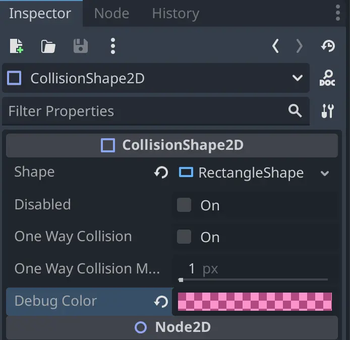

이제 사각형 쉐이프의 크기를 조절해 보겠습니다. 여기에는 미묘한 부분이 있습니다! 사각형 쉐이프로 스프라이트의 일부분만 덮도록 해야 합니다.
이전 강의에서 설명드린 것처럼, 스프라이트는 게임의 시각적 표현이며, 실제 충돌 계산은 물리 엔진이 물리 쉐이프를 기준으로 수행합니다.
따라서 캐릭터가 블록의 앞과 뒤를 자유롭게 걸을 수 있도록, 쉐이프는 스프라이트보다 작게 만들어야 합니다.

쉐이프의 너비는 스프라이트와 맞춰 주시고, 높이는 위쪽과 아래쪽 부분을 비워 주세요. 참고용으로 임시로 러너 씬 인스턴스를 추가해 보셔도 좋습니다.
러너의 충돌 원형이 블록에 닿을 때 플레이어가 멈추게 될 것입니다.

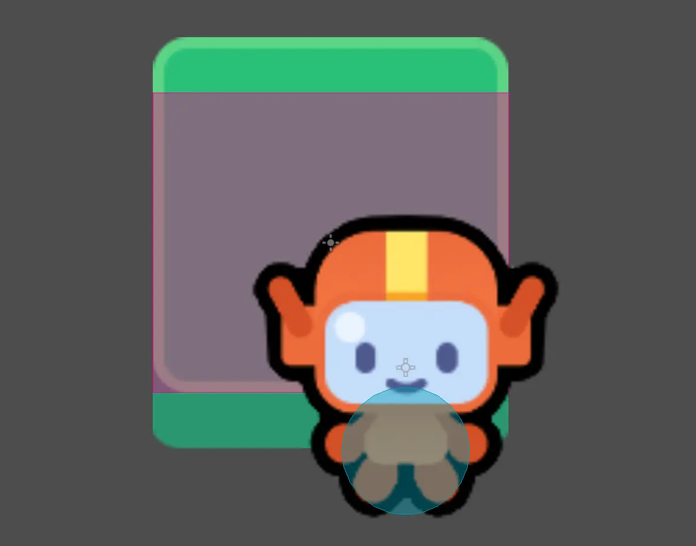

단축키를 사용하면 쉐이프의 크기를 대칭적으로 조절할 수 있다는 점을 기억해 주세요.

#### 장애물 테스트하기

이제 이 장애물을 테스트할 수 있는 씬을 만들어 보겠습니다. res://lessons 폴더에 새 씬을 생성하시고, 이름은 game.tscn으로 지정해 주세요.
루트 노드는 Node2D로 선택하시고, runner.tscn과 simple_obstacle.tscn 씬을 인스턴스로 추가해 주세요. 
두 씬 파일을 파일 시스템 독(FileSystem dock)에서 동시에 선택한 후 뷰포트로 드래그하시면 됩니다.

씬 구조는 다음과 같아야 하며, **러너가 장애물보다 위쪽에 위치하도록** Scene 독에서 배치해 주세요.

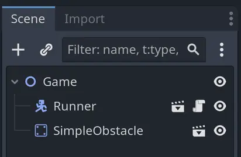

원하신다면 SimpleObstacle 노드를 선택하여 여러 번 복제하실 수 있습니다.

직접 테스트해 보세요! 작동은 잘 되지만, 약간의 문제가 있습니다. 캐릭터가 블록 뒤로 이동할 때는 잘 그려지지만,
캐릭터가 아래쪽으로 내려오면 여전히 장애물 뒤에 그려져서 깊이감이 있는 것처럼 보이던 연출이 깨지게 됩니다.

지금이 바로 **그리기 순서(drawing order)** 에 대해 소개하고 설명드리기에 좋은 기회입니다.

---

## P2 Draw order

기본적으로 Godot의 2D에서는 씬 트리(Scene Tree)에 나타나는 순서대로 노드를 그립니다. 위에서 아래로 순서대로 그려지며,
씬 트리의 위쪽에 있는 노드가 먼저, 즉 뒤쪽에 그려지고, 아래쪽에 있는 노드일수록 나중에, 즉 앞쪽에 그려집니다.

이러한 기본 동작은 대부분의 게임이나 사용자 인터페이스에서는 잘 작동합니다. 그러나 탑다운(top-down)이나 아이소메트릭(isometric) 방식의 
게임에서는 그렇지 않습니다. 이러한 게임에서는 씬 트리에서의 순서가 아니라 **화면상의 위치** 를 기준으로 노드를 그려야 합니다. 그리고 씬 트리에서의
순서와 화면상의 위치는 항상 일치하지 않습니다!

Godot는 2D 노드의 그리기 순서를 제어할 수 있는 몇 가지 도구를 제공합니다. 그중 첫 번째가 **Z 인덱스(Z Index)** 속성입니다.
Z 인덱스가 높은 노드는 낮은 노드보다 **앞쪽에 표시** 됩니다.

현재 씬에서 러너가 블록의 아래쪽과 겹치도록 배치한 후, 블록의 Z 인덱스 속성을 조절해 보세요. 씬 독(Scene dock)에서 러너가 블록보다 위쪽에 위치해 있으면,
블록이 **앞쪽에 그려져서** 러너를 가리게 됩니다. 하지만 블록의 Z 인덱스를 낮추면, 블록이 **러너 뒤쪽에 그려지는** 것을 확인하실 수 있습니다.

좋습니다, 문제가 해결된 것 같죠? 하지만… 정말 해결된 걸까요?

러너를 블록의 위쪽으로 이동시켜 보면, 여전히 러너가 블록 **앞에 그려지는** 것을 보실 수 있습니다. 
즉, 에디터에서 Z 인덱스를 수동으로 조절하는 것만으로는 이번 경우에 완전히 원하는 결과를 얻을 수 없습니다.

문제는 다음과 같습니다:

- 캐릭터가 뷰포트에서 블록보다 **위쪽에 위치** 해 있을 때는, **블록이 캐릭터 앞에 그려지기를** 원합니다.
    
- 반대로 캐릭터가 블록보다 **아래쪽에 위치** 해 있을 때는, **블록이 캐릭터 뒤에 그려지기를** 원합니다.

아하! 그렇다면 런타임 중에 두 노드 중 하나의 Z 인덱스를 **동적으로 변경** 할 수 있겠네요! 장애물과 러너의 position.y 속성을 비교해서,
그에 따라 Z 인덱스를 조절하는 방식입니다. 하지만 게임에 더 많은 오브젝트들이 추가되면, **게임 안의 모든 블록과 캐릭터 각각에 대해** 이런 처리를 해줘야 합니다… 
생각보다 꽤 많은 작업이 될 것 같네요.

---

## P3 Y-sort

다행히도, 우리가 직접 코딩할 필요는 없습니다! 이 문제는 워낙 흔하게 발생하기 때문에, Godot 엔진에서는 이를 자동으로 처리해 주는 속성을 제공합니다.
바로 **Y Sort Enabled** 속성입니다.

> [!example] 다음 질문에 답해보세요
> **이 속성이 무슨 역할을 한다고 생각하시나요?** 최선을 다해 추측해 보세요.
> 
> - 노드들의 **Y 위치** 를 기준으로 그리기 순서를 변경합니다.
> 
> - 노드들의 **Z 위치** 를 기준으로 그리기 순서를 변경합니다.
> 
> - **y 속성** 이 있는 노드만 그립니다.
> 
> - 노드들의 **X 위치** 를 기준으로 그리기 순서를 변경합니다.
> 
> - “y”라는 그룹에 속한 노드들만 그리기 순서를 변경합니다.
> 
> > [!example]- 정답
> > Y Sort Enabled 속성은 해당 노드의 **모든 자식 노드들의 Y 위치를 기준으로 정렬** 하여, 그 순서대로 그려지게 합니다. 이는 스프라이트가 화면 위아래로 이동하면서 **다른 스프라이트의 앞이나 뒤로 자연스럽게 이동하도록 표현하고 싶을 때** 매우 유용합니다.

Y Sort Enabled 속성을 사용하면, 노드의 순서와 관계없이 position.y 값이 더 큰 노드가 position.y 값이 더 작은 노드 위에 그려지도록 할 수 있습니다.
참고로, position.y 값은 노드가 화면 아래쪽으로 이동할수록 증가합니다. 따라서 position.y 값이 클수록 캐릭터는 화면에서 더 아래쪽에 위치하게 됩니다.
예를 들어, 아래의 다이어그램에서는 Godot이 A 위에 B 노드를 그리게 됩니다.

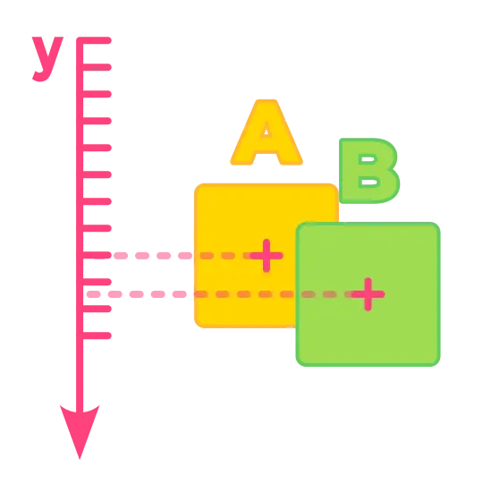

노드의 모양이나 시각적 요소는 중요하지 않다는 점에 유의해 주세요. 중요한 것은 노드의 피벗 포인트이며, 이는 에디터의 뷰포트에 작은 십자 모양으로 표시됩니다.

피벗 포인트가 스프라이트의 중심에 위치해 있다면, B 노드의 크기를 A보다 작게 만들 경우 그려지는 순서가 어색하게 보일 수 있습니다.

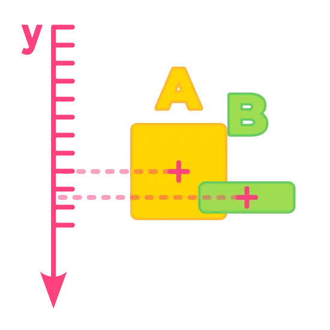

이것은 탑다운 게임에서 흔히 발생하는 문제입니다. 더 큰 스프라이트가 다른 스프라이트 앞에 그려지게 하고 싶다면,
노란색 스프라이트의 피벗 포인트를 이미지의 아래쪽으로 옮기는 것이 하나의 해결책입니다.

위의 예시에서, 만약 스프라이트 A의 피벗 포인트를 이미지의 아래쪽에 맞춰 이동시킨다면,
Y Sort Enabled가 활성화된 상태에서 Godot은 A를 B 위에 그리게 됩니다.

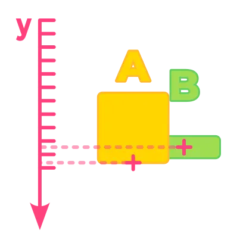

**참고:** Y Sort Enabled는 부모 노드에 설정해야 하며, 이 속성은 해당 부모 노드의 모든 자식 노드에 적용됩니다.

좋습니다! 이제 우리 프로젝트에서 Y Sort Enabled 속성을 사용해 보겠습니다. Game 노드를 선택한 다음,
인스펙터에서 **Ordering > Y Sort Enabled** 체크박스를 활성화해 주세요.
(자식들의 z-index가 동일해야 y sort 기능이 작동함)

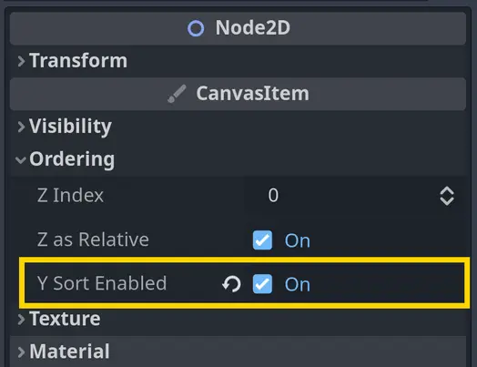

이제 씬을 다시 테스트해 보세요. 캐릭터가 블록 위쪽으로 이동할 때, 이제는 블록 뒤에 그려져야 합니다. 멋지죠! 씬을 잠깐 플레이해 보세요.

하지만 또 다른 문제가 있다는 것을 눈치채실 수도 있습니다. 만약 아직 못 보셨다면, 제가 보여드리겠습니다.
캐릭터가 블록보다 훨씬 일찍 뒤에 그려지기 시작하는데, 이것이 다소 어색하게 보일 수 있습니다.

> [!example] 다음 질문에 답해보세요
> 무슨 일이 일어나고 있다고 생각하시나요?
> 
> - 캐릭터가 블록에서 너무 멀리 떨어졌을 때 블록 뒤에 그려진다
> 
> - 캐릭터의 position.y 값이 블록보다 작을 때 블록 뒤에 그려진다
> 
> - 캐릭터가 블록에 너무 가까이 있을 때 블록 뒤에 그려진다
> 
> - 캐릭터가 블록과 같은 높이에 있을 때 블록 뒤에 그려진다
>
> > [!example]- 정답
> > Y Sort Enabled 속성은 노드들을 Y 위치에 따라 정렬합니다. 블록의 피벗 위치만이 중요하기 때문에, 달리는 캐릭터의 피벗 포인트가 블록의 중심을 지나치게 되면, Godot은 캐릭터를 블록 뒤에 그리게 됩니다.

---

## P4 Adjusting the pivot point

이제 블록의 피벗 포인트를 조정해 보겠습니다. 좀 더 정확히 말하자면, 노드들을 이동시켜 블록의 위치가 스프라이트의 상단 근처에 오도록 하겠습니다.
이렇게 하면, 캐릭터가 블록의 윗부분 가까이에 있을 때에만 블록이 캐릭터 앞에 그려지게 됩니다.

simple_obstacle.tscn 씬을 열어 주세요.

장애물의 피벗 포인트는 루트 노드인 StaticBody2D의 위치입니다.
이 위치는 해당 노드를 선택했을 때 에디터에서 밝게 표시되는 위치 아이콘으로 확인하실 수 있습니다.

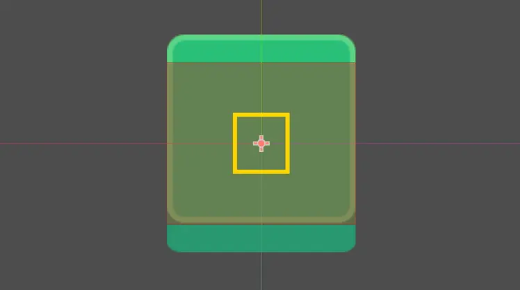

문제는 StaticBody2D 노드를 이동하면 스프라이트와 충돌 모양도 함께 이동하게 된다는 점입니다. 그래서 이렇게 하는 것은 실제로 도움이 되지 않습니다.
대신, 스프라이트와 충돌 모양 노드를 직접 이동시켜서 블록의 피벗 포인트를 효과적으로 변경해야 합니다.

Sprite2D와 CollisionShape2D 노드를 함께 선택해 주세요. 두 노드를 모두 선택한 상태에서 Transform > Position > Y 값을 74픽셀로 설정하시면 됩니다.

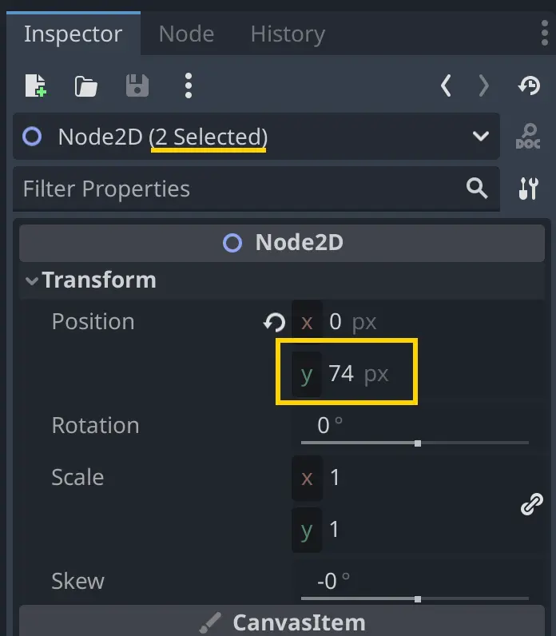

이렇게 하면 스프라이트의 상단이 StaticBody2D 노드의 위치와 정렬되게 됩니다.

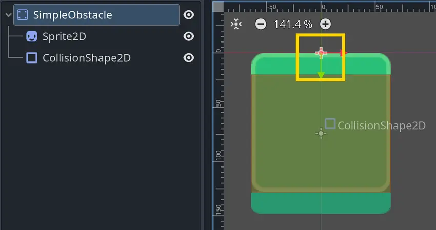

이제 다시 Game 씬으로 돌아가서 테스트해 보세요. Godot은 캐릭터가 블록의 윗부분 가장자리에 가까이 있을 때에만 캐릭터를 블록 뒤에 그려야 합니다.
정확히 말로 표현하기는 어렵지만, 그려지는 순서의 변화가 훨씬 더 자연스럽게 느껴질 것입니다.

이렇게 하면 캐릭터가 충돌할 수 있으면서, 그 뒤와 앞을 자유롭게 지나갈 수 있는 오브젝트를 설정할 수 있습니다.

이제 장애물이 잘 작동하니, 달리는 캐릭터를 위한 경로를 만들어 봅시다!

---

## P5 Creating a circuit with complex collision shape

CollisionShape2D 노드는 매우 유용하지만, 미리 정의된 형태만 제공하기 때문에 모든 씬에 적합하지는 않습니다.
에디터에서 직접 폴리곤을 그릴 수 있게 해주는 또 다른 노드가 있습니다. 바로 CollisionPolygon2D입니다! 이 기능을 잘 활용해보겠습니다.

제가 두 개의 레이어로 나누어진 서킷을 준비해 두었습니다. 이미지 파일은 res/assets 폴더에서 확인하실 수 있습니다:

- circuit_background.png: 바다, 지면, 벽의 옆면 등 서킷의 배경입니다. 이 이미지는 다음 섹션에서 사용하실 겁니다.
    
- circuit_obstacle.png: 벽의 윗부분입니다. 우리의 충돌 폴리곤은 이 레이어를 기준으로 설정될 것입니다.

두 이미지를 서로 겹치면 다음과 같은 모습이 됩니다:

> [!info]- 보통 게임 레벨을 이렇게 큰 이미지로 만드시나요?
> 아니요, 보통은 그렇지 않습니다! 대부분의 탑다운 게임에서는 타일맵이나 여러 개의 작은 이미지를 사용해서 레벨을 구성합니다. 저희는 주로 프로토타입을 만들 때 큰 이미지를 사용합니다.
> 
> 이번 모듈에서는 러너와 장애물에 집중하기 위해 간단하게 시작하는 것입니다. 큰 이미지를 사용하면 CollisionPolygon2D 노드를 소개하고 이를 활용해 게임 레벨을 구성할 수 있는 좋은 기회가 됩니다.
> 
> 걱정하지 마세요! 다음 모듈에서는 타일맵을 사용하는 방법도 배우시게 될 겁니다!

이것은 나중에 게임에 가져올 새로운 씬이 될 것입니다. 먼저 벽 레이어를 위한 충돌 폴리곤을 생성하실 겁니다. 이를 위해 다음과 같은 작업을 하게 됩니다:

- StaticBody2D 노드를 다시 생성합니다.
    
- 벽의 윗부분을 나타내는 Sprite2D 노드를 추가합니다.
    
- CollisionPolygon2D 노드를 추가하고, 서킷의 형태를 따라 도형을 그립니다.

StaticBody2D를 루트 노드로 하는 새로운 씬을 만들고 이름을 **Circuit**으로 지정해 주세요. 
그런 다음, StaticBody2D의 자식 노드로 **Sprite2D** 노드를 추가해 주세요.
circuit_obstacle.png 텍스처를 드래그하여 Sprite2D 노드의 **Texture** 속성에 설정해 주세요.

그다음, StaticBody2D의 자식 노드로 **CollisionPolygon2D** 노드를 추가해 주세요.
이 노드를 선택하면, 뷰포트 상단의 툴바에 새로운 옵션들이 나타나는 것을 확인하실 수 있습니다.

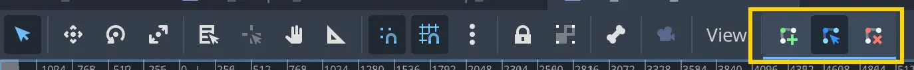

이 세 개의 버튼을 사용하면 충돌 도형에 점을 추가하거나, 이동하거나, 제거할 수 있습니다.

특정 픽셀에 정확히 맞추는 것은 어렵기 때문에, 이를 좀 더 쉽게 하기 위해 격자에 스냅되는 기능을 설정해보겠습니다.
**Snap Grid** 아이콘을 클릭하면 Godot이 격자에 맞춰 스냅되도록 설정됩니다. 
그런 다음, 해당 아이콘 옆에 있는 세 개의 점을 클릭하고 **Configure Snap…** 을 선택해 주세요.

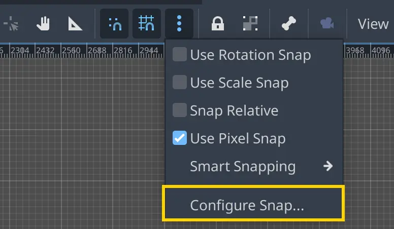

팝업 대화 상자에서 격자 간격을 **32 x 32 픽셀** 로 설정해 주세요. 이렇게 하면 우리가 그리는 점들이 32픽셀 단위로 스냅되어 정렬됩니다.

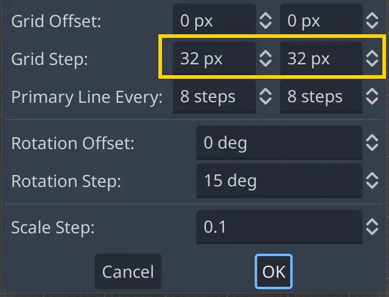

> [!info]- 적절한 격자 간격 값은 어떻게 선택하나요?
> 보통은 아티스트의 작업 방식에 따라 결정합니다. 아티스트가 그래픽 작업을 할 때 사용한 격자 크기를 알려줄 것이고, 그에 맞춰 설정하시면 됩니다. 만약 직접 그래픽을 제작하셨다면, 제작할 때 사용한 격자 크기를 그대로 사용하거나, 배치할 때 더 세밀한 조절이 필요하다면 그 크기를 2 또는 4로 나눈 값을 사용할 수도 있습니다.

이제 서킷의 형태를 그려보겠습니다. 가운데 섬부터 시작해 보겠습니다. 초록색 부분과 중앙의 투명한 픽셀들을 모두 포함하는 하나의 폴리곤을 만들어도 괜찮습니다.
우리가 원하는 것은 캐릭터가 통과할 수 없는 영역을 만드는 것입니다.

**CollisionPolygon2D** 노드를 선택한 상태에서, 툴바에서 **점 생성(Create points)** 아이콘을 클릭하면 도형에 점을 추가할 수 있습니다.
서킷의 모서리 부분을 클릭하여 도형을 만들어 주세요. 다 그리셨으면, 처음에 만든 점을 다시 클릭하여 도형을 닫아 주세요.

> [!caution]- 뷰포트에서 클릭해서 점을 만들려고 하는데 아무 일도 일어나지 않아요!
> **점 생성 도구(Create points)** 를 선택했는데도 점이 추가되지 않는다면, **선택 모드(Select Mode)** 가 활성화되어 있는지도 확인해 주세요. 툴바 왼쪽에 있는 **선택 모드 아이콘** 이 선택되어 있어야 합니다.

점을 잘못 클릭하셨더라도 걱정하지 마세요! 계속 진행하시면 됩니다.
도형을 완성한 후에는 툴바의 **점 편집(Edit points)** 아이콘을 사용하여 점을 이동하거나 삭제할 수 있습니다.

또한 도형을 그리는 중에도 평소처럼 뷰를 이동할 수 있습니다. **마우스 가운데 버튼**이나 **스페이스바**를 누르고 있으면 화면을 이동시킬 수 있습니다.

> [!example] 다음 질문에 답해보세요
> 그럼 이제 어떻게 하실 건가요? 최선을 다해 추측해 보세요.
> 
> - 구멍이 있는 CollisionPolygon2D 사용하기
> 
> - 여러 개의 CollisionShape2D 노드 사용하기
> 
> - 여러 개의 CollisionPolygon2D 노드 사용하기
> 
> - 구멍이 있는 CollisionPolygon2D와 CollisionShape2D 함께 사용하기
> 
> - CollisionShape2D를 마흔두 개 사용하기
> 
> > [!example]- 정답
> > CollisionPolygon2D는 구멍을 만들 수는 없지만, StaticBody2D 노드나 다른 물리 노드의 자식으로 여러 개의 충돌 도형(Collision Shape 또는 Polygon)을 가질 수는 있습니다. 따라서 두 개 이상의 **CollisionPolygon2D** 노드를 사용해서 원하는 형태를 만들 수 있습니다.
> > 기술적으로는 여러 개의 **CollisionShape2D** 노드를 사용하는 것도 가능하지만, 훨씬 많은 작업이 필요할 수 있습니다. CollisionShape2D 노드는 미리 정의된 형태만 제공되기 때문에, 이 작업에는 그다지 편리하지 않습니다.

**StaticBody2D** 노드의 자식으로 새로운 **CollisionPolygon2D** 노드를 추가해 주세요. 
이번에는 서킷의 **외곽 부분만** 그리실 겁니다. 이전과 동일한 방식으로 도형을 그리면 됩니다. 
하나의 폴리곤에는 구멍을 만들 수 없기 때문에, 두 개의 도형을 따로 그려야 합니다. 
한 부분을 먼저 그린 후, 또 다른 **CollisionPolygon2D** 노드를 추가하여 나머지 부분을 그려 주세요. 
필요한 경우 두 개보다 더 많은 노드를 사용하는 것도 물론 가능합니다. 다음은 제가 도형을 만든 방식입니다:

> [!info]- 성능을 위해 충돌 도형을 나누는 것이 더 좋을 수 있습니다.
> 충돌 폴리곤에 점이 많을수록, 컴퓨터가 충돌을 감지하는 데 더 많은 성능을 소모하게 됩니다. 물론 이번에 사용하는 서킷 정도는 최신 컴퓨터는 물론, 꽤 오래된 모바일 기기나 태블릿에서도 전혀 문제가 되지 않습니다.
> 
> 하지만 게임에 복잡한 도형이 많이 포함되어 있다면, 이러한 도형들을 더 작은 형태로 나누는 것이 좋습니다. 물리 엔진은 플레이어나 해당 도형의 경계 사각형과의 거리를 기준으로, 비용이 많이 드는 충돌 검사를 생략할 수 있기 때문입니다.
> 
> 우리의 서킷처럼 큰 충돌 폴리곤이 플레이어를 둘러싸고 있다면, 엔진은 매 프레임마다 그 도형과의 충돌 여부를 검사해야 합니다. 하지만 도형을 더 작은 여러 개로 나누면, 엔진은 플레이어와 멀리 떨어진 도형들은 검사에서 생략할 수 있게 됩니다.
> 
> 물론 프로토타입을 만들 때는 이런 부분을 굳이 신경 쓰실 필요는 없습니다. 그리고 이번 서킷처럼 단순한 경우에는 전혀 문제가 되지 않습니다. 다만 나중에 더 복잡한 게임을 만들게 될 때를 대비해서 알고 계시면 좋습니다.

서킷 전체의 윤곽을 천천히 그려주세요. 저는 여기서 기다리고 있겠습니다.

…

… 천천히 하셔도 괜찮아요, 저는 아직 여기 있습니다 …

…

좋습니다, 이제 다 끝나셨다고 생각할게요! 이제 모든 것을 하나로 모아봅시다.

> [!info]- 이미지로부터 충돌 폴리곤을 생성할 수도 있습니다. 하지만…
> **CollisionPolygon2D** 노드는 텍스처로부터 직접 생성할 수 있습니다. 방법은 **Sprite2D** 노드를 선택한 후, 툴바에서 **Sprite2DCreate CollisionPolygon2D sibling** 버튼을 클릭하는 것입니다. 그러면 텍스처에서 불투명한 픽셀들을 기준으로 폴리곤이 생성됩니다. 아래는 그 예시입니다:
> 
> 
> 
> 보시면 어느 정도 작동은 하지만, 약간 정확도가 떨어진다는 것을 알 수 있습니다. 도형을 빠르게 프로토타이핑할 때는 유용하지만, 우리 서킷처럼 복잡한 형태에는 잘 맞지 않습니다.
> 
> 다음은 이 도구를 서킷 스프라이트에 사용한 예시입니다.
> 
> 
> 
> 보시다시피, 이 방법은 불필요한 점들을 많이 생성하고 때로는 작은 구멍들도 만들어냅니다. 빠르게 프로토타이핑할 때는 점이 많거나 약간의 오류가 있어도 큰 문제가 되지 않습니다. 하지만 최종 게임에서는 좀 더 정밀한 도형이 필요합니다. 점이 너무 많으면 물리 엔진이 계산해야 할 양이 많아져 게임 속도가 느려질 수 있습니다. 또한, 경우에 따라 충돌 판정이 플레이어에게 어색하게 느껴질 수도 있습니다.
> 
> 그럼에도 불구하고, 프로토타입 단계에서는 시간을 크게 절약할 수 있으니 나중에 꼭 한번 시도해 보시기 바랍니다!

---

## P6 Bringing it all together

이제 모든 것을 하나로 모아 플레이할 수 있는 씬을 만들어 보겠습니다.

다음과 같은 요소들을 포함한 씬을 만들게 됩니다:

- 서킷
    
- 러너 인스턴스
    
- 직접 배치한 몇 개의 블록들
    
- 러너에 연결된 카메라 (러너를 따라 화면이 이동하도록 하기 위해)

이전에 만들었던 game.tscn 씬으로 돌아가 주세요.
**Sprite2D** 노드를 추가한 다음, circuit_background.png 텍스처를 드래그하여 해당 노드에 설정해 주세요.
이 스프라이트의 **Z 인덱스(Z Index)** 를 -1로 설정하면 다른 모든 요소들이 그 위에 그려지게 됩니다.
그런 다음, **Circuit** 씬을 인스턴스로 추가하여 **Game** 씬에 배치해 주세요.

그 후에는 **장애물 씬(obstacle scene)** 을 복제하여 서킷에 추가 장애물들을 배치하실 수 있습니다. 
노드 계층 구조는 대략 다음과 같은 형태가 되어야 합니다:

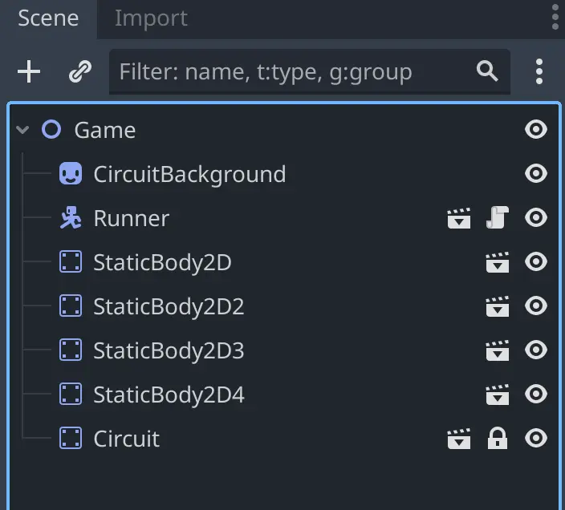

러너와 장애물들을 서킷 위에 원하는 위치에 자유롭게 배치해 주세요.

이제 거의 완료되었습니다. 남은 작업은 플레이어에게 카메라를 추가하는 것입니다. 
runner.tscn 씬을 열고, **CharacterBody2D** 노드의 자식으로 **Camera2D** 노드를 추가해 주세요. 
이렇게 하면 카메라가 플레이어를 따라다니며 서킷 위에서 화면이 이동하게 됩니다.

마지막으로 다시 **Game** 씬으로 돌아가서 실행해 보세요! 작은 캐릭터가 서킷 위를 이동하고, 벽이나 블록에 부딪히는 모습을 보실 수 있을 것입니다.

> [!info]- 그런데 캐릭터의 발이 벽 뒤로 가지 않는 건 왜 그런가요?
> **서킷이 하나의 큰 이미지** 이기 때문에, 해당 이미지에는 **“Y 정렬(Y Sorting)”** 을 사용할 수 없습니다! 그래서 캐릭터는 항상 그 이미지보다 앞쪽에 있거나, 항상 뒤쪽에 있게 됩니다. 레벨 전체를 하나의 이미지로 만드는 방식은 **진짜 탑다운(Top-Down)** 방식의 게임에는 매우 효과적일 수 있지만, **깊이감이 있는 게임** 에는 적합하지 않을 수 있습니다.
> 
> 그리기 순서를 동적으로 변경하려면, 서킷을 여러 부분으로 나누어 개별적으로 배치해야 합니다. 하나의 큰 이미지를 사용하는 대신, 다양한 형태의 이미지들을 조합하여 서로 다른 트랙을 구성할 수도 있습니다. 또는 **타일맵(TileMap)** 을 사용할 수도 있는데, 이는 다음 모듈에서 다루게 될 예정입니다.
> 
> 이번 모듈에서는 충돌을 처리하기 위한 핵심 노드들과, 좀 더 복잡한 캐릭터 컨트롤러나 상호작용 가능한 오브젝트 설정 등, 더욱 흥미로운 요소들에 집중하고자 합니다.

> [!caution]- 내 캐릭터가 가끔 사라져요!
> 이런 현상은 트랙 자체가 **Game** 의 자식 노드이기 때문에, **Y 정렬(Y Sort)** 속성이 트랙에도 적용되면서 발생할 수 있습니다. 수업에서 안내한 대로, 트랙의 **Z 인덱스(Z Index)** 를 -1로 설정해서 항상 캐릭터보다 뒤에 그려지도록 해 주세요.
> 
> 또한 트랙의 피벗 포인트가 캐릭터의 피벗 포인트보다 항상 **위쪽에** 있도록 설정하는 것도 한 방법입니다. **Sprite2D** 의 경우에는 **OffsetCentered** 옵션을 체크 해제하면, 피벗 포인트가 스프라이트의 왼쪽 상단으로 설정됩니다.

> [!example] 연습이 완벽을 만듭니다.
> 이제 새로 익힌 기술들을 잘 활용해 볼 시간입니다. Godot에서 **워크북 프로젝트(workbook project)** 를 열고 따라와 주세요.
>  
> **미션: 플레이어가 게임 영역 안에 머물도록 하세요**
> 
> **L4.P1**
> 
> **사용 기술:** CollisionPolygon2D (충돌 폴리곤)

---

## P7 Recap

이제부터 여러분이 만들고 싶은 레벨에 한계는 오직 상상력뿐입니다! 
**CollisionShape2D**와 **CollisionPolygon2D** 노드를 조합하면 원하는 어떤 형태의 벽이든 만들 수 있습니다.

또한 **Y Sort Enabled** 속성을 사용하면 노드들을 수직 위치에 따라 정렬할 수 있습니다. 
이는 대부분의 탑다운 게임처럼 노드들이 **동적으로 그려지는 순서** 를 조절하고 싶을 때 매우 유용합니다.

이번 수업에서는 다음 내용을 배우셨습니다:

- 장애물을 만들기 위해 **StaticBody2D** 노드를 생성하는 방법
    
- **CollisionPolygon2D** 노드를 사용하여 충돌 폴리곤을 직접 그리는 방법
    
- **Z Index** 속성으로 노드의 그리기 순서를 제어하는 방법
    
- **Y Sort Enabled** 속성을 사용하여 노드의 그리기 순서를 동적으로 변경하는 방법
    
- 간단한 레벨을 빠르게 프로토타이핑하는 방법
    
- 하나의 물리 오브젝트에 여러 개의 충돌 도형이나 폴리곤을 사용할 수 있다는 점
    

축하드립니다! 이제 탑다운 게임의 기본기를 익히셨습니다. 
다음 수업에서는 캐릭터에 **관성(Inertia)** 을 추가하여 좀 더 역동적이고 재미있는 움직임을 만들어 보겠습니다.

