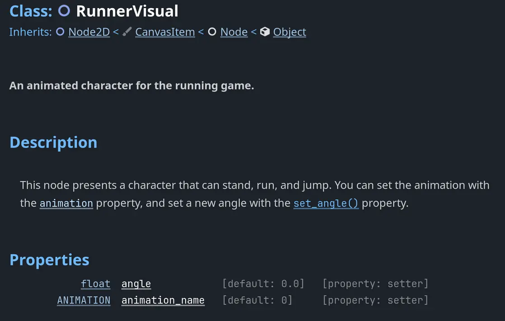
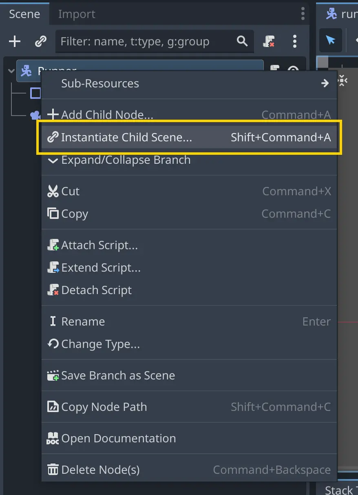
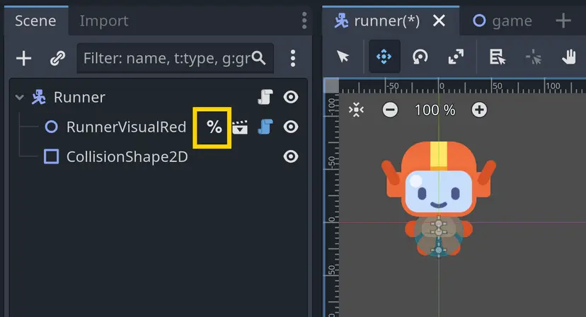

이번 수업에서는 캐릭터에 **관성**을 추가하고, 임시로 사용하던 스프라이트를 보다 완성도 있는 에셋으로 교체하게 됩니다.


디자이너가 아직 에셋 작업을 열심히 진행 중이니 곧 받아보실 수 있을 것입니다. 그동안 우리는 게임의 조작 감각을 개선해 보겠습니다!

현재 러너는 방향키를 누르자마자 **즉시 최고 속도로** 움직입니다. 방향을 입력하면 **바로 해당 방향으로** 이동하죠.


이 방식도 작동은 하지만, 대부분의 게임에서는 여기에 조금 더 요소가 추가됩니다. 대부분의 게임에서는 캐릭터가 즉시 최고 속도로 움직이지 않고,
**서서히 가속하고 감속**합니다.

예를 들어, **M4. To Space and Beyond** 에서는 **선형 보간(linear interpolation)** 의 일종인 **조종 행동(steering behaviors)** 을
사용하여 우주선을 부드럽게 움직이도록 만들었습니다.


이번 게임에서는 러너의 **가속**과 **감속**을 제어하기 위해 다른 기법을 사용하게 됩니다.

대부분의 게임에서는 **가속도와 감속도 값이 게임 플레이 중에 변할 수 있습니다.** 예를 들어, 진흙 위를 걸으면 가속도와 최고 속도가 줄어들 수 있고,
얼음 위를 걸으면 가속도와 감속도가 모두 줄어들어 캐릭터가 더 많이 미끄러질 수 있습니다. 우리는 나중에 이러한 메커니즘을 쉽게 추가할 수 있도록,
이를 고려한 코드를 작성할 것입니다. 다음 모듈에서는 캐릭터의 **최고 속도와 가속도** 를 변화시키는 **장애물들** 을 추가할 예정입니다.

이번 수업에서는 다음과 같은 작업을 진행하실 겁니다:

- 러너에게 **가속**과 **감속**을 추가합니다.
    
- 러너에 사용할 **새로운 에셋**을 적용합니다.
    
- 러너가 **부드럽게 회전**하고, **속도에 따라 애니메이션이 전환**되도록 설정합니다.

그럼 시작해 보겠습니다!

---

## P1 Adding inertia

먼저 **runner.gd** 스크립트에 가속과 감속을 처리하기 위해 필요한 변수를 추가하실 것입니다. 필요하다면 스크립트를 다시 여십시오.

우선 max_speed를 export 하는 것부터 시작하겠습니다. 이렇게 하면 에디터에서 값을 변경하여 러너를 세밀하게 조정할 수 있습니다.

```gdscript
## 러너가 도달할 수 있는 최고 속도입니다.
@export var max_speed := 600.0
```

그리고 가속과 감속을 처리할 변수를 추가하십시오:

```gdscript
## 플레이어가 이동 키를 눌렀을 때, 초당 얼마나 속도가 더해지는지.
@export var acceleration := 1200.0
## 플레이어가 모든 이동 키에서 손을 뗐을 때, 초당 얼마나 속도가 줄어드는지.
@export var deceleration := 1080.0
```

이제 속도를 계산해야 합니다. 이전에는 입력 방향에 속도를 곱해서 속도를 계산하셨습니다:

```gdscript
velocity = direction * max_speed
```

이 방식은 러너가 즉시 최고 속도에 도달하게 만들었습니다. 이제는 시간이 지남에 따라 속도를 점차 증가시키고자 합니다.
각 프레임마다 러너에게 조금씩 속도를 더해 주는 방식입니다.

Godot에서는 move_toward() 함수를 통해 이를 매우 쉽게 처리할 수 있습니다.
이 함수는 어떤 값을 목표값 또는 최대값 쪽으로 일정량 이동시키며, 결과가 결코 최대값을 초과하지 않도록 보장합니다.

속도 계산 부분을 다음 코드로 교체하십시오. 또한 \_physics_process() 함수의 매개변수 이름을 \_delta에서 delta로 바꿨는데,
이제 이 값을 사용할 것이기 때문입니다.

```gdscript
func _physics_process(delta: float) -> void:
	# ...
	var has_input_direction := direction.length() > 0.0
	if has_input_direction:
		var desired_velocity := direction * max_speed
		velocity = velocity.move_toward(desired_velocity, acceleration * delta)
	else:
		velocity = velocity.move_toward(Vector2.ZERO, deceleration * delta)
```

이 코드에서 속도 변화는 두 부분으로 나뉩니다:

- 플레이어가 입력 방향 키를 누르고 있다면, 속도를 desired_velocity 쪽으로 acceleration * delta 만큼 이동시킵니다. 이렇게 하면 캐릭터가 플레이어가 누른 방향으로 최고 속도에 도달할 때까지 가속하게 됩니다.
    
- 반대로 플레이어가 어떤 입력도 누르지 않는다면, 속도를 Vector2.ZERO 쪽으로 deceleration * delta 만큼 이동시킵니다. 이렇게 하면 캐릭터는 감속하다가 멈추게 됩니다.
    

Vector2.move_toward()는 매 프레임마다 acceleration * delta 값을 속도에 더합니다. 결과가 desired_velocity에 도달하면 멈추게 되어,
캐릭터가 결코 max_speed보다 더 빠르게 움직일 수 없게 됩니다.

> [!note]- 왜 가속도에 delta를 곱하는 것일까요?
> 가속도에 delta를 곱해야 하는 이유는 두 가지가 있습니다:
> 
> - **움직임을 프레임레이트에 독립적으로 만들기 위해서입니다.**
>
>   기술적으로는 물리 처리 루프가 고정된 시간 간격을 가지므로 정확히는 프레임레이트에 의존하지 않습니다. 그러나 물리 업데이트 속도는 프로젝트 설정이나 코드에서 플레이어의 성능 설정에 따라 변경될 수 있습니다. 따라서 이 delta 값은 때때로 달라질 수 있고, 이를 사용하는 것이 좋은 습관입니다.
> 
> - **단위의 일관성을 유지하기 위해서입니다.**
> 
>   물리학에서 가속도는 시간 제곱에 대한 거리(거리/시간²)이고, 속도는 시간에 대한 거리(거리/시간)입니다. 즉, 서로 다른 단위를 가진 값들입니다. 만약 가속도에 delta를 곱하지 않는다면, 가속도를 속도에 직접 더하게 되어 기본적인 물리 법칙을 위반하게 됩니다. 가속도를 속도에 반영하려면, 가속도가 작용한 시간만큼을 곱해야 합니다. 이 경우 그 시간은 두 프레임 사이의 시간 간격인 delta입니다.


게임을 실행해 보십시오! 캐릭터를 조종하는 것이 이미 조금 더 재미있어졌음을 느끼실 수 있을 것입니다.
max_speed와 acceleration 값을 자유롭게 조정하여 캐릭터에 어떤 영향을 주는지 확인해 보셔도 좋습니다.


---

## P2 Using new assets

와, 멋지군요! 아티스트께서 작업물을 전달해 주셨습니다! 새로운 에셋인 **RunnerVisual**이 생겼습니다.
이것은 캐릭터의 애니메이션 버전입니다. 이제 게임에 추가해 보겠습니다. 조금 손이 가겠지만, 그만한 가치가 있습니다.

캐릭터 비주얼은 res/assets/runner/runner_visual_red.tscn 씬입니다.
이는 여러 움직이는 파츠로 이루어진 애니메이션 캐릭터입니다.


이와 같은 것을 만드는 방법을 배우는 것은 본 과정의 범위를 벗어납니다. 이 캐릭터는 숙련된 게임 아티스트에 의해 제작되었기 때문입니다.
일반적으로 인디 게임에서는 게임 아티스트가 아트를 제작하고, 그것을 게임 엔진에 통합하여 의도한 대로 보이고 작동하도록 만듭니다.
따라서 여기서는 그 과정을 시뮬레이션하는 것입니다.

우리에게 중요한 것은 이 캐릭터의 **[Interface](../../Glossary/Interface.md)**입니다.
한 번 살펴보겠습니다! 러너 비주얼에는 에디터에 통합된 문서 페이지가 함께 제공됩니다.

스크립트 창 오른쪽 상단에 있는 **Search Help** 버튼을 클릭하거나 키보드에서 **F1**(Mac에서는 ⌥+Space)을 눌러 도움말 검색 창을 여십시오.
그런 다음 **RunnerVisual**이라고 입력하고 **RunnerVisual 클래스**를 선택하십시오. 그러면 해당 클래스의 문서를 보실 수 있을 것입니다.

> [!caution]- 도움말 검색 창에서 **RunnerVisual** 페이지를 찾을 수 없습니다.
> 
> 코드 참조를 검색할 때 해당 페이지가 나타나지 않는다면, 이는 Godot이 아직 문서를 생성하지 않았다는 뜻입니다. runner_visual.gd 스크립트 파일을 열고, 빈 줄을 하나 추가한 뒤 저장하여 강제로 페이지를 생성할 수 있습니다.
> 
> 이렇게 하면 에디터가 변경 사항을 감지하고 이 스크립트의 문서를 다시 생성하게 됩니다. 그런 다음, 다시 도움말에서 **RunnerVisual**을 검색해 보십시오.



이 문서를 통해 무엇을 할 수 있는지 감을 잡으실 수 있을 것입니다! 보시는 것처럼, 캐릭터는 매우 단순한 인터페이스를 가지고 있습니다:

- **animation 속성**은 현재 애니메이션을 제어합니다. RunnerVisual.Animations.IDLE, RunnerVisual.Animations.WALK, 또는 RunnerVisual.Animations.RUN으로 설정할 수 있습니다.
    
- **angle 속성**은 캐릭터의 시야 각도를 제어합니다.

또한 runner_visual_red.tscn 씬을 열고 루트 노드를 선택한 뒤, 인스펙터에서 속성을 직접 조정해 보실 수도 있습니다.
이렇게 하면 나중에 코드로 작성할 속성들이 러너 비주얼에 어떤 영향을 주는지 감을 잡을 수 있습니다. 작업이 끝나면 반드시 값을 원래대로 되돌려 놓으시기 바랍니다!

> [!info]- 이 씬이 어떻게 만들어졌는지 더 설명해 주실 수 있나요?
> 물론입니다. 저희 아티스트는 비픽셀 아트 게임에서 흔히 사용하는 방식으로 2D 캐릭터를 제작했습니다. 즉, 컷아웃 애니메이션, 퍼펫 애니메이션, 또는 모듈식 애니메이션이라 불리는 기법입니다.
> 
> 이는 캐릭터를 여러 부분으로 분리한 뒤, 게임 엔진에서 직접 애니메이션을 주는 방식입니다. 이러한 세팅은 게임 아트에 대한 어느 정도의 경험이 필요합니다. 중요한 부분은 다음과 같습니다:
> 
> - 러너의 대부분은 개별 스프라이트로 이루어져 있습니다. 손, 발, 얼굴 모두 Sprite2D 노드입니다. 아티스트는 오픈소스 벡터 드로잉 프로그램인 **Inkscape**에서 아트를 제작한 뒤, Godot으로 이미지를 가져왔습니다.
> 
> - 팔과 다리는 Line2D 노드를 사용합니다. 이름에서 알 수 있듯 Line2D는 선을 그리며, 여러 점을 추가해 곡선을 그릴 수도 있습니다.
> 
> Godot은 2D 스켈레탈 애니메이션을 지원하여 캐릭터의 구조를 더 복잡하게 만들고 각 부분에 제약을 적용할 수 있습니다. 하지만 이 캐릭터는 그것을 사용하지 않고, 단순한 2D 노드들의 계층 구조만 사용합니다.
> 
> 아티스트는 Godot의 애니메이션 에디터와 AnimationPlayer 노드를 사용하여 애니메이션을 제작했습니다. 애니메이션은 단순하며, 캐릭터가 팔다리와 얼굴을 움직이는 동작입니다. 팔다리는 노드를 회전시켜 움직이고, 얼굴은 모양의 위치를 변경하여 움직입니다.
> 
> 캐릭터가 회전할 때는 스크립트가 팔다리의 위치와 그리기 순서를 계산해 변경합니다. 예를 들어 오른팔이나 왼팔의 z_index 속성이 바뀌면서 회전에 따라 팔이 앞이나 뒤에 그려집니다.
> 
> 얼굴의 경우, 앞쪽에 있는 모양들은 우리가 M5에서 배에 화면 래핑을 적용할 때 사용했던 wrapf() 함수를 이용해 한쪽에서 다른 쪽으로 이동합니다. 마치 컨베이어 벨트 위에 있는 것처럼 움직입니다.
> 
> 
>
> 그런 다음, 보이지 않아야 할 부분을 숨기고 최종 결과를 만들어 내기 위해 **[클리핑 마스크](https://www.youtube.com/watch?v=W4j4tnQLcTA)**가 사용됩니다.


먼저, **runner.tscn** 러너 씬을 다시 여십시오. 그다음 캐릭터 비주얼을 씬에 추가하겠습니다. 방법 중 하나는 다음과 같습니다:

1. 루트 노드를 선택합니다.
    
2. 노드를 마우스 오른쪽 버튼으로 클릭하고 **Instantiate Child Scene**을 선택합니다.
    
3. runner_visual_red.tscn 씬을 검색하여 추가합니다.



또 다른 방법으로는 runner_visual_red.tscn 씬을 **Runner** 노드로 드래그하여 추가할 수도 있습니다.

새로운 캐릭터가 훨씬 크게 보일 것입니다! 에셋의 스케일은 개발 과정, 특히 초기 단계에서 종종 달라질 수 있습니다.
아티스트가 카메라 줌 애니메이션을 나중에 적용할 수 있도록, 화질 손실 없이 더 높은 해상도로 에셋을 가져오는 경우도 있습니다.

걱정하지 않으셔도 됩니다. 캐릭터를 쉽게 축소할 수 있습니다. **RunnerVisualRed** 노드를 선택한 뒤,
씬 트리의 맨 위로 이동시켜 충돌 모양과 기존 스프라이트가 그 앞에 그려지도록 하십시오.
그런 다음, 스케일을 Vector2(0.5, 0.5)로 낮추고 스프라이트와 대략적으로 맞춰질 때까지 아래로 이동시키면 됩니다.

작업이 끝나면 **Skin** 노드를 삭제해도 됩니다. 이제 필요하지 않기 때문입니다.
마지막으로, **RunnerVisualRed** 노드를 **Access as Unique Name**으로 표시하여 나중에 참조할 수 있도록 하십시오.

이제 씬은 다음과 같은 모습이 될 것입니다:



---

## P3 Making the character rotate

이제 스크립트를 수정하여 캐릭터가 회전하도록 만들어 보겠습니다. **runner.gd**를 다시 여십시오.

여기서 하실 작업은 다음과 같습니다:

- 더 이상 이미지를 사용하지 않으므로 이미지와 관련된 모든 참조를 제거합니다.
    
- 같은 이유로 이미지를 선택하는 코드를 제거합니다.
    
- 대신 방금 추가한 **RunnerVisual**을 사용합니다.
    

먼저, 캐릭터 스프라이트를 변경하는 것과 관련된 모든 상수와 코드를 제거하십시오.
이제 스프라이트가 없기 때문입니다. 또한 \_skin 노드도 더 이상 존재하지 않으므로 이것 역시 삭제하셔야 합니다.

```gdscript
# ... 
# ... 

func _physics_process(delta: float) -> void: 
	# ...
```

이제 스크립트는 다음과 같이 보이셔야 합니다:

```gdscript
extends CharacterBody2D

@export var max_speed := 600.0
## How much speed is added per second when the player presses a movement key.
@export var acceleration := 1200.0
## How much speed is lost per second when the player releases all movement keys.
@export var deceleration := 1080.0

func _physics_process(delta: float) -> void:
	var direction := Input.get_vector("move_left", "move_right", "move_up", "move_down")
	var has_input_direction := direction.length() > 0.0
	if has_input_direction:
		var desired_velocity := direction * max_speed
		velocity = velocity.move_toward(desired_velocity, acceleration * delta)
	else:
		velocity = velocity.move_toward(Vector2.ZERO, deceleration * delta)
	move_and_slide()
```

게임을 테스트해 보시면 오류는 없겠지만, 예상대로 캐릭터가 더 이상 회전하지 않을 것입니다. 이제 새 캐릭터 비주얼을 사용할 수 있습니다.

> **참고:**
> 
> 캐릭터의 움직임을 보려면 **Game** 씬을 테스트해야 합니다. 캐릭터에 카메라가 연결되어 있기 때문입니다. 만약 러너 씬을 직접 테스트한다면, 카메라가 러너를 따라가기 때문에 아무 일도 일어나지 않는 것처럼 보일 것입니다.

이제 스크립트에서 러너를 사용할 수 있습니다. 먼저, **RunnerVisual** 씬 인스턴스에 대한 참조를 생성하십시오:

```gdscipt
@onready var _runner_visual: RunnerVisual = %RunnerVisualRed
```

이제 이 참조를 사용하여 각도를 설정할 수 있습니다. 
단순히 \_runner_visual.angle = direction.angle() 이라고 하면 캐릭터가 즉시 회전하게 됩니다. 
대신 부드럽게 회전하도록 만들어 보겠습니다. 이를 위해 rotate_toward() 함수를 사용할 수 있습니다.

> [!example] 다음 질문에 답해 보십시오.
> **rotate_toward() 함수가 무엇을 하는 함수라고 생각하십니까? 최선을 다해 추측해 보세요.**
> 
> - 원하는 각도를 반환한다.
> 
> - 노드의 각도를 원하는 각도로 즉시 바꾸지만, 부드럽게 보이게 한다.
> 
> - 스티어링 동작을 사용하여 원하는 속도로 부드럽게 가속한다.
> 
> - move_toward()와 같은 기능이지만 각도에 적용된다. 주어진 각도를 일정한 값만큼 증가시켜 원하는 각도에 도달할 때까지 반복한다.
> 
> > [!example]- **정답**
> > rotate_toward()는 주어진 각도를 일정한 값만큼 증가시켜 원하는 각도에 도달할 때까지 회전시킵니다. 즉, move_toward()와 비슷하지만 각도에 적용되는 함수입니다. 

\_physics_process() 함수의 맨 아래에 다음 코드를 추가하십시오:

```gdscript
if direction.length() > 0.0:
	_runner_visual.angle = rotate_toward(_runner_visual.angle, direction.angle(), 8.0 * delta)
```

이 코드는 플레이어가 누르는 방향으로 캐릭터를 회전시킵니다. 이제 작은 연습을 하나 해 보겠습니다: 코드 참조에서 rotate_toward() 함수의 문서를 찾아보십시오.

**팁:**

- **F1** 키(맥에서는 ⌥+Space)를 눌러 코드 참조 검색 팝업을 여십시오.
- 해당 함수를 검색하고, 문서와 매개변수를 읽은 뒤 이곳으로 돌아오십시오.
- 코드를 실행해 보고, 문서와 비교해 보면서 각 인자가 무엇을 의미하는지 이해해 보시기 바랍니다.

> [!example] 다음 질문에 답해 보십시오.
> **위 코드에서 두 번째 인자인 direction.angle()은 무엇에 해당할까요?**
> 
> - 캐릭터가 회전해야 하는 현재 각도이다.
> 
> - 캐릭터가 회전해야 할 목표 각도이다.
> 
> - 초당 회전량이다.
> 
> > [!example]- **정답**
> > rotate_toward() 함수 문서에 따르면, 두 번째 인자는 캐릭터가 회전해야 할 **목표 각도**입니다. 이 함수는 캐릭터를 해당 각도로 회전시켜 줍니다.


> [!example] 다음 질문에 답해 보십시오.
> **위 코드에서, 캐릭터의 각도를 초당 몇 라디안씩 증가시키고 있을까요?**
> 
> - 회전량은 8.0이고, delta는 1/60초이므로 초당 8/60 라디안, 즉 약 0.133 라디안만큼 회전합니다.
> 
> - 회전량은 한 프레임에서 8.0이고, 초당 60프레임이므로 8 * 60, 즉 480 라디안만큼 초당 회전합니다.
> 
> - 회전 속도는 8.0이므로 초당 8.0 라디안입니다.
> 
> > [!example]- **정답**
> >
> > 위 코드에서 8.0은 회전 속도를 의미합니다. delta 값은 두 프레임 사이의 시간입니다. 우리는 회전량을 8.0으로 설정했고, 이를 1/60과 곱했습니다. 즉, 8.0 \* 0.01667은 프레임당 약 0.1333 라디안을 줍니다. 이를 초당 환산하면 0.1333 \* 60 라디안, 즉 대략 **8.0 라디안/초**가 됩니다.
> >
> > 물리 처리에서는 delta 시간이 고정된 값으로 유지되어 물리 계산의 안정성을 보장합니다. 따라서 물리 delta 값과 곱하는 것은 물리 업데이트 속도로 나누는 것과 같습니다. 그래서 1.0 \* delta는 초당 1.0 라디안, 10.0 \* delta는 초당 10.0 라디안 회전을 의미합니다.

위의 세 가지 질문에 처음부터 모두 정답을 맞히셨다면 축하드립니다! 
지금 스스로 코드를 읽고 생각하면서 새로운 코드를 이해해 나가고 계신 겁니다. 
개발자들은 누가 가르쳐주지 않아도 이렇게 새로운 기술을 배우며, 이것이 바로 일명 “튜토리얼 지옥”에서 벗어나는 방법 중 하나입니다.

만약 정답을 맞히지 못하셨더라도 걱정하지 마십시오! 시간이 지나면서 이런 능력을 충분히 익히시게 될 것입니다.

지금 게임을 실행해 보시면, 캐릭터가 거의 제대로 작동하지만 잘못된 방향을 바라보고 있을 것입니다. 
이는 아티스트가 기본적으로 캐릭터가 아래쪽을 바라보도록 만들었기 때문입니다. 방향을 맞추려면 캐릭터를 반시계 방향으로 90도 회전시켜야 합니다. 
이를 위해 Vector2.orthogonal() 함수를 사용할 수 있습니다.

```gdscript
if direction.length() > 0.0:
	_runner_visual.angle = rotate_toward(_runner_visual.angle, direction.orthogonal().angle(), 8.0 * delta)
```

빠밤! 이제 캐릭터가 올바르게 회전합니다! 게임을 자유롭게 테스트해 보시고, 준비가 되시면 계속해서 애니메이션을 추가해 보겠습니다.


---

## P4 Using animations

디자이너가 준비해 준 세 가지 애니메이션을 기억하시나요? 
**IDLE**, **WALK**, 그리고 **RUN**입니다. 이제 이 애니메이션들을 사용해 보겠습니다. 
필요하시다면 **RunnerVisual** 코드 참조 페이지를 다시 확인하여 사용 방법을 떠올리셔도 좋습니다.

애니메이션을 변경하려면 다음 단계를 거쳐야 합니다:

1. 캐릭터의 속도를 확인합니다.
    
2. 속도가 0.0보다 크면 RunnerVisual.Animations.WALK 애니메이션을 재생합니다.
    
3. 속도가 일정 기준, 예를 들어 최고 속도의 80%를 넘으면 RunnerVisual.Animations.RUN 애니메이션을 재생합니다.
    
4. 속도가 0.0이면 RunnerVisual.Animations.IDLE 애니메이션을 재생합니다.

> [!info] 직접 해보시겠습니까? 캐릭터의 속도에 따라 애니메이션을 변경할 수 있겠습니까? 최선을 다해 시도해 보십시오!
> 
> 필요하다면 힌트를 참고하시고, 준비가 되면 해결 방법을 이어가시면 됩니다.
> 
> - **velocity 벡터의 길이**가 캐릭터의 현재 속도를 나타냅니다.
> 
> - 벡터의 길이를 확인하려면 Vector2.length() 메서드를 사용할 수 있습니다.

만약 RUN 애니메이션 없이 **IDLE**과 **WALK** 애니메이션만 있었다면, 코드를 다음과 같이 작성할 수 있었을 것입니다:

```gdscript
if direction.length() > 0.0:
	_runner_visual.angle = rotate_toward(_runner_visual.angle, direction.orthogonal().angle(), 8.0 * delta)
	_runner_visual.animation_name = RunnerVisual.Animations.WALK
else:
	_runner_visual.animation_name = RunnerVisual.Animations.IDLE
```

하지만 우리는 캐릭터의 속도가 높을 때 **RUN** 애니메이션도 재생되기를 원합니다. 
그러려면 먼저 캐릭터의 속도를 확인해야 합니다. 사용할 수 있는 값으로는 velocity, direction, 그리고 desired_velocity가 있습니다.

> [!example] 다음 질문에 답해 보십시오.
> **어떤 값을 사용해야 할까요?**
> 
> - velocity
> 
> - direction
> 
> - desired_velocity
> 
> > [!example]- **정답**
> > - **direction**은 플레이어의 입력 방향입니다. 키보드를 사용할 때 이 벡터 값만으로는 걷기와 달리기 애니메이션을 구분할 수 없습니다. 또 다른 이유는 플레이어 입력을 직접 사용하는 것이 적절하지 않은 경우가 있기 때문입니다. 예를 들어, 진흙 위를 걸을 때는 최고 속도를 줄이고 걷기 애니메이션만 재생하고 싶을 수도 있습니다.
> > 
> > - **desired_velocity**는 캐릭터가 도달하기를 원하는 속도로, 플레이어가 누른 방향으로 최고 속도로 이동하는 값을 나타냅니다. 따라서 이것만으로도 걷기와 달리기를 구분할 수는 없습니다.
> > 
> > - **velocity**는 캐릭터의 현재 방향과 속도를 의미합니다. 걷고 있는지 달리고 있는지를 구분할 수 있는 유일한 벡터입니다.


좋습니다, 이제 어떤 벡터를 사용할지는 알게 되었습니다. 하지만 캐릭터가 달리고 있는지를 어떻게 판단할 수 있을까요?

velocity.length()를 확인하고, 이를 하드코딩된 값과 비교할 수 있습니다:

```gdscript
if velocity.length() > 500.0:
	...
```

이 방식도 동작하긴 합니다. 하지만 500.0이라는 값은 무엇일까요? 
만약 max_speed가 600.0이라면, 500.0은 대략 최고 속도의 83%에 해당합니다. 
괜찮아 보이지만… 만약 max_speed를 1000.0으로 바꾼다면 어떻게 될까요? 그러면 캐릭터는 최고 속도에 도달하기 훨씬 전에 달리기 애니메이션을 시작하게 됩니다.
반대로 max_speed를 450.0으로 변경하면, 달리기 애니메이션은 결코 맞아떨어지지 않을 것입니다.

따라서 하드코딩된 값을 사용하는 대신, 현재 속도를 최고 속도의 일정 비율과 비교하는 것이 좋습니다.

캐릭터가 최고 속도의 80%에 도달했을 때 달리기 애니메이션을 재생하도록 해 보겠습니다. 다음 코드를 추가하십시오:

```gdscript
if direction.length() > 0.0:
	_runner_visual.angle = rotate_toward(_runner_visual.angle, direction.orthogonal().angle(), 8.0 * delta)
	var current_speed_percent := velocity.length() / max_speed
```

이제 속도에 따라 애니메이션을 변경할 수 있습니다. 
일반적인 if 문을 사용해서 아래와 같이 작성할 수도 있습니다 (이 코드는 단순 예시이므로 그대로 복사하지 마십시오):

```gdscript
func _physics_process(delta: float) -> void:
	# ...
	var current_speed_percent := velocity.length() / max_speed
	if current_speed_percent > 0.8:
		_runner_visual.animation_name = RunnerVisual.Animations.RUN
	else:
		_runner_visual.animation_name = RunnerVisual.Animations.WALK
```

이 방식도 동작하지만, 여기서 코드에서 흔히 사용하는 짧은 문법인 **삼항 연산자**를 보여드리고자 합니다:

```gdscript
func _physics_process(delta: float) -> void:
	# ...
	if direction.length() > 0.0:
		_runner_visual.angle = rotate_toward(_runner_visual.angle, direction.orthogonal().angle(), 8.0 * delta)
		var current_speed_percent := velocity.length() / max_speed
		_runner_visual.animation_name = (
			RunnerVisual.Animations.WALK
			if current_speed_percent < 0.8
			else RunnerVisual.Animations.RUN
		)
```

> [!note] **참고:**
> 삼항 연산자는 보통 한 줄에 작성됩니다. 그러나 이번 경우에는 코드 박스의 줄이 너무 길어지는 것을 피하기 위해 괄호로 감싸 여러 줄로 나누었습니다. 원하신다면 한 줄로 작성하셔도 됩니다!

> [!info]- **GDScript에서 한 줄의 코드를 여러 줄로 나누는 두 가지 방법**
> 한 줄이 너무 길어질 때, 이를 여러 줄로 나눌 수 있는 두 가지 문법이 있습니다:
> 
> 1. **괄호 () 사용하기**
> 
> 	괄호는 연산이 실행되는 순서를 제어할 수 있을 뿐만 아니라, 코드에 줄바꿈을 추가하는 것도 허용합니다.
> 
>  2. **백슬래시 \ 사용하기**
> 
> 	 줄 끝에 백슬래시를 붙이면 다음 줄에서도 코드가 이어집니다.
> 
> 아래는 동일한 코드를 두 가지 방식으로 작성한 예시입니다:
> 
> ```gdscript
> _runner_visual.animation_name = (RunnerVisual.Animations.WALK if current_speed_percent < 0.8 else RunnerVisual.Animations.RUN)
> _runner_visual.animation_name = RunnerVisual.Animations.WALK if current_speed_percent < 0.8 else RunnerVisual.Animations.RUN
> ```
> 
> 또한 코드를 여러 줄로 나누어 쓸 수도 있습니다:
> 
> ```gdscript
> _runner_visual.animation_name = (
> 	RunnerVisual.Animations.WALK
> 	if current_speed_percent < 0.8
> 	else RunnerVisual.Animations.RUN
> )
> 
> _runner_visual.animation_name = \
> 	RunnerVisual.Animations.WALK \
> 	if current_speed_percent < 0.8 \
> 	else RunnerVisual.Animations.RUN
> ```
> 
> 저는 개인적으로 괄호 사용을 선호합니다. 괄호는 백슬래시보다 더 다양한 상황에서 쓰일 수 있고, 연산의 순서를 제어하는 데도 도움이 되기 때문입니다. 하지만 원하신다면 백슬래시를 사용하셔도 됩니다.

지금 실행해 보시면 캐릭터가 걷는 것도 보이고, 달리기도 합니다! 하지만 아직 끝난 것은 아닙니다.
키 입력을 멈춰도 캐릭터가 달리기를 멈추지 않습니다. 이제 그 부분을 고쳐 보겠습니다.

> [!note] 직접 시도해 보세요
> 캐릭터가 멈추도록 만들 수 있나요? 속도가 0.0이거나 direction.length()가 0.0일 때 캐릭터는 **IDLE** 애니메이션을 재생해야 합니다.
> 
> > [!note]- 힌트
> > 앞서 **WALK**와 **RUN**을 구현하기 전, 이미 이 코드를 잠깐 보신 적이 있습니다.
> 
> > [!note]- 힌트
> > else 블록을 사용하여 애니메이션을 **IDLE**로 설정하시면 됩니다.

이제 캐릭터가 멈추는 동작만 처리하시면 됩니다:

```gdscript
func _physics_process(delta: float) -> void:
	# ...
	if direction.length() > 0.0:
		_runner_visual.angle = rotate_toward(_runner_visual.angle, direction.orthogonal().angle(), 8.0 * delta)
		var current_speed_percent := velocity.length() / max_speed
		_runner_visual.animation_name = (
			RunnerVisual.Animations.WALK
			if current_speed_percent < 0.8
			else RunnerVisual.Animations.RUN
		)
	else:
		_runner_visual.animation_name = RunnerVisual.Animations.IDLE
```

잘 해내셨다면 축하드립니다! 이제 캐릭터가 움직이고, 회전하며, 애니메이션까지 재생하게 되었고 점점 진짜 게임처럼 보이기 시작했습니다.


> [!info]- 왜 캐릭터가 회전할 때 일부 신체 부위가 사라지는 걸까요?
> 회전할 때 캐릭터의 일부 신체 부위가 트랙(경로) 뒤로 사라지는 것을 보실 수 있을 겁니다. 이는 캐릭터의 스킨이 설계된 방식 때문입니다. 3D 캐릭터처럼 보이게 하기 위해 러너를 구성하는 스프라이트들의 그리기 인덱스가 동적으로 변경되는데, 이로 인해 일부 스프라이트가 배경 뒤로 그려질 수 있습니다.
> 
> 다음 강의에서는 이 문제를 해결하기 위해 **SubViewport** 노드를 사용하여 캐릭터의 모든 스프라이트를 하나의 전체로 렌더링하는 방법을 배우겠습니다. 또한 셰이더를 이용해 캐릭터에 아웃라인을 추가하여 배경에서 더 눈에 띄도록 만들 것입니다.

> [!example] 연습이 완벽을 만듭니다.
> 이제 새로 익히신 기술을 잘 활용해 보실 시간입니다. Godot에서 워크북 프로젝트를 열어 함께 따라가 보십시오.
> 
> **참고:**
> 완료한 모든 작업을 체크하여 연습을 끝낸 것으로 표시하십시오.
> 
> **미션: 플레이어를 부드럽게 움직이게 만들기**
> L5.P1
> 
> **기법:**
> - move_toward 사용하기
> - rotate_toward 사용하기

---

## P5 Recap

게임이 이제 훨씬 더 보기 좋고 느낌도 좋아졌습니다. 캐릭터가 부드럽게 회전하고, 속도에 따라 애니메이션이 바뀝니다. 
작은 변화이지만 게임의 느낌에는 큰 차이를 만들어 냅니다.

이번 강의에서 배우신 내용은 다음과 같습니다:

- Vector2.move_toward()를 사용하여 벡터를 목표 값 쪽으로 보간하고, 초과하지 않도록 하는 방법
    
- Vector2.orthogonal()을 사용하여 벡터를 반시계 방향으로 90도 회전시키는 방법
    
- rotate_toward()를 사용하여 오브젝트를 부드럽게 회전시키는 방법
    
- [Ternary_Expression.md](../../Glossary/Ternary_Expression.md)를 사용하여 한 줄에서 조건을 확인하는 방법
    
- 제공된 에셋의 문서를 읽고, 이를 직접 코드에서 활용하는 방법
    

다음 몇 강에서는 캐릭터가 달릴 때 **그림자**, **외곽선**, 그리고 **먼지 파티클**을 추가하게 됩니다. 재미있을 거예요!

**코드 참조**

```gdscript
extends CharacterBody2D

## 러너가 도달할 수 있는 최고 속도
@export var max_speed := 600.0
## 플레이어가 이동 키를 눌렀을 때 초당 더해지는 속도
@export var acceleration := 1200.0
## 플레이어가 이동 키에서 손을 뗐을 때 초당 줄어드는 속도
@export var deceleration := 1080.0

@onready var _runner_visual: RunnerVisual = %RunnerVisualRed

func _physics_process(delta: float) -> void:
	var direction := Input.get_vector("move_left", "move_right", "move_up", "move_down")
	var has_input_direction := direction.length() > 0.0
	if has_input_direction:
		var desired_velocity := direction * max_speed
		velocity = velocity.move_toward(desired_velocity, acceleration * delta)
	else:
		velocity = velocity.move_toward(Vector2.ZERO, deceleration * delta)

	move_and_slide()

	if direction.length() > 0.0:
		_runner_visual.angle = rotate_toward(_runner_visual.angle, direction.orthogonal().angle(), 8.0 * delta)
		var current_speed_percent := velocity.length() / max_speed
		_runner_visual.animation_name = (
			RunnerVisual.Animations.WALK
			if current_speed_percent < 0.8
			else RunnerVisual.Animations.RUN
		)
	else:
		_runner_visual.animation_name = RunnerVisual.Animations.IDLE
```