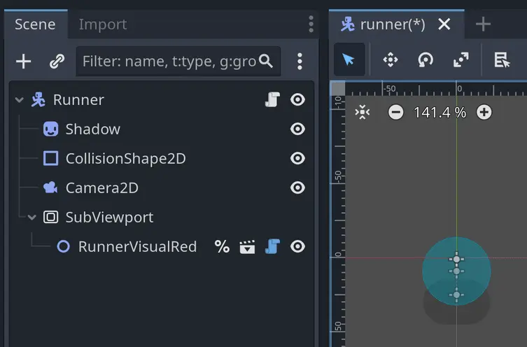
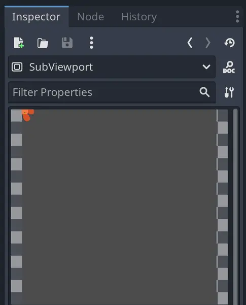
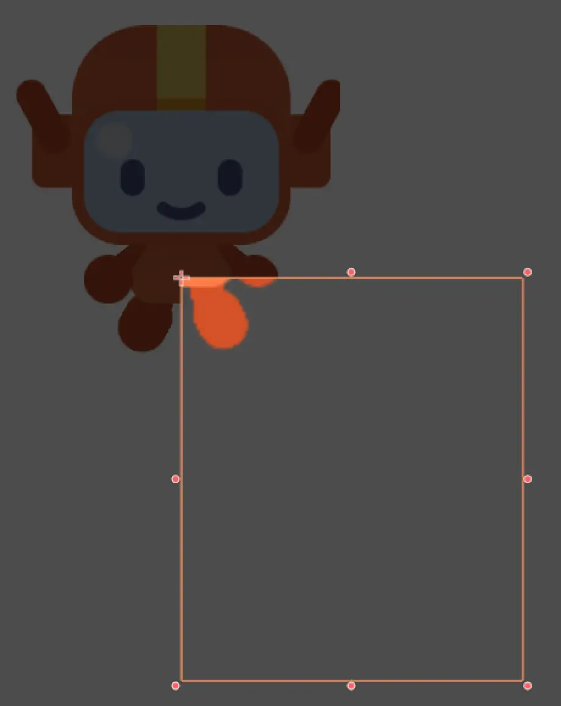
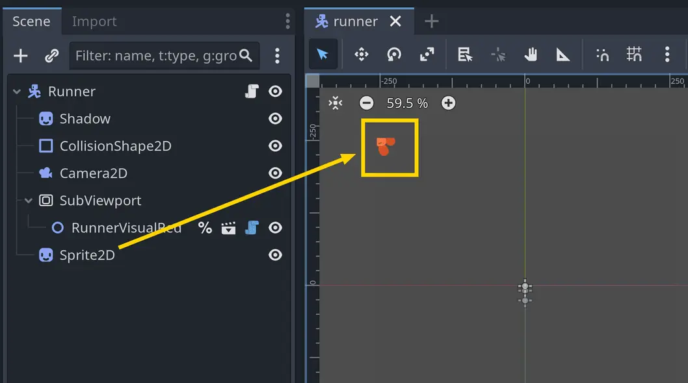
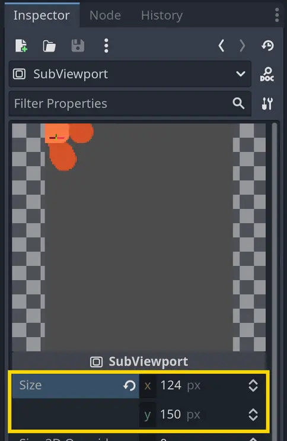
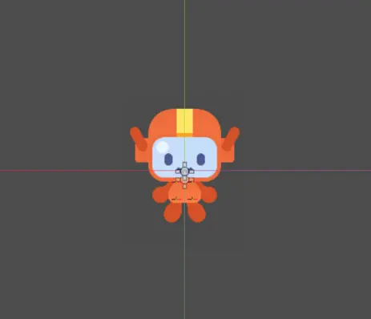
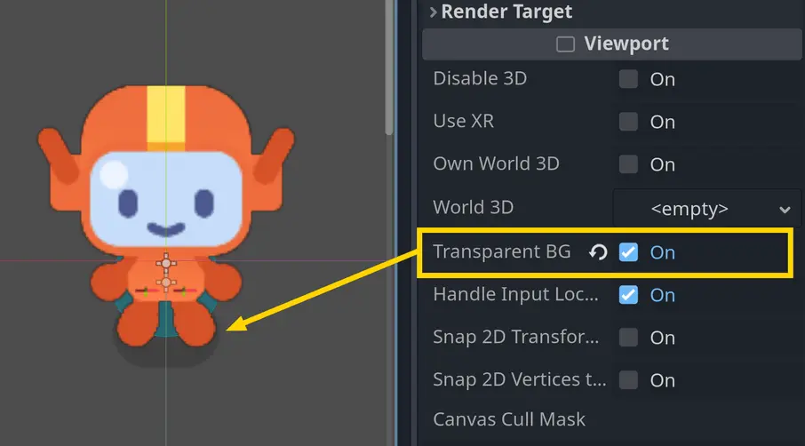

이번 강의에서는 러너 캐릭터를 개선하기 위해 다음을 추가하겠습니다:

- 은은한 그림자
    
- 외곽선 셰이더

이 작업은 캐릭터의 스타일을 풍부하게 하고 더 즐겁게 만들어 줄 것입니다.
그림자와 먼지는 캐릭터를 시각적으로 세계에 고정시켜 주어 게임이 좀 더 전문적으로 보이게 할 것입니다.
외곽선은 캐릭터를 배경에서 돋보이게 하여 더 쉽게 눈에 띄도록 만들어 줍니다.

가장 간단한 부분인 그림자부터 시작해 보겠습니다.

--- 

## P1 Adding a shadow

**runner.tscn** 씬에 Sprite2D 노드를 하나 추가하고 이름을 **Shadow**로 지정하십시오.

에셋 폴더에서 그림자 텍스처(res/assets/runner/shadow.png)를 찾으실 수 있습니다.
이 파일을 Shadow 노드의 **Texture** 속성으로 드래그하시거나 **Quick Load** 기능을 사용하셔도 됩니다.

나중에 그리기 순서를 변경하기 위해 이 노드를 노드 트리의 맨 위로 이동하게 될 것입니다. 
지금은 우선 스케일을 줄이고 캐릭터 발 부분 주변에 시각적으로 배치해 주십시오.

기억해 두십시오. **Select Mode**가 활성화된 상태에서 **Shift** 키를 누르면 노드의 축을 고정할 수 있고,
**Alt**(Mac에서는 ⌥) 키를 누르면 노드의 중심을 기준으로 크기를 조정할 수 있습니다.

관찰력이 뛰어나신 덕분에 그림자가 흰색이라는 것을 알아차리셨을 것입니다! 아티스트들은 종종 단순한 도형을 흰색으로 만들어 두는데,
이는 팀의 누구라도 Godot에서 색상을 쉽게 변경할 수 있도록 하기 위함입니다. 어떻게 할까요?
바로 **Modulate** 속성을 사용하면 됩니다.

그림자를 어둡게 해 보겠습니다. **Visibility** 카테고리를 열고,
**Modulate** 속성을 검은색으로 설정한 뒤 투명하게 만드십시오. 모든 슬라이더 값을 0으로 하고,
**A(알파)** 슬라이더만 40으로 설정하시면 됩니다.

이제 **Shadow** 노드를 트리의 맨 위로 이동시켜 캐릭터 뒤에 오도록 하십시오. 완료되었습니다!

>이번 단원은 정말 짧았습니다! 그 이유가 단순해서일까요, 아니면 이제 Godot에 점점 더 익숙해지고 계셔서일까요?
> 
>만약 사전 지식 없이 이 강좌를 시작하셨다면, 잠시 시간을 내어 이 사실을 깨닫고 넘어가셨으면 합니다. 강좌 초반에는 이런 지시사항들이 훨씬 더 자세하고 길었을 것입니다. 하지만 지금은 훨씬 더 간결해졌습니다. 그만큼 여러분이 많은 발전을 이루셨다는 뜻입니다!
>
> Nathan
> GDQuest 설립자이자 강사

---

## P2 Flattening the character

다음으로 캐릭터에 외곽선을 추가해 보겠습니다.

이를 구현하는 일반적인 방법은 셰이더를 사용하는 것입니다. M5 Loot it all 에서 이미 보신 적이 있지요, 
기억나시나요? 당시 상자가 여러 스프라이트로 이루어져 있었기 때문에, 모든 요소에 한 번에 셰이더를 적용하기 위해 **CanvasGroup**을 사용했었습니다.

이 방법만으로도 보통은 충분합니다… 그러나 아쉽게도 **CanvasGroup**은 현재 러너 캐릭터 비주얼에서는 작동하지 않습니다.
그 이유를 설명하기 위해 잠시 뒤로 돌아가 보겠습니다.

모든 렌더링 엔진에는 [[Draw Order]]라는 개념이 있습니다. 즉, 무엇을 먼저 그리고 무엇을 나중에 그릴지를 제어하는 시스템입니다.
이전에 **Z Index**와 **Y Sort Enabled** 속성을 통해 이를 간단히 살펴본 적이 있습니다.
예를 들어, 2D 노드에서 **Y Sort Enabled**를 켜면 y축에서 더 아래에 있는 자식 노드가 위쪽에 그려집니다.
그러나 이 속성만이 그리기 순서를 바꾸는 유일한 요소는 아닙니다.

엔진이 한 프레임을 렌더링하려 할 때, 내부적으로 여러 개의 시각적 레이어를 생성합니다.
그리고 어떤 노드들이 함께 묶이는지를 계산하여 이를 한 번에 GPU(그래픽 처리 장치)로 보냅니다.
GPU는 이를 화면에 표시되는 이미지로 렌더링하게 됩니다.

CanvasGroup에 셰이더를 적용하면, 해당 그룹 전체에 셰이더가 적용되지만 이는 모든 노드가 같은 레이어에 있을 때만 가능합니다.
다시 말해, 같은 **Z Index**를 가질 때만 적용된다는 뜻입니다. 그런데 러너 캐릭터의 경우 하나의 요소가 다른 **Z Index**를 가지고 있습니다.
그것이 바로 **HeadShape** 노드입니다. 캐릭터의 얼굴은 얼굴 모양에 맞게 잘린 여러 스프라이트들로 이루어져 있기 때문입니다.

이러한 이유로 **CanvasGroup** 기법은 작동하지 않을 것입니다. 따라서 다른 해결책을 찾아야 합니다.
하지만 그 전에, 만약 우리가 어쨌든 **CanvasGroup**을 사용하려 한다면 어떤 일이 일어나는지 잠시 살펴보고 싶습니다.
잠시 편히 계시고, 저는 작업을 진행할 테니 여러분은 글과 이미지를 읽고 보시기만 하면 됩니다.

그래서 **RunnerVisualRed** 노드의 부모로 **CanvasGroup** 노드를 추가하면, 다음과 같은 결과가 나옵니다:

좋습니다. 거의 제대로 작동하는 것처럼 보이지만, 얼굴 주변의 외곽선이 빠져 있습니다! 이상하군요. 왜 **CanvasGroup**의 영향을 받지 않는 걸까요?

runner_visual_red.tscn 씬을 열고 **HeadShape** 노드를 선택해 보면, 그 속성을 확인할 수 있습니다:

> [!example] 다음 질문에 답해보세요
> 위 이미지의 인스펙터를 보시고, 왜 캐릭터의 머리에 외곽선이 없는지 짐작하실 수 있겠습니까?
> 
> - 머리가 CanvasGroup 노드의 일부가 아니기 때문입니다.
> 
> - 머리는 Z 인덱스 때문에 외곽선이 있는 스프라이트들 위에 렌더링됩니다.
> 
> - 머리는 캐릭터의 일부가 아닙니다.
> 
> > [!example]- 정답
> > 외곽선은 캐릭터의 전체 몸통에 적용되지만, 머리는 몸통 위에서 별도로 렌더링됩니다. 머리는 더 높은 Z 인덱스 속성을 가지고 있기 때문입니다. 그래서 셰이더의 영향을 받지 않는 것입니다.

**HeadShape** 스프라이트 노드의 **Z Index** 속성은 1로 설정되어 있는 반면, 다른 모든 스프라이트는 0으로 설정되어 있습니다.
그렇기 때문에 **CanvasGroup**이 그것에는 영향을 주지 못하는 것입니다.

그렇다면, 아티스트는 왜 그렇게 했을까요? 이제 머리의 **Z Index**를 다시 0으로 바꿔 보고 어떤 일이 일어나는지 확인해 보겠습니다:

아이고! 얼굴이 사라져 버렸습니다! 결국 아티스트가 틀린 것이 아니었던 것 같습니다. **Z Index**를 1로 두는 것이 필요했던 것이지요.

제 생각에는, 이것은 **Clip Children** 속성이 Clip + Draw로 설정되어 있기 때문인 것 같습니다.
이 속성은 **클리핑 마스크(clipping mask)**를 만들어 캐릭터 형태 밖에 있는 얼굴 부분을 가려 줍니다.

아마도 Godot은 **CanvasGroup** 안에서 자식 노드를 클리핑할 수 없고,
별도의 시각적 레이어에 있어야 CanvasGroup을 먼저 그린 뒤 다른 스프라이트를 따로 클리핑할 수 있는 것 같습니다.

이 가설을 실험적으로 검증해 보기 위해, 얼굴의 **Z Index**를 0으로 설정하고 **Clip Children** 속성을 기본값인 Disabled로 되돌려 보았습니다:

이제 얼굴의 두 부분이 동시에 보이기는 하지만, 적어도 셰이더는 기대한 대로 작동하고 있습니다:

이 가설은 그럴듯해 보입니다. 얼굴이 다른 캐릭터 부분보다 더 높은 **Z Index**를 가져야 별도로 렌더링되고 클리핑을 지원할 수 있는 것입니다.
하지만 이는 곧 **CanvasGroup** 기법이 작동하지 않는다는 뜻이기도 합니다.

> [!info]- 어떻게 알았냐고요?
> 사실 몰랐습니다! 위의 실험이 바로 제가 이 강의를 작성하기 전에 실제로 결론에 도달했던 방식과 거의 똑같습니다. 클리핑 기능에 대해 가설을 세우고, 그것을 직접 테스트해 본 것이지요.
> 
> 게임 개발자로서 경험이 쌓이면 지식이 더 나은 추측을 할 수 있도록 도와주지만, 꼭 익혀야 할 중요한 기술 중 하나는 바로 **실험하려는 의지**와 **가설을 검증할 인내심**입니다. 우리는 코드에서 종종 잘못된 가정을 하게 되며, 확실히 알 수 있는 유일한 방법은 직접 테스트해 보는 것입니다.
> 
> 또한, 이번 작은 실험을 기반으로 저는 클리핑 기능에 대해 최종적인 결론에 도달한 것이 아닙니다. 엔진 소스 코드를 읽거나, 더 많은 실험을 해 보거나, 신뢰할 만한 정보를 찾기 전까지는 확실히 알 수 없습니다. 하지만 좋은 출발점이 될 수는 있습니다.
> 
> 실제로 **CanvasGroup** 노드의 문서를 살펴보면, 이 기능이 클리핑과 호환되지 않는다고 명시되어 있습니다. 다만 그 이유가 무엇인지는 구체적으로 설명되어 있지 않습니다.

그렇다면 어떻게 해야 할까요? **CanvasGroup**보다 렌더링을 더 세밀하게 제어할 수 있는 노드들이 있습니다.
바로 **SubViewport**입니다.

--- 

## P3 Using a SubViewport node

**SubViewport** 노드는 화면의 일부분을 텍스처로 렌더링하는 데 사용됩니다.
주로 미니맵, 3D 게임에서의 UI 렌더링, 화면 분할, 혹은 **CanvasGroup**만으로는 충분하지 않을 때 노드 그룹에 셰이더를 적용하는 용도로 사용됩니다.

> [!info]- ‘화면의 일부를 텍스처로 렌더링한다’는 것은 무슨 뜻일까요?
> 
> 2D 게임이 렌더링되어 화면에 표시되는 방식은 대략 다음과 같습니다:
> 
> 1. Godot은 버튼, 스프라이트, 기타 모든 시각적 요소들과 그들의 변환 정보(위치, 회전, 크기)를 수집합니다.
> 
> 2. 화면에서 사용되는 텍스처 리소스, 스타일 박스, 폰트 등의 모든 시각적 에셋을 매핑합니다.
> 
> 3. 각 요소의 **Z Index**와 같은 속성을 기준으로 모든 도형을 정렬합니다.
> 
> 4. 모든 정보를 그래픽 카드(GPU)에 전송합니다.
> 
> 5. GPU는 받은 데이터와 명령을 사용하여 [Shader](../../Glossary/Shader.md) 프로그램으로 새로운 이미지를 생성합니다. 셰이더는 색상이 어떻게 혼합되는지, 어떤 픽셀이 투명한지, 빛이 어떻게 적용되는지를 결정합니다.
> 
> 이 과정은 매 프레임마다 일어나며, 최종적으로 화면에 표시될 수 있는 이미지가 출력됩니다.
>  
> 이제, 전체 게임 월드를 직접 화면에 렌더링하여 표시하는 대신, 월드의 일부만 렌더링하여 이를 텍스처에 담을 수도 있습니다. 이렇게 만들어진 텍스처는 다른 텍스처처럼 사용할 수 있으며, 예를 들어 Sprite2D 노드에 할당할 수도 있습니다.
> 
> 이것이 바로 **SubViewport** 노드의 역할입니다. SubViewport의 자식 노드들은 화면에 직접 렌더링되지 않고, 대신 렌더링된 이미지를 텍스처 리소스로 전달하여 다른 곳에서 활용할 수 있게 됩니다.

좋습니다! 이제 직접 시도해 보겠습니다. 외곽선을 그리기 위해 새로운 노드인 **SubViewport**를 사용하겠습니다.
이 노드는 새로운 뷰포트를 생성하여 게임 월드의 일부를 독립적으로 렌더링할 수 있도록 해 줍니다. 이를 이용해 러너를 텍스처로 렌더링할 수 있습니다.

그다음 이 텍스처를 **Sprite2D** 노드를 사용해 표시하고, 그 위에 외곽선 셰이더를 적용할 수 있습니다.

먼저, **Runner** 노드의 자식으로 **SubViewport** 노드를 생성하고, **RunnerVisualRed** 노드를 그 아래로 재배치하십시오.
그리고 SubViewport에 이름을 지정하십시오. 그러자 캐릭터가 씬에서 사라질 것입니다! 왜 그럴까요?!

이는 **SubViewport** 노드가 캐릭터를 렌더링하고 있지만, 아직 그 출력 결과를 화면에 표시하고 있지 않기 때문입니다.

**SubViewport** 노드를 선택하고 인스펙터를 확인해 보시면, 해당 노드가 렌더링하는 내용을 미리 보실 수 있습니다.

러너를 캡처하고 있는 것처럼 보이지만, 이미지의 왼쪽 위에 일부만 나타납니다!
이는 러너 스킨이 게임 월드의 원점에 위치해 있기 때문인데, 이 원점은 **SubViewport**의 좌측 상단 모서리에 해당합니다.

아래 이미지에서 보시듯, 제가 몇 개의 노드를 배치하여 문제를 시각적으로 보여 드렸습니다. 주황색 테두리는 **SubViewport**의 범위를 나타냅니다.

따라서 두 가지 방법 중 하나를 선택하셔야 합니다:

- 러너를 **SubViewport**가 렌더링하는 영역의 중앙으로 이동시키기
    
- 또는 **Camera2D**를 사용하여 뷰포트의 시야를 러너 중심으로 맞추기
    

여기서는 첫 번째 방법인 러너를 직접 이동시키는 방식을 사용하겠습니다.
이렇게 하면 **Camera2D** 노드를 사용할 때와 달리 에디터에서 미리보기를 깔끔하게 확인할 수 있습니다.

> [!caution]- **Camera2D 노드는 SubViewport 노드에서 미리보기가 되지 않습니다**
> 만약 **Camera2D** 노드를 사용해 캐릭터를 중심으로 뷰를 맞추더라도, 에디터에서는 그 효과를 확인할 수 없습니다. **SubViewport** 노드는 에디터에서 카메라의 뷰를 렌더링하지 않기 때문입니다. 결과는 [[Runtime]] 중에만 확인할 수 있습니다. 이는 현재 Godot 에디터의 작동 방식에 따른 제한이며, 마치 SubViewport 안에서 노드를 인터랙티브 도구로 크기 조절하거나 이동시킬 수 없는 것과 같은 맥락입니다.
> 
> 하지만 이것은 큰 제약이 아닙니다. 언제든 씬을 실행해서 결과를 확인할 수 있고, 게임 창을 열어 둔 상태에서 다른 창에서 씬을 편집하면 됩니다. Godot은 에디터에서 한 변경 사항을 실행 중인 게임과 자동으로 동기화해 주기 때문에 충분히 실용적입니다.
> 
> 이 동작은 **Godot 4.4**까지 테스트되어 확인되었으며, 앞으로 변경될 가능성에 대해서는 Godot의 GitHub 저장소에서 이 이슈를 추적하실 수 있습니다.

우리는 뷰포트 텍스처를 생성하여 스프라이트에 할당함으로써 **SubViewport**가 만들어내는 텍스처를 미리 볼 수 있습니다.
**Runner**의 자식으로 새로운 **Sprite2D** 노드를 생성한 뒤, 인스펙터에서 **Texture** 속성 옆의 빈 칸을 클릭하십시오.

새로운 **ViewportTexture**를 생성하십시오. 그러면 팝업이 열리면서 새 텍스처 리소스에 연결할 뷰포트를 선택하라는 메시지가 표시됩니다.
여기서 **SubViewport** 노드를 선택하시면 됩니다.

**Sprite2D** 노드의 바운딩 박스가 확장되며, 이제 에디터에서 러너의 다리 일부가 보이실 것입니다.

> [!caution]- 아무것도 보이지 않으시나요?
> 캐릭터의 일부가 전혀 보이지 않는다면, 아마도 다음과 같은 이유일 수 있습니다:
> - **RunnerVisualRed** 노드가 뷰포트 범위 밖에 위치해 있거나,
> - 에디터 카메라가 너무 확대되어 있는 경우입니다.
>  
> 러너가 뷰포트 밖에 있는지 확인하려면, **RunnerVisualRed** 노드를 선택하고 **Transform → Position** 속성을 확인하십시오. 값이 대략 Vector2(0, 0) 주변인지 확인하시고, 만약 값이 음수이거나 지나치게 큰 숫자라면 러너가 뷰포트 범위 밖에 있을 가능성이 큽니다.
> 
> 이 방법으로도 해결되지 않는다면, 에디터 뷰포트에서 화면을 축소(zoom out)해 보십시오. **SubViewport** 노드는 기본적으로 **512 x 512 픽셀** 크기를 가지므로, 캐릭터를 보기 위해 화면을 축소해야 할 수도 있습니다.

씬의 원점에서 캐릭터가 왼쪽 위로 한참 떨어져 있는 것을 눈치채셨나요?

이는 뷰포트가 기본적으로 꽤 큰 이미지를 생성하기 때문입니다. 뷰포트의 크기를 캐릭터의 크기에 더 가깝게 조정할 수 있습니다.

**SubViewport** 노드를 선택하고 **Size** 속성을 확인해 보십시오. 이것은 뷰포트가 렌더링하는 텍스처의 해상도입니다.
기본값은 512 x 512 픽셀로 설정되어 있습니다. 이 값을 캐릭터 크기에 맞게 조정할 수 있습니다.
나중에 외곽선을 넣을 여유를 조금 주기 위해 약간의 여백을 더한다면, 러너 스킨은 가로 124픽셀, 세로 150픽셀 크기의 사각형 안에 들어맞습니다.
따라서 **Size** 속성을 **124 x 150**으로 설정하십시오.

이제 캐릭터를 이동시켜 보겠습니다! 주의하실 점은, 익숙한 에디터 도구로는 SubViewport 안의 노드와 상호작용할 수 없다는 것입니다.
**Select Mode**를 사용해 선택, 이동, 혹은 크기 조정을 할 수 없으며, SubViewport 노드의 자식 노드와는 오직 **인스펙터**를 통해서만 상호작용할 수 있습니다.

**RunnerVisualRed** 노드를 선택하고, **Transform → Position** 속성을 x축 **62픽셀**, y축 **120픽셀**로 설정하십시오.
이렇게 하면 캐릭터가 SubViewport 안에서 대략 중앙에 배치됩니다.

> [!info]- 왜 캐릭터가 지금 픽셀화되어 보일까요?
> 에디터를 확대했을 때 특히 캐릭터가 조금 거칠게 보일 수 있습니다.
> 
> 캐릭터의 원본 에셋은 고해상도이므로, 캐릭터를 확대해도 선명하게 보입니다. 그러나 **SubViewport**는 러너를 특정 크기의 텍스처로 렌더링하는데, 이 크기가 원본 에셋보다 작기 때문에 에디터에서는 캐릭터가 픽셀화되어 보이는 것입니다.
> 
> 하지만 이것은 문제가 되지 않습니다. 실제 게임에서는 캐릭터를 확대해서 보지 않기 때문입니다. 중요한 것은 실행 시 캐릭터가 보기 좋게 표시되는지 여부입니다.
> 
> 만약 다른 게임에서 캐릭터를 확대해서 보여야 한다면, 더 높은 해상도의 텍스처로 캐릭터를 렌더링해야 할 것이며, 그 대가로 성능이 조금 더 소모될 수 있습니다.

마지막으로, 현재 뷰포트는 캐릭터 뒤에 회색 배경을 렌더링하고 있습니다. 일반적인 에디터 배경색과 같아서 잘 보이지 않을 뿐, 실제로 존재합니다.
그림자가 사라진 것을 눈치채셨나요? 바로 그 때문입니다!

뷰포트가 캐릭터를 **투명한 배경**으로 렌더링하도록 설정할 수 있습니다.
**SubViewport** 노드를 선택하고, **Viewport** 카테고리에서 **Transparent BG** 속성을 찾아 체크박스를 켜십시오.
그러면 뷰포트의 배경이 투명해지고, 그림자가 다시 보이실 것입니다.

필요하다면 **Sprite2D** 노드를 y축 방향으로 위로 이동시켜 캐릭터의 발이 그림자와 맞도록 정렬하십시오.

좋습니다! 이제 캐릭터가 하나의 이미지로 렌더링되므로, 외곽선을 추가할 수 있습니다.

---

## P4 Adding the outline shader

외곽선 셰이더는 res/assets/character_contour.gdshader에 있습니다. 셰이더 머티리얼을 추가하는 방법을 기억하고 계신가요?

> [!note] 직접 시도해 보세요
> 캐릭터에 외곽선 셰이더를 추가해 보십시오. 요약하자면, 노드 중 하나에 새로운 셰이더 머티리얼을 할당하고 외곽선 셰이더를 설정해야 합니다.
> 
> 러너는 최종적으로 **4픽셀 두께의 검은색 외곽선**을 가지게 될 것입니다.
> 
> 직접 시도해 보시고, 필요하다면 아래 단계를 참고하시면 됩니다.
> 
> > [!note]- 힌트
> > **SubViewport** 노드는 셰이더 머티리얼을 지원하지 않습니다. 따라서 외곽선은 **Sprite2D 노드**에 적용해야 합니다.
>
> > [!note]- 힌트
> > 노드의 **Material** 속성을 변경해야 합니다.
> 
> > [!note]- 힌트
> > 먼저 새로운 **ShaderMaterial** 리소스를 생성해야 합니다. 이 리소스가 셰이더를 설정할 수 있게 해줍니다.
> 
> > [!note]- 힌트
> > 그런 다음, 셰이더를 **ShaderMaterial**의 **Shader** 속성에 할당하시면 됩니다.

캐릭터에 셰이더를 할당하는 단계는 다음과 같습니다:

1. **Sprite2D 노드**를 선택합니다.
    
2. 인스펙터에서 **Material** 카테고리를 펼치고, **Material** 속성에 **ShaderMaterial**을 지정합니다.
    
3. 리소스를 클릭해 펼친 뒤 **Shader** 속성을 찾습니다.
    
4. 그것을 클릭하고 **Quick Load**를 선택하여 character_contour.gdshader 파일을 불러옵니다.

그러면 캐릭터 주위에 외곽선이 나타나는 것을 보실 수 있습니다.  

또한 **Shader Params**를 펼쳐 외곽선의 모양을 변경할 수도 있습니다. 원하시는 대로 조정하셔도 좋습니다. 저는 완전한 검은색에 **4픽셀** 두께의 외곽선을 적용했습니다.

좋습니다, 이제 완료되었습니다! 비주얼 이펙트를 만드는 방법을 배우기 전에 간단히 복습해 보겠습니다.

---

## P5 Recap

이번 강의에서는 러너에 **그림자**와 **외곽선**을 추가했습니다. 이를 통해 캐릭터가 배경에서 더욱 돋보이게 되었습니다.

여러분은 이번에 다음을 배우셨습니다:

- 예상대로 작동하지 않는 에셋을 **가설을 세우고 테스트하는 방식**으로 문제 해결하는 방법
    
- **Index**와 **Clip Children** 속성이 그리기에 미치는 영향, 그리고 **CanvasGroup** 노드의 역할
    
- 게임 월드의 일부를 텍스처로 렌더링하기 위해 **SubViewport 노드**를 사용하는 방법
    
- **SubViewport**에서 생성된 텍스처를 **Sprite2D 노드**와 **ViewportTexture 리소스**를 사용해 표시하는 방법
    

다음 강의에서는 파티클을 활용해 비주얼 이펙트를 만드는 법을 배우게 됩니다. 
학습을 위해 **불꽃 효과**를 만들고, 이어서 캐릭터가 달릴 때 따라오는 **먼지 파티클**을 디자인할 것입니다.

