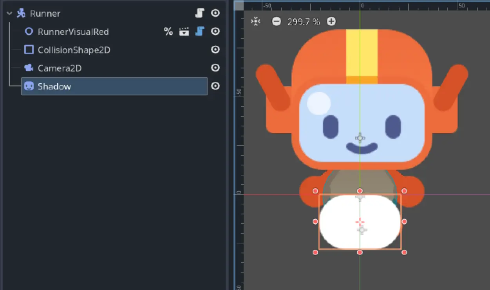
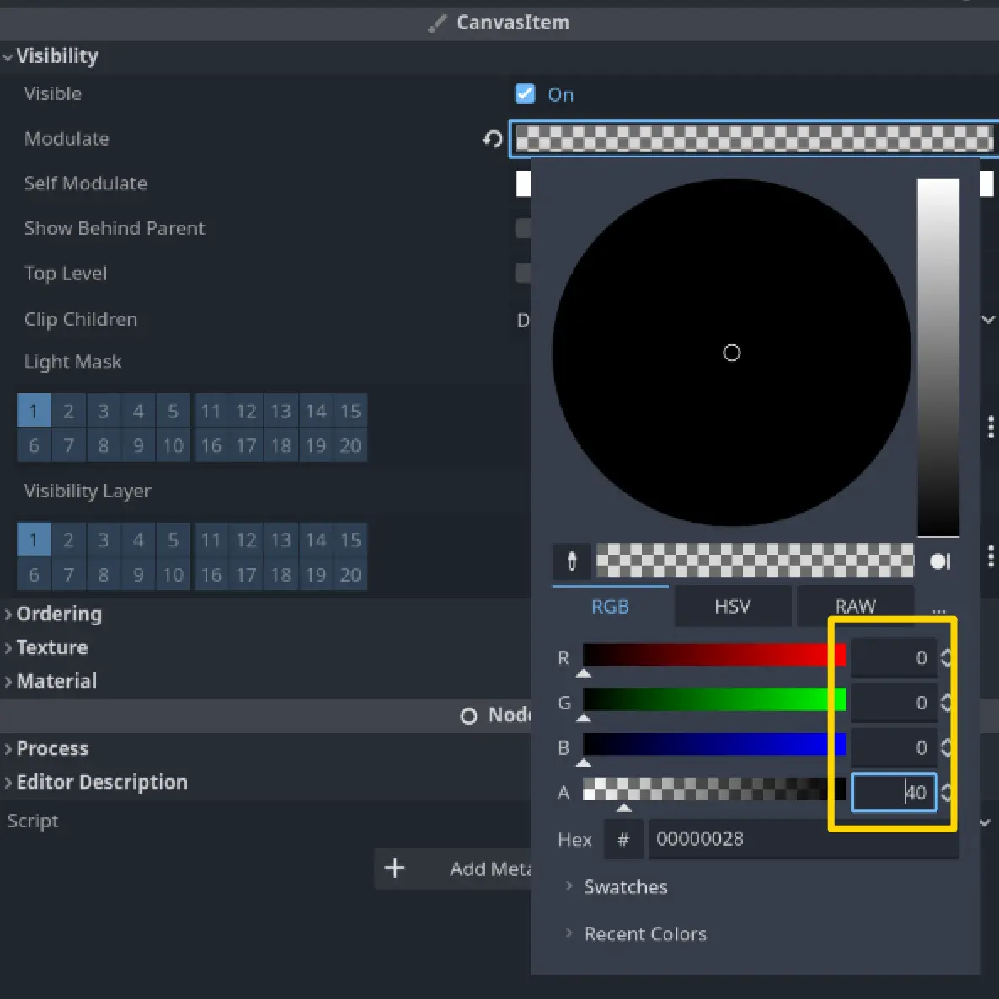
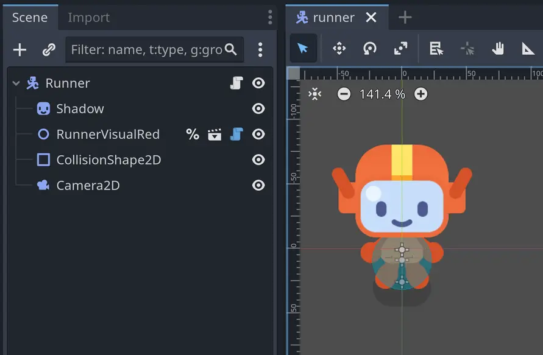
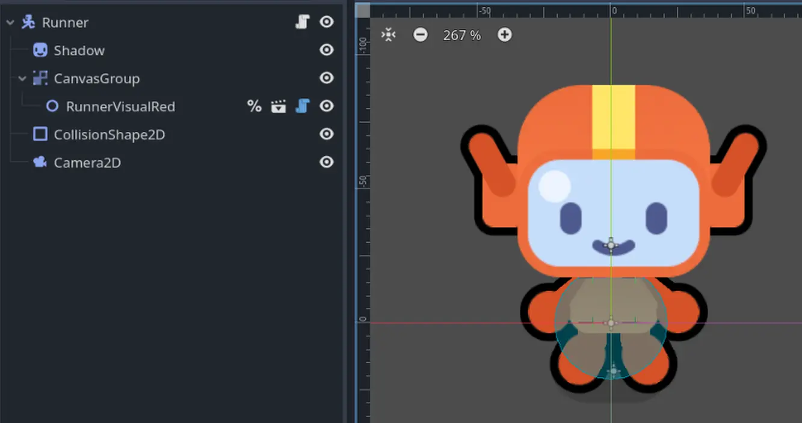
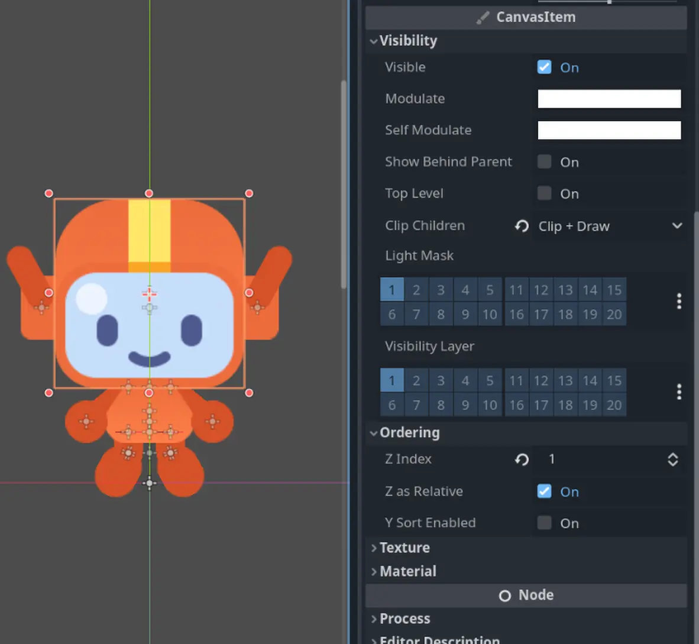
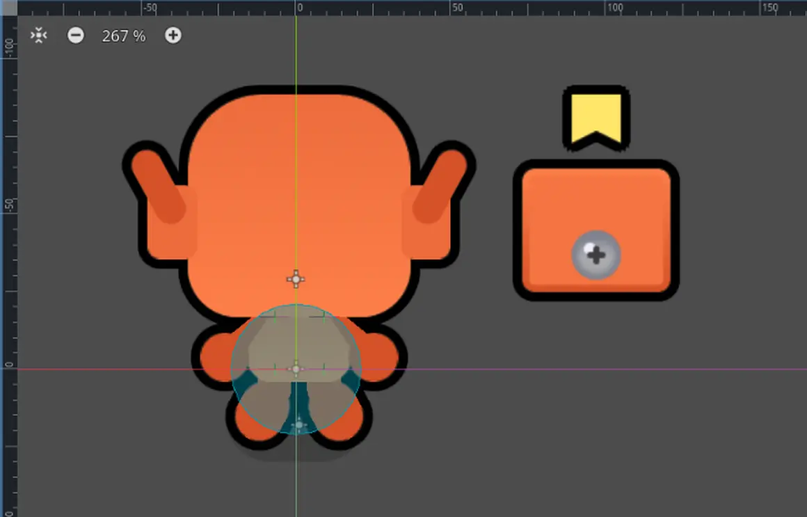
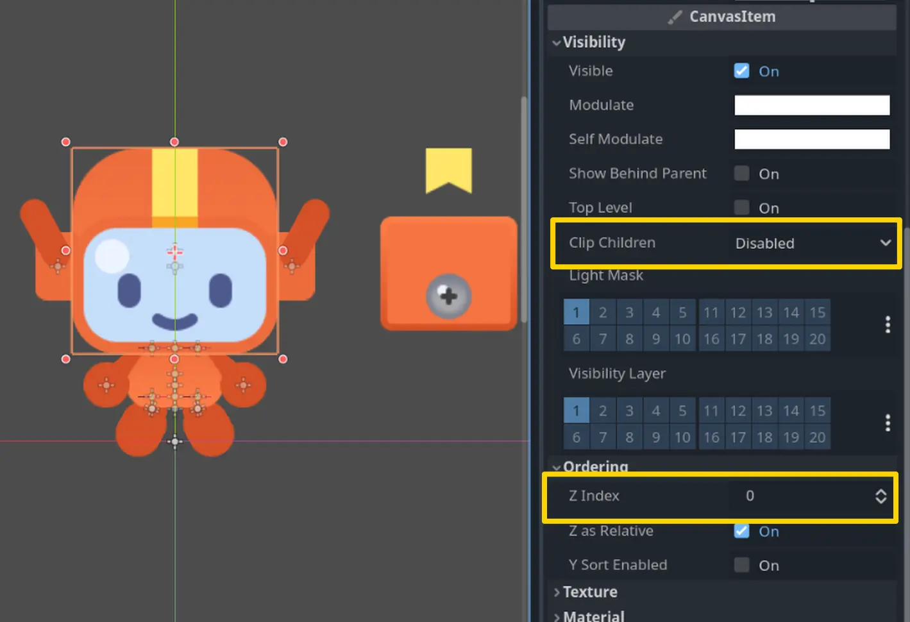
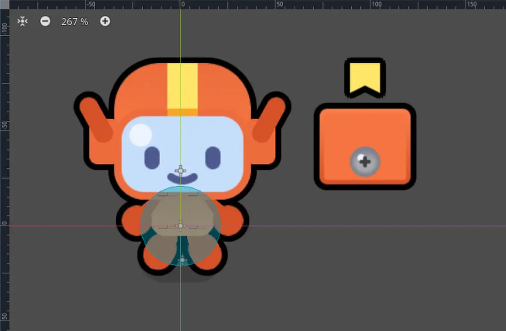

이번 강의에서는 러너 캐릭터를 개선하기 위해 다음을 추가하겠습니다:

- 은은한 그림자
    
- 외곽선 셰이더

이 작업은 캐릭터의 스타일을 풍부하게 하고 더 즐겁게 만들어 줄 것입니다.
그림자와 먼지는 캐릭터를 시각적으로 세계에 고정시켜 주어 게임이 좀 더 전문적으로 보이게 할 것입니다.
외곽선은 캐릭터를 배경에서 돋보이게 하여 더 쉽게 눈에 띄도록 만들어 줍니다.

가장 간단한 부분인 그림자부터 시작해 보겠습니다.

--- 

## P1 Adding a shadow

**runner.tscn** 씬에 Sprite2D 노드를 하나 추가하고 이름을 **Shadow**로 지정하십시오.

에셋 폴더에서 그림자 텍스처(res/assets/runner/shadow.png)를 찾으실 수 있습니다.
이 파일을 Shadow 노드의 **Texture** 속성으로 드래그하시거나 **Quick Load** 기능을 사용하셔도 됩니다.

나중에 그리기 순서를 변경하기 위해 이 노드를 노드 트리의 맨 위로 이동하게 될 것입니다. 
지금은 우선 스케일을 줄이고 캐릭터 발 부분 주변에 시각적으로 배치해 주십시오.

기억해 두십시오. **Select Mode**가 활성화된 상태에서 **Shift** 키를 누르면 노드의 축을 고정할 수 있고,
**Alt**(Mac에서는 ⌥) 키를 누르면 노드의 중심을 기준으로 크기를 조정할 수 있습니다.

관찰력이 뛰어나신 덕분에 그림자가 흰색이라는 것을 알아차리셨을 것입니다! 아티스트들은 종종 단순한 도형을 흰색으로 만들어 두는데,
이는 팀의 누구라도 Godot에서 색상을 쉽게 변경할 수 있도록 하기 위함입니다. 어떻게 할까요?
바로 **Modulate** 속성을 사용하면 됩니다.

그림자를 어둡게 해 보겠습니다. **Visibility** 카테고리를 열고,
**Modulate** 속성을 검은색으로 설정한 뒤 투명하게 만드십시오. 모든 슬라이더 값을 0으로 하고,
**A(알파)** 슬라이더만 40으로 설정하시면 됩니다.

이제 **Shadow** 노드를 트리의 맨 위로 이동시켜 캐릭터 뒤에 오도록 하십시오. 완료되었습니다!

>이번 단원은 정말 짧았습니다! 그 이유가 단순해서일까요, 아니면 이제 Godot에 점점 더 익숙해지고 계셔서일까요?
> 
>만약 사전 지식 없이 이 강좌를 시작하셨다면, 잠시 시간을 내어 이 사실을 깨닫고 넘어가셨으면 합니다. 강좌 초반에는 이런 지시사항들이 훨씬 더 자세하고 길었을 것입니다. 하지만 지금은 훨씬 더 간결해졌습니다. 그만큼 여러분이 많은 발전을 이루셨다는 뜻입니다!
>
> Nathan
> GDQuest 설립자이자 강사

---

## P2 Flattening the character

다음으로 캐릭터에 외곽선을 추가해 보겠습니다.

이를 구현하는 일반적인 방법은 셰이더를 사용하는 것입니다. M5 Loot it all 에서 이미 보신 적이 있지요, 
기억나시나요? 당시 상자가 여러 스프라이트로 이루어져 있었기 때문에, 모든 요소에 한 번에 셰이더를 적용하기 위해 **CanvasGroup**을 사용했었습니다.

이 방법만으로도 보통은 충분합니다… 그러나 아쉽게도 **CanvasGroup**은 현재 러너 캐릭터 비주얼에서는 작동하지 않습니다.
그 이유를 설명하기 위해 잠시 뒤로 돌아가 보겠습니다.

모든 렌더링 엔진에는 [[Draw Order]]라는 개념이 있습니다. 즉, 무엇을 먼저 그리고 무엇을 나중에 그릴지를 제어하는 시스템입니다.
이전에 **Z Index**와 **Y Sort Enabled** 속성을 통해 이를 간단히 살펴본 적이 있습니다.
예를 들어, 2D 노드에서 **Y Sort Enabled**를 켜면 y축에서 더 아래에 있는 자식 노드가 위쪽에 그려집니다.
그러나 이 속성만이 그리기 순서를 바꾸는 유일한 요소는 아닙니다.

엔진이 한 프레임을 렌더링하려 할 때, 내부적으로 여러 개의 시각적 레이어를 생성합니다.
그리고 어떤 노드들이 함께 묶이는지를 계산하여 이를 한 번에 GPU(그래픽 처리 장치)로 보냅니다.
GPU는 이를 화면에 표시되는 이미지로 렌더링하게 됩니다.

CanvasGroup에 셰이더를 적용하면, 해당 그룹 전체에 셰이더가 적용되지만 이는 모든 노드가 같은 레이어에 있을 때만 가능합니다.
다시 말해, 같은 **Z Index**를 가질 때만 적용된다는 뜻입니다. 그런데 러너 캐릭터의 경우 하나의 요소가 다른 **Z Index**를 가지고 있습니다.
그것이 바로 **HeadShape** 노드입니다. 캐릭터의 얼굴은 얼굴 모양에 맞게 잘린 여러 스프라이트들로 이루어져 있기 때문입니다.

이러한 이유로 **CanvasGroup** 기법은 작동하지 않을 것입니다. 따라서 다른 해결책을 찾아야 합니다.
하지만 그 전에, 만약 우리가 어쨌든 **CanvasGroup**을 사용하려 한다면 어떤 일이 일어나는지 잠시 살펴보고 싶습니다.
잠시 편히 계시고, 저는 작업을 진행할 테니 여러분은 글과 이미지를 읽고 보시기만 하면 됩니다.

그래서 **RunnerVisualRed** 노드의 부모로 **CanvasGroup** 노드를 추가하면, 다음과 같은 결과가 나옵니다:

좋습니다. 거의 제대로 작동하는 것처럼 보이지만, 얼굴 주변의 외곽선이 빠져 있습니다! 이상하군요. 왜 **CanvasGroup**의 영향을 받지 않는 걸까요?

runner_visual_red.tscn 씬을 열고 **HeadShape** 노드를 선택해 보면, 그 속성을 확인할 수 있습니다:

> [!example] 다음 질문에 답해보세요
> 위 이미지의 인스펙터를 보시고, 왜 캐릭터의 머리에 외곽선이 없는지 짐작하실 수 있겠습니까?
> 
> - 머리가 CanvasGroup 노드의 일부가 아니기 때문입니다.
> 
> - 머리는 Z 인덱스 때문에 외곽선이 있는 스프라이트들 위에 렌더링됩니다.
> 
> - 머리는 캐릭터의 일부가 아닙니다.
> 
> > [!example]- 정답
> > 외곽선은 캐릭터의 전체 몸통에 적용되지만, 머리는 몸통 위에서 별도로 렌더링됩니다. 머리는 더 높은 Z 인덱스 속성을 가지고 있기 때문입니다. 그래서 셰이더의 영향을 받지 않는 것입니다.

**HeadShape** 스프라이트 노드의 **Z Index** 속성은 1로 설정되어 있는 반면, 다른 모든 스프라이트는 0으로 설정되어 있습니다.
그렇기 때문에 **CanvasGroup**이 그것에는 영향을 주지 못하는 것입니다.

그렇다면, 아티스트는 왜 그렇게 했을까요? 이제 머리의 **Z Index**를 다시 0으로 바꿔 보고 어떤 일이 일어나는지 확인해 보겠습니다:

아이고! 얼굴이 사라져 버렸습니다! 결국 아티스트가 틀린 것이 아니었던 것 같습니다. **Z Index**를 1로 두는 것이 필요했던 것이지요.

제 생각에는, 이것은 **Clip Children** 속성이 Clip + Draw로 설정되어 있기 때문인 것 같습니다.
이 속성은 **클리핑 마스크(clipping mask)**를 만들어 캐릭터 형태 밖에 있는 얼굴 부분을 가려 줍니다.

아마도 Godot은 **CanvasGroup** 안에서 자식 노드를 클리핑할 수 없고,
별도의 시각적 레이어에 있어야 CanvasGroup을 먼저 그린 뒤 다른 스프라이트를 따로 클리핑할 수 있는 것 같습니다.

이 가설을 실험적으로 검증해 보기 위해, 얼굴의 **Z Index**를 0으로 설정하고 **Clip Children** 속성을 기본값인 Disabled로 되돌려 보았습니다:

이제 얼굴의 두 부분이 동시에 보이기는 하지만, 적어도 셰이더는 기대한 대로 작동하고 있습니다:

이 가설은 그럴듯해 보입니다. 얼굴이 다른 캐릭터 부분보다 더 높은 **Z Index**를 가져야 별도로 렌더링되고 클리핑을 지원할 수 있는 것입니다.
하지만 이는 곧 **CanvasGroup** 기법이 작동하지 않는다는 뜻이기도 합니다.

> [!info]- 어떻게 알았냐고요?
> 사실 몰랐습니다! 위의 실험이 바로 제가 이 강의를 작성하기 전에 실제로 결론에 도달했던 방식과 거의 똑같습니다. 클리핑 기능에 대해 가설을 세우고, 그것을 직접 테스트해 본 것이지요.
> 
> 게임 개발자로서 경험이 쌓이면 지식이 더 나은 추측을 할 수 있도록 도와주지만, 꼭 익혀야 할 중요한 기술 중 하나는 바로 **실험하려는 의지**와 **가설을 검증할 인내심**입니다. 우리는 코드에서 종종 잘못된 가정을 하게 되며, 확실히 알 수 있는 유일한 방법은 직접 테스트해 보는 것입니다.
> 
> 또한, 이번 작은 실험을 기반으로 저는 클리핑 기능에 대해 최종적인 결론에 도달한 것이 아닙니다. 엔진 소스 코드를 읽거나, 더 많은 실험을 해 보거나, 신뢰할 만한 정보를 찾기 전까지는 확실히 알 수 없습니다. 하지만 좋은 출발점이 될 수는 있습니다.
> 
> 실제로 **CanvasGroup** 노드의 문서를 살펴보면, 이 기능이 클리핑과 호환되지 않는다고 명시되어 있습니다. 다만 그 이유가 무엇인지는 구체적으로 설명되어 있지 않습니다.

그렇다면 어떻게 해야 할까요? **CanvasGroup**보다 렌더링을 더 세밀하게 제어할 수 있는 노드들이 있습니다.
바로 **SubViewport**입니다.

