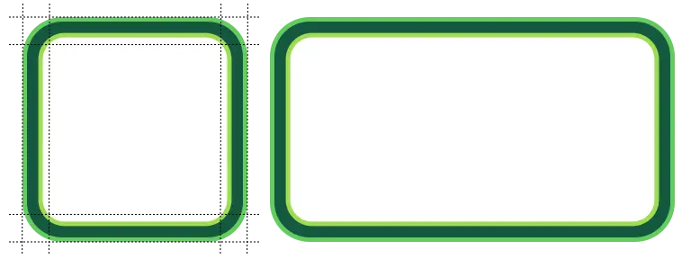

9-슬라이스 스케일링(Nine-slice scaling)은 텍스처를 스케일링할 때, 테두리 부분이 늘어나거나 왜곡되지 않도록
**모서리와 가장자리 영역을 분리하는 기법**입니다.

예를 들어, 왼쪽의 텍스처처럼 단순히 텍스처 전체를 늘리면, **테두리가 함께 늘어나서 모양이 일그러지게 됩니다**:

하지만 9-슬라이스 스케일링을 사용하면, **네 모서리를 고정된 크기로 분리**하여 유지하기 때문에,
텍스처가 커지더라도 **테두리는 원래 형태를 유지하며 미관을 해치지 않습니다**:

