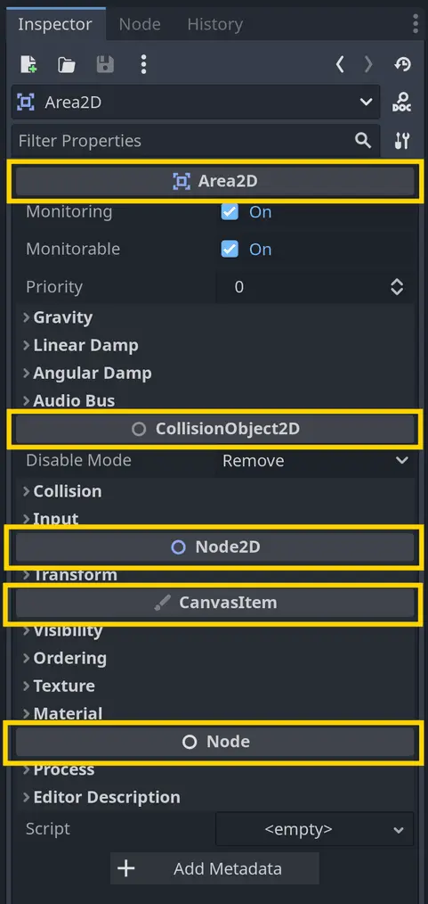

상속(inheritance)은 한 클래스가 다른 [Class.md](Class.md)의 모든 멤버 함수와 변수에 접근할 수 있게 되는 과정을 말합니다.
우리는 이를 “확장한다(extends)“고 표현합니다.
Godot에서 GDScript 프로그래밍 언어를 사용할 때는 extends 키워드를 사용하여 어떤 스크립트가 다른 스크립트나 Godot에 내장된 클래스를
확장할 수 있습니다.

이러한 관계는 **부모-자식 관계(parent-child relationship)** 로 설명됩니다. 부모 클래스는 자식이 확장하는 클래스이고,
자식 클래스는 그 부모로부터 상속받는 클래스입니다.

예를 들어, 스크립트의 첫 줄에 extends Area2D 라고 작성하면, 부모 클래스는 Area2D이고 자식 클래스는 이 스크립트가 됩니다.

이 extends 키워드와 상속을 통해 자식 스크립트는 부모 클래스(Area2D의 경우)가 제공하는 모든 코드에 **그대로 접근**할 수 있게 됩니다.
마치 자식 스크립트 안에 Area2D의 모든 코드가 들어 있는 것처럼 동작합니다.

Godot 게임 엔진에는 **긴 상속 체계**가 존재합니다. 예를 들면,
Area2D 노드는 CollisionObject2D를 확장하고,
CollisionObject2D는 Node2D를,
Node2D는 CanvasItem을,
CanvasItem은 Node를,
Node는 RefCounted를,
그리고 RefCounted는 최종적으로 Object를 확장합니다.

그래서 Area2D 노드는 Node2D, CanvasItem, Node, RefCounted, 그리고 Object의 모든 함수와 속성에 접근할 수 있습니다.
이 중 상당 부분은 **Inspector 도크**에서 확인할 수 있습니다. 속성 섹션은 각 속성이 어떤 클래스에서 왔는지를 보여줍니다.

이 **상속 체인** 덕분에 Godot의 모든 노드들은 add_child() 나 get_node() 같은 함수에 접근할 수 있습니다.
이 두 함수는 엔진의 Node 클래스에 포함되어 있으며, 모든 노드 타입은 이 클래스를 상속받기 때문입니다.