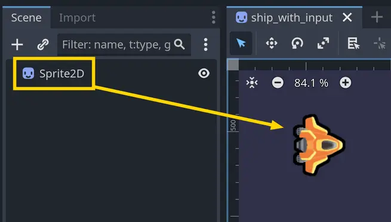
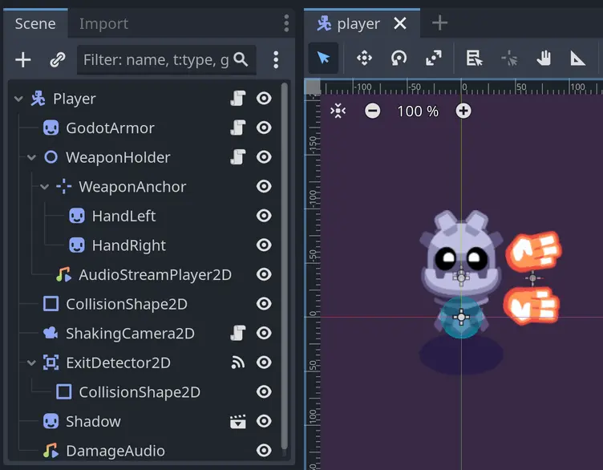
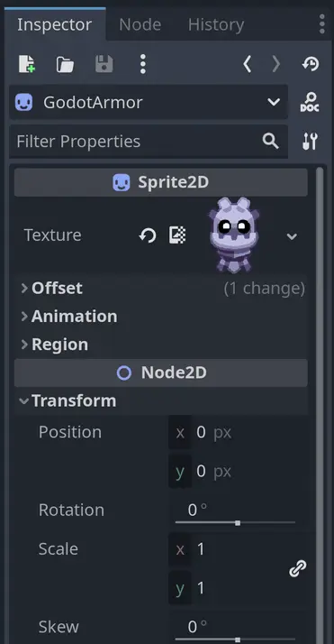

Godot 게임 엔진에서 **노드(Node)** 는 게임 콘텐츠를 만들고 구성하는 데 있어 **기본적인 구성 요소**입니다.
노드는 **데이터와 함수가 묶인 [Object](Object.md)**이며, 여기에 **추가적인 기능**이 포함되어 있습니다.
노드들은 **트리 구조로 생성하고 배치할 수 있습니다.**

노드를 **각기 다른 목적을 가진 작은 레고 조각들**이라고 생각할 수 있습니다.
예를 들어, 어떤 노드는 그래픽을 표시하고, 어떤 노드는 소리를 재생하거나, 게임 로직을 처리하는 역할을 합니다.

각 노드 유형은 **자신만의 함수 집합**을 제공합니다.
예를 들어, Sprite2D 노드는 **2D 그래픽을 표시**하며, Camera2D 노드는 **게임 뷰가 해당 노드를 따라가도록 설정**하여
**가상 카메라를 생성**합니다.



Godot 게임을 만들 때, 노드들은 **장면 트리(Scene Tree)** 라는 **트리 구조**로 배치됩니다.
이 구조에서는 하나의 노드가 하나 이상의 **자식 노드**를 가질 수 있으며, 이로써 **계층적 트리 구조**가 형성됩니다.
이러한 구조는 게임을 **조직적으로 구성**하고, **노드 간의 상호작용**을 제어하는 데 도움이 됩니다.

예를 들어, Camera2D 노드를 Sprite2D의 **자식 노드로 추가**하면, **카메라는 부모인 Sprite2D 노드와 함께 움직이게 됩니다.**


Godot에서는 **플레이어가 상호작용하는 대부분의 요소**를 노드로 구성할 수 있습니다. 여기에는 **화면에 보이는 게임 요소**뿐만 아니라,
**타이머**, **사운드 재생기**, **경로 탐색 알고리즘(캐릭터가 특정 위치까지 이동 가능한 경로를 찾는 기능)** 같은 **보이지 않는 요소**도 포함됩니다.

---

#### 노드를 생략하는 것도 선택 가능합니다

노드는 게임을 구성하고 조직하는 데 있어 강력하고 접근하기 쉬운 방법이지만, **더 많은 제어를 원하는 숙련된 개발자**라면 노드를
**생략하고 Godot의 저수준 API(Application Programming Interface)** 를 직접 사용할 수도 있습니다. 이에 대해 더 알고 싶다면
Godot 문서에서 server를 검색해보세요.

Godot의 **서버(Server)** 들은 물리 엔진, 오디오, 렌더링 같은 **엔진의 핵심 시스템**에 대한 인터페이스를 제공합니다.
이 서버를 통해 **보다 효율적인 명령형 코드**로 직접 시스템과 상호작용할 수 있습니다.

이는 더 **고급 주제**이며, 이러한 방식으로 코드를 작성하는 데는 **더 많은 시간과 노력**이 필요합니다.
따라서 **처음에는 노드를 사용하여 Godot의 기능에 익숙해지는 것**을 추천합니다.
서버는 주로 **커스텀 시스템을 작성하거나**, 특정 상황에서 **성능 최적화**가 필요할 때 도움이 됩니다.

---

#### 에디터에서의 노드

Godot 에디터에서는 노드들이 **씬 파일의 일부로 저장되고 표시**됩니다.
화면 좌측 상단의 **“Scene” 독(Scene Dock)** 에서 이 노드들을 **추가, 이동, 삭제**할 수 있습니다.


  
Godot 에디터의 Scene 독에서는 **노드들의 트리 구조**를 확인할 수 있습니다.
(트리 구조를 통해 각 노드의 부모-자식 관계를 시각적으로 파악할 수 있습니다.)

노드를 클릭하면 해당 노드가 선택되며, 오른쪽에 있는 **“Inspector” 독**에서 노드의 속성들을 볼 수 있습니다.
예를 들어 **위치(position), 회전(rotation), 크기(scale)** 등의 속성을 확인하고 수정할 수 있습니다.



### 스크립트로 노드 제어하기

노드는 **자체로는 많은 일을 하지 않습니다**. 노드에 행동을 부여하고 그 잠재력을 최대한 활용하려면,
Godot에서는 **노드에 스크립트를 연결할 수 있게** 해줍니다.
이 스크립트 안에서 우리는 **노드의 속성을 조작하고, 시그널에 반응하며, 씬 트리 안의 다른 노드들과 상호작용**하는 코드를 작성할 수 있습니다.

우리 강의와 무료 튜토리얼에서 이런 스크립트 예제를 많이 찾아볼 수 있습니다.
다음은 Godot 4로 배우는 2D 게임 개발 입문 강좌에서 나온 스크립트 예제로, 플레이어가 방향키를 누르면 우주선이 **8방향으로 이동**합니다:

```gdscript
extends Sprite2D

var max_speed := 600.0
var velocity := Vector2(0, 0)

func _process(delta: float) -> void:
    var direction := Vector2(0, 0)
    direction.x = Input.get_axis("move_left", "move_right")
    direction.y = Input.get_axis("move_up", "move_down")

    if direction.length() > 1.0:
        direction = direction.normalized()

    velocity = direction * max_speed
    position += velocity * delta
```

이 스크립트는 입력을 받아 방향을 계산하고, 해당 방향으로 **속도를 곱한 값만큼 매 프레임마다 위치를 이동**시키는 간단한 방식입니다.