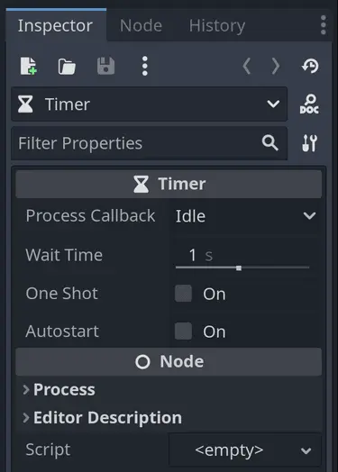
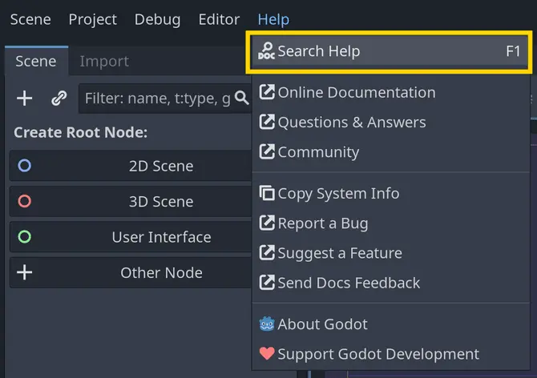

컴퓨터 프로그래밍에서 **객체(object)** 는 **자신만의 데이터와 그 데이터를 다루는 함수들을 가진 작은 기계**와 같습니다.
예를 들어, 커피 머신은 물과 커피 원두(데이터)를 담을 수 있고, 커피를 만들 수 있는 기능(함수)을 가집니다.
자동차는 연료와 사람(데이터)을 담고, 주행(함수)을 할 수 있습니다.

이것은 많은 프로그래밍 언어의 핵심에 있는 **추상적인 개념**입니다.

Godot 게임에서 객체의 예로는 **플레이어 캐릭터**가 있습니다.
플레이어는 체력, 이동 속도, 인벤토리(데이터)를 가질 수 있으며, 이동, 점프, 공격, 피해 받기 등의 기능(함수)을 수행할 수 있습니다.

Godot에서 객체는 게임을 구성하는 **가장 기본적인 구성 요소**입니다.
모든 노드(Node)는 객체이며, 일반적으로 플레이어, 적, 메뉴, 시각 효과 등 **프로젝트 내 다양한 요소를 구현할 때 객체를 사용하게 됩니다.**

> **숙련된 개발자를 위한 참고 사항:**
> 
> Godot에서는 노드와 객체를 사용하는 것이 **선택 사항**입니다.
> 엔진 내부에서는 성능을 위해 데이터 지향적(data-oriented)인 코드가 많이 사용됩니다.
> 필요하다면 노드와 객체를 우회하고  데이터 중심 코드를 직접 사용할 수도 있습니다.

---

#### 객체는 “속성(properties)“과 “메서드(methods)“를 가진다

앞서 언급했듯이, 객체는 데이터와 함수를 함께 묶은 것입니다.
프로그래밍에서는 이 데이터들을 **속성(property)** 또는 **멤버 변수(member variable)**,
함수들을 **메서드(method)** 또는 **멤버 함수(member function)** 라고 부릅니다.

Godot의 **GDScript** 언어에서는, 속성은 **스크립트 상단 함수 바깥에서 정의된 변수들**을 의미합니다.
예를 들어, 플레이어 객체가 체력, 속도, 인벤토리 같은 데이터를 가질 수 있다고 했을 때, 아래와 같이 속성을 정의할 수 있습니다:

```gdscript
extends CharacterBody2D

var health := 100
var speed := 500.0
var inventory := []
```

**메서드(methods)** 또는 **멤버 함수**는 스크립트 내에서 정의된 함수들입니다.
예를 들어, 플레이어 객체가 move(), jump(), take_damage() 같은 기능을 갖고 있다면 아래와 같이 정의할 수 있습니다:

```gdscript
extends CharacterBody2D

func move():
	# ...

func jump():
	# ...

func take_damage(amount):
	# ...
```

위의 두 예시는 스크립트에서 속성과 메서드를 어떻게 정의하는지를 보여줍니다.
이 외에도 Godot는 **엔진 자체에서 정의한 수많은 속성과 메서드**를 제공합니다.
에디터에서 노드를 선택하면, 오른쪽 **인스펙터(Inspector)** 패널에서 해당 노드가 가진 모든 속성을 확인할 수 있습니다.



모든 노드와 그 속성, 메서드는 Godot 코드 레퍼런스(Code Reference)에서도 확인할 수 있습니다.
에디터에서 **Help -> Search Help** 메뉴를 클릭하거나, 키보드에서 **F1**(Mac에서는 **⌥Space**)을 눌러 검색 창을 열면 됩니다.


