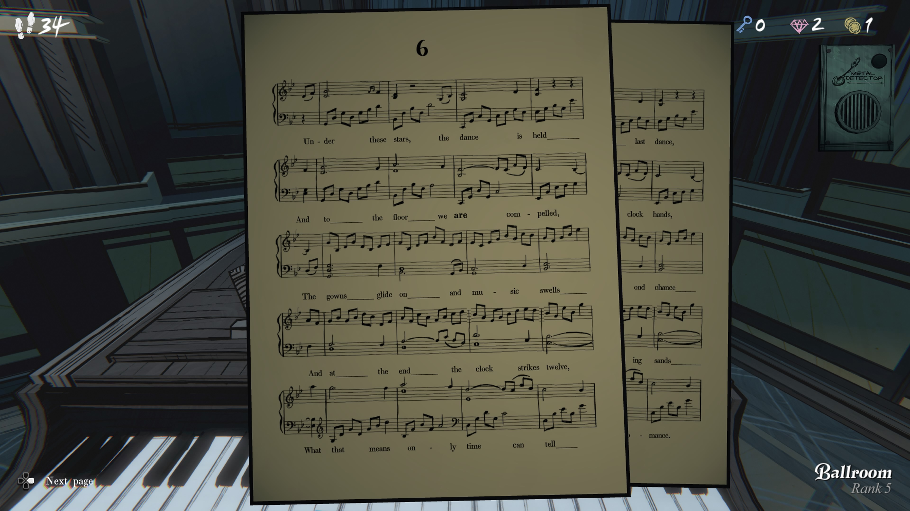
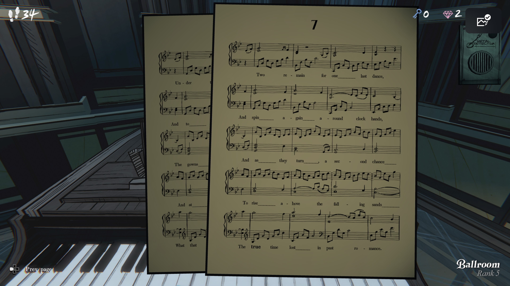

### **페이지 6**

**Under these stars, the dance is held**

이 별들 아래에서, 춤이 열리고

**Last dance, and to the floor we are compelled,**

마지막 춤, 그리고 우리는 무대로 이끌리며

**Clock hands, the gowns glide on and music swells**

시계 바늘처럼, 드레스는 흘러가고 음악은 고조되고

**And chance at the end the clock strikes twelve,**

그리고 기회는 끝에서, 시계가 열두 시를 칠 때

**What that means only time can tell— romance.**

그것이 무슨 의미일지는 오직 시간이 말해줄 뿐 — 로맨스.

### **페이지 7**

**Two remain for one last dance,**

마지막 춤을 위해 두 사람만 남고

**And spin again around clock hands,**

그리고 다시 시계 바늘처럼 회전하며

**And to the floor they turn a second chance**

그들은 무대로 향하고, 두 번째 기회를 얻으며

**The gowns glide on and as they turn**

드레스는 흘러가고, 그들이 돌며

**To rise above the falling sands**

떨어지는 모래(시간)를 넘어 올라서고

**And at the end the true time lost in past romance.**

그리고 마지막에, 과거의 로맨스 속에서 잃어버린 진정한 시간.

---

원문이 시적 표현을 사용해 문장 구조가 느슨합니다. 핵심 비유:

- 시간 = 시계 바늘, 모래시계의 모래
    
- 춤 = 로맨스
    
- 마지막 춤 = 마지막 기회
    
- 시간이 지나도 사랑과 로맨스는 흐른다
    

  