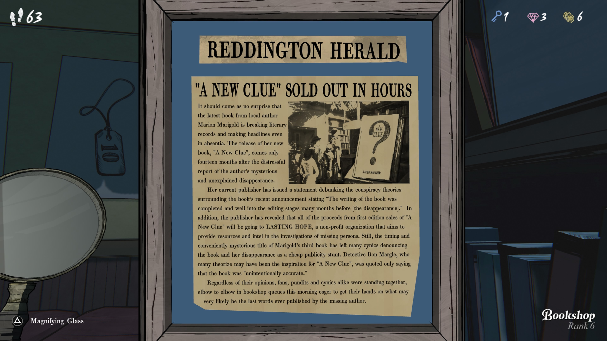

**레딩턴 헤럴드**

**“새로운 단서(A New Clue)” 수시간 만에 매진**

지역 작가 마리온 매리고울드의 최신작이 문학 기록을 깨고 있으며, 
작가가 실종 상태임에도 불구하고 헤드라인을 장식하고 있다는 사실은 놀랄 일이 아니다. 
그녀의 신작 **“새로운 단서”**는 작가가 실종되고 설명되지 않은 사건이 발생한 지 불과 14개월 만에 출간되었다.

출판사는 최근 떠도는 음모론을 일축하는 성명을 내며 “책은 작가의 실종 훨씬 이전에 집필 및 편집 과정이 완료되었다”고 밝혔다. 
또한 출판사는 **첫 번째 초판 판매 수익 전액**을 실종자 수색을 돕는 비영리 단체 **라스팅 호프(Lasting Hope)**에 기부한다고 발표했다.

그러나 책의 시기적 발표와 제목의 ‘편리한’ 미스터리성 때문에 많은 회의론자들은 책과 작가의 실종을 값싼 홍보 수단이라 비난하고 있다. 
일부는 이번 책에 영감을 준 인물일지도 모르는 탐정 본 마글이 “의도치 않게 정확했다”는 간단한 언급만 남겼다.

비판가, 팬, 전문가, 회의론자 할 것 없이 모두가 서점 앞에 줄을 서며, 
실종된 작가가 남긴 마지막 작품이 될지도 모를 책을 손에 넣기 위해 서로 밀치고 있었다.

