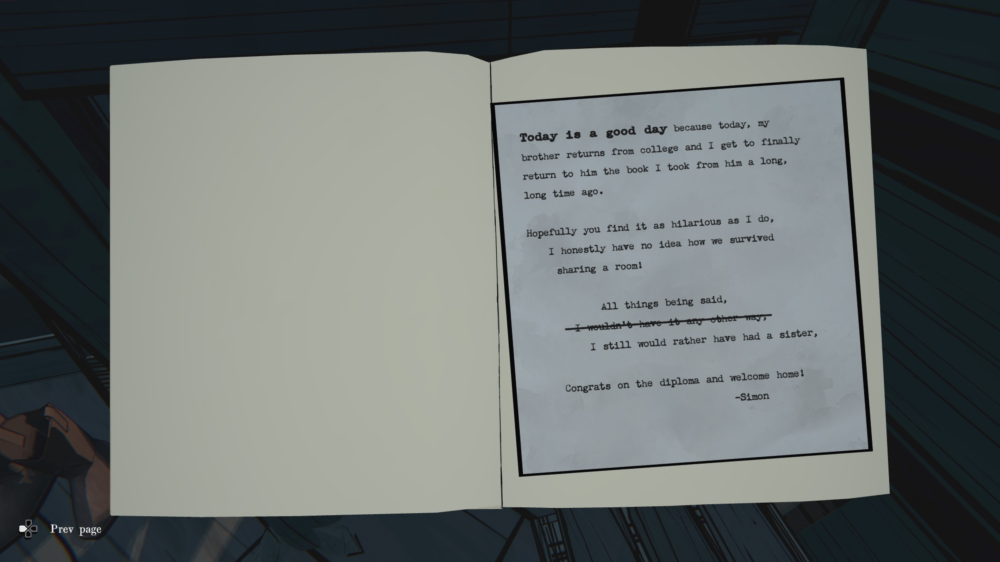

일기1

TODAY is a good day because Simon is at camp and he is not as much fun as my friends.
I will not have to share my toys and I will not have to share my room and I will not have to share my snacks.
Having a younger brother is not as much fun as they told me it would be, 
but today will be a good day because he is at camp.

번역:

오늘은 좋은 날이다.
사이먼(Simon)-동생 이 캠프에 가 있어서 친구들처럼 재밌지도 않고,
이제 나는 내 장난감도 안 나눠줘도 되고, 방도 혼자 쓰고, 간식도 혼자 먹을 수 있다.
사람들이 말하던 것처럼 남동생이 있는 게 그렇게 즐겁진 않다.
그래도 오늘은 좋은 날이다.
왜냐하면 사이먼이 캠프에 가 있기 때문이다.

---

일기2

HERBIE IS MEAN AND REALLY STUPID AND TODAY IS A GOOD DAY BECAUSE I THREW AWAY HIS AIRPLANE.

번역:

허비(HERBIE)-형 는 못됐고 진짜 바보다.
오늘은 좋은 날이다.
왜냐하면 내가 그 녀석의 비행기를 던져버렸기 때문이다.

---

일기3

I ALSO HAD MORE FUN AT CAMP THAN HE HAS HAD IN HIS ENTIRE LIFE.

번역:

그리고 나는 캠프에서 그 녀석 인생 전체보다 더 재밌게 놀았다.

---

일기4

TODAY is a good day because I got my brother in trouble for reading my private journal without my permission 
and writing mean things in it too.
He also threw my model airplane in the bushes outside
but I got it back and IF HE DOES it again he will NOT get to go to the park on Friday
and I will make sure he gets no presents for his birthday.

번역:

오늘은 좋은 날이다.
내 동생이 내 허락 없이 내 일기를 훔쳐보고 거기다 못된 말을 써서 혼이 났다!
그 녀석은 내 모형 비행기도 밖의 덤불 속에 던져버렸지만, 내가 찾아왔다.
만약 그걸 또 던지면, 이번 주 금요일에 공원에도 못 가고,
생일 선물도 못 받을 거다.

---

일기5

I DONT NEED ANY PRESINTS BECAUSE I HAVE MY BROTHER’S BOOK BECAUSE HE WONT STOP WRITING ABOUT ME
AND TODAY IS A GOOD DAY BECAUSE I KNOW HE CRIES WHEN HE CAN’T FIND HIS BOOK EVEN THOE HE IS OLDER.
HE IS A CRYBABY.

번역:

나는 선물 따위 필요 없다.
왜냐하면 형의 책(일기) 을 내가 가지고 있으니까.
그는 자꾸 나에 대해 쓸 뿐이야.
그리고 오늘은 좋은 날이다.
그 책을 못 찾아서 울고 있을 걸 생각하면 너무 웃기다.
나보다 나이 많아도 울보인 건 마찬가지다.

---

일기6

Today is a good day because today, my brother returns from college
and I get to finally return to him the book I took from him a long, long time ago.
Hopefully you find it as hilarious as I do, I honestly have no idea how we survived sharing a room!

All things being said, I wouldn’t have it any other way, I still would rather have had a sister.
Congrats on the diploma and welcome home! — Simon

번역:

오늘은 좋은 날이다.
오늘 내 형이 대학에서 돌아오고,
나는 아주 오래전에 형한테서 몰래 가져갔던 그 책을 드디어 돌려준다.

너도 나처럼 이걸 보면서 웃었으면 좋겠다.
솔직히, 우리가 한 방을 같이 쓰며 어떻게 살아남았는지 지금도 모르겠다!

모든 걸 말하자면,
(“다시 돌아간다 해도 똑같이 했을 거야” 라고 쓰려다 지우고)
그래도 차라리 여동생이 있었으면 좋았을 텐데.

졸업 축하하고, 집에 온 걸 환영한다! — 사이먼

