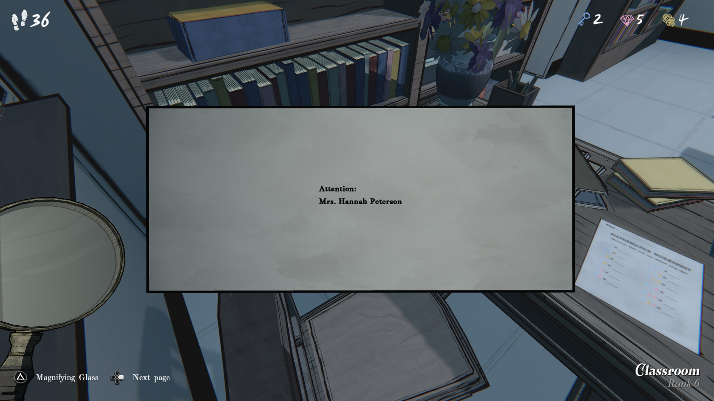
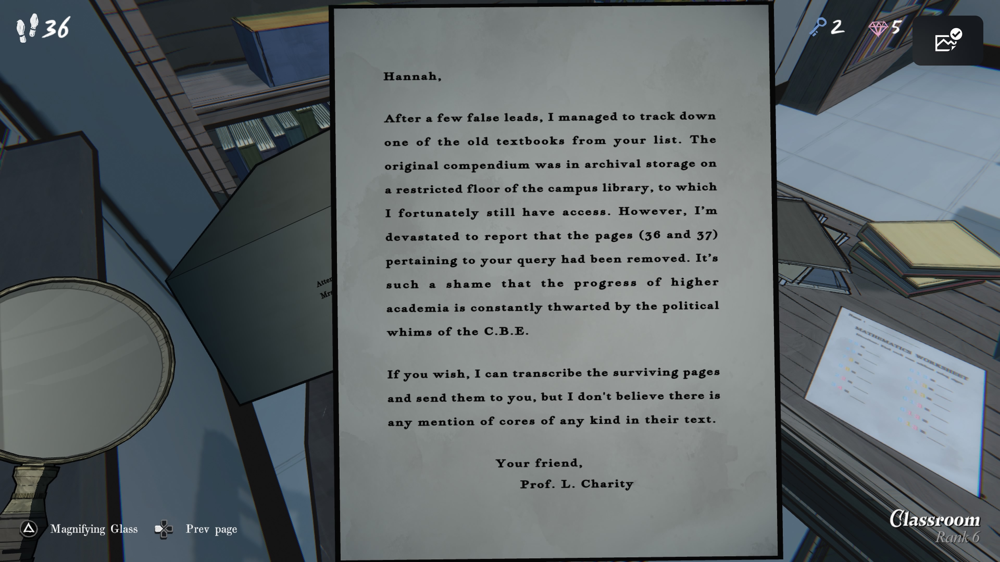

**한나에게,**

몇 번의 허탕 끝에, 네 리스트에 있던 오래된 교과서 중 하나를 찾아내는 데 성공했어.
원본 자료집은 캠퍼스 도서관의 제한 구역 보관소에 있었고, 다행히 나는 아직 그곳에 접근할 수 있어.

하지만 안타깝게도 네가 찾던 내용이 있는 페이지(36과 37쪽)는 제거되어 있었어.
고등 교육의 발전이 C.B.E.*의 정치적 변덕 때문에 계속 방해받는다는 게 정말 유감이야.

(*아마 학교나 정부 기관 이름 약자)

원한다면 남아 있는 페이지들을 필사해서 보내줄 수 있어.
하지만 그 안에는 어떤 종류의 ‘코어’(핵심/핵) 관련 언급도 없는 것 같아.

친애를 담아,

**L. 채리티 교수**
