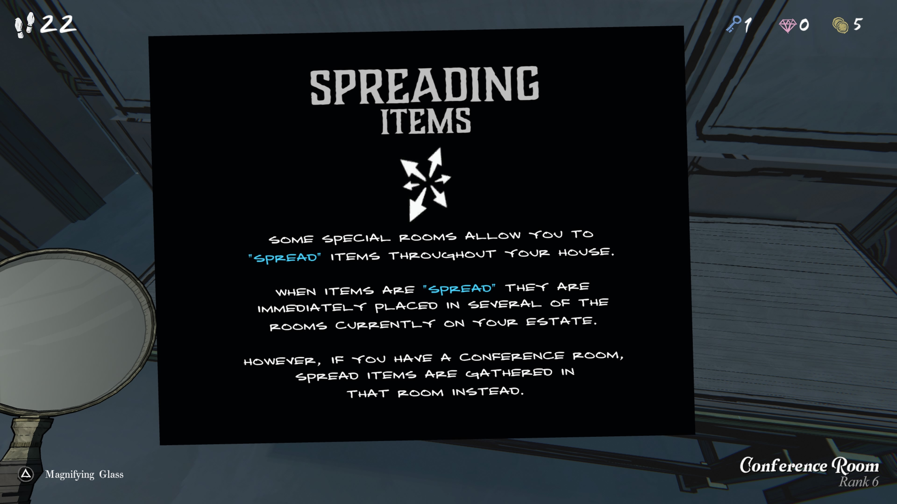
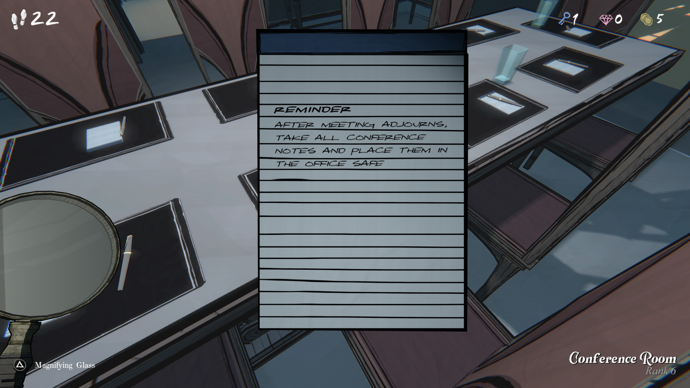
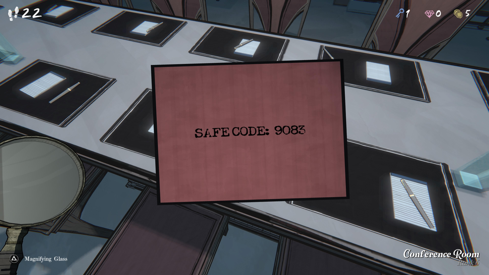

**SPREADING ITEMS**

일부 특별한 방에서는 집 전체에 아이템을 “퍼뜨릴(spread)” 수 있습니다.
아이템이 “퍼뜨려지면”, 현재 저택의 여러 방에 즉시 배치됩니다.

하지만 회의실(Conference Room)이 있다면,
퍼뜨려진 아이템은 그 방에 모입니다.

**REMINDER**

회의가 끝난 후,
모든 회의 노트를 가져가
사무실 금고에 보관할 것.

