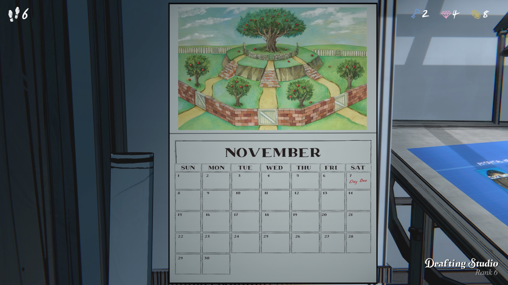

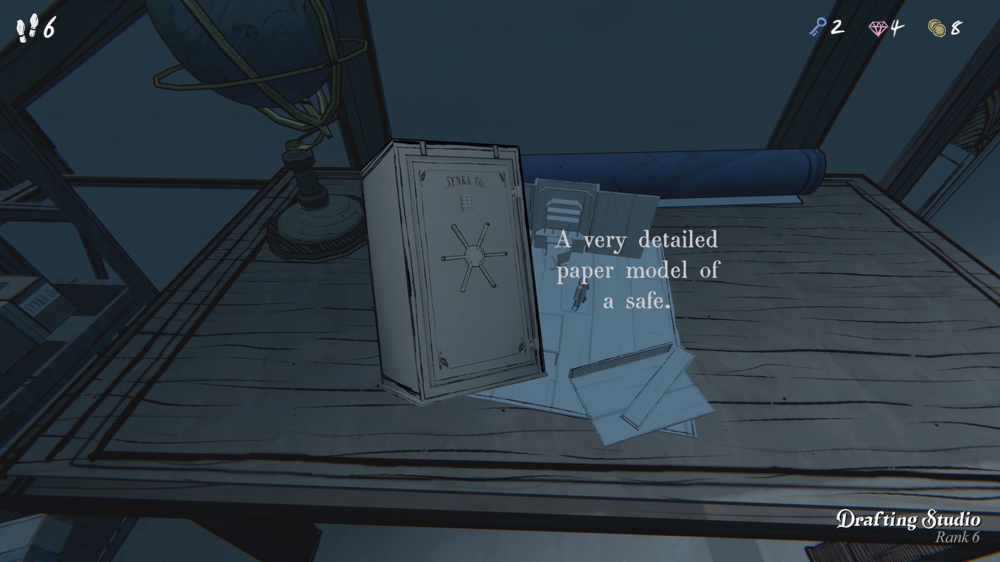

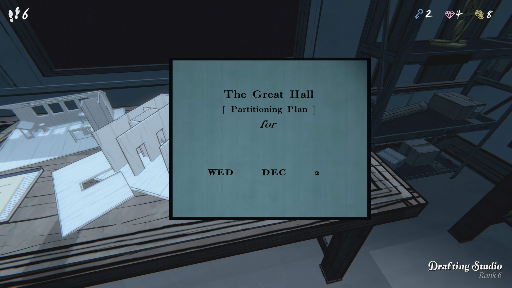

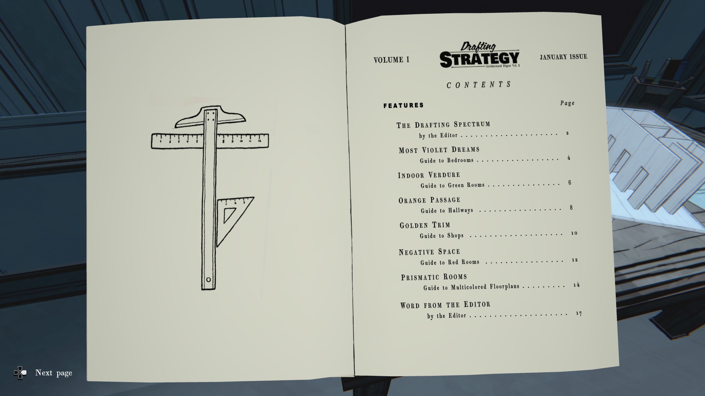

**제1권 ― 설계 전략**

_1월호_

### **목차**

|**항목**|**페이지**|
|---|---|
|**설계 스펙트럼** _(편집자 글)_|2|
|**가장 보랏빛 꿈**침실 안내|4|
|**실내 녹음**녹색 방 안내|6|
|**오렌지 통로**복도 안내|8|
|**황금 장식**상점 안내|10|
|**네거티브 스페이스**빨간 방 안내|12|
|**프리즈매틱 룸**다채로운 설계도 안내|14|
|**편집자 코멘트**|17|

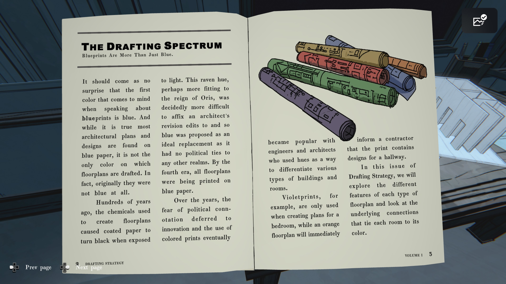

### **설계 스펙트럼**

청사진은 파란색만이 아니다.

청사진을 말할 때 가장 먼저 떠오르는 색이 파란색이라는 것은 놀랄 일이 아니다. 
대부분의 건축 계획서와 디자인이 파란 종이에 그려진다는 것은 사실이지만,
이것이 설계도가 그려지는 유일한 색은 아니다. 
사실, 원래는 파란색이 아니었다.

수백 년 전, 설계도를 만드는 데 사용된 화학 성분은 종이를 빛에 노출하면 검게 변하게 했다.
이 까마귀색은 오리스(Ori s) 치세에 더 어울렸을지도 모르나,
건축가가 수정 사항을 기재하기가 매우 어려웠다.
그래서 정치적 의미가 전혀 없는 색이자 이상적인 대체재로 파란색이 제안되었다. 
제4시대가 되자 모든 설계도는 파란 종이에 인쇄되었다.

세월이 지나며 정치적 의미에 대한 두려움 대신 혁신이 자리잡았고,
다양한 색상의 도면이 사용되기 시작했다.
엔지니어와 건축가들은 색을 사용해 다양한 건물과 방 유형을 구분했다.

예를 들어, 보라색 설계도는 침실 도면에만 사용되고,
주황색 설계도는 복도 설계가 포함되었다는 것을 즉시 시공자에게 알린다.

이번 《설계 전략》 호에서는 각 설계도 색상의 특징과,
색이 각 방과 연결되는 근본적인 관계를 살펴볼 것이다.

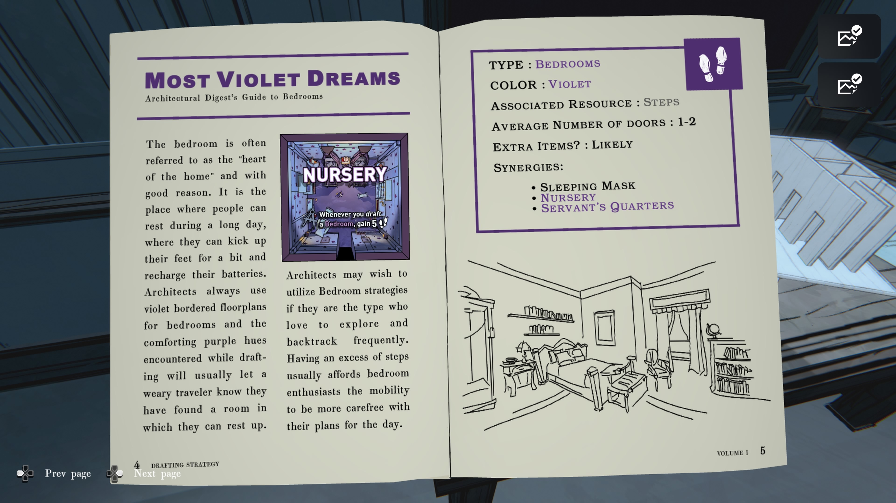

### **MOST VIOLET DREAMS**

건축 다이제스트: 침실 가이드

침실은 종종 “집의 심장”이라고 불린다. 이유가 있다.
긴 하루 동안 사람들이 휴식을 취하고, 잠시 다리를 뻗고,
에너지를 충전할 수 있는 곳이기 때문이다.
건축가들은 항상 침실에 보라색 테두리의 설계도를 사용하며,
설계 중에 마주치는 편안한 보라색 색조는 피곤한 여행자에게 이곳이 휴식할 수 있는 방임을 알려준다.

건축가들은 자주 탐험하고 되돌아가는 것을 좋아하는 타입이라면 침실 전략을 활용할 수 있다.
여분의 걸음 수가 있으면 침실 애호가들은 하루 계획에 더 여유를 가질 수 있다.

---

### **오른쪽 페이지**

**유형:** 침실

**색상:** 보라색

**관련 자원:** 걸음 수

**평균 문 개수:** 1–2

**추가 아이템:** 있을 가능성 높음

**시너지:**

• 수면용 안대

• 유아실(Nursery)

• 하인 방(Servant’s Quarters)

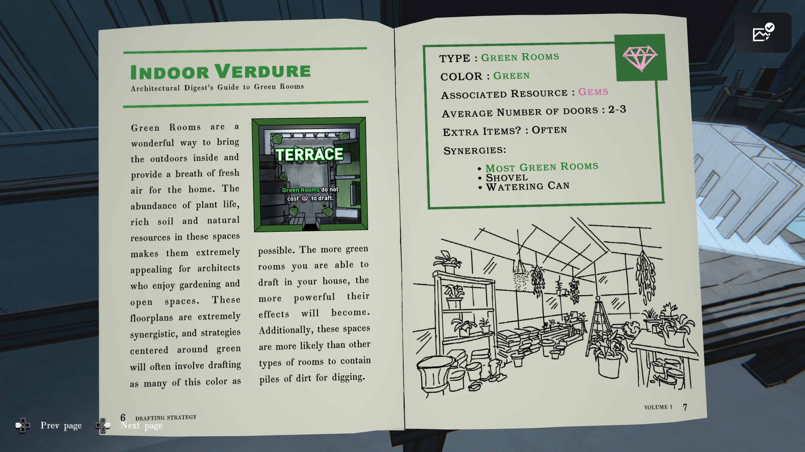

### **실내 녹색 공간 (Indoor Verdure)**

건축 다이제스트: 그린 룸 가이드

그린 룸은 실내에 자연을 들이는 멋진 방법이며, 
집에 상쾌한 공기를 제공합니다. 
식물, 비옥한 토양, 그리고 풍부한 자연 자원 덕분에 이 공간들은
정원 가꾸기와 개방된 공간을 즐기는 건축가들에게 매우 매력적입니다.

이 설계도는 높은 시너지를 가지며, 
녹색 중심 전략은 가능한 한 많은 녹색 방을 배치하는 것을 포함합니다.
집에 더 많은 그린 룸을 배치할수록 그 효과는 더욱 강력해집니다.

또한, 이 공간들은 다른 종류의 방보다 흙더미가 있을 확률이 높아,
파낼 수 있는 장소를 제공하기도 합니다.

---

### **오른쪽 페이지**

**유형:** 그린 룸

**색상:** 초록

**관련 자원:** 보석(Gems)

**평균 문 개수:** 2–3

**추가 아이템:** 자주 등장

**시너지:**

• 대부분의 그린 룸

• 삽 (Shovel)

• 물뿌리개 (Watering Can)

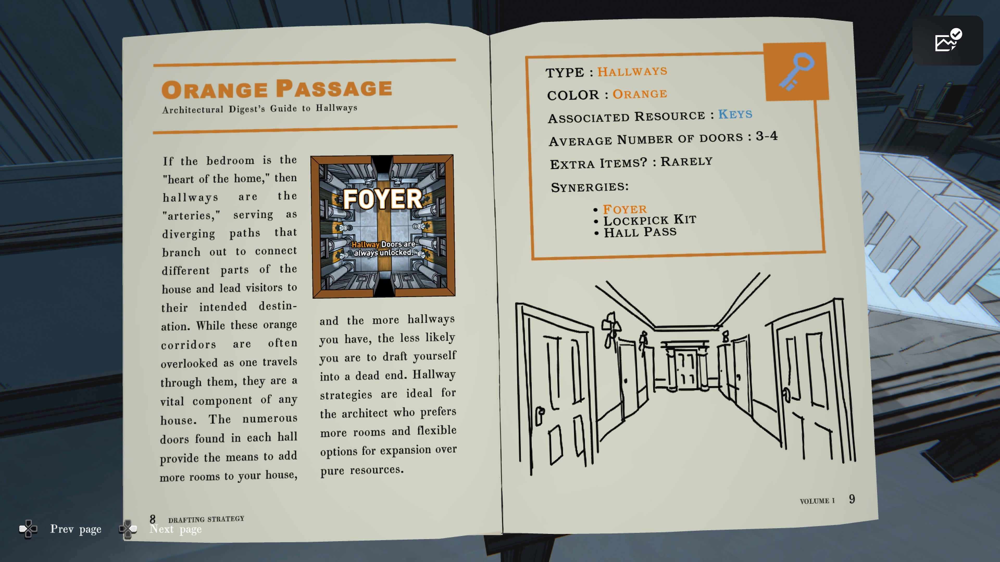

### **오렌지 통로**

건축 다이제스트: 복도 가이드

침실이 “집의 심장”이라면, 복도는 “동맥”입니다.

복도는 집의 서로 다른 부분을 연결하고 방문객을 목적지로 안내하는 갈림길 역할을 합니다.

이 오렌지색 통로들은 흔히 지나가는 길로 간과되지만,
사실 어떤 집에서도 매우 중요한 구성 요소입니다.
하나의 복도 안에 있는 수많은 문들은 집에 더 많은 방을 추가할 수 있는 수단을 제공합니다.

또한 복도가 많을수록 막다른 길에 빠질 가능성도 줄어듭니다. 
복도 전략은 자원보다는 더 많은 방과 확장성을 선호하는 건축가에게 이상적입니다.

---

### **오른쪽 페이지**

**유형:** 복도

**색상:** 오렌지

**사용 자원:** 열쇠

**평균 문 개수:** 3–4

**추가 아이템:** 거의 없음

**시너지:**

• 현관(Foyer)

• 자물쇠 따기 키트(Lockpick Kit)

• 복도 출입권(Hall Pass)

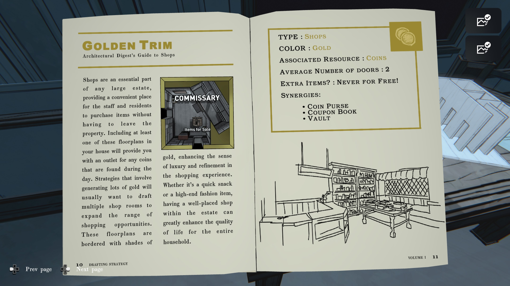

### **황금 장식 (Golden Trim)**

건축 다이제스트: 상점 가이드

상점은 어떤 대저택에서도 필수적인 공간으로,
직원들과 거주자들이 저택 밖으로 나가지 않고도 물건을 구매할 수 있는 편리한 장소를 제공합니다.

집 안에 이러한 설계도를 최소 하나 포함하면 하루 동안 발견한 동전을 사용할 공간을 얻게 됩니다.
많은 금화를 생성하는 전략이라면, 쇼핑 기회 범위를 넓히기 위해 여러 개의 상점 방을 배치하고 싶을 것입니다.

이 설계도는 황금빛 테두리를 가지고 있으며, 
쇼핑 경험에 고급스러움과 세련됨의 감각을 더합니다. 
간단한 간식이든 고급 패션 아이템이든, 저택 내에 알맞게 배치된 상점은 전체 가구 구성원의 삶의 질을 크게 향상시킵니다.

---

### **오른쪽 페이지**

**유형:** 상점

**색상:** 금색

**소모 자원:** 동전

**평균 문 개수:** 2

**추가 아이템:** 공짜는 절대 없음!

**시너지:**

• 동전 지갑(Coin Purse)

• 쿠폰북(Coupon Book)

• 금고(Vault)

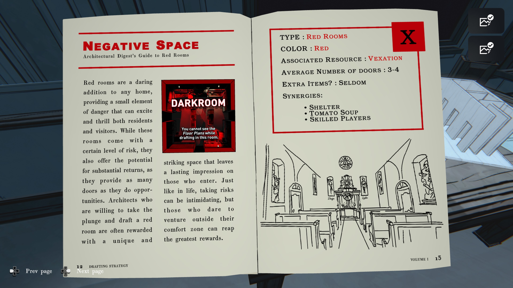

### **부정 공간 (Negative Space)**

건축 다이제스트: 붉은 방 가이드

붉은 방은 어떤 집에도 대담한 선택으로, 
거주자와 방문객 모두에게 흥분과 스릴을 줄 수 있는 작은 위험 요소를 제공합니다.

이 방들은 일정 수준의 위험을 수반하지만, 
그만큼 높은 보상을 제공할 잠재력도 있습니다. 
왜냐하면 많은 문과 기회를 제공하기 때문입니다.

과감하게 붉은 방을 설계하는 건축가들은 종종 독특하고 인상적인 공간을 얻게 되며, 
이는 방문자들에게 강렬한 인상을 남깁니다.

인생에서처럼 위험을 감수하는 일은 무서울 수 있지만, 
편안한 구역을 벗어날 용기가 있는 사람은 가장 큰 보상을 얻을 수 있습니다.

---

### **오른쪽 페이지**

**유형:** 붉은 방

**색상:** 빨강

**사용 자원:** 성가심(Vexation)

**평균 문 개수:** 3–4

**추가 아이템:** 거의 없음

**시너지:**

• 쉼터(Shelter)

• 토마토 수프(Tomato Soup)

• 숙련된 플레이어(Skilled Players)

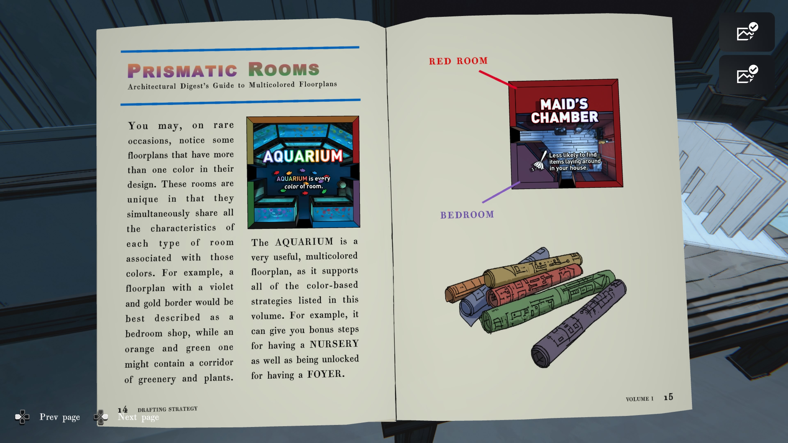

### **프리즈매틱 룸 (다색 방)**

건축 다이제스트: 다색 플로어플랜 가이드

드물게, 설계 도면 중 어떤 것들은 하나 이상의 색을 가지고 있는 경우가 있습니다.

이 방들은 독특한데, 각 색에 해당하는 방의 특성을 동시에 모두 지니기 때문입니다.

예를 들어, 보라색과 금색 테두리를 가진 설계도는 ‘침실 겸 상점’이라고 부를 수 있으며,

주황색과 초록색이 섞인 설계도는 식물과 녹지가 있는 복도를 포함할 수 있습니다.

---

**AQUARIUM(수족관)** 은 매우 유용한 다색 설계도로,

이 책에 소개된 모든 색 기반 전략을 지원합니다.

예를 들어, 이 방은 **보육실(NURSERY)** 조건을 만족시켜 추가 이동 보너스를 줄 수 있으며,

동시에 **현관(FOYER)** 조건을 충족하여 해금 효과도 제공합니다.

---

### **오른쪽 페이지**

**RED ROOM → 하녀의 방 (Maid’s Chamber)**

- 집 안에 놓인 아이템을 발견할 확률 감소
    

**BEDROOM → 침실**

아래 그림: 여러 색의 도면 롤

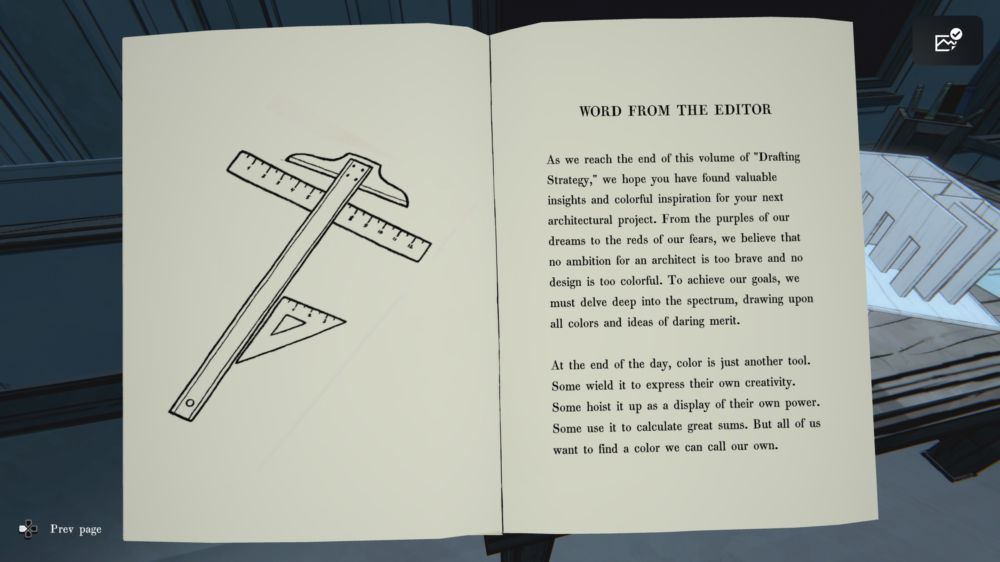

### **편집자의 말**

이번 「Drafting Strategy」 첫 번째 권의 마지막에 도달하면서,
독자 여러분께서 다음 건축 프로젝트를 위한 가치 있는 통찰과
다채로운 영감을 얻으셨기를 바랍니다.

우리의 꿈을 나타내는 보라색부터
두려움을 상징하는 붉은색까지,
건축가에게 너무 대담한 야망이란 없으며
너무 화려한 디자인도 없습니다.

목표를 이루기 위해 우리는
스펙트럼의 깊숙한 곳까지 탐구하고
모든 색과 대담한 아이디어에서
영감을 얻어야 합니다.

---

하루가 끝나면, 색은 단지 또 하나의 도구일 뿐입니다.
누군가는 그것을 창의성을 표현하는 데 사용하고,
누군가는 자신의 힘을 과시하기 위해 높이 치켜들며,
또 누군가는 복잡한 계산을 위해 사용합니다.

그러나 우리 모두는
**자신만의 색을 찾고 싶어합니다.**
