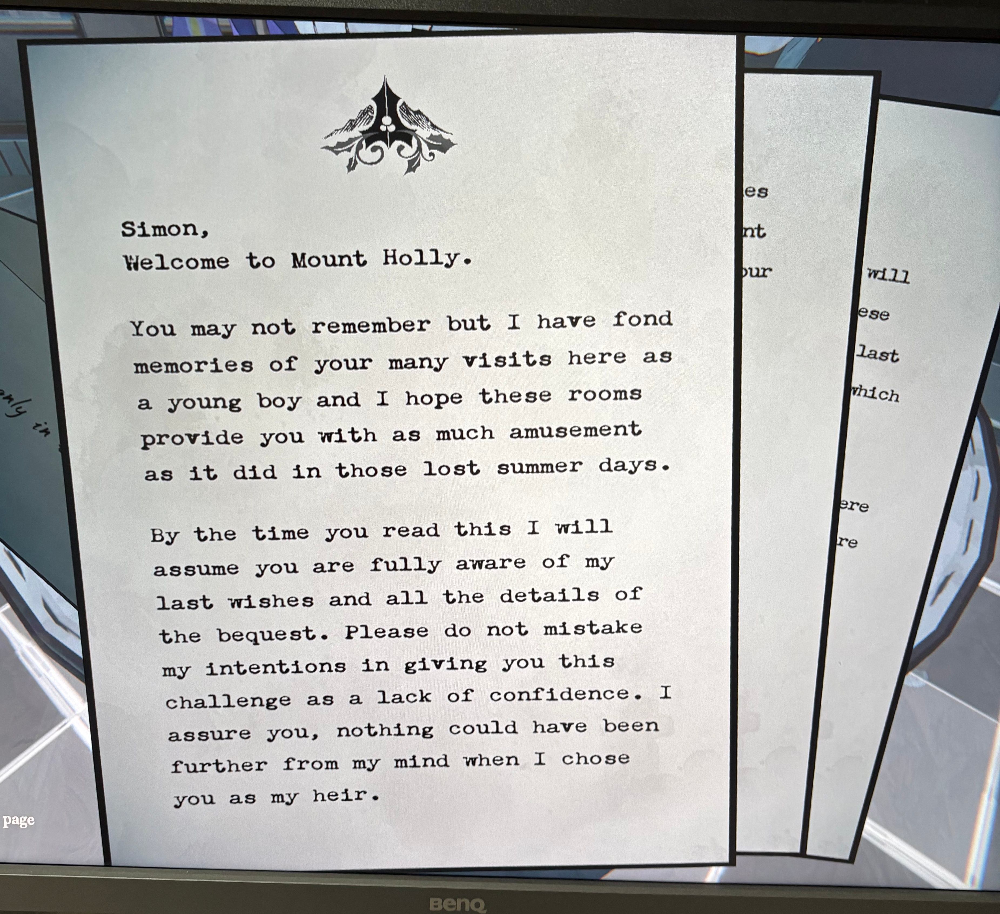
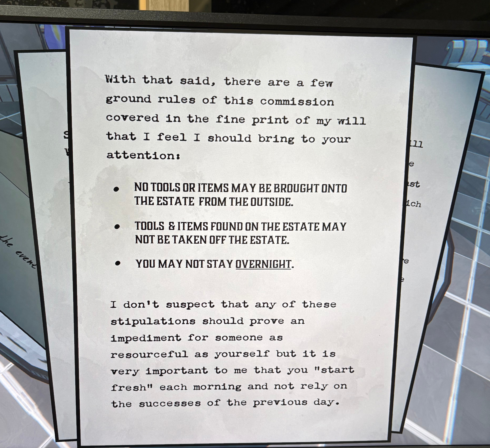
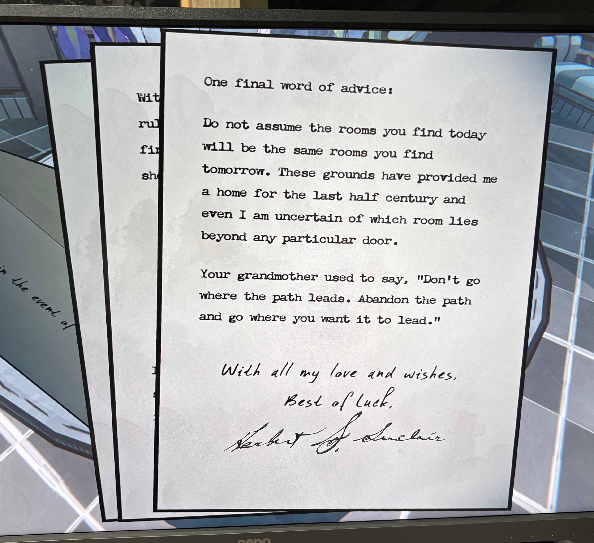

### 편지 1

**Simon,**

Mount Holly에 온 것을 환영하네.

자네는 기억하지 못할 수도 있겠지만, 어릴 적 자네가 이곳을 자주 방문하던 때의 추억이 내겐 무척 소중하단다.

이 방들이 그 시절 잃어버린 여름날처럼 자네에게 즐거움을 주기를 바란다네.

이 편지를 읽을 즈음이면, 자네는 내 유언의 세부 사항과 유산에 대한 모든 내용을 충분히 알고 있을 거라 생각하네.

부디 이 과제를 자네의 능력을 의심한 결과로 오해하지 말게.

내가 자네를 후계자로 택할 때, 그 어떤 불신도 마음속에 없었다는 점을 확실히 해두고 싶네.

---

### 편지 2

이제 몇 가지 기본 규칙을 말해야겠네.

이는 내 유언의 세부 조항에도 명시되어 있지만, 특별히 자네에게 직접 강조하고자 하네.

- **외부에서 어떤 도구나 물건도 저택 안으로 들여올 수 없다.**
    
- **저택 안에서 발견한 도구나 물건은 절대 밖으로 가져갈 수 없다.**
    
- **하룻밤을 이곳에서 머물러서는 안 된다.**

이 조항들이 자네처럼 자원ful(재치 있고 능숙한)한 사람에게 방해가 되리라 생각지는 않네.

하지만 내가 강조하고 싶은 건, 매일 아침 “새롭게 시작하라”는 것이네.

전날의 성과에 의존하지 말고 말일세.

---

### 편지 3

마지막으로 한 가지 조언을 덧붙이겠네.

오늘 자네가 찾은 방이 내일도 같은 방일 거라고 생각하지 말게.

지난 반세기 동안 이 땅이 내 집이 되어 주었지만, 나조차도 어느 문 너머에 어떤 방이 있을지 확신할 수 없네.

자네의 할머니께서 늘 말씀하셨지.

> “길이 이끄는 대로 가지 말고,자네가 가고자 하는 곳으로 길을 만들어라.”

내 사랑과 행운을 모두 담아,

**Herbert G. Sinclair**

