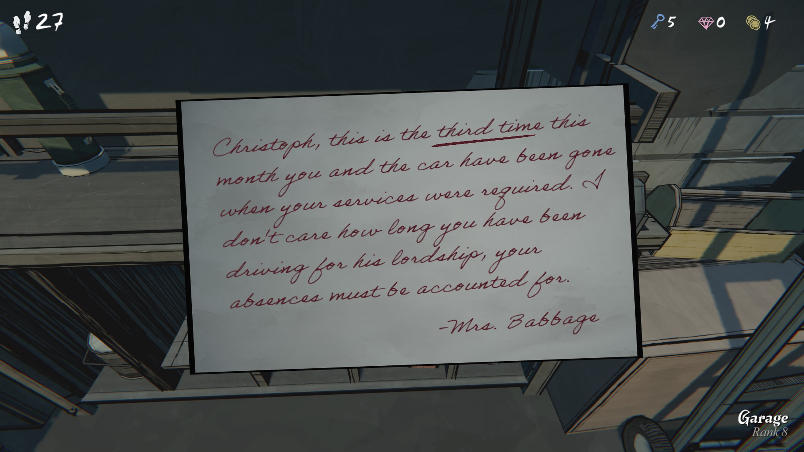

원문

Christoph, this is the third time this month you and the car have been gone when your services were required.
I don’t care how long you have been driving for his lordship, your absences must be accounted for.

— Mrs. Babbage
 
⸻
번역

크리스토프, 이번 달만 해도 세 번째야.
네가 운전해야 할 때마다 너와 차가 어디론가 사라져 있더구나.

그분(귀하의 주인님)을 위해 운전한 지 얼마나 됐든 상관없어.
네 결근 사유는 반드시 설명해야 해.

— 배비지 부인

