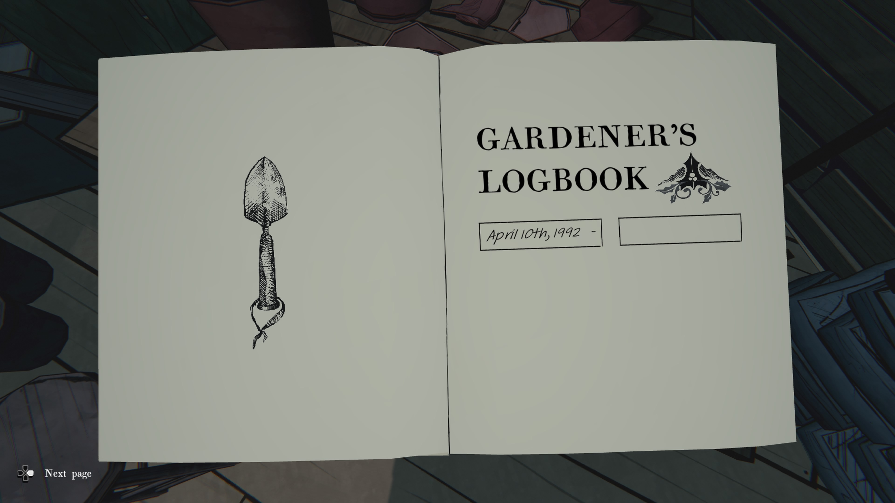
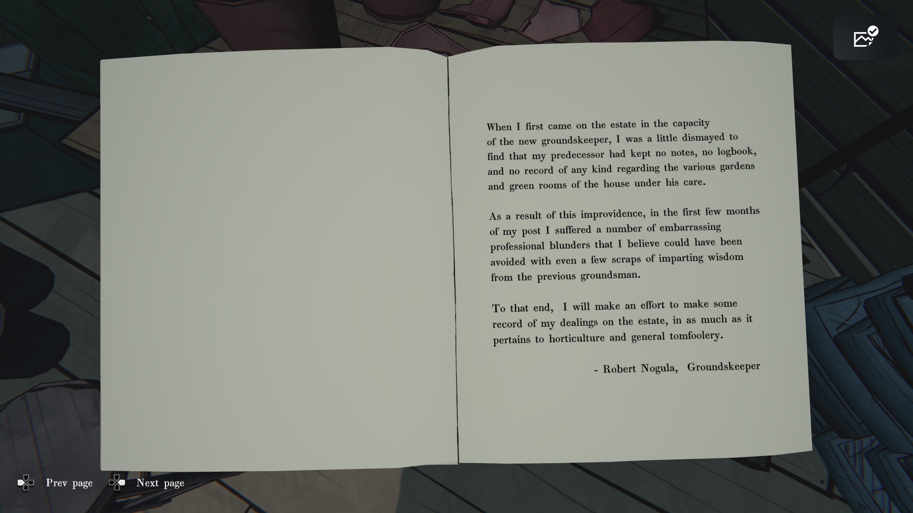
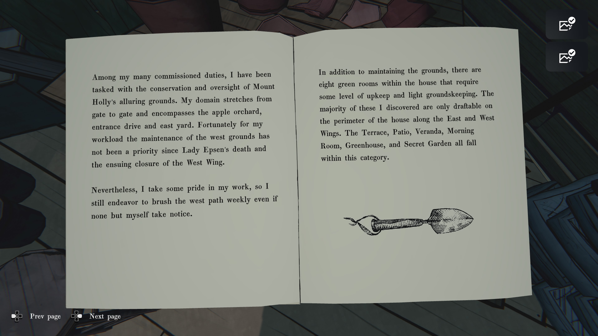
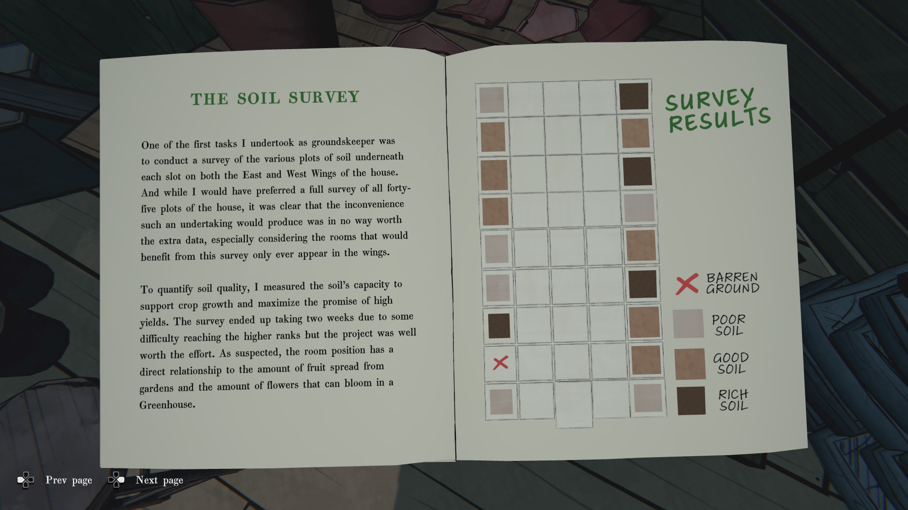
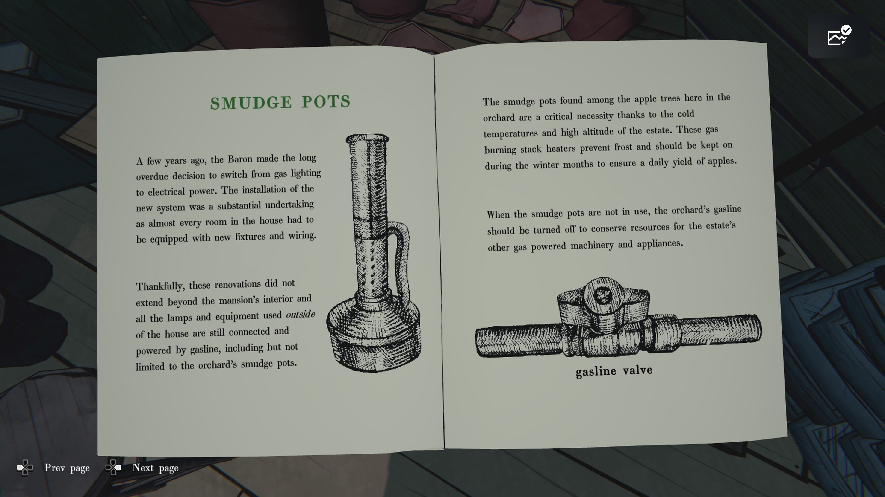
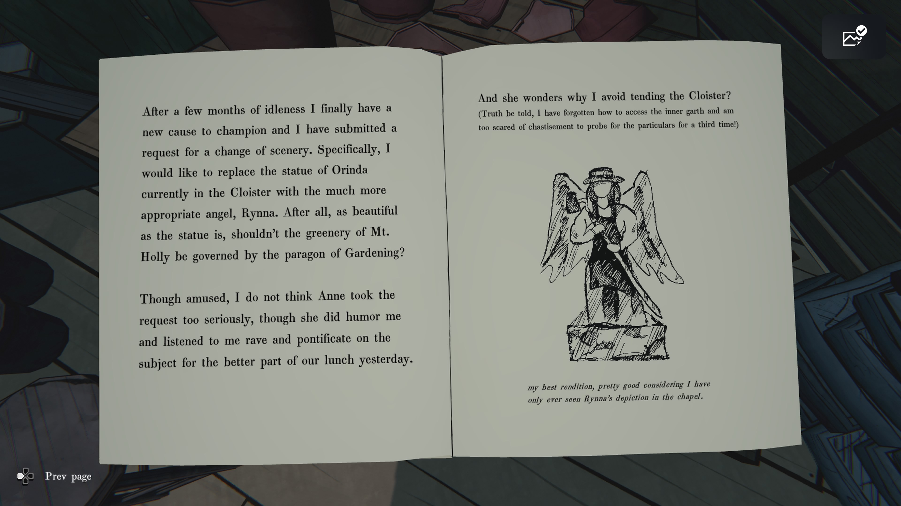

새 관리인으로 이 저택에 처음 왔을 때, 전임자가 아무런 기록도, 일지조차도, 
그가 관리하던 여러 정원과 그린룸에 대해 어떤 형태의 메모도 남기지 않았다는 사실에 약간 낙담했다.

그 부주의의 결과로, 부임 초기 몇 달 동안 나는 여러 당황스러운 직무 실수를 겪었고, 
이는 전임 정원사로부터 단 몇 줄의 지혜라도 전해졌다면 충분히 피할 수 있었을 것이라 믿는다.

그러므로, 원예와 일반적인 소소한 일들에 관련된 저택 내 업무 기록을 남기기 위해 노력할 것이다.

– 정원 관리인 로버트 노굴라

내가 맡은 여러 임무 중 하나는 매혹적인 마운트 홀리 부지의 관리와 보존이다. 
내 담당 구역은 정문에서 후문까지 뻗어 있으며 사과 과수원, 진입로, 동쪽 정원을 포함한다. 
다행히도, 레이디 엡센의 사망과 그에 따른 서쪽 윙 폐쇄 이후 서쪽 정원 관리는 우선순위가 아니었다.

그럼에도, 나는 내 일에 나름 자부심을 가지고 있으므로, 
아무도 알아주지 않더라도 매주 서쪽 산책로를 쓸고 다닌다.

그리고 외부 부지 관리 외에도, 저택 내부에는 유지 관리가 필요하고 가벼운 정원 관리를 
요하는 그린룸이 여덟 개 있다. 대부분은 동쪽 및 서쪽 윙의 외곽에 위치해 있으며, 
테라스, 파티오, 베란다, 모닝룸, 온실, 비밀 정원이 여기에 속한다.

### **토양 조사**

정원 관리인으로서 수행한 첫 과제 중 하나는 저택 동관과 서관 아래 각 구역의 토양을 조사하는 일이었다. 
전체 45개의 구획을 모두 조사하고 싶었지만,
그러한 작업이 가져올 번거로움은 추가 데이터의 가치에 비해 전혀 합당하지 않다는 것이 분명했다. 
특히 이 조사로 혜택을 받을 방들은 오직 양쪽 날개 구역에만 존재한다는 점을 고려하면 더욱 그러했다.

토양의 품질을 파악하기 위해,
나는 작물 성장 지원 능력과 높은 수확량을 기대할 수 있는지를 기준으로 측정하였다.
조사에는 상층부 구역 접근 문제로 인해 약 2주가 걸렸지만, 그 노력은 충분히 가치 있었다.
예상대로 각 방의 위치는 정원에서 퍼지는 과일 양과 온실에서 꽃이 피는 양에 직접적인 영향을 주는 것으로 나타났다.

---

### **SURVEY RESULTS — 조사 결과**

- ❌ **메마른 땅 (Barren Ground)**
    
- ▭ 연한 회갈색 **나쁜 토양 (Poor Soil)**
    
- ▭ 갈색 **좋은 토양 (Good Soil)**
    
- ▭ 진갈색 **비옥한 토양 (Rich Soil)**

### **SMUDGE POTS 훈연 화로**

몇 년 전, 남작님은 오랫동안 미뤄왔던 결정을 내려 가스 조명에서 전기 조명으로 전환하였다. 
새로운 시스템 설치는 저택 거의 모든 방에 새로운 설비와 배선을 갖추어야 했기 때문에 상당한 규모의 작업이었다.

다행히도 이러한 개조는 저택 내부에만 해당되었고,
바깥에서 사용되는 모든 램프와 장비는 여전히 가솔린으로 연결되고 작동된다.
여기에는 과수원의 훈연 화로도 포함된다.

과수원 내 사과나무들 사이에 놓인 훈연 화로는 저택의 높은 고도와 추운 기온 덕분에 반드시 필요한 장치이다.
이 가스식 연소 스택 히터들은 서리를 막아주며,
겨울철에는 매일 사과 수확을 보장하기 위해 계속 가동되어야 한다.

훈연 화로가 사용되지 않을 때는 저택 내 다른 가솔린 장비 및 기계에 연료를 절약하기 위해 과수원 가솔린 밸브를 반드시 잠가야 한다.

**gasline valve — 가솔린 밸브**

몇 달간의 나태함 끝에 마침내 새로운 목표가 생겼다. 나는 풍경을 바꿔달라는 요청을 제출했다. 
구체적으로는, 지금 회랑(Cloister)에 있는 오린다(Orinda) 조각상을 훨씬 더 적절한 천사 린나(Rynna)로 교체하고 싶다. 
결국, 조각상이 아무리 아름답다 한들, 마운트 홀리의 푸르름은 원예의 모범이 지배해야 하지 않겠는가?

앤은 이 요청을 너무 진지하게 받아들이지는 않은 것 같지만,
어제 점심시간 대부분을 할애해 내 주장을 듣고 웃으며 맞장구쳐 주었다.

그리고 그녀는 왜 내가 회랑 관리를 피하는지 궁금해한다?
(사실을 말하자면, 나는 안쪽 정원에 들어가는 방법을 잊어버렸고, 
세 번째로 다시 물어보기엔 꾸지람이 두렵다!)

_내가 그린 최고의 버전이다. 예배당(chapel)에 있는 린나의 모습을 한 번 본 것이 전부라는 점을 감안하면 꽤 잘한 편이다._
