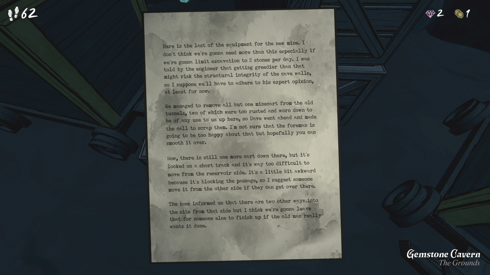

여기 새 광산을 위한 마지막 장비가 있습니다.

하루에 돌 두 덩이만 캐낼 계획이라면 이 정도면 충분할 거라고 생각합니다.

엔지니어 말로는 그 이상 욕심을 부리면 동굴 벽의 구조적 안정성이 위험해질 수 있다고 하더군요.

그러니 일단은 그의 전문적인 의견을 따라야 할 것 같습니다.

우리는 옛 터널에 있던 갱도차들을 거의 다 치웠습니다.

그 중 두 개는 너무 녹슬고 닳아서 여기서 사용할 수 없을 정도였기에 데이브가 폐기하기로 했습니다.

현장 감독이 이걸 썩 좋아하진 않겠지만, 당신이 잘 중재해줄 수 있기를 바랍니다.

아직 아래에 갱도차 하나가 남아 있는데,

짧은 선로에 잠겨 있고 저수지 쪽에서 옮기기 너무 어렵습니다.

통로를 막고 있어 좀 불편하니, 누군가 반대편으로 들어가 옮길 수 있다면 옮기는 게 좋겠습니다.

상사는 저쪽에서 들어오는 다른 두 경로가 있다고 했지만,

아마도 그건 정말 원한다면 누군가 나중에 마무리할 겁니다.
