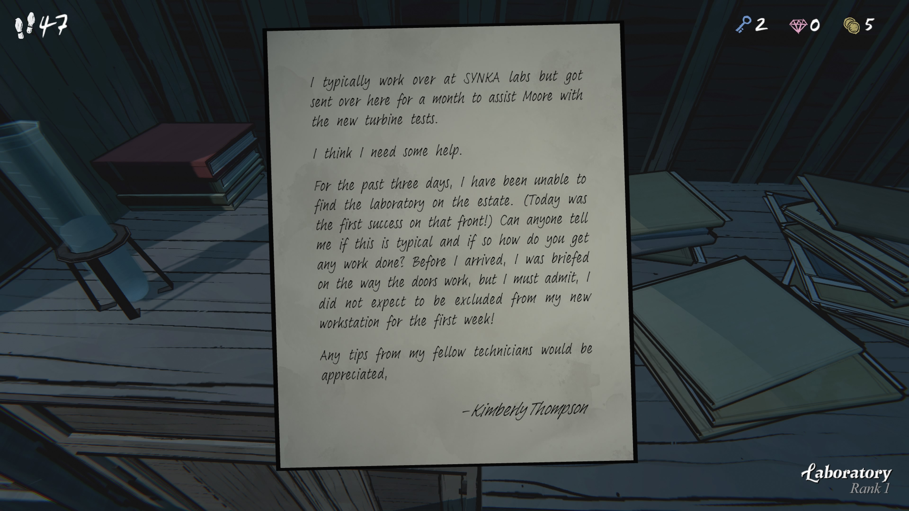
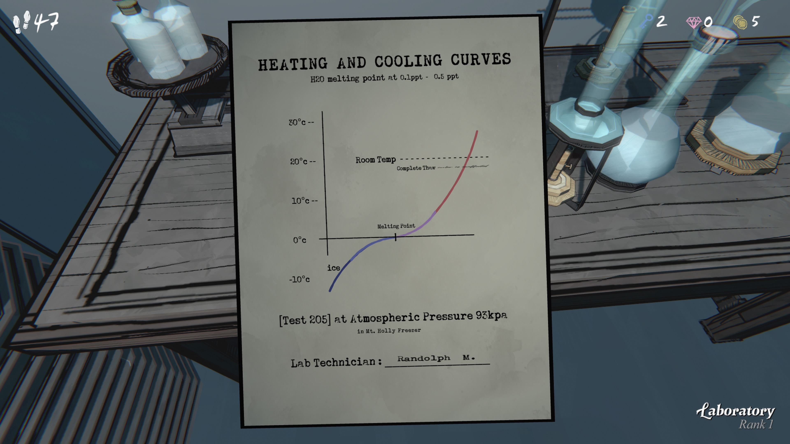
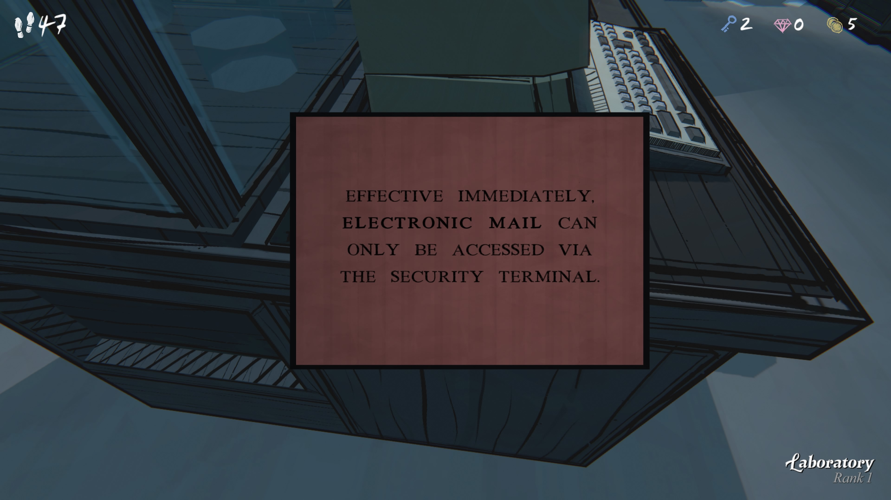
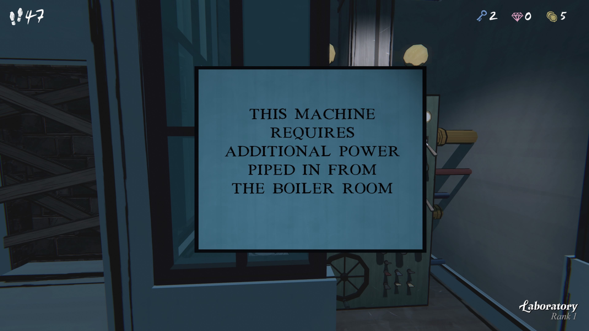
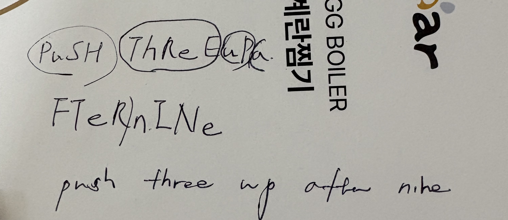

좋아요 👍 각 이미지를 한국어로 자연스럽게 번역해드릴게요.

⸻

🧾 1. 전자메일 접근 공지문

원문:
EFFECTIVE IMMEDIATELY,
ELECTRONIC MAIL CAN ONLY BE ACCESSED VIA THE SECURITY TERMINAL.

번역:
즉시 시행:
전자메일은 이제 **보안 터미널(Security Terminal)**을 통해서만 접근할 수 있습니다.

⸻

🧪 2. 실험 데이터 시트 (HEATING AND COOLING CURVES)

원문:
HEATING AND COOLING CURVES
H2O melting point at 0.1ppt - 0.5ppt
Room Temp — Complete Thaw
[Test 205] at Atmospheric Pressure 93kpa
in Mt. Holly Freezer
Lab Technician: Randolph M.

번역:
가열 및 냉각 곡선
수소(H₂O)의 녹는점 (염도 0.1ppt - 0.5ppt)

실온(Room Temp) — 완전 해동 시점
시험 번호: 205 (대기압 93kPa)
위치: 마운트 홀리 냉동실
실험 담당자: 랜돌프 M.

⸻

📄 3. Kimberly Thompson의 메모

원문:
I typically work over at SYNKA labs but got sent over here for a month to assist Moore with the new turbine tests.
I think I need some help.

For the past three days, I have been unable to find the laboratory on the estate. (Today was the first success on that front!)
Can anyone tell me if this is typical and if so how do you get any work done?
Before I arrived, I was briefed on the way the doors work, but I must admit, I did not expect to be excluded from my new workstation for the first week!

Any tips from my fellow technicians would be appreciated,
— Kimberly Thompson

번역:
저는 보통 SYNKA 연구소에서 일하지만, 이번에는 Moore의 새로운 터빈 실험을 돕기 위해 한 달간 이곳에 파견되었습니다.
그런데 도움이 좀 필요하네요.

지난 3일 동안 이 저택 안에서 **연구실(Laboratory)**을 찾지 못했습니다. (오늘에서야 처음으로 찾았어요!)
혹시 이게 정상인가요? 그렇다면 여러분은 어떻게 일을 하고 계신 건가요?

도착하기 전, 문이 작동하는 방식에 대해 설명을 듣긴 했지만, 새 근무지에 첫 주부터 접근조차 못 하게 될 줄은 몰랐네요!

동료 기술자분들의 조언을 부탁드립니다.
— Kimberly Thompson

⸻

⚙️ 4. 보일러룸 전력 경고문

원문:
THIS MACHINE REQUIRES ADDITIONAL POWER PIPED IN FROM THE BOILER ROOM.

번역:
이 장치는 **보일러룸(Boiler Room)**에서 공급되는 추가 전력이 필요합니다.

⸻

이 문서들은 전반적으로 “연구소 내 단서”들이에요 —
특히 전력 관련 문구(4번)와 보안 터미널(1번)은 퍼즐 진행과 연결된 힌트로 보입니다.

원하신다면, 이 네 문서가 Blue Prince의 Laboratory 퍼즐과 어떤 순서로 연결되는지(즉, 어떤 행동을 유도하는 단서인지) 정리해드릴까요?

