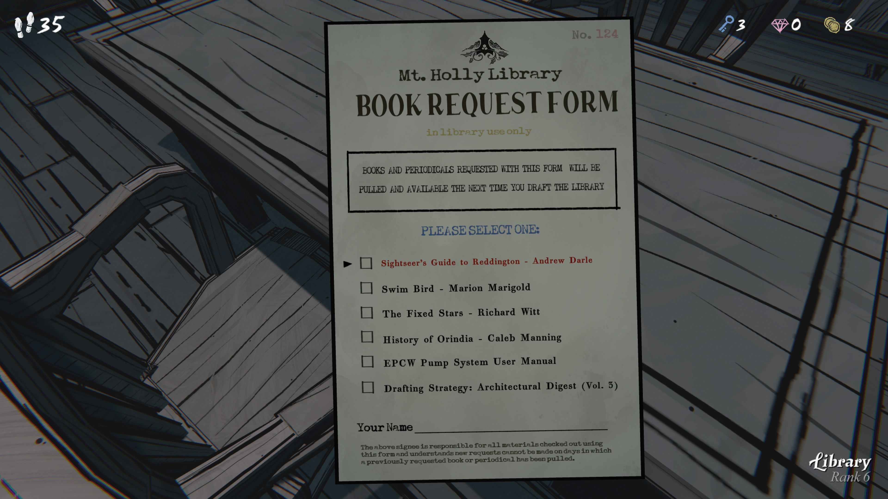
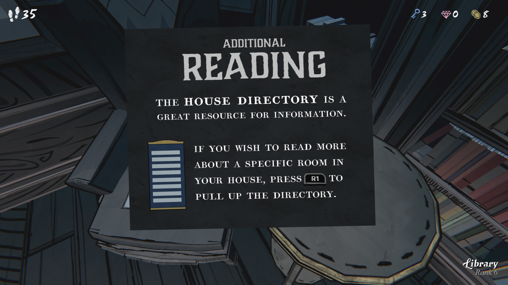

좋아요 😊
두 이미지 모두 Blue Prince 게임 속 도서관(Library) 지역의 문서예요.
각 문구를 자연스럽게 한국어로 번역해드릴게요.

⸻

📄 1. Mt. Holly Library — BOOK REQUEST FORM

(마운트 홀리 도서관 — 도서 신청서)

BOOK REQUEST FORM
(in library use only)

BOOKS AND PERIODICALS REQUESTED WITH THIS FORM WILL BE PULLED AND AVAILABLE THE NEXT TIME YOU DRAFT THE LIBRARY

PLEASE SELECT ONE:
☐ Sightseer’s Guide to Reddington – Andrew Darle
☐ Swim Bird – Marion Marigold
☐ The Fixed Stars – Richard Witt
☐ History of Orindia – Caleb Manning
☐ EPCW Pump System User Manual
☐ Drafting Strategy: Architectural Digest (Vol. 3)

Your Name:

The above signee is responsible for all materials checked out using this form and understands new requests cannot be made on days in which a previously requested book or periodical has been pulled.

⸻

🩵 한국어 번역:

마운트 홀리 도서관 — 도서 신청서
(도서관 내 열람 전용)

이 신청서를 통해 요청한 도서 및 정기간행물은
다음에 도서관을 열람할 때 준비되어 있을 것입니다.

다음 중 하나를 선택하세요:
☐ 레딩턴 여행 안내서 – 앤드루 달레
☐ 헤엄치는 새 – 마리온 메리골드
☐ 고정된 별들 – 리처드 윗
☐ 오린디아의 역사 – 케일럽 매닝
☐ EPCW 펌프 시스템 사용자 매뉴얼
☐ 도면 전략: 건축 다이제스트 (3권)

신청자 이름:

※ 본 서류를 통해 대출된 모든 자료의 책임은 신청자에게 있으며,
이미 요청한 도서가 준비된 날에는 새 요청을 접수할 수 없습니다.

⸻

📘 2. ADDITIONAL READING 안내판

ADDITIONAL READING
THE HOUSE DIRECTORY IS A GREAT RESOURCE FOR INFORMATION.

IF YOU WISH TO READ MORE ABOUT A SPECIFIC ROOM IN YOUR HOUSE, PRESS R1 TO PULL UP THE DIRECTORY.

⸻

🩵 한국어 번역:

추가 읽기 안내

하우스 디렉터리(House Directory) 는
정보를 얻기에 매우 유용한 자료입니다.

집 안의 특정 방에 대해 더 읽어보고 싶다면,
R1 버튼을 눌러 디렉터리를 열어보세요.

⸻

이 두 문서는 “도서관(Library)” 구역의 탐색 가이드 및 힌트 역할을 해요.
	•	첫 번째 양식은 **‘책 제목을 통한 단서 선택 퍼즐’**의 일부로, 특정 책을 선택하면 관련 스토리나 방이 열릴 수 있고
	•	두 번째 표지판은 하우스 디렉터리(House Directory) 시스템(게임 내 도움말 메뉴)을 설명하는 안내문이에요.

원하신다면 “각 책 제목이 게임 내에서 의미하는 바(숨은 단서 또는 코드)” 도 함께 분석해드릴까요?

