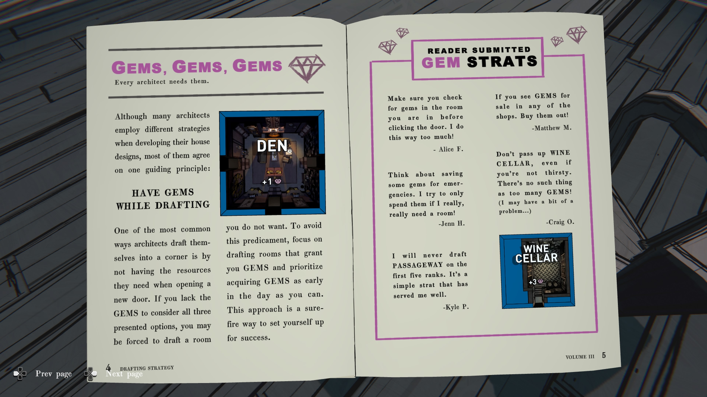

**정기간행물 (PERIODICAL)**

**제목:** Drafting Strategy Vol III

|**날짜**|**대출자**|
|---|---|
|1993년 9월 5일|Kimberly Thompson|
|1993년 11월 13일|Simon P. Jones|

---

**Drafting Strategy**

**VOL III – 6월호 (June Issue)**

**목차 (CONTENTS)**

|**항목**|**페이지**|
|---|---|
|**The Potential Within**by the Editor|2|
|**Gems, Gems, Gems**Gem Strategies and Tips|4|
|**Planning Your House**Estate Layout and Drafting|6|
|**Top Drafting Combos**Five Combos You Won’t Want to Miss|8|
|**Making a Connection**Estate Connectivity|10|
|**Tips and Tricks**Suggestions for Success|12|
|**Word from the Editor**by the Editor|15|

---

**The Potential Within**

_우리 모두는 빈 도면에서 시작한다._

열정적인 젊은 건축가에게 새로운 청사진은 **무한한 가능성의 세계**를 의미합니다.

하얀 캔버스를 바라볼 때, 여러분은 **끝없는 잠재력과 아이디어**를 탐구할 수 있습니다.

그러나 선택지가 너무 많으면, 건축가는 **수많은 결정과 선택**에 압도될 수도 있습니다.

> “복도를 그릴까, 아니면 옷장을 그릴까?”
>
> “집에는 몇 개의 침실이 필요할까?”
>
> “Passageway가 정말로 보석 두 개의 가치가 있을까?”

이런 질문들은 설계 과정에 **복잡성과 스트레스의 층을 더하게** 됩니다.

그래서 더더욱 **단순하고 효과적인 전략**을 세우는 것이 중요합니다.

이 전략들을 활용하면 **집을 설계할 때 성공적인 결과**를 얻을 수 있습니다.

이 **Architectural Digest** 권에서는,
건축가들이 사용할 수 있는 여러 전략들을 제공하고,
그들이 **자신만의 전략을 발전시킬 수 있도록 돕는 것**을 목표로 합니다.

---

**GEMS, GEMS, GEMS**

모든 건축가에게 필요한 것
많은 건축가들이 집을 설계할 때 서로 다른 전략을 사용하지만,

대부분은 한 가지 핵심 원칙에 동의합니다.

**설계할 때는 보석(GEMS)을 확보하라.**

건축가들이 자주 저지르는 가장 흔한 실수 중 하나는
새로운 문을 열 때 필요한 자원이 부족해 코너에 몰리게 되는 것입니다.

세 가지 제시된 선택지를 고려할 **보석이 부족하면**,
원하지 않는 방을 설계할 수밖에 없게 됩니다.

이런 상황을 피하려면,
**보석을 제공하는 방을 우선적으로 설계하고**,
가능한 한 이른 시점에 **보석을 확보하는 것**에 집중하십시오.

이 접근법은 성공을 위한 확실한 준비가 될 것입니다.

---

**독자 제안 GEM 전략 (Reader Submitted GEM Strats)**

- **“방을 나가기 전에 반드시 그 방의 보석을 확인하세요. 저도 너무 자주 깜빡합니다!”**
    
    — _Alice F._
    
- **“비상 상황을 대비해 보석을 조금은 아껴 두세요. 정말 필요한 방이 있을 때만 쓰려고 합니다.”**
    
    — _Jenn H._
    
- **“상점에서 보석이 판매 중이라면 무조건 사세요!”**
    
    — _Matthew M._
    
- **“목마르지 않더라도 ‘와인 저장고(WINE CELLAR)’는 절대 놓치지 마세요. 보석은 많을수록 좋습니다! (저에게는 약간의 문제가 있을지도 모릅니다…)”**
    
    — _Craig O._
    
- **“저는 처음 다섯 단계에서는 절대 ‘PASSAGEWAY’를 설계하지 않습니다. 저에게 아주 잘 통하는 단순한 전략입니다.”**
    
    — _Kyle P._

---

**PLANNING YOUR HOUSE**

부지(estate) 배치와 설계

집을 설계할 때는, 매일 **탄탄한 기반에서 시작하는 것**이 중요합니다.

**초기 단계의 방부터 설계하라 (Draft Early Ranks First)**

초보자들이 자주 저지르는 실수는 북쪽으로 일직선으로만 설계하면서
초반 구역의 **열지 않은 문들**을 무시하는 것입니다.

이런 건축가들은 상위 단계로 올라갈 때
**열쇠나 보석이 부족해 더 이상 진행할 수 없다는 것**을 깨닫습니다.

그들은 종종 처음에 지나쳤던 하위 단계의 문으로 돌아가
그제서야 큰 도움이 될 방이나 아이템을 발견하곤 합니다.

오른쪽 그림이 보여주듯,
집 안을 구불구불 통과하는 경로라도
직선이 아니면 구조적으로 약해질 수 있습니다.

특히 **뒤에 많은 미개방 문을 남겨둔 경우** 그렇습니다.

따라서 매일 **초기 단계의 방들로 견고한 기반을 마련한 뒤**
집 안쪽으로 설계를 진행하면,
더 깊은 구역으로 들어갈수록 **성공 확률이 훨씬 높아집니다.**

---

**TOP DRAFTING COMBOS**

놓치고 싶지 않은 다섯 가지 조합

집을 설계할 때 고려해야 할 또 하나의 요소는 **방을 설계하는 순서**입니다.

예를 들어, **CLOISTER(수도원)** 를 **TERRACE(테라스)** 보다 먼저 설계하면,
보석 3개를 잃게 됩니다.

하지만 **반대 순서**로 설계하면, CLOISTER는 **무료**로 지을 수 있습니다.

이처럼 **시너지 효과가 있는 방의 조합을 파악하는 것**이 첫걸음입니다.

그러나 **최적의 순서**로 설계하는 것은 추가적인 이점을 주며, 성공 확률을 크게 높여 줍니다.

**TERRACE**

> 초록색 방은 설계 비용이 들지 않습니다.

**CLOISTER**

> 보석 비용: 💎💎💎

---

**OTHER FLOORPLAN COMBOS**

기타 평면 설계 조합

**FOYER(현관)** 를 **GREAT HALL(대홀)** 보다 먼저 설계하면
그 많은 문들이 모두 잠금 해제됩니다.

**NURSERY(유아실)** 다음에 **BUNK ROOM(2층 침대 방)** 을 설계하면
침실 트리거가 두 번 적용되어 **10걸음의 추가 이동**을 얻습니다.

**OFFICE(사무실)** 를 설계한 후 **CONFERENCE ROOM(회의실)** 을 설계하면
금화 수집을 위해 되돌아다닐 필요가 없습니다.

**ATTIC(다락방)** 은
아이템이 많을수록, **WORKSHOP(작업실)** 에서
새로운 장치를 만들 확률이 높아집니다.

---

**MAKING A CONNECTION**

부지(estate) 연결성

두 개의 방 조합만이 시너지를 내는 것은 아닙니다.

일부 방은 **특정 다른 방과 함께 설계할 때만** 작동합니다.

이 방들은 **단독으로는 약하지만**,
**연결성이 발견되면 매우 유용해질 수 있습니다.**

**UTILITY CLOSET(유틸리티 수납실)** 은 그 좋은 예입니다.

이 방은 혼자서는 아무 일도 하지 않지만,
집 안의 다른 방들을 **강화하거나(또는 약화시키거나)** 할 수 있습니다.

- **GARAGE(차고)** – 차고 문에 전원을 공급하고 서쪽 통로 접근을 허용합니다.
    
- **DARKROOM(암실)** – 퓨즈가 나간 후 불을 다시 켭니다.
    
- **GYMNASIUM(체육관)** – 발판 손실을 막기 위해 조명을 유지합니다.
    

---

**OTHER EXAMPLES of Connectivity**

연결성의 다른 예시들

가장 간단한 예로, **HER LADYSHIP’S CHAMBER(귀부인의 방)** 은
**Lady Epsen의 BOUDOIR(부도아)** 와 **WALK-IN CLOSET(드레스룸)** 과
시너지를 형성합니다.

**BOILER ROOM(보일러실)** 은
증기 에너지를 이용해 집의 여러 방으로 연결되는 덕트를 이어 줍니다.

**LABORATORY(연구실)**, **GARAGE(차고)**, **LAUNDRY ROOM(세탁실)**,
**FURNACE(화로실)**, **PUMP ROOM(펌프실)** 등에서 이 증기 동력을 활용합니다.

**PUMP ROOM(펌프실)** 은 저택의 **물 흐름을 제어**하며,x
**POOL(수영장)**, **AQUARIUM(수족관)**, **GREENHOUSE(온실)**,
**KITCHEN(부엌)** 등 본관 외부의 여러 시설과 **직접적으로 상호작용**할 수 있습니다.

---

**TIPS & TRICKS**

팁과 요령

- **KITCHEN(부엌)** 에서는 그날 **DINING ROOM(식당)** 에서 어떤 요리가 제공되는지 확인할 수 있습니다. 
  이를 통해 특정 방을 설계하여 **식사를 더욱 맛있게 만들 기회**를 얻을 수 있습니다.
    
- **BUNK ROOM(이층 침대방)** 은 두 개의 침실로 계산될 뿐 아니라, 두 개의 방으로도 계산됩니다. 
  이는 **MASTER BEDROOM(안방)** 에서 부여되는 이동 거리, **TOMB(무덤)** 에서 뿌려지는 금화의 양, 
  그리고 **SERVANT’S QUARTERS(하인들의 방)** 에서 발견되는 열쇠의 수를 증가시킵니다.
    
- **BILLIARD ROOM(당구실)** 이나 **PARLOR(응접실)** 의 퍼즐을 해결할 때마다 다음에 그 방을 설계할 때의 **난이도가 약간 상승**합니다.
    
- 방을 처음 탐험했을 때 **아이템이 없었다고 해서**, 다음 번 설계 시에도 **없으리란 보장은 없습니다.**
    
- **FREEZER(냉동실)** 을 설계한 다음 날에는 자동으로 **재냉각 주기(cooldown refreezing cycle)** 에 들어가며, 
  24시간 동안은 다시 설계할 수 없습니다.
    
- 특정 방에서 막히거나, 무엇을 해야 할지 모르겠다면, **그냥 넘어가는 것이 현명할 때도 있습니다.**
  게임의 여러 도전 과제는 다양한 해결책이 존재하며, 나중에 도움이 될 **힌트나 정보 조각**을 발견할 확률이 높습니다.
    
- **확신이 서지 않을 때는, 이전에 본 적 없는 방을 설계하십시오.**
  방이 별로 유용해 보이지 않더라도, 그 안에는 **여정에 도움이 될 단서나 정보**가 숨어 있을 수 있습니다.

---

**WORD FROM THE EDITOR**

편집자의 말

이번 호에서는 독자 여러분께 다양한 전략과 팁을 제시했지만,
저희 **Architectural Digest**는 예비 건축가 여러분이 **성공의 정해진 설계도란 존재하지 않는다**는 사실을 알기를 바랍니다.

자신만의 길을 개척하고 **독창적인 전략을 세우는 것**이야말로 가장 좋은 결과를 가져온다고 믿습니다.

각 건축가는 자신만의 **즐겨 찾는 방**이 있고, 각 설계자는 자신만의 **도구**를 갖고 있습니다.

따라서 모든 플레이어는 자신만의 **플레이 스타일과 비밀스러운 요령**을 발견하게 되며, 그것을 세상과 공유하거나, 혹은 자신만의 비밀로 간직할 것입니다.

어떤 전략을 사용하시든, 저희는 여러분이 꿈꾸는 집을 완성하기를 그리고 그 과정에서 **행운이 함께하기를 진심으로 바랍니다.**
