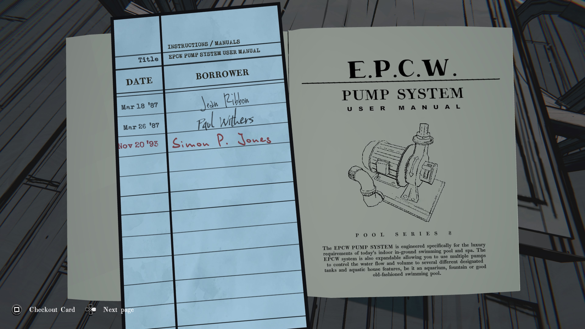
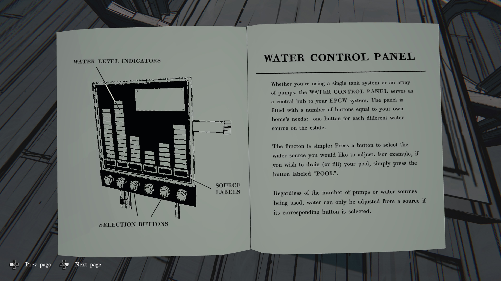
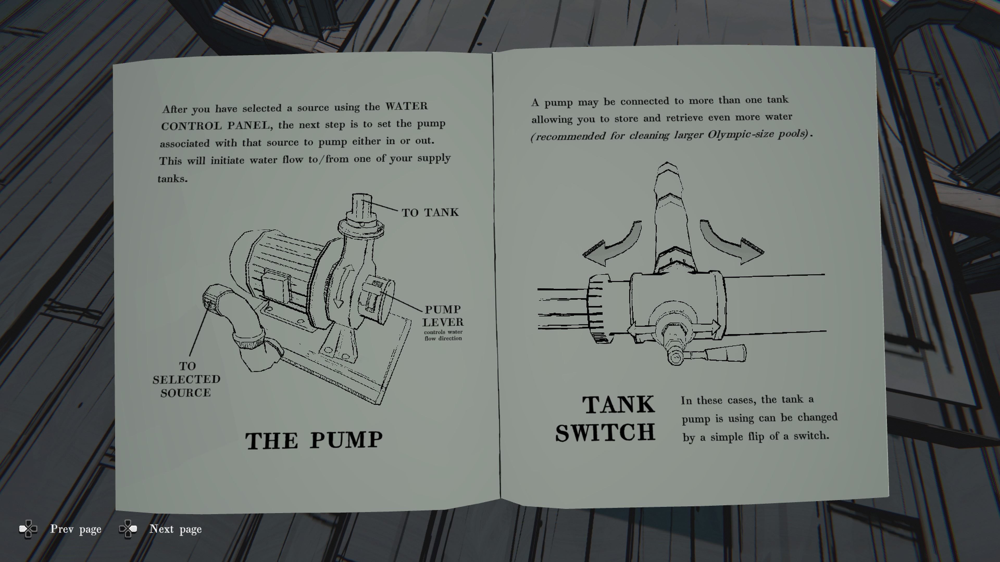
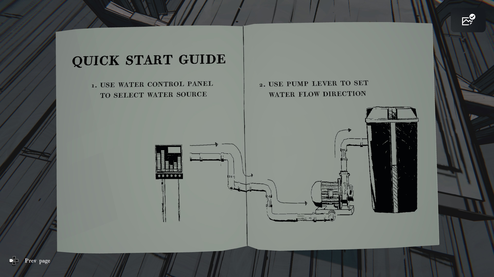

---

### **📘 EPCW PUMP SYSTEM USER MANUAL**

  

#### **EPCW 펌프 시스템 사용자 설명서**

EPCW 펌프 시스템은 고급 실내 수영장 및 스파 환경을 위해 설계되었습니다.

또한 여러 펌프와 탱크를 연결해 물의 흐름과 양을 제어할 수 있도록 확장 가능합니다.

수족관, 분수, 전통식 수영장에도 사용 가능합니다.

---

### **📖 대출 기록 (도서 카드)**

|**날짜**|**대출자**|
|---|---|
|1987년 3월 18일|Jean Ribbon|
|1987년 3월 26일|Paul Withers|
|1993년 11월 20일|Simon P. Jones|

---

### **📘 WATER CONTROL PANEL**

  

#### **물 제어 패널**

집에서 단일 탱크 시스템이든 여러 펌프 시스템이든, **물 제어 패널**은 EPCW 시스템의 중앙 허브 역할을 합니다.

패널에는 각기 다른 수원(source)을 선택할 수 있도록 여러 개의 버튼이 있습니다.

  

기능은 간단합니다:

원하는 수원을 선택하려면 버튼을 누르십시오.

예: 수영장을 비우거나(또는 채우려면) **POOL** 버튼을 누르십시오.

  

펌프나 수원이 여러 개여도, **선택된 버튼의 수원만 조절할 수 있습니다.**

---

### **📘 THE PUMP / TANK SWITCH**

  

#### **펌프 사용 방법**

물 제어 패널에서 수원을 선택한 뒤,

해당 수원에 연결된 펌프를 **유입(in) 또는 유출(out)** 상태로 설정하십시오.

이 설정으로 물이 탱크로 들어가거나 나오게 됩니다.

  

#### **탱크 전환 스위치**

펌프는 여러 탱크와 연결될 수 있으며,

스위치를 한번 돌려서 사용할 탱크를 바꿀 수 있습니다.

(대형 수영장 시스템 권장)

---

### **📘 QUICK START GUIDE**

  

#### **빠른 시작 가이드**

1. 물 제어 패널에서 수원을 선택하십시오.
    
2. 펌프 레버로 물 흐름 방향을 설정하십시오.
    
