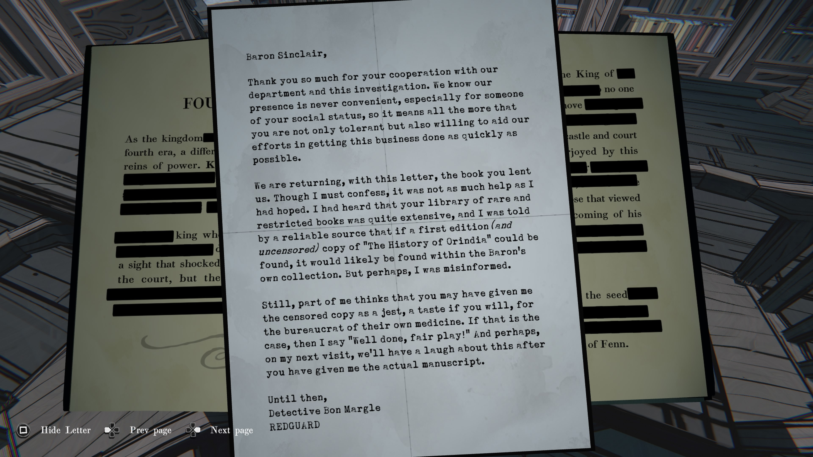

**싱클레어 남작께,**

부서와 이번 조사에 협조해 주셔서 감사합니다.
귀하 같은 신분을 가진 분께 저희가 불쾌한 방문을 드리는 일이 편할 리 없다는 것을 잘 알고 있습니다.
그렇기에 이렇게 인내해 주시고, 또 가능한 한 빠르게 이 일을 처리하려는 저희의 노력에 기꺼이 함께해 주신 점에 더욱 감사드립니다.

이 편지와 함께, 귀하께서 빌려주신 책을 돌려드립니다.
정직히 말씀드리자면, 기대만큼 많은 도움이 되지는 않았습니다.
귀하의 희귀 서적과 제한 도서 컬렉션이 매우 방대하다는 이야기를 들었고,
또 신뢰할 만한 정보에 따르면
만약 『오린디아의 역사』 초판본(검열되지 않은 버전)이 존재한다면
그것은 바로 남작님의 개인 소장품 안에 있을 것이라 하였습니다.
그러나 제가 오해를 했던 것일 수도 있겠지요.

그럼에도, 한편으로는 남작님께서 일부러 검열본을 주신 게 아닌가 생각하게 됩니다.
일종의 장난이자, 관료들에게 자기 약을 맛보게 해주는 셈으로 말입니다.
만약 그렇다면, 저는 “잘하셨습니다, 공정한 대응입니다!”라고 말씀드리고 싶습니다.
그리고 다음 방문 때에는, 진짜 원고를 저에게 보여주신 뒤
이 일로 함께 웃을 수 있기를 바랍니다.

그때까지,

수사관 본 마글

레드가드
