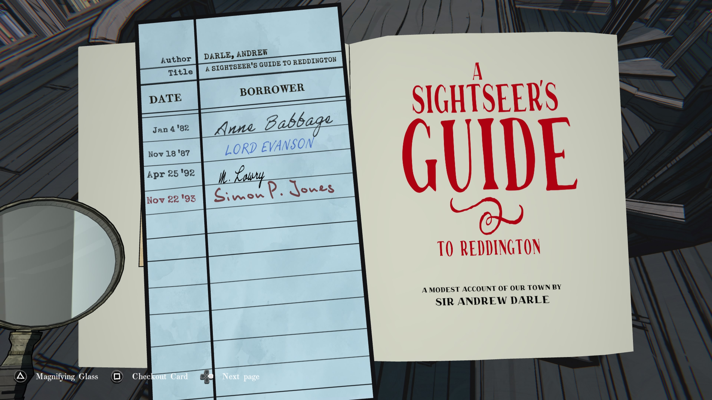
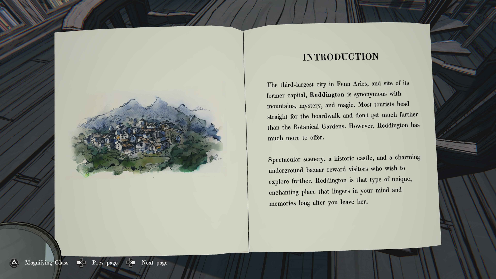
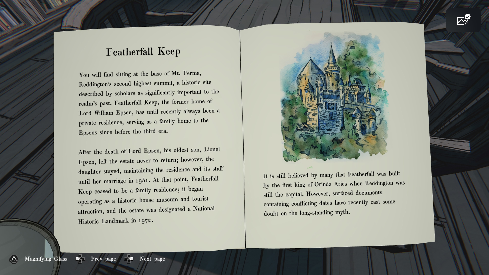
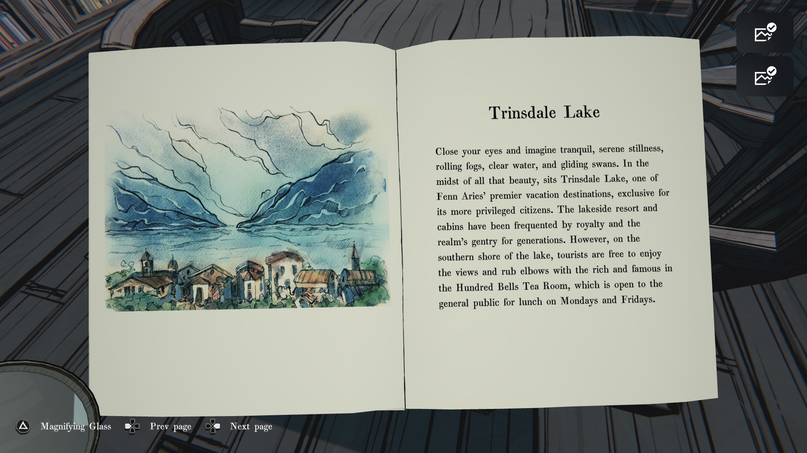
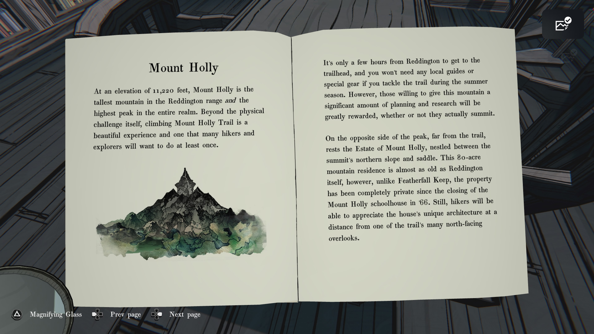
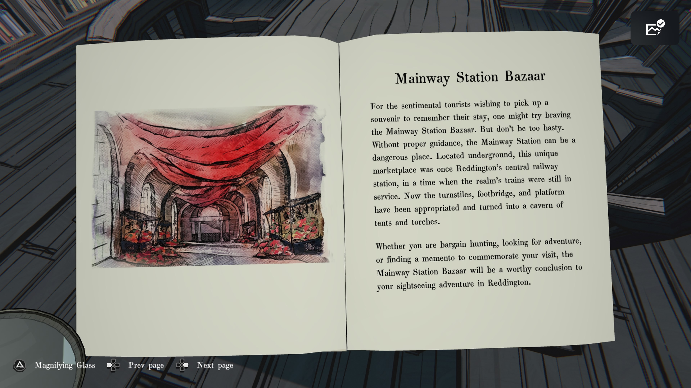
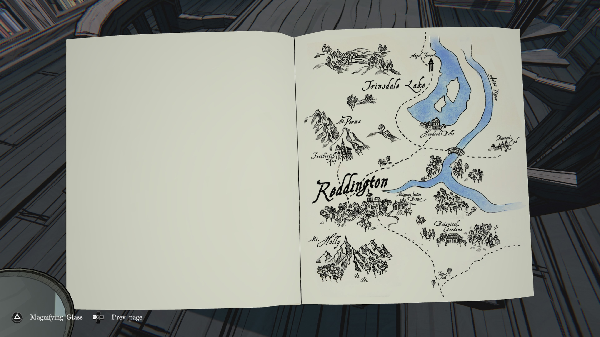

### **여행자의 레딩턴 안내서 (A Sightseer’s Guide to Reddington)**

  

우리 마을에 대한 소박한 기록

저자: **앤드루 달 경(Sir Andrew Darle)**

  

(체크아웃 기록은 번역 생략: 이름 및 날짜 표기)

### **소개 (INTRODUCTION)**

  

펜 아리즈(Fenn Aries)의 세 번째로 큰 도시이자 이전 수도였던 레딩턴(Reddington)은

산, 신비, 그리고 마법과 동의어입니다.

대부분의 관광객들은 산책로로 직행하며 식물원 이상의 곳까지 가지 않습니다.

하지만 레딩턴에는 더 많은 것들이 있습니다.

  

눈부신 경치, 역사적인 성, 매력적인 지하 시장은

더 탐험하고자 하는 방문객들에게 보상을 선사합니다.

레딩턴은 독특하고 매혹적인 장소로, 떠난 뒤에도 마음과 기억 속에 오래 남습니다.

### **식물원 (The Botanical Gardens)**

  

레딩턴에서 가장 인기 있는 명소이자 틀림없는 인파 몰림 장소인 식물원은

아제란(Ajeran) 캐노피 하우스와 영묘, 꽃잎이 덮인 산책로,

그리고 경이로운 수많은 종류의 꽃들로 인해 현지 주민과 관광객 모두에게 사랑받고 있습니다.

이것이 바로 봄이 레딩턴에서 가장 붐비는 시즌인 이유입니다.

### **Featherfall Keep**

  

**Featherfall Keep**

  

Mt. Perma 기슭에 위치한 Reddington의 두 번째로 높은 봉우리 아래, 역사적으로 왕국의 과거에 중요한 장소로 학자들에 의해 여겨지는 곳이 있다. Featherfall Keep은 전 Lord William Espen의 옛 집으로, 최근까지도 Espen 가문의 사유지로, 3대가 시작되기 전부터 가족의 거주지로 사용되어 왔다.

  

Lord Espen이 사망한 이후, 그의 장남 Lionel Espen은 영지를 떠났고 다시 돌아오지 않았다. 그러나 그의 딸은 1951년 결혼할 때까지 저택과 직원들을 유지하며 머물렀다. 그 시점 이후, Featherfall Keep은 가족의 거주지가 아니라 역사적인 주택 박물관 겸 관광지로 운영되기 시작했으며, 1972년에 국가 사적지로 지정되었다.

  

많은 사람들은 Featherfall Keep이 Reddington이 여전히 수도였던 시절 Orinda Aries의 첫 번째 왕에 의해 지어졌다고 믿고 있다. 그러나 최근에 발견된, 서로 충돌하는 날짜를 포함한 문서들로 인해 이 오래된 전설에 대한 의문이 제기되고 있다.

### **Trinsdale Lake**

  

**Trinsdale Lake**

  

눈을 감고 고요함을 떠올려 보라. 고요한 정적, 흘러가는 안개, 맑은 물, 미끄러지듯 움직이는 백조들. 그 모든 아름다움의 한가운데, Trinsdale Lake가 있다. 이것은 Fenn Aries의 최고급 휴양지 중 하나로, 더 특권 있는 시민들만을 위한 장소이다. 호숫가 리조트와 오두막은 왕족과 이 지역의 상류층이 여러 세대에 걸쳐 이용해 왔다. 그러나 호수 남쪽 기슭에서는 관광객들도 풍경을 즐기고 유명 인사 및 부유층과 어울릴 수 있다. 또한 Hundred Bells Tea Room이 있어 월요일과 금요일 점심 시간에는 일반인도 이용할 수 있다.

### **Mount Holly**

  

**Mount Holly**

  

해발 11,220피트의 Mount Holly는 Reddington 산맥에서 가장 높은 산이며, 왕국 전체에서도 가장 높은 봉우리이다. 신체적인 도전 그 자체를 넘어, Mount Holly 트레일을 등반하는 것은 매우 아름다운 경험이며 많은 등산객과 탐험가들이 최소한 한 번은 해보고 싶어하는 일이다.

  

Reddington에서 트레일 입구까지는 몇 시간만 가면 되며, 여름철에 트레일을 이용할 경우 특별한 장비나 현지 안내자가 필요하지 않다. 그러나 이 산을 오르는 데 상당한 계획과 조사를 하는 사람들은 정상에 오르든 그렇지 않든 큰 보상을 느끼게 될 것이다.

  

봉우리의 반대편, 트레일부터 멀리 떨어진 곳에는 Estate of Mount Holly가 있다. 북쪽 비탈과 능선 사이에 자리한 이 80에이커 규모의 산악 저택은 Reddington만큼 오래된 곳이다. 그러나 Featherfall Keep과는 달리, Mount Holly 학교가 1966년에 문을 닫은 이후 이곳은 완전히 사유지로 남아 있다. 그래도 등산객들은 트레일의 북쪽 전망대들 중 하나에서 저택의 독특한 건축 양식을 멀리서 감상할 수 있을 것이다.

**Mainway Station Bazaar 페이지**

  

**Mainway Station Bazaar**

  

추억을 남길 기념품을 사고 싶어 하는 감상적인 관광객이라면, 메인웨이 역 시장을 시도해 볼 만합니다. 그러나 너무 성급하게 굴지 마십시오. 적절한 안내가 없다면 메인웨이 역은 위험한 장소가 될 수 있습니다. 지하에 위치한 이 독특한 시장은 한때 레딩턴의 중앙 철도역이었으며, 왕국의 기차가 여전히 운행되던 시절이었습니다. 지금은 개찰구, 보도교, 승강장 등이 장악되어 천막과 횃불이 있는 동굴 같은 장소로 바뀌었습니다.

  

흥정을 하거나 모험을 찾거나, 방문을 기념할 기념품을 찾고 있든, 메인웨이 역 시장은 레딩턴에서의 관광 모험을 멋지게 마무리할 만한 곳이 될 것입니다.

**지도 페이지**

- Trinsdale Lake → 트린스데일 호수
    
- Angel’s Tower → 엔젤의 탑
    
- Harper’s River → 하퍼 강
    
- Hunter’s Falls → 헌터 폭포
    
- Reddington → 레딩턴
    
- Mt. Perma → 퍼마 산
    
- Featherfall Keep → 페더폴 요새
    
- Mainway Station Bazaar → 메인웨이 역 시장
    
- Botanical Gardens → 식물원
    
- Mt. Holly → 홀리 산
    
- Barrow’s End → 배로우스 엔드
    
- Tunnel → 터널
    

---

