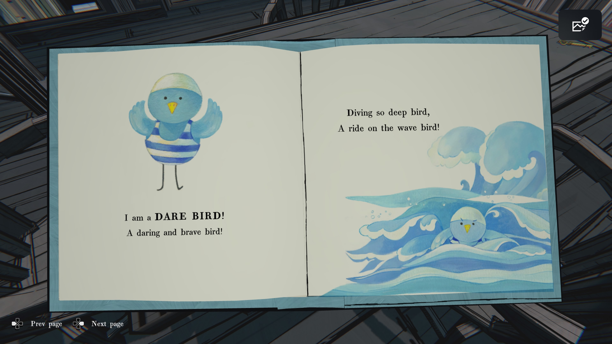
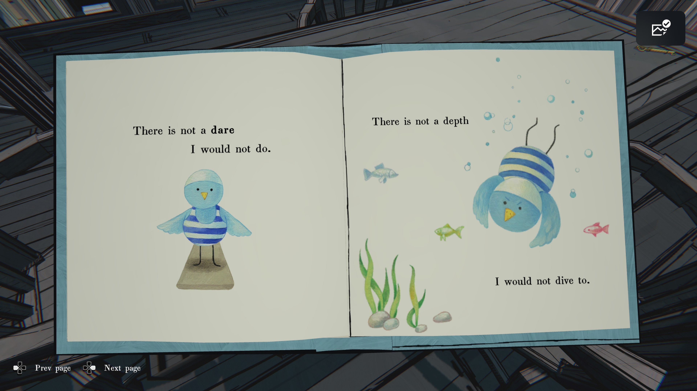
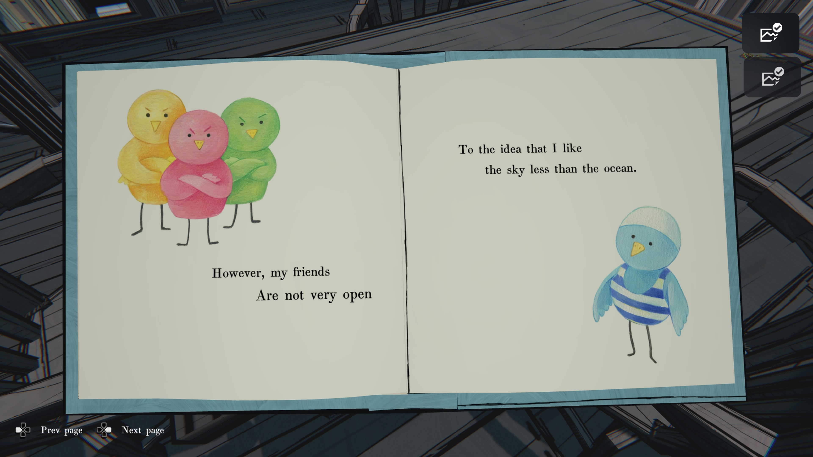
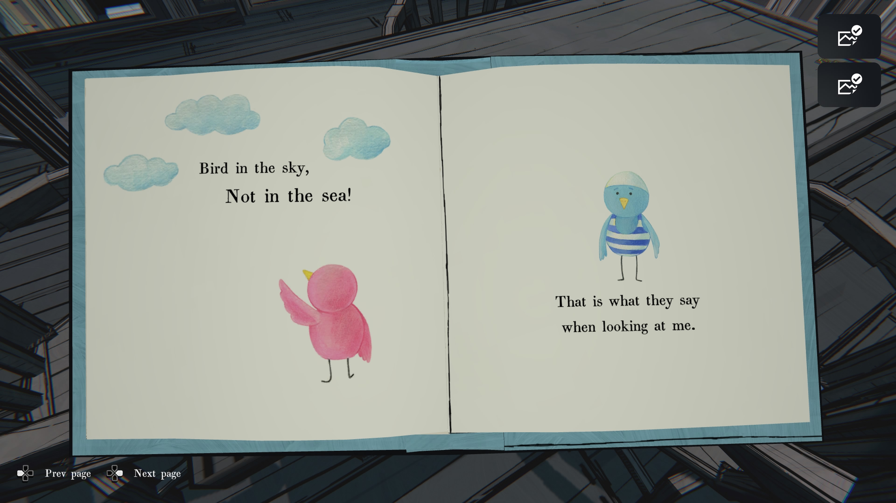
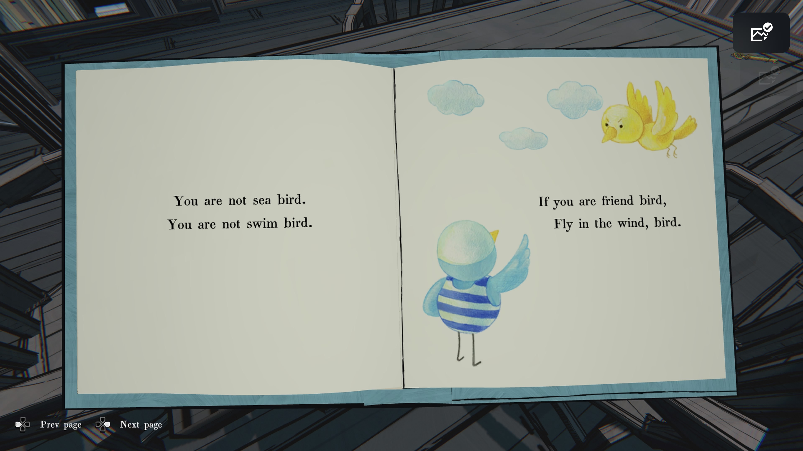
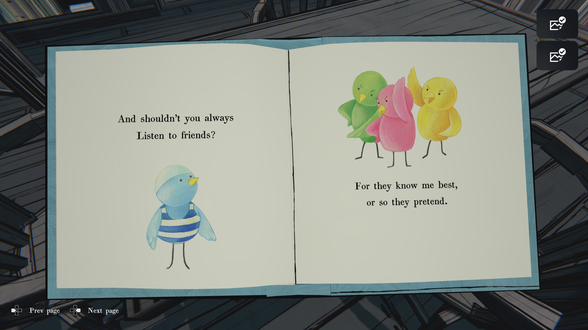
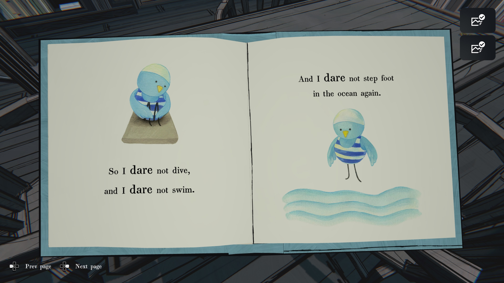
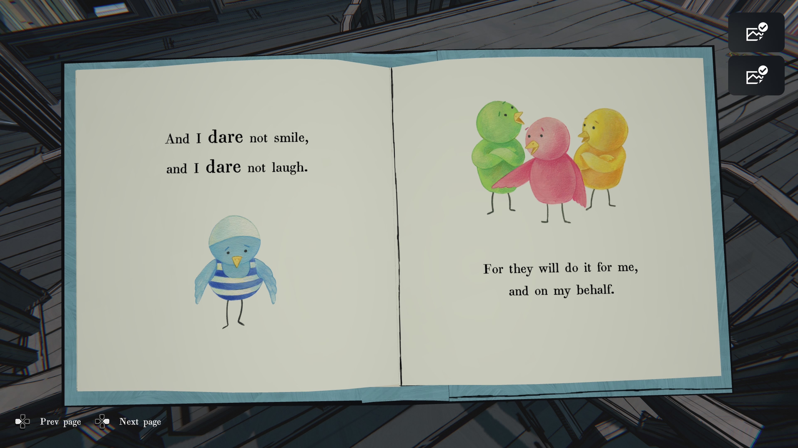
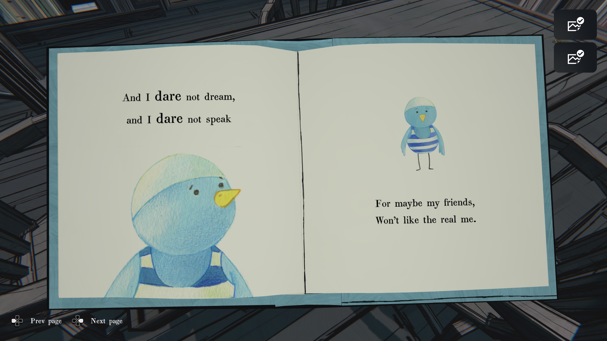
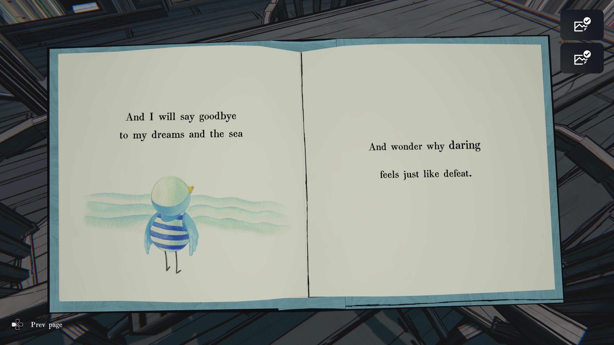

나는 ‘용기의 새’!

대담하고 용감한 새!

깊이 잠수도 하고,

파도도 타는 새!

내가 마다하지 않을

도전은 없다.

내가 잠수하지 않을

깊이도 없다.

하지만, 내 친구들은

마음이 넓지 않다

내가 하늘보다

바다를 더 좋아한다는 생각에 대해.

새는 하늘에 있어야지,

바다에 있지 않아!

그게 그들이

나를 보며 하는 말이다.

너는 바다새가 아니야.

너는 수영하는 새가 아니야.

정말 친구라면,

바람 속을 날아라, 새야.

그리고 너는 항상

친구들 말을 들어야 하지 않나?

왜냐하면 친구들은

나를 가장 잘 안다고,

적어도 그렇게 _가장(假裝)_ 하고 있으니까.

그래서 나는 잠수할 용기도 없고,

수영할 용기도 없다.

그리고 다시는

바다에 발을 들이지 못한다.

나는 웃을 용기도 없고,

나는 웃음 짓는 용기도 없다.

왜냐하면 친구들이

내 대신 웃어줄 테니까.

그래서 나는 꿈꾸지 못하고,

말하지도 못한다.

왜냐하면, 어쩌면 친구들이

진짜 나를 좋아하지 않을 수도 있으니까.

나는 나의 꿈과 바다에게

작별을 고할 것이다

그리고 왜 용기를 낸다는 것이

패배처럼 느껴지는지 의아해할 것이다.
