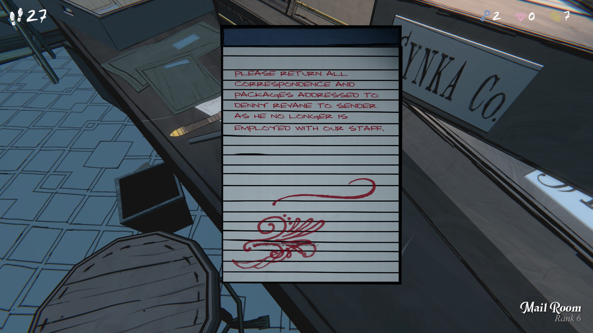
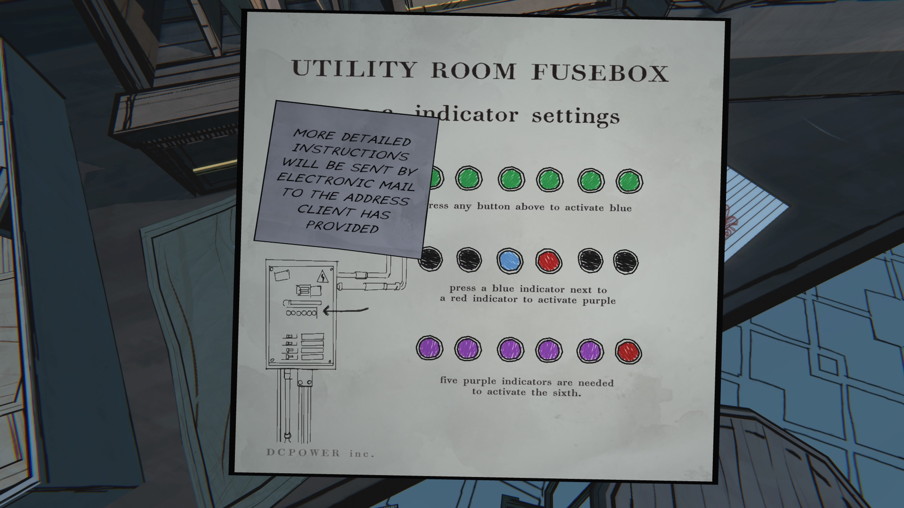
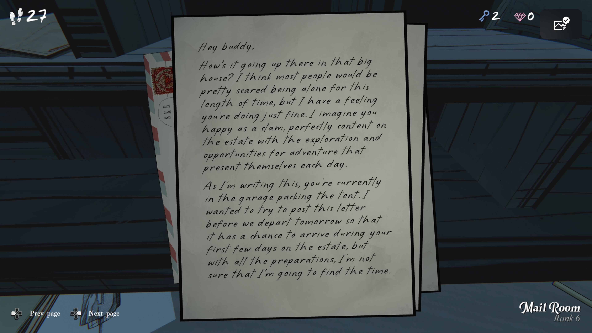
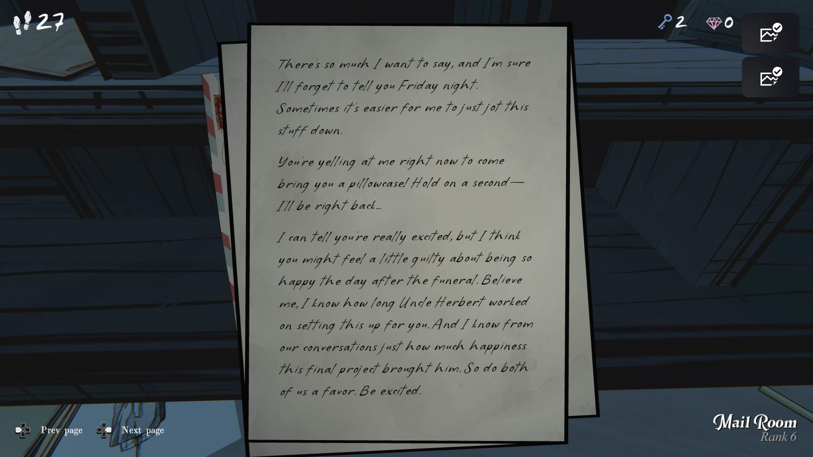
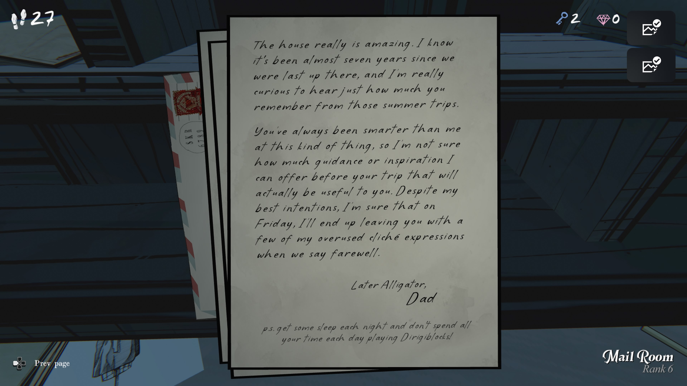

직원 해고 안내문

PLEASE RETURN ALL CORRESPONDENCE AND PACKAGES ADDRESSED TO DENNY REVANE TO SENDER 
AS HE NO LONGER IS EMPLOYED WITH OUR STAFF.

번역:

데니 리베인(Denny Revane) 앞으로 온 모든 우편물과 소포는
보낸 사람에게 반송해 주십시오.
그는 더 이상 우리 직원이 아닙니다.

⸻

전기실 퓨즈박스 설명서

번역:

전기실 퓨즈박스 — 표시등 설정

	•	위쪽의 아무 버튼이나 누르면 파란 불빛이 켜집니다.
	•	파란 불이 켜진 옆의 빨간 불을 누르면 보라색 불이 켜집니다.
	•	보라색 표시등 5개가 켜져야 여섯 번째 불이 작동합니다.

붙임 메모:

“더 자세한 사용 설명서는
고객이 제공한 이메일 주소로 전송됩니다.”

⸻

편지 1

번역:

얘야,
그 큰 집에서 잘 지내고 있니? 대부분의 사람들은 그렇게 오랜 시간 혼자 있으면 무서울 텐데,
넌 잘 지내고 있을 것 같아.
너는 늘 그렇듯 즐겁고, 그 저택에서 매일 새로운 모험과 탐험의 기회를 만끽하고 있을 거라 생각해.

이 편지를 쓰는 지금, 너는 차고에서 텐트를 꾸리고 있겠지.
내일 우리가 떠나기 전에 이 편지를 보내려고 하는데,
준비할 게 너무 많아서 시간이 될지 모르겠구나.

⸻

편지 2

번역:

하고 싶은 말이 정말 많지만,
금요일 밤엔 또 잊어버릴 것 같아서 이렇게 적어둔다.

지금 네가 나한테 베갯잇 가져오라고 소리치고 있겠지!
잠깐만 기다려 — 금방 간다…

넌 지금 정말 들떠 있겠지만,
아마도 장례식 바로 다음 날이라 조금은 죄책감이 들지도 모르겠구나.
하지만 믿어다오,
허버트 삼촌이 이걸 준비하느라 얼마나 긴 시간을 보냈는지 난 알고 있어.

그리고 우리 대화 속에서
그가 이 마지막 프로젝트에서 얼마나 행복해했는지도 알고 있다.
그러니 우리 둘을 위해 부탁 하나만 하자 — 기뻐해라.

⸻

편지 3

번역:

그 집은 정말 놀라워.
우리가 마지막으로 거기에 갔던 게 벌써 7년 전이라니 믿기지 않는다.
그때의 여름 여행을 네가 얼마나 기억하고 있을지 궁금하구나.

이런 일엔 항상 네가 나보다 똑똑했지.
그래서 이번 여행 전에 내가 줄 수 있는 조언이 얼마나 도움이 될지는 모르겠다.

내 의도와는 다르게, 아마 이번 금요일엔
또 뻔한 아빠식 인사말 몇 마디만 남기고 헤어지겠지.

“나중에 보자, 악어야!”

— 아빠

P.S. 밤엔 푹 자고, 하루 종일 ‘디리지블록(Dirigiblocks)’만 하지 말렴!

