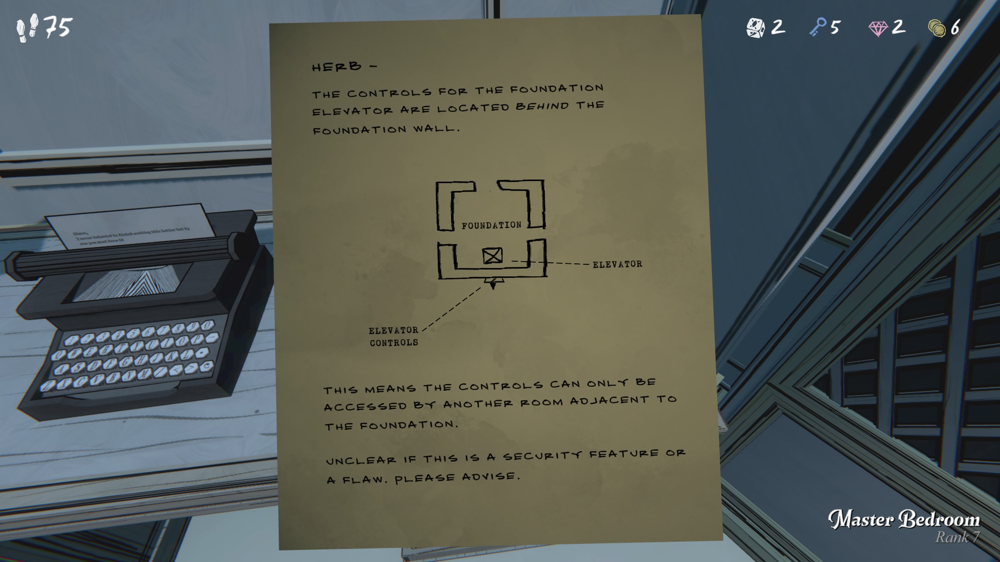
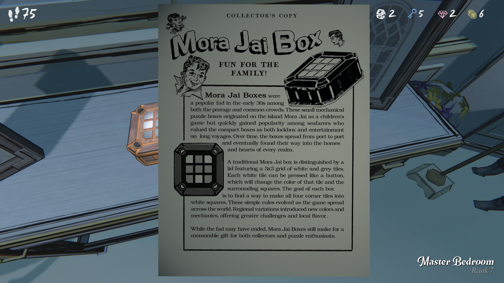

모라 자이 박스

가족 모두의 즐거움!

모라 자이 박스는 1930년대 초반, 
귀족과 일반인 모두 사이에서 유행했던 기계 퍼즐 장난감이다.
원래는 모라 자이 섬에서 아이들을 위한 장난감으로 만들어졌으나, 
곧 바다를 건너 인기를 끌게 되었다. 
긴 항해에서 자그마한 퍼즐 상자는 금고이자 오락거리로 사랑받았고, 
항구에서 항구로 퍼지며 결국 각 왕국 가정의 사랑받는 장난감이 되었다.

전통적인 모라 자이 박스는 뚜껑에 3×3 격자로 흰색과 회색 타일이 배열되어 있으며,
각 타일은 버튼처럼 눌러 자기 색과 주변 타일의 색을 바꾸는 방식이다.
목표는 모든 타일을 흰색으로 만드는 것. 
규칙은 간단하지만, 지역마다 새로운 색과 기믹이 추가되면서 난이도와 재미가 높아졌다.

지금은 유행이 지나갔지만, 
모라 자이 박스는 여전히 수집가와 퍼즐 애호가들에게 사랑받는 선물이다.
