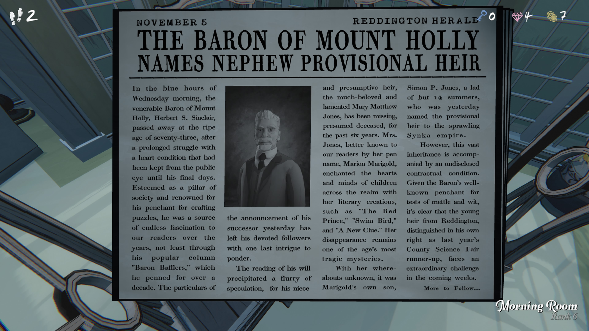

**마운트 홀리의 남작, 조카를 임시 상속인으로 지명**

**11월 5일 — 레딩턴 헤럴드**

수요일 새벽의 푸른 시간대에,
마운트 홀리의 존경받는 남작 **허버트 S. 싱클레어**가
73세의 나이로 세상을 떠났다.

오랜 기간 이어진 심장질환과 싸우다 마지막까지 대중의 눈을 피해오다
생을 마감했다.

그는 사회의 기둥이었고,
퍼즐 제작을 즐기는 것으로 유명했다.
10년 이상 연재된 인기 칼럼
**“Baron Bafflers(남작의 난제들)”**을 통해
독자들에게 끝없는 흥미를 선사했다.

어제 발표된 후계자 소식은
그의 열렬한 추종자들에게
마지막 수수께끼를 남겼다.

유언 집행 소식은 많은 추측을 불러일으켰다.
남작의 조카딸이자 추정 상속인인 **메리 매튜 존스**가
지난 6년 동안 실종 상태이며
사망한 것으로 추정되기 때문이다.

독자들에게는 **마리온 메리고울드**라는 필명으로 알려진 그녀는
“붉은 왕자”, “스윔버드”, “새로운 단서” 같은 작품으로
아이들의 마음을 사로잡은 유명 작가였다.

그녀의 실종은 시대의 가장 비극적인 미스터리 중 하나로 남아 있다.

그녀의 행방이 알려지지 않은 가운데,
메리고울드의 아들 **사이먼 P. 존스**,
14세 소년이 어제
거대한 **싱카 제국**의 임시 상속인으로 지명되었다.

그러나 이 광대한 유산은
공개되지 않은 계약 조건이 동반된 것으로 알려졌다.

남작이 지혜와 용기를 시험하는 것을 즐겼다는 점을 고려하면,
지난해 카운티 과학 박람회 준우승을 차지한
이 레딩턴 소년에게
앞으로 특별한 도전이 기다리고 있다는 것은 분명하다.
