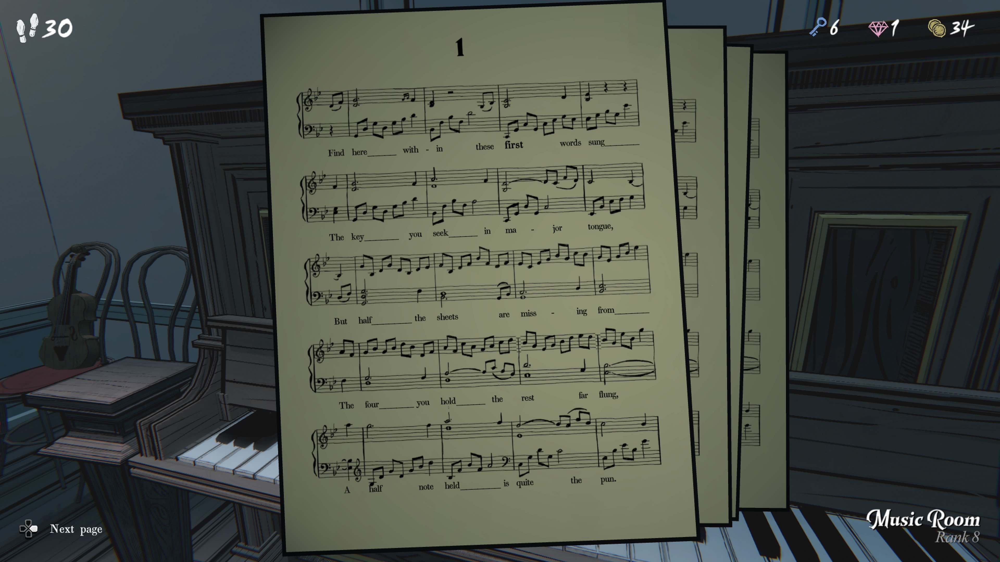
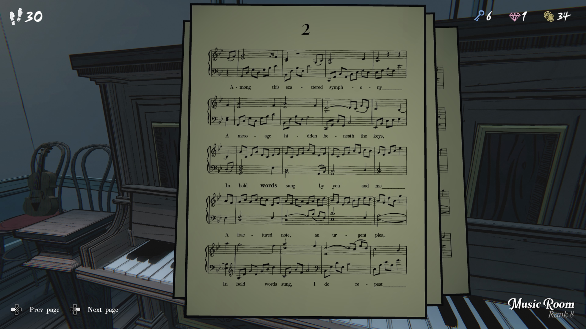
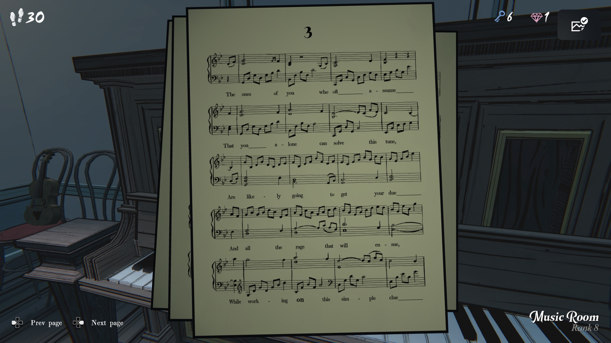
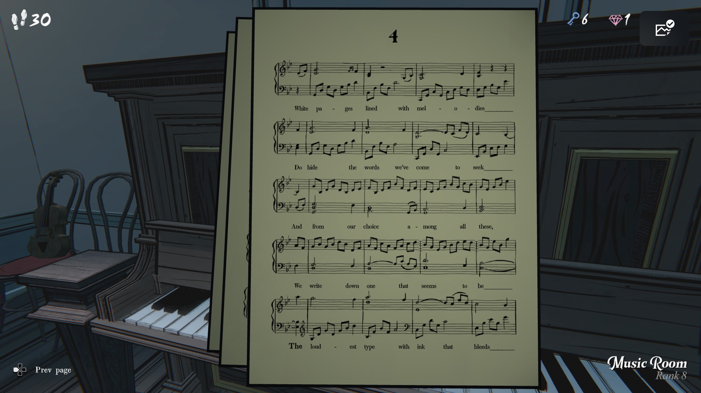
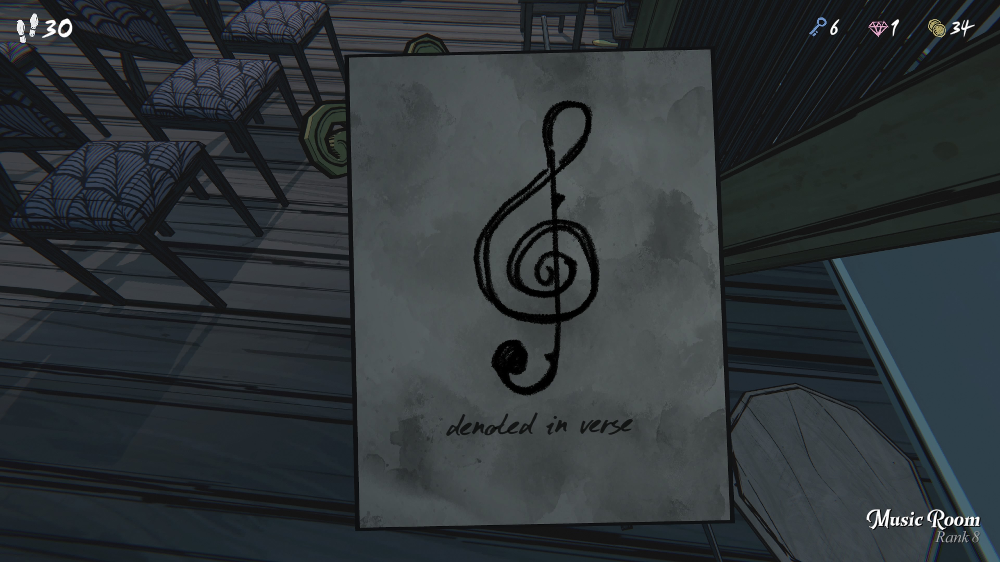

Find here within these first words sung _______
여기, 처음 불린 이 단어들 속에서 _______ 을 찾아라

The key you seek in major tongue, _______
네가 찾는 열쇠는 장조(major)의 언어로 되어 있다, _______

But half the sheets are missing from _______
하지만 악보의 절반은 _______ 에서 사라졌다

The four you hold the rest far flung, _______
네가 가진 네 장, 나머지는 멀리 흩어져 있다, _______

A half note held _______ is quite the pun.
붙들린 2분음표(half note)는 _______ 에 대한 재치있는 말장난이다.

Among this scattered symphony ______
이 흩어진 심포니 속에서 ______

A message hidden beneath the keys,
건반 아래 숨겨진 메시지,

In bold words sung by you and me ______
너와 내가 굵게 불러내는 단어들 속에 ______

A fractured note, an urgent plea,
깨진 음표, 절박한 호소,

In bold words sung, I do repeat ______
굵게 불린 단어들로, 나는 반복한다 ______

The ones of you who oft ______ assume ______
자주 ______ 가정하는 너희 중 누구든지 ______

That you ______ alone can solve this tune,
너 혼자만 이 곡을 풀 수 있다고 ______

Are likely going to get your due ______
아마도 마땅한 ______을 얻게 될 것이다

And all the rage that will ensue ______
그리고 곧 따라올 모든 분노 ______

While working on this simple clue ______
이 간단한 단서를 푸는 동안 ______

White pages lined with melodies
하얀 페이지가 선율들로 줄지어 있고

Do hide the words we’ve come to seek, _______
우리가 찾으러 온 단어들을 감추고 있네, _______

And from our choice among all these,
그리고 이 모든 것들 중 우리가 선택한 것에서,

We write down one that seems to be _______
우리는 그것들 중 하나를 적는다, 그것은 _______ 로 보인다

The loudest type with ink that bleeds _______
가장 크게 새겨지고, 번지는 잉크로 쓰인 _______

“시(詩)로 표시된”, “운문으로 표현된”.