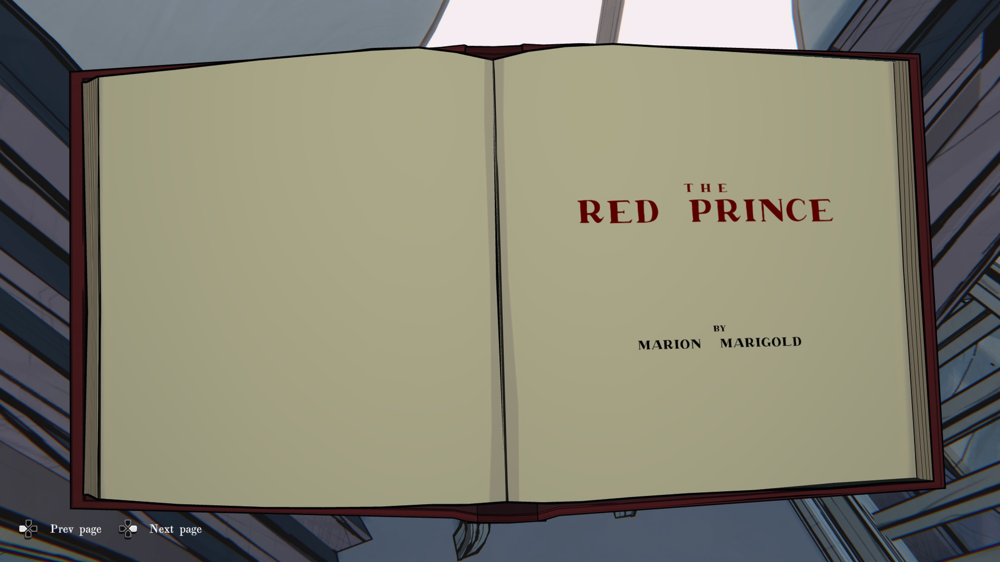

**《붉은 왕자》**

마리온 마리골드 지음

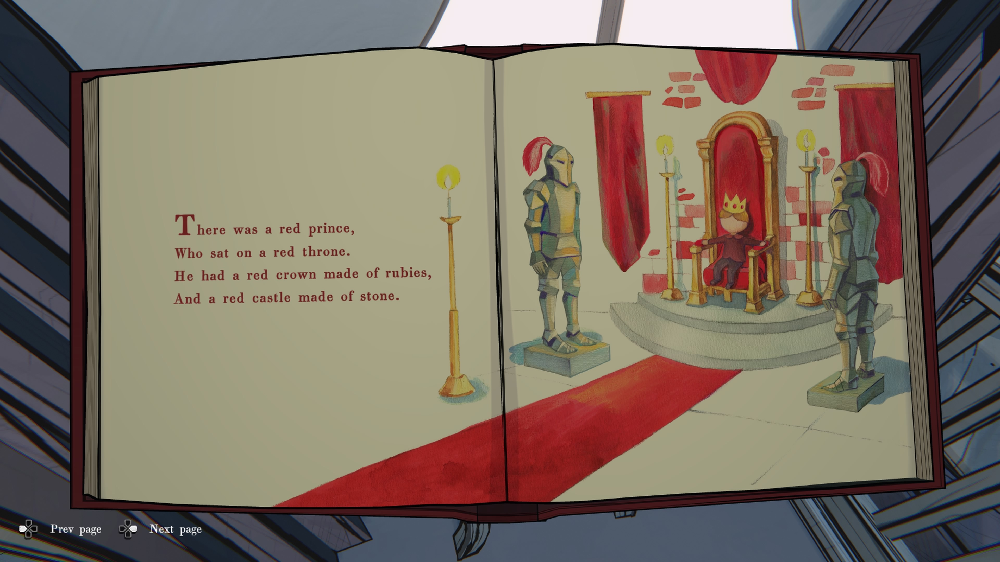

**붉은 왕자가 있었어요.**

그는 붉은 왕좌에 앉아 있었지요.

루비로 만든 붉은 왕관을 쓰고,

붉은 돌로 지은 성에 살았답니다.

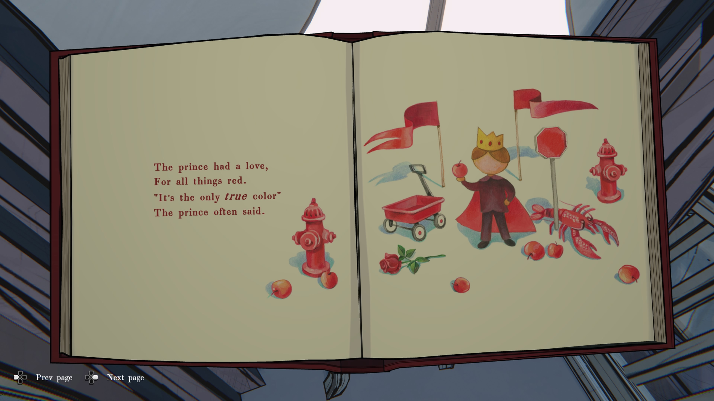

**왕자는 붉은색을 사랑했어요.**

“진짜 색깔은 붉은색뿐이야,”

왕자는 자주 그렇게 말하곤 했지요.

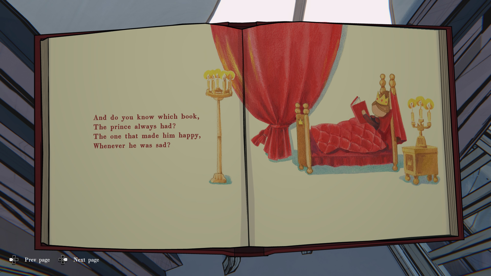

**왕자가 언제나 곁에 두던 책이 뭔지 아시나요?**

슬플 때마다 그를 기쁘게 해주던 바로 그 책이요.

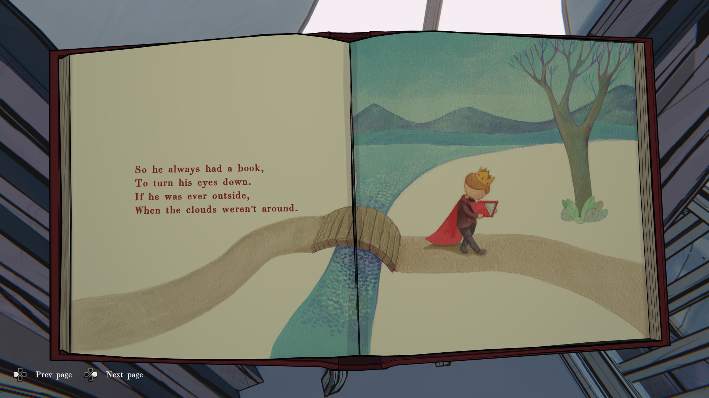

**그래서 왕자는 늘 책을 들고 다녔어요.**

눈을 아래로 향하게 해주는 책이었죠.

맑은 날 밖에 나가 있을 때도,

언제나 책을 손에 쥐고 있었답니다.

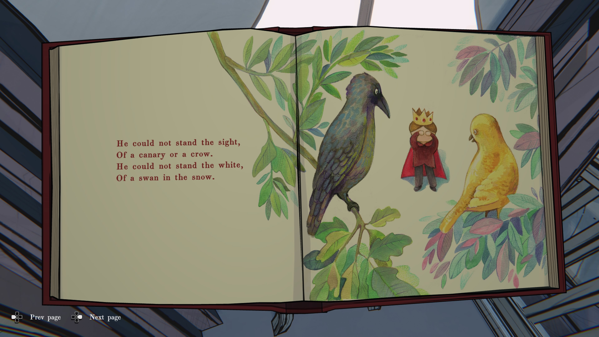

**왕자는 카나리아도, 까마귀도 싫어했어요.**

**하얀 눈 위의 백조도 보기 싫어했죠.**

붉지 않은 모든 것은 그에게 불편했어요.

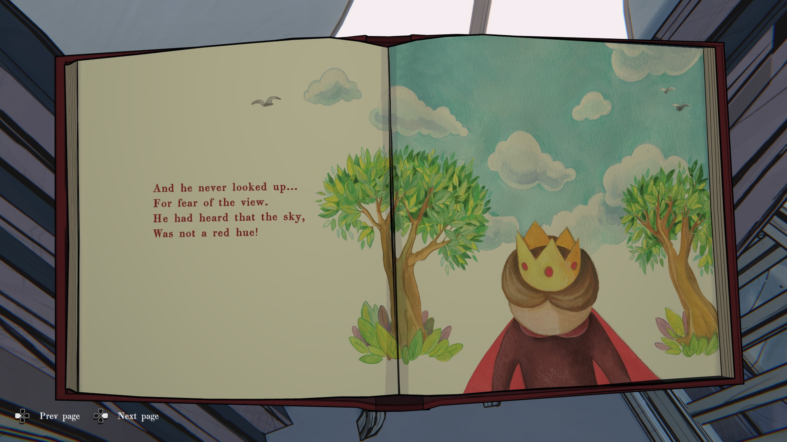

**왕자는 하늘을 올려다본 적이 없어요.**

혹시라도 보게 될까 봐 두려웠거든요.

**하늘은 붉지 않다는 말을 들었기 때문이에요.**
 
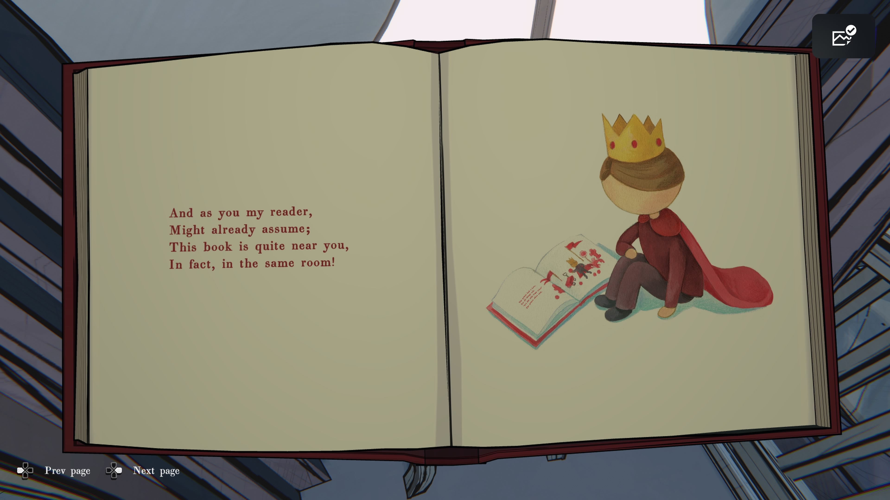

**그리고 이제, 내 독자여,**

당신도 이미 짐작했겠지요.

이 책은 바로 당신 곁에 있어요.

사실, 지금 이 방 안에요!

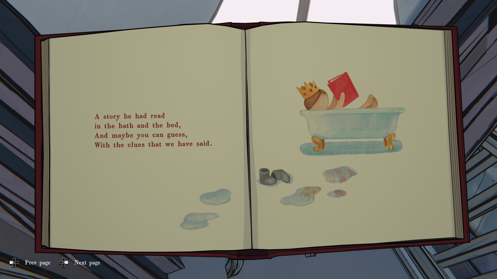

**왕자는 이 책을 욕조에서도, 침대에서도 읽었어요.**

**이제 당신도 알겠죠?**

우리가 남긴 단서들로, 어디에 있는지.

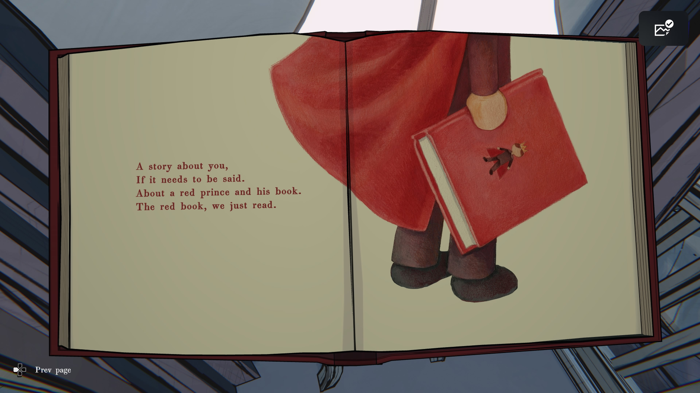

**이 이야기는 당신에 관한 이야기예요.**

**붉은 왕자와 그의 책, 우리가 방금 읽은 바로 그 이야기.**
  
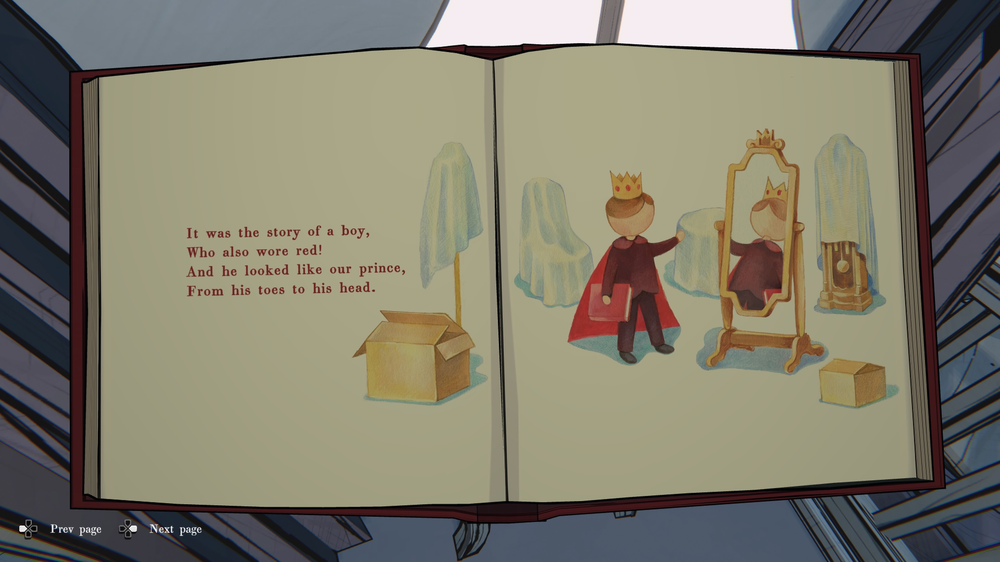
