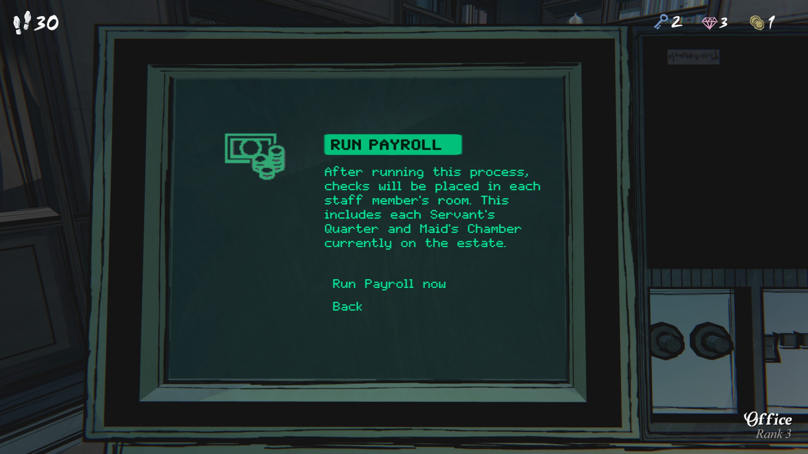

급여 처리 (Run Payroll)

이 과정을 실행하면, 각 직원 방에 수표가 배치된다.
여기에 현재 저택에 있는 모든 하인 방과 메이드 방이 포함된다.

지금 급여 처리

뒤로

온실의 전실 레버가 또 고장 났다.

사이먼이 도착하기 전에 작업 요청을 넣을 시간은 없어 보이니, 서쪽과 동쪽 레버만 작동하게 해 두면 된다.

브리짓,

레딩턴에서 아래 제목과 일치하는 책이 구매 가능한지 확인해줘.

QUEEN의 비행

COUNT의 행진

LORD의 몰락

BARONS의 종말

MAJOR의 청어들

남작의 필체를 읽는 데 조금 어려움이 있어서,
마지막 제목이 ‘hearrings’인지 ‘herrings’인지 확실하지 않다.
하지만 허버트를 아는 이상, 둘 중 아무거나 맞을 것 같다.

3월 3일

친애하는 싱클레어 씨께,

우리의 요구에 즉시 응해주시고, 경찰을 개입시키지 않으며,
이 불행한 거래가 가능한 한 매끄럽게 진행되도록 해주셔서 감사합니다.

그리고 아마 저희에게서 다시는 연락이 오지 않기를 바라셨을 테지만,
봉투들을 돌려드린 이후 상황을 고려해 저희도 마지막 붉은 편지를 보내는 것이 타당하다고 판단했습니다.
바라건대, 이번 편지는 예전 것들처럼 부주의하게 다루지 않으시길 바랍니다.

이처럼 죄를 입증할 수 있는 서신은 책상 서랍이 아닌 금고에 보관하셔야 합니다.

먼저 걱정을 덜어드리겠습니다. 
아마 이번 주 책상 위에서 또 다른 붉은 봉투를 발견하게 될 거라 예상하지 못하셨겠죠.
아니요, 저희는 더 이상 요구하지 않을 것이며, 다른 편지의 “사본”도 가지고 있지 않습니다.

당신은 이미 매우 관대하고 협조적이었습니다. 최소한 저희도 약속의 몫을 이행해야겠지요.
그렇다면 왜 편지를 또 보내는가? 이미 원하는 것을 얻었는데 왜 더 위험을 감수하는가?
한마디로 말해, 원칙 때문입니다.

당신의 우아한 답장을 읽고 난 후 몇 가지 오해가 있었다는 것이 명백해졌습니다.
이 편지는 그러한 점들을 바로잡고, 저희의 계획을 좀 더 부드러운 빛 아래에 두기 위한 것입니다.

첫째, 저희가 협박이라는 화려한 언어에 너무 들떠 있었던 것 같지만,
목적은 공포를 조성하는 것이 아니었습니다.
당신이 조카에 대한 은밀한 위협으로 받아들였을 수도 있지만,
실제로 위험은 전혀 없었다는 점을 개인적으로 보증드립니다.

만약 어린 아이에게 위해를 가할 것처럼 보였다면, 
그것은 단지 그의 “사회적 전망을 해칠 수 있다”는 매우 모호한 의미였습니다. 

그리고 저희도 인정하듯, 단어 선택은 다소 부적절했을 수 있습니다
(고의로 오해를 유발했다고 해도 할 말은 없겠지만), 믿어주시길 바랍니다.
이것은 돈을 뜯어낼 계산적인 계획이 아니었습니다.

하지만 이미 돈이 지급된 만큼, 저희의 윤리적 문제를 파헤친다고 얻을 것은 없습니다. 
그 점에 대해선 변명의 여지가 없다는 것도 알고 있습니다.

또한, 당신의 훔쳐진 편지 내용을 언급하는 과정에서 판단하는 듯한 태도가 느껴졌다면,
그것은 전혀 의도한 바가 아닙니다. 
저희는 당신이나 당신의 가족보다 우월하다고 생각하지 않으며, 
오히려 그 편지들이 언급하는 근본적인 사안에 깊이 공감합니다
(그리고 당신이 생각한 대로, 이 편지는 우리에게 더 불리한 증거가 되고 있군요).

다시 한 번 말씀드리지만, 저희는 죄책감을 느끼고 있으며, 
오직 시간이 지나야 금전적 보상이 과연 우리의 잘못보다 큰 가치가 있는지 판단될 것입니다.

다시는 저희에게서 연락을 받지 않겠지만,
이 마지막 편지가 저희를 떠올릴 때 최소한 동정심 정도는 갖게 되길 희망합니다.

불편을 끼쳐드려 죄송합니다.

영원히 익명으로,
X
