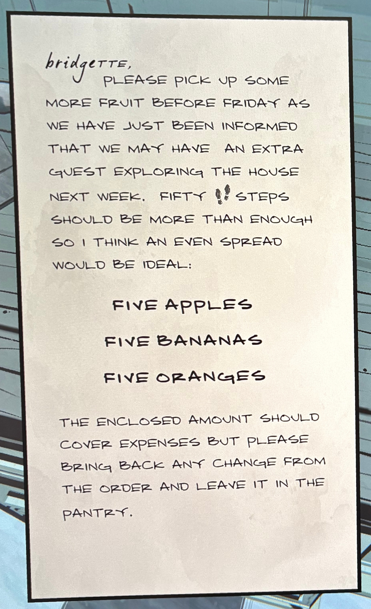

**브리짓(Bridgette),**

이번 주 금요일 전에 과일을 좀 더 사와 주세요.

다음 주에 저택을 탐험할 새로운 손님이 한 명 더 올 수도 있다는 소식을 들었습니다.

**50개의 걸음**이면 충분할 테니, 골고루 사오면 좋겠어요.

**사과 5개**

**바나나 5개**

**오렌지 5개**

동봉된 금액이면 비용은 충분할 겁니다.

하지만 주문 후 남은 잔돈이 있다면 식료품 저장실(pantry)에 두세요.

(“Fifty steps” 부분은 문맥상 ‘50개의 걸음’이 아니라 **수량 단서나 암호**일 가능성도 있습니다. 게임 내 퍼즐 힌트일 수도 있어요.)

