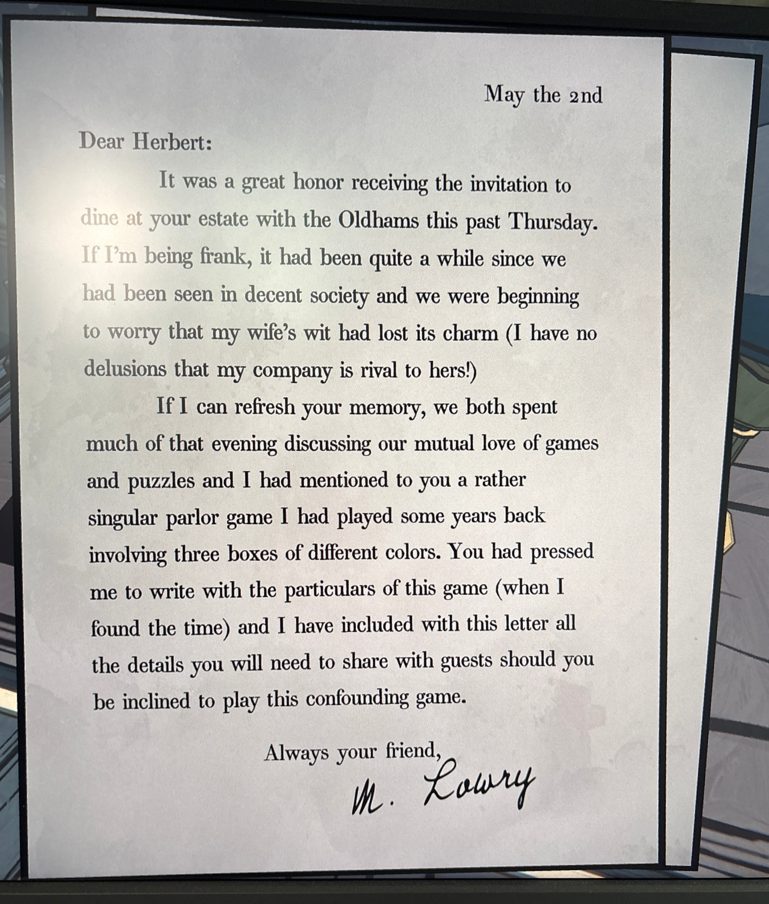
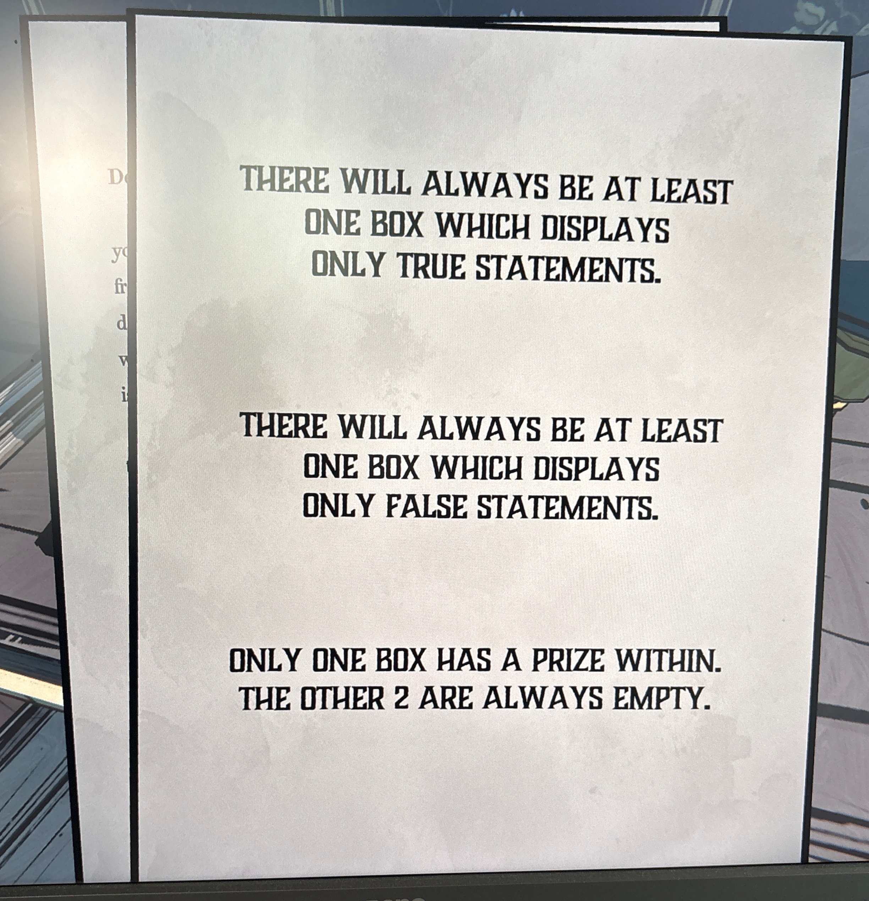

**5월 2일**

  

친애하는 허버트에게,

  

지난 목요일, 올드햄 부부와 함께 당신의 저택에서 저녁 식사 초대를 받은 것은 큰 영광이었습니다.

솔직히 말하자면, 우리가 마지막으로 사회 모임에 참석한 지 꽤 오래되어, 제 아내의 재치가 예전만 못한 것은 아닌가 걱정이 되던 참이었습니다. 
(물론 제 유머 감각이 아내의 그것과 비교될 수 있다고 착각하진 않습니다!)

  

제 기억이 맞다면, 우리는 그날 저녁 내내 서로의 공통된 취미인 게임과 퍼즐에 대해 이야기를 나누었습니다. 
그리고 제가 몇 년 전에 했던 다소 특이한 **살롱 게임** 하나를 언급했지요.

그 게임은 색깔이 다른 **세 개의 상자**를 이용하는 것이었습니다.

당신은 그 게임의 **규칙과 세부 사항**을 적어 보내달라고 하셨고 (시간이 날 때 쓰겠다고 약속드렸죠), 이번 편지에 그 모든 내용을 동봉합니다.

혹시라도 손님들과 함께 이 **혼란스러운 게임**을 즐기고 싶으시다면 참고하시기 바랍니다.

  

언제나 당신의 친구,

**M. 로우리**

- **항상 최소한 한 개의 상자에는 오직 진실된 문장만 적혀 있습니다.**
    
- **항상 최소한 한 개의 상자에는 오직 거짓된 문장만 적혀 있습니다.**
    
- **단 하나의 상자만 상자 안에 상금(혹은 보상)이 들어 있으며, 나머지 두 개는 항상 비어 있습니다.**

