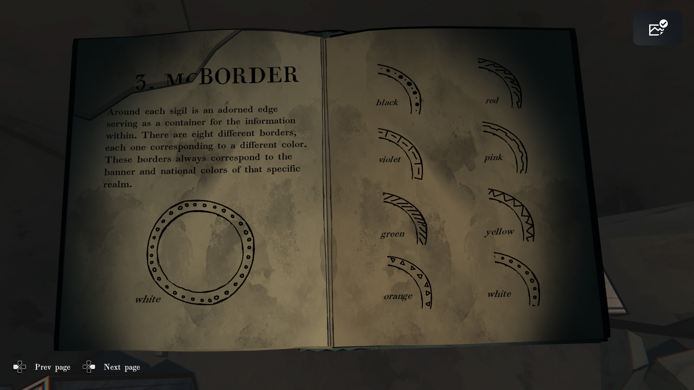

### **스크립트 & 루드포드 광산회사**

**발굴 부서**

**감독관 기록 번호:** 3

**날짜:** 1915년 7월 2일

---

우리 고객 토마스 싱클레어가 의심했던 대로, 
남쪽 절벽에서 보였던 아치 구조물은 바위층에 새겨진 훨씬 더 긴 회랑의 일부였습니다. 
지난주 우리 팀이 처음 도착했을 때는 지지 기둥 두 개만 보였지만, 
덩굴과 이끼, 흙을 며칠간 제거한 결과 우리는 추가로 열두 개 더 발견했습니다.

지금까지의 탐사 작업은 제한적이고 매우 표면적인 수준이었습니다. 
우리가 조사한 모든 갱도는 갑자기 끝났고, 
산 깊은 곳으로 이어지는 유망한 경로는 흙, 바위, 잔해로 꽉 막힌 터널에 의해 차단되었습니다.

이 장소는 우리가 처음 생각했던 것보다 훨씬 오래되었거나, 
누군가가 고의로 이 방들을 매몰시킨 것입니다.

---

### **왼쪽 페이지**

**감독용 사본**

**현장에서 가져가지 말 것.**

---

### **오른쪽 페이지**

**REALM & (—)**

**과거와 (선사시대)의 인장들**

**저자: R. 윌라드 교수**

FENN ARIES

ROBERT BIRD & SONS

1905

※ 찢어진 부분 추정:

- “SIGILS OF THE PAST AND PR(…)” = “Sigils of the Past and Pre(-historic Age)” → _과거와 선사 시대의 인장들_
    
- 책 제목 “REALM & (—)” → 맥락상 “Realm & Ritual” 또는 “Realm & Relics(유물)”류 추정

### **왼쪽 페이지**

(…) 첫 시대의 왕들은
자연 현상 혹은 (창조된 신성한 문양)에서 비롯된 징표들을 발견하였다.
그들은 자신의 왕국의 각기 다른 상징을
일종의 표식으로 기록하는 데 익숙했다.
그 목적은 외부인이 그들의 왕국을
이해하지 못하도록 하기 위함이었다.

역사적으로 말해 ‘인장(sigils)’은 새로운 전통이 아니다.
모든 시대와 문화에서 발견되었으며,
문자 기록과 문장(紋章) 예술보다도 오래되었다.
그러나 오늘날 우리가 “인장(sigils)”이라는 말을 사용할 때는
특히 ‘왕국의 인장(Realm Sigils)’을 의미한다.
이것들은 왕실 유물, 건축물, 옛 문서에서 발견되는
원형 모양의 표식으로 특정 지위를 나타냈다.

### **오른쪽 페이지**

이 책은 이 흥미로운 상형 문양들에 대한 이해를 돕고,
각 인장과 그 왕국의 왕실 상징도 사이의 연관성을
명확히 보여주기 위해 쓰였다.

예를 들어,
“잎이 없는 불타는 나무의 형상이
왜 기하학적 선으로 표현되는가?
그리고 그것이 그 왕국의 역사에 대해
무엇을 말해주는가?”

각 선, 동그라미, 변형된 형태마다
그 땅의 이야기를 담고 있다.
심지어 인장을 둘러싼 장식적인 테두리조차
특별한 의미를 가진다.

(아래 원형 도안 그림)

### **왼쪽 페이지**

**1. 왕국의 방위(추정 제목: THE REALM’S RAYS)**
(…) 항로. 배의 경로.

(빛이 뻗는) 여덟 개의 광선은
마치 나침반 장미가 방향을 알려주듯
왕국의 방향을 나타낸다.

(…) 수레들.

여기 보이는 선들은 마치 지도상의 길처럼 보인다.
중앙에서 방사형으로 뻗은 이 형태는
왕국의 지도를 우리에게 제시한다.
또한 이 선들은 왕국의 북쪽이 어디인지 알려준다.

(…) 또 다른 형태는 말을 타고 달리는 것처럼
경로를 나타낸다.
이 선들은 분기되어 있으며,
어떤 경우에는 네 갈래의 광선 형태를 이룬다.
이는 가장 빠른 여행 수단을 상징한다.

여전히, (…) 이 ‘광선’들은
왕국을 해석하고 구분하는 데 중요한 역할을 한다.
이러한 신호들을 해석할 수 있다면
누구나 그 왕국의 길을 이해할 수 있다.

(…) 이동 수단.
선들이 철도 기반 왕국에서는
모두 철도 노선처럼 보인다.

---

### **오른쪽 페이지**

물결 모양의 선은 극심한 **열기(HEAT)**를 의미한다.
타오르는 공기와 눈부신 햇빛 때문에
직선 광선이 흔들리는 듯 보이기 때문이다.

**비(RAIN)**가 많은 왕국은
수직으로 떨어지는 세 개의 선으로 표현된다.

보다 극심한 **폭풍(STORM)** 날씨는
번개 모양의 뾰족한 광선이 사용된다.

점이 떨어지는 선은
**눈(SNOW)**이 흔한 추운 왕국을 나타낸다.

**바람(WIND)**이 강한 날씨는
굽은 곡선 형태의 선으로 표현되며,
광선이 강풍에 휘어진 것처럼 보인다.

### **왼쪽 페이지**

**THE SIGIL**

(문양)

Realm Sigil(왕국 문양)을 이해하려면,
우리는 먼저 그 기호를 분해하여
전체를 구성하는 개별 요소들을 확인해야 한다.

각 문양은 아래 **4가지 요소**로 이루어진다:

(큰 원형 그림)

---

### **오른쪽 페이지**

- **The Core**
    
    중심부
    
- **The Dividing Lines (Rays)**
    
    분할선(광선)
    
- **The Motes**
    
    작은 점들(티끌 모양의 표식)
    
- **The Border**
    
    외곽 테두리
  

### **왼쪽 페이지**

**1. THE CORE**

1. 중심부

각 문양의 중앙에는
각 왕국마다 다른 독특한 형태가 있다.
만약 중심부가 그 문양의 이름을 알려준다면,
나머지 문양 요소들은 그 이름 뒤에 숨겨진
역사를 보여주는 것이다.

따라서 어떤 문양을 해독할 때
가장 먼저 중심부를 식별하고
구분하는 것이 중요하다.
중심부를 모르면 다른 요소들은
해석할 의미가 없다.

우리가 묘사하는 장소를 먼저 알아야만 한다.

(아이콘 4개: 오각형, 여덟자형, 역V자 등)

---

### **오른쪽 페이지**

오른쪽은 각 중심부 형태 예시로 보임:

- 다각형 형태
    
- 항아리 같은 형태
    
- 마름모 형태
    
- 왕관 같은 형태

(옆 문장이 찢어짐. 아마 “Several examples from well-known realms…”

즉, “잘 알려진 왕국들의 예시 몇 가지”를 보여주는 페이지.)

### **왼쪽 페이지**

**1. THE RAYS**

1. 광선(선분)

각 문양의 중심에서 뻗어 나오는
선들은 문양을 여러 영역으로 나누고
방향성과 의미를 부여한다.

한 문양에서 다른 문양으로 갈수록,
이 선들의 개수, 형태, 길이가 달라지며
이 차이를 해독하는 것이
그 왕국을 이해하는 데 매우 중요하다.

(중간 문장 찢어진 부분 추정)

> 선을 통해 우리는 그 장소의 위치, 기능,
> 그리고 그 왕국의 성격을 알 수 있다.

---

### **오른쪽 페이지**

(상단 제목 추정: **THE RAYS AND THEIR MEANINGS**
광선과 그 의미)

광선의 개수를 세면
그 왕국의 **이동/교통 방식**을 알 수 있다.

예를 들어:

- 직선 광선 → 도로/마차/도보 이동
    
- 굽은 광선 → 바람/공중 이동
    
- 뾰족 번개 형태 → 폭풍/험난한 환경
    

**비바람 많은 지역**은
수직으로 떨어지는 세 줄로 표시된다.

**눈이 자주 내리는 곳**은
떨어지는 동그라미 점들로 표현된다.

**강풍이 부는 곳**은
휘어진 선들이 표시된다.

(하단 그림: 중심점 + 여러 방향의 광선)

### **왼쪽 페이지 (추정 포함)**

**1. THE RAYS**

1. 광선

문양 중심에서 뻗어 나오는 선들은
그 왕국의 방향과 이동 방식을 알려준다.

텍스트 일부(추정):

> 중심의 코어에서 나오는 선들은
> 문양을 여러 영역으로 나누며
> 각 왕국의 특성과 이동 방식을 보여준다.

여기 삽입된 문장들:

- **Carriages** — 마차
    
- **Trails** — 길, 산길
    
- **Locomotion** — 이동 방식

(추정된 전체 의미)

> 어떤 문양은 직선으로 길을 의미하고,
> 또 어떤 문양은 굽은 선으로 짐승의 움직임이나
> 울퉁불퉁한 여행길을 나타낸다.

---

### **오른쪽 페이지**

**기후 표현법**

- 물결 선 = **극심한 더위(HEAT)**
    
    뜨거운 공기로 인해 직선이 흔들려 보임
    
- 세 개의 수직선 = **비(RAINY)**
    
    비가 쏟아지는 모습
    
- 번개 모양 = **폭풍(STORMY)**
    
    더 거친 날씨를 표현
    
- 점이 떨어지는 동그라미 = **눈(SNOW)**
    
    차가운 지역, 눈이 자주 옴
    
- 굽은 선 = **바람(WINDY)**
    
    강풍으로 휘어지는 모습
    

### **왼쪽 페이지**

**PUTTING IT ALL TOGETHER**

모든 것을 하나로

> 시질(문양)의 핵심, 광선, 점(모트), 테두리를 연구함으로써
> 이제 당신은 이전까지는 해독할 수 없었던 수수께끼의 의미를
> 풀어낼 수 있을 것입니다.

(아래 그림은 완성된 예시 문양)

---

### **오른쪽 페이지 (필기)**

지워진 글: Banners (깃발들?)

→ 아마 의미가 틀려서 지운 것

남아 있는 단어들:

- **Martial**
    
    전투/군사적, 무력과 관련된
    
- **Fog**
    
    안개

(추정)

이 문양은 ‘군사적/전쟁과 관련된 안개 낀 지역’ 또는

‘전투 전략을 숨긴, 안개 속 제국’ 같은 의미로 해석 중인 페이지.

### **왼쪽 페이지**

**3. THE BORDER**

**3. 테두리**

각 시질(문양) 주변에는 장식된 가장자리가 있으며,
이 가장자리는 안에 담긴 정보를 둘러싸는 역할을 한다.

테두리는 총 여덟 종류가 있으며,
각각은 서로 다른 색에 대응한다.

이 테두리들은 항상 해당 왕국의
**깃발 색**과 **국가 색**과 일치한다.

그림 아래:

**white** — 흰색

---

### **오른쪽 페이지 (색과 테두리 패턴)**

- **black** — 검정
    
- **red** — 빨강
    
- **violet** — 보라
    
- **pink** — 분홍
    
- **green** — 초록
    
- **yellow** — 노랑
    
- **orange** — 주황
    
- **white** — 흰색

(각 색마다 고유한 테두리 패턴이 있음)

**3. MOTES**

**3. 입자(문양 점 요소)**

각 시질에서, 광선들(선들) 사이에 떠 있는 작은 형상을 **Motes**라 부른다.
시질에 사용된 모트의 모양과 스타일을 통해
그 문양이 상징하는 사회의 종류를 알 수 있다.

그들이 스스로를 무력으로 강하다고 생각했는지,
혹은 예술적·경제적 번영을 축복받았다고 여겼는지를 알 수 있다.

---

### **목록**

**★ Tribal — 부족 사회**

원시적인 영역. 사냥·채집 사회.

**⧫ Agricultural — 농경 사회**

수확과 농업 기반의 문화.

**⚔ Martial — 군사 사회**

세대에 걸친 전쟁과 갈등을 중시하는 사회.

**🏛 Metropolitan — 도시 국가형 사회**

밀집된 도시 중심의 사회.

**📚 Academic — 학문 사회**

지식을 중심으로 발전한 사회.

학교, 대학, 도서관이 많은 영역.

**⚙ Industrial — 산업 사회**

공학·제조·발명·생산 중심의 사회.

**✧ Spiritual — 영적 사회**

자연, 동물, 보이지 않는 힘에 대한 높은 경외심을 가진 사회.

**● Poetic — 예술·문학 중심 사회**

예술, 글쓰기, 음악, 언어 발전에 강한 집중을 둔 사회.

---

**‘시질(Realm Sigil)’ 해독 체계**

- **구성 4요소**
    
    1. **Core(핵심 도형)**: 영역의 정체성. 먼저 식별.
        
    2. **Rays(분할선)**: 중심에서 뻗어 상징을 구획. 개수·형태가 의미 전달.
        
    3. **Motes(점상 기호)**: 선 사이에 떠 있는 작은 문양으로 사회 성격 표기.
        
    4. **Border(테두리)**: 8가지 패턴 = 8색. 그 영역의 깃발/국색과 대응.
        
    
- **날씨·환경선 표기 규칙**
    
    - **HEAT**: 물결선.
        
    - **RAINY**: 수직 3선이 “쏟아짐”.
        
    - **STORMY**: 번개형 톱니선.
        
    - **SNOW**: 떨어지는 점이 박힌 선.
        
    - **WINDY**: 굽은 휜 선.
        
    
- **Motes(사회 유형) 8종**
    
    - Tribal(부족) · Agricultural(농경) · Martial(군사) · Metropolitan(대도시) · Academic(학문) · Industrial(산업) · Spiritual(영적) · Poetic(예술/문학).
        
    
- **Border 8색 예시**
    
    - black, red, violet, pink, green, yellow, orange, white(각각 고유 패턴).
        
    
- **해독 절차**
    
    1. 코어 도형으로 영역 식별 → 2) 레이 수·형태로 구조/상태 파악 → 3) 모트로 사회성격 판독 → 4) 테두리 색/문양으로 국색 확인 → 5) 날씨선으로 환경 보정 → **종합 의미 도출**.
        
    
    - 예시 메모: “Martial, Fog”처럼 군사적 영역 + 안개/저시정 환경 해석.
