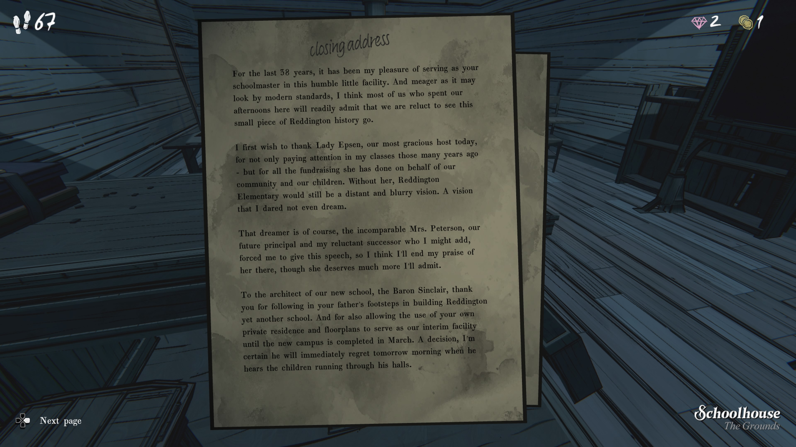

**closing address**

**폐회 연설**

지난 58년 동안, 이 작은 학교에서 교장으로 봉사할 수 있어 매우 영광이었습니다.

그리고 이 시설이 현대 기준으로는 초라해 보일지라도,
우리 중 많은 사람이 이곳에서 오후 시간을 보냈고
이 작은 레딩턴 역사의 한 조각이 사라진다는 사실을 아쉬워하고 있습니다.

오늘의 가장 고귀한 주최자이신 **렐디 엡슨 여사**께 먼저 감사를 드립니다.

오랜 전 제 수업에 귀 기울여 주셨을 뿐만 아니라,
우리 지역 사회와 아이들을 위해 기부 활동을 해주셨습니다.
그분이 아니었다면, 레딩턴 초등학교는 여전히
멀고 흐릿한 꿈으로 남아 있었을 것입니다.
제가 감히 꿈꾸지도 못했던 비전이었습니다.

그 꿈을 현실로 만든 분이 바로 **피터슨 여사**입니다.
앞으로 교장이 되실 분이며, 또한 저에게 이 연설을 억지로 하게 만든 분입니다.
그분이 받을 칭찬이 더 많지만, 여기서 마치겠습니다.

그리고 새 학교의 설계자이신 **싱클레어 남작**께 감사드립니다.
아버님의 발자취를 따라 레딩턴에 또 하나의 학교를 지어주셨습니다.
또한 새 캠퍼스가 내년 3월 완성될 때까지
이 저택의 공간과 설계를 임시 학교로 제공해 주셨습니다.
내일 아침 아이들이 이 홀을 뛰어다니는 소리를 들으시면
조금 후회하실지도 모르겠습니다만…

그리고 마지막으로, 제 모든 학생들에게 감사드립니다.
오늘 여기 있는 많은 분들을 수년 동안 보지 못했지만,
여전히 어린 모습과 말썽꾸러기였던 태도를 기억합니다.

여러분의 부모님도 가르쳤고, 언젠가 여러분의 아이들도 가르칠지 모르겠습니다.
여러분이 없었다면 저는 평온한 삶을 살았을 겁니다.
그러나 세상에 징계를 줄 학생이 없다면 평온이 무슨 의미가 있겠습니까?

진심으로 감사드립니다.
이곳에서의 시간은 제 인생 그 자체였습니다.
8개월 뒤 제가 아직 서 있다면,
내년 덜 우울한 리본 커팅식에서 모두 다시 뵙겠습니다.

---

(필기 메모)

**better joke to end?**

→ 마지막에 더 좋은 농담?

**remember to give Mrs. Peterson her gift**

→ 피터슨 여사에게 선물 주기 기억할 것
