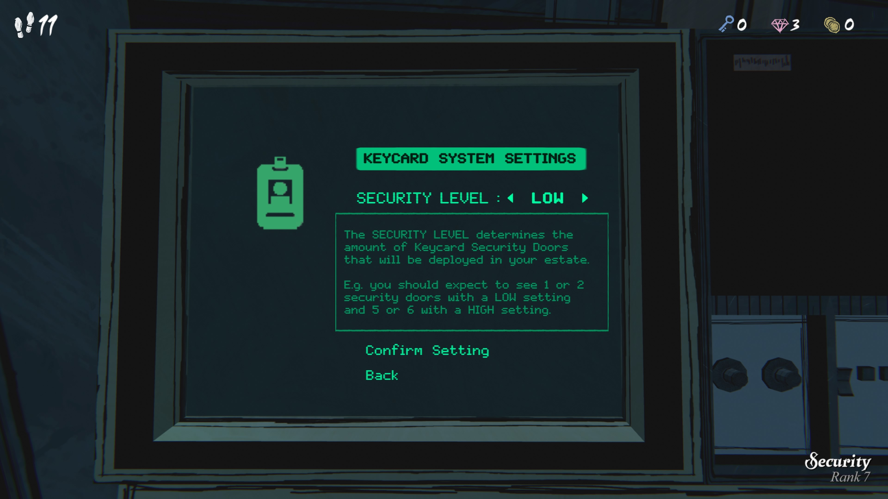
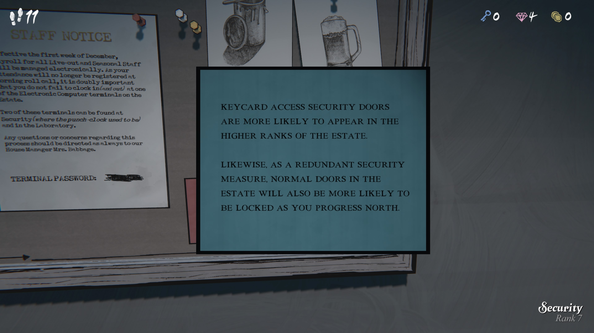
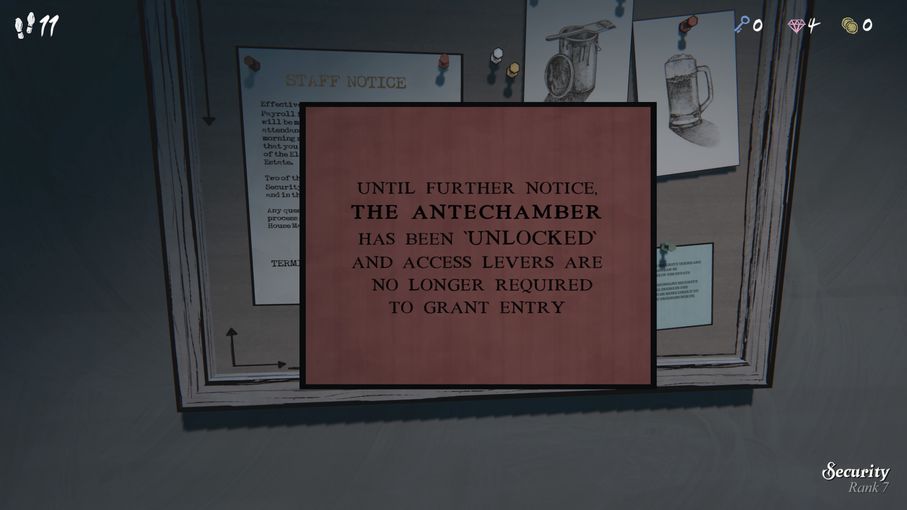
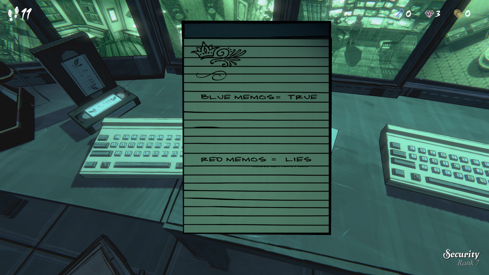
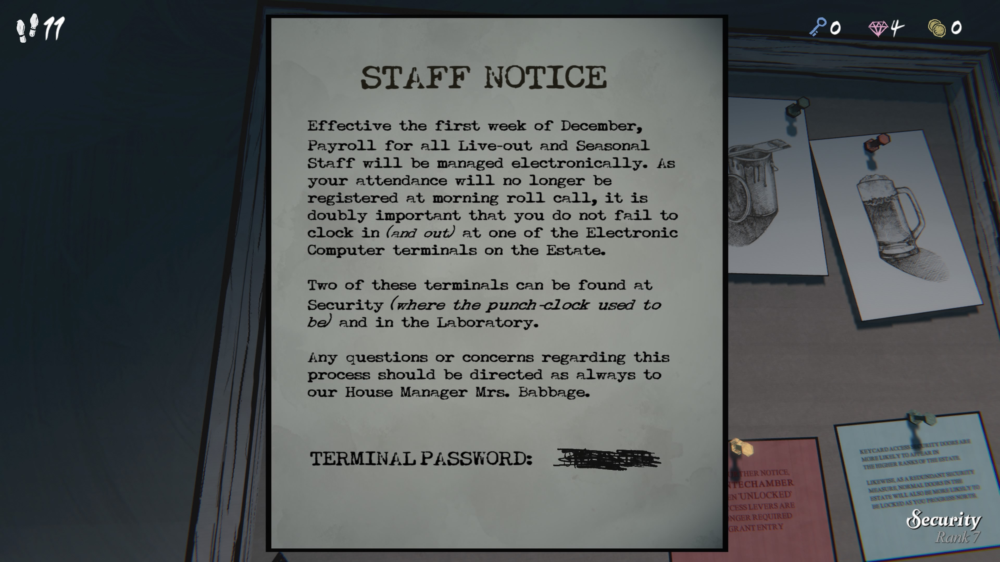

키카드 시스템 설정
보안 수준: 낮음 (LOW)

보안 수준(Security Level)은 저택 내에 설치될 키카드 보안문(Keycard Security Door)의 개수를 결정합니다.

예를 들어, 낮은 설정(LOW) 에서는 12개의 보안문이, 높은 설정(HIGH) 에서는 56개의 보안문이 나타날 수 있습니다.

---

파란색 메모

번역:

키카드 접근 보안문은 저택의 상위 구역(높은 등급 구역) 으로 갈수록 더 자주 등장할 것입니다.

또한, 추가적인 보안 조치로서, 일반 문들도 북쪽(저택의 상단 지역)으로 이동할수록 잠겨 있을 가능성이 높아질 것입니다.

---

빨간색 메모

번역:

추가 공지가 있을 때까지,
전실(Antechamber) 은 잠금 해제되었습니다.

이제 출입을 위해 레버를 조작할 필요가 없습니다.

