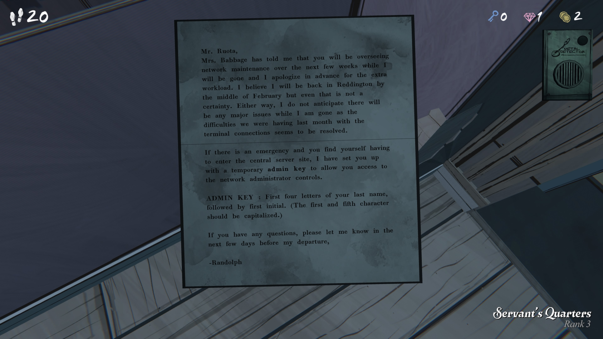
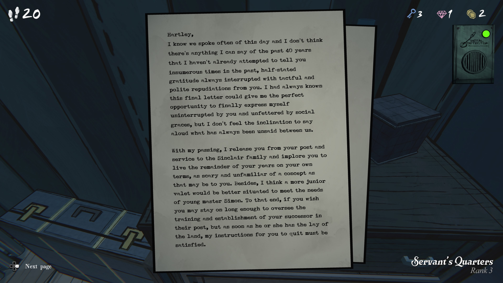
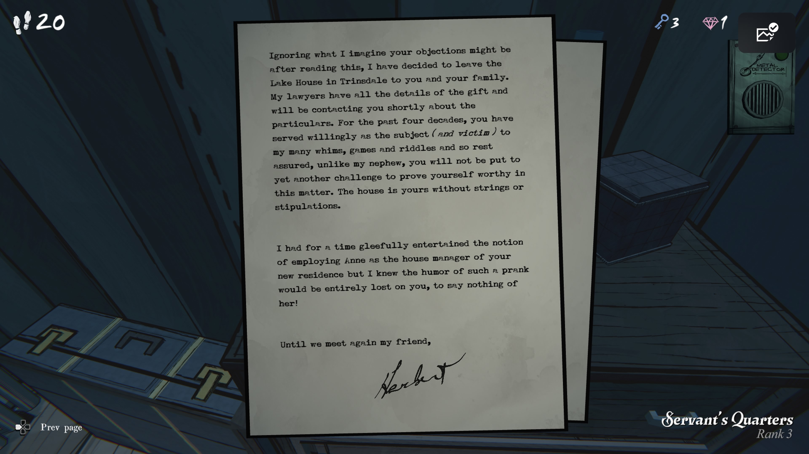

Mr. Ruota,

Mrs. Babbage께서 말씀하시길, 
앞으로 몇 주 동안 제가 자리를 비우는 사이에 귀하께서 네트워크 유지보수를 담당하시게 된다고 들었습니다.
미리 추가 업무에 대해 사과드립니다.
저는 2월 중순쯤 Reddington으로 돌아올 것으로 생각하지만, 그마저도 확실하지는 않습니다. 
어쨌든, 지난달 발생했던 터미널 연결 문제는 해결된 것으로 보이므로,
제가 없는 동안 큰 문제가 생길 것이라 예상하지는 않습니다.

비상 상황이 발생하여 중앙 서버 구역에 들어가야 할 경우를 대비해,
네트워크 관리자 제어에 접근할 수 있도록 임시 **관리자 키(admin key)** 를 설정해 두었습니다.

**ADMIN KEY**: 당신의 성의 첫 네 글자를 적고, 그 뒤에 이름의 첫 글자를 적으십시오.

(첫 번째 글자와 다섯 번째 글자는 대문자로 작성해야 합니다.)

질문이 있으시면, 제가 떠나기 전 며칠 동안 알려주시기 바랍니다.

- Randolph

하틀리,

우리가 이 날에 대해 여러 번 이야기했고,
지난 40년 동안 내가 자네에게 전하려 했던 말은
이미 셀 수 없이 많이 했었다고 생각하네.
자네는 언제나 공손하게 내 감사를 가로막으며
단호하게 사양했지. 이 마지막 편지는 내가
마침내 방해받지 않고, 사회적 예절에 구애받지 않고
내 마음을 표현할 완벽한 기회라 생각했지만,
굳이 지금까지 말하지 않았던 것을 말하고 싶은
기분은 들지 않네.

내가 떠나면, 자네를 직위와
신클레어 가문에 대한 봉사에서 해방시키네.
그리고 남은 생을 자네 방식대로 살도록 권하네.
그게 자네에게는 낯설고 두려운 개념일 수 있겠지만.
게다가 나는 어린 시몬 군의 필요를 충족하려면
좀 더 젊은 하인이 더 적합할 것이라 생각하네.

그러니 자네가 원한다면 후임자의 훈련과 자리잡기를
감독하기 위해 잠시 더 머물 수 있네.
하지만 그 또는 그녀가 집안 사정을 파악하고 나면,
자네가 떠나도록 했던 내 지시는 반드시 지켜져야 하네.

그대가 이 글을 읽고 어떤 이의를 제기할지 대강 짐작되지만,
나는 트린스데일의 호숫가 저택을 당신과 당신의 가족에게
남기기로 결정했네. 변호사들이 증여 관련 모든 세부사항을
가지고 있으며 곧 당신에게 연락을 할 걸세.

지난 40년 동안, 자네는 기꺼이(그리고 희생자로서도) 나의
수많은 변덕, 게임, 수수께끼들을 감당해 주었지. 그러니
안심하게. 내 조카와는 달리 자네가 또다시 어떤 시험을
통과해야 할 필요는 없네. 이 문제에 있어서 자네가
가치를 증명할 필요는 없네. 이 집은 아무런 조건도,
제약도 없이 자네 것이네.

한동안, 새 집의 관리인으로 앤을 고용하는 장난을 쳐볼까
고민하기도 했네만, 그런 농담이 자네에게는 전혀 통하지
않을 것이고, 그녀에게도 말할 것 없이 참을 수 없는 일이
될 거라 판단했다네.

다시 만날 때까지, 친구여.

서명: **Herbert**

