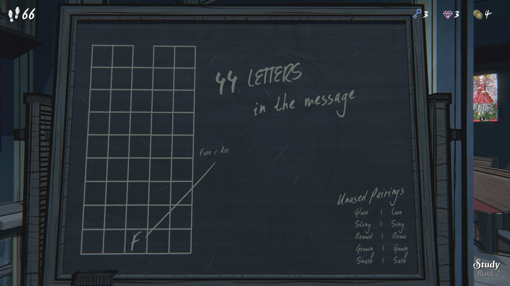
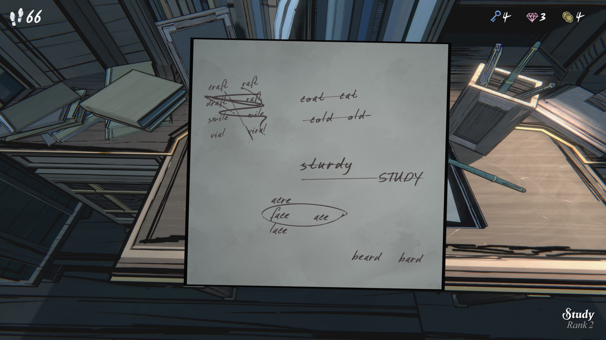
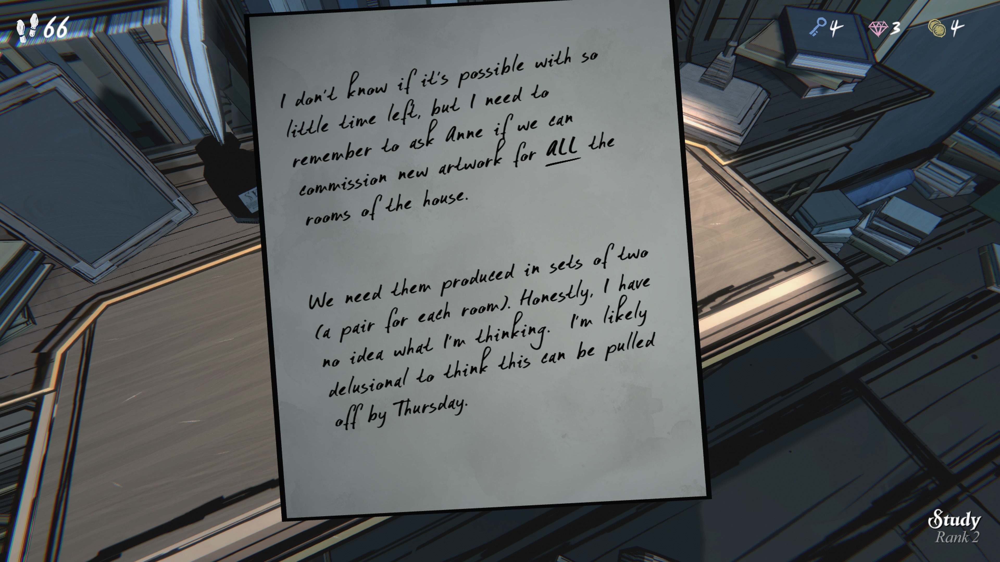

“44 letters in the message” 뜻: 메시지 안에 글자 44개가 있다는 의미.

이렇게 시간이 얼마 안 남았는데 가능한지 모르겠다. 하지만 집 모든 방을 위한 새로운 예술 작품을 주문 제작할 수 있는지 Anne에게 꼭 물어봐야 한다.

각 방마다 두 점씩(한 쌍) 필요하다. 솔직히 내가 무슨 생각을 하는지 모르겠다. 목요일까지 이걸 해낼 수 있다고 생각하는 건 아마 망상일 거다.
