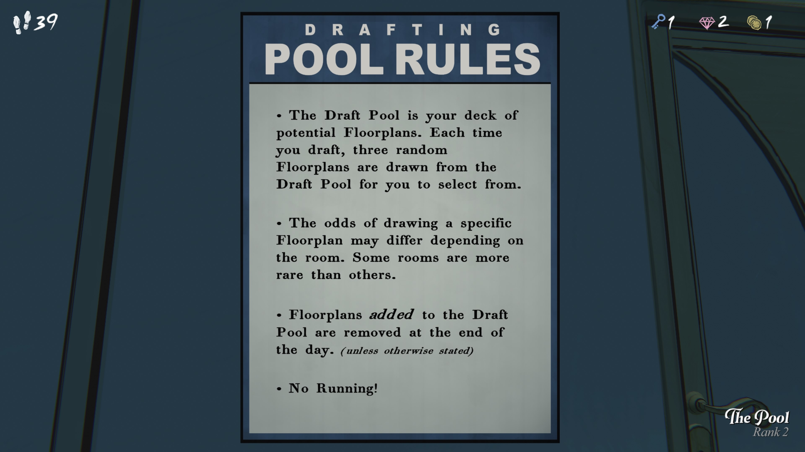
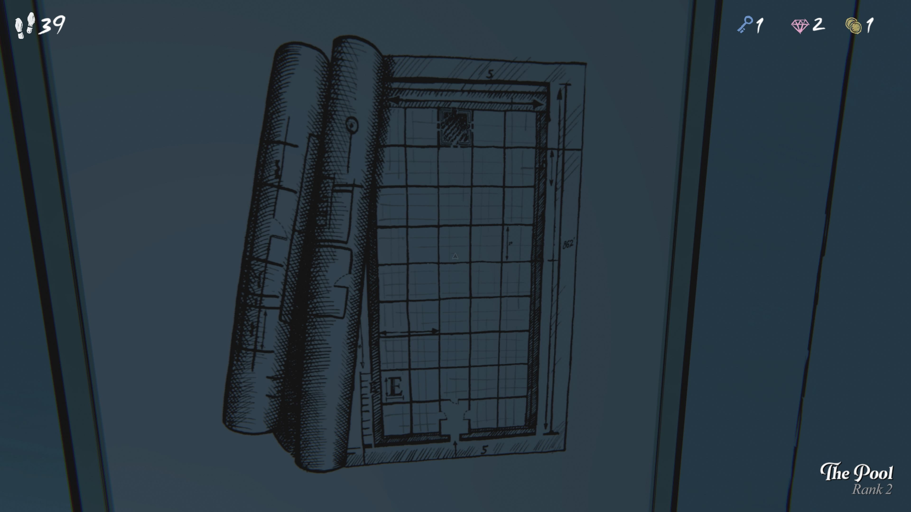

도면 초안 규칙 (DRAFTING POOL RULES)

- **초안 풀(Draft Pool)**은 당신이 선택할 수 있는 **잠재적 도면(Floorplans)**의 덱(목록)입니다. 초안을 작성할 때마다, 무작위로 3개의 도면이 초안 풀에서 선택되어 제시됩니다.
- 도면이 선택될 확률은 방(Room)의 종류에 따라 다를 수 있습니다. 일부 방은 다른 방보다 더 희귀할 수 있습니다.
- 풀에 추가된 도면은 하루가 끝나면 제거됩니다. (별도의 언급이 없는 한)
- 뛰지 마세요!

