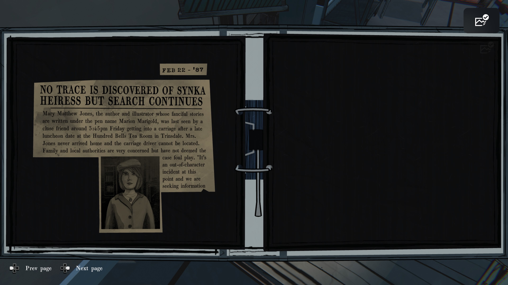
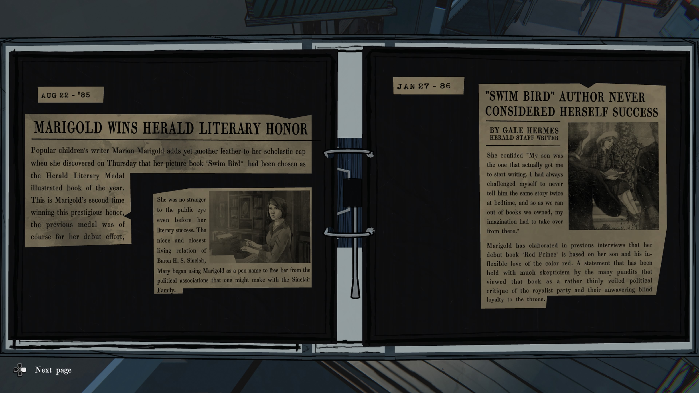
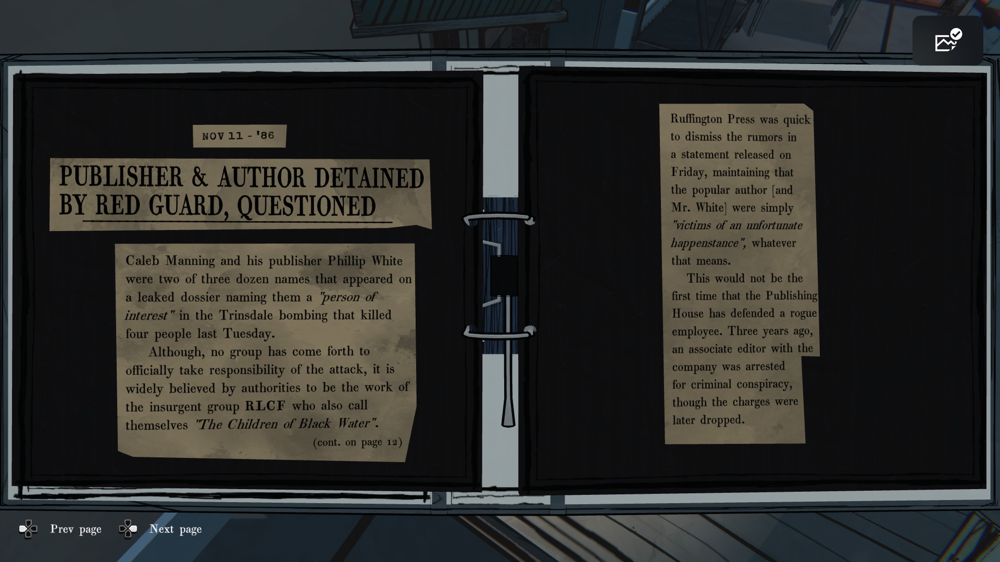
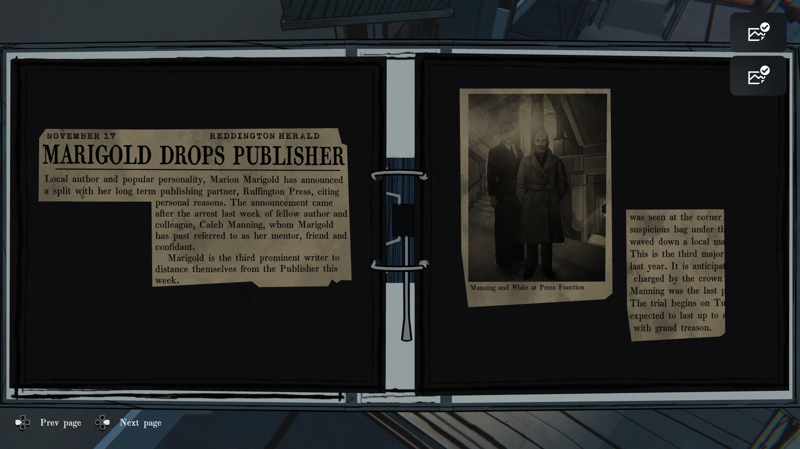
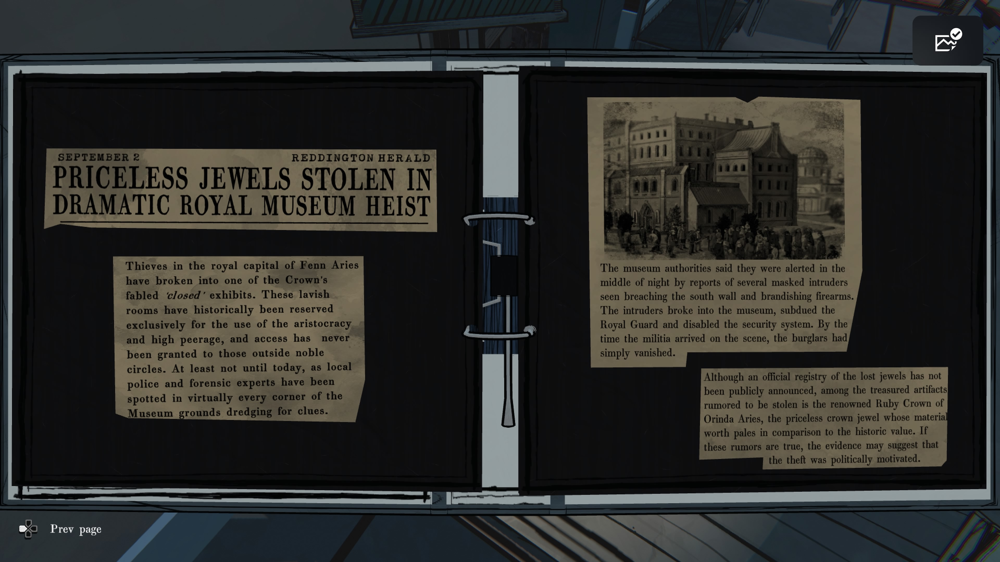

**NO TRACE IS DISCOVERED OF SYNKA HEIRESS BUT SEARCH CONTINUES**

(신카 상속녀 실종, 행방 여전히 오리무중)

동화작가이자 일러스트레이터인 **메리 매튜 존스(Mary Matthew Jones)** — 필명 ‘마리온 마리골드’로 알려진 인물 — 가 실종되었다.
금요일 오후 3시 45분경, 지인과 함께 점심식사 후 마차를 타고 떠나는 모습이 목격된 것이 마지막이었다.
그녀는 집에 도착하지 않았으며, 마차의 마부 역시 행방이 묘연하다.
경찰은 범죄 가능성을 배제하지 않았지만, 사건의 경위를 계속 조사 중이다.

**MARIGOLD WINS HERALD LITERARY HONOR**

(마리골드, 헤럴드 문학상 수상)

아동문학 작가 마리온 마리골드가 그림책 _“Swim Bird”_ 로 올해의 일러스트 도서 부문을 수상했다.
그녀는 이미 데뷔작으로 첫 문학상을 받은 바 있다.
마리골드는 남작 **H. S. 싱클레어**의 조카로, 필명을 사용함으로써 가문의 정치적 연관성을 피하고자 했다.

---

**“SWIM BIRD” AUTHOR NEVER CONSIDERED HERSELF SUCCESS**

(“Swim Bird”의 작가, 자신을 성공이라 생각하지 않았다)

“글을 쓰게 된 건 제 아들이었어요. 아이에게 같은 이야기를 두 번 들려주지 않겠다고 다짐했죠.”
그녀의 첫 작품 _“Red Prince”_ 는 아들과 그가 좋아한 붉은색을 모티프로 쓴 책이었다.
이 책은 일부 비평가들에게 “왕정 지지 세력에 대한 정치적 비판을 은유한 작품”이라는 의혹을 받았다.

**PUBLISHER & AUTHOR DETAINED BY RED GUARD, QUESTIONED**

(출판사 대표와 작가, 붉은 경비대에 체포되어 조사 중)

작가 **캘럽 매닝**과 출판사 대표 **필립 화이트(Phillip White)** 는 트린스데일 폭탄 테러 사건의 관련 인물로 체포되었다.
이 사건은 네 명이 사망한 폭발 사건으로, 두 사람의 이름이 ‘관심 인물’ 목록에 있었다.
관계자들은 이 사건이 반체제 단체 **RLCF (“Black Water의 아이들”)** 과 관련되어 있을 가능성을 제기했다.

러핑턴 프레스는 두 사람의 체포가 단순한 우연한 사건의 피해자라고 해명했다.
그러나 3년 전에도 같은 출판사 소속 편집자가 음모 혐의로 체포된 전적이 있다.

**MARIGOLD DROPS PUBLISHER (마리골드, 출판사와 결별)**

지역 작가이자 대중적으로 사랑받는 인물인 마리온 마리골드는 오랜 출판 파트너 러핑턴 프레스(Ruffington Press)와의 결별을 발표했다. 개인적인 사유를 이유로 들었다.
이번 발표는 동료 작가이자 멘토로 알려진 **캘럽 매닝(Caleb Manning)** 이 지난주 체포된 사건 직후에 나왔다.
마리골드는 이번 주 세 번째로 러핑턴 출판사와 관계를 끊은 유명 작가로 기록되었다.

**PRICELESS JEWELS STOLEN IN DRAMATIC ROYAL MUSEUM HEIST**

(왕립 박물관에서 무가치할 수 없는 보석 도난 사건)

펜 아리어스(Fenn Aries) 왕립 수도의 박물관이 도난 사건을 당했다. 도둑들은 귀족층 전용으로만 공개되던 ‘비공개 전시실’에 침입했다.
한밤중, 복면을 쓴 무장 괴한들이 남쪽 벽을 폭파하고 경비병을 제압, 보안 시스템을 마비시켰다.
경찰이 도착했을 때, 범인들은 이미 사라졌다.

공식적으로 도난 목록은 발표되지 않았지만, **오린다 아리어스의 루비 왕관(Ruby Crown of Orinda Aries)** 이 포함되었다는 소문이 있다.
루비 왕관은 정치적 상징성을 띠고 있어, 도난이 **정치적 동기에서 비롯된 것일 가능성**이 제기되고 있다.
