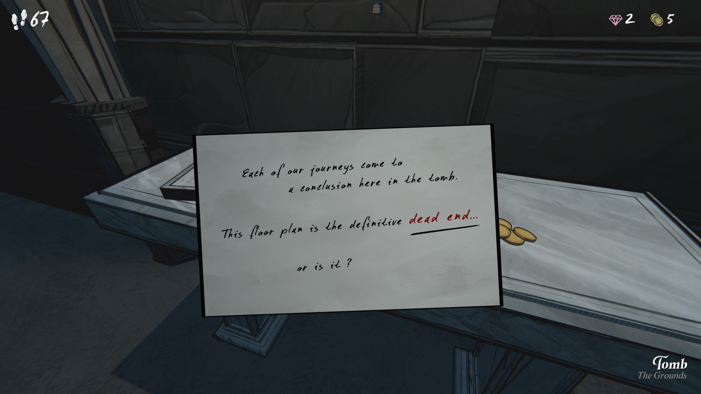
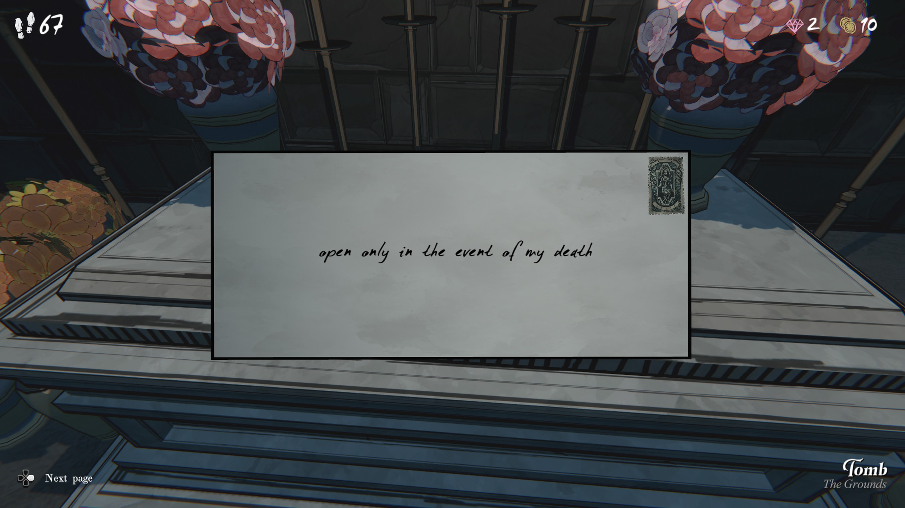
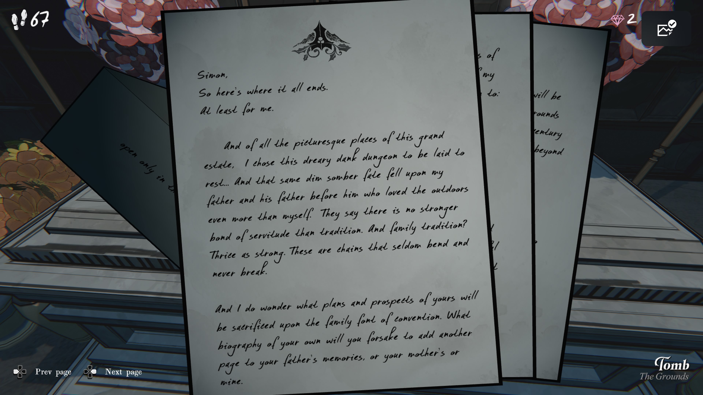
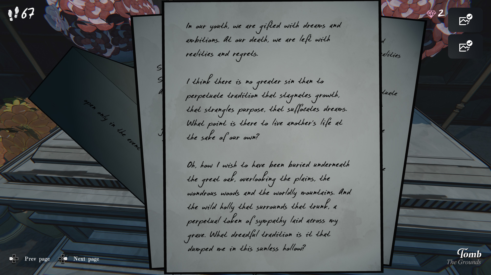
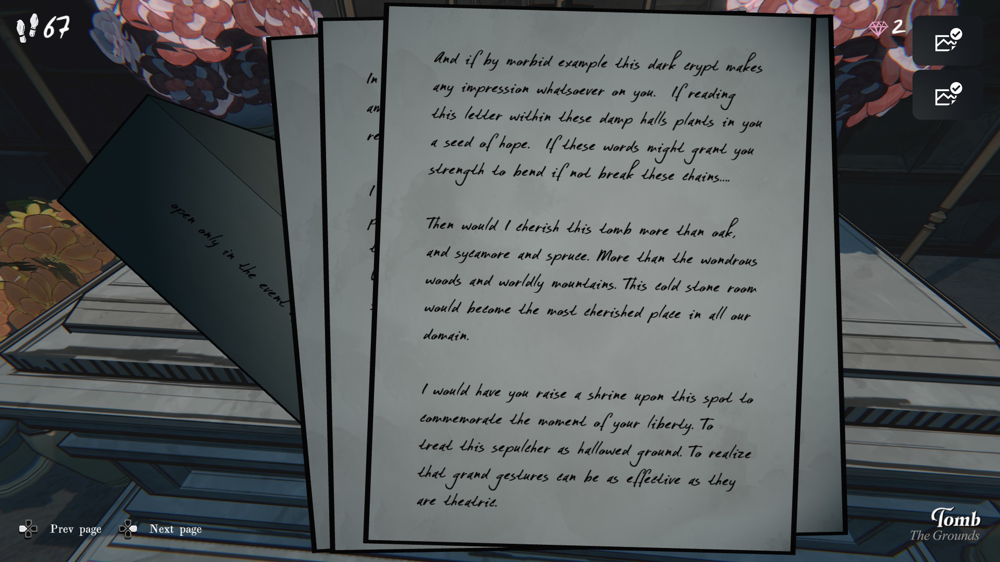
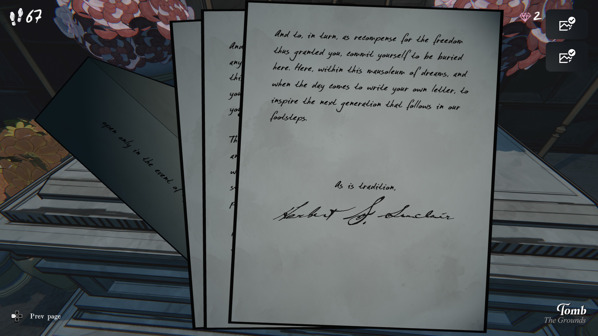

우리의 여정은 결국
이 무덤에서 끝을 맞이한다.

이 설계도는 말 그대로 **막다른 길**이다…
정말 그럴까?

**사이먼,**

여기가 내가 끝을 맞이하는 곳이다. 적어도 나에게는.

이 광대한 영지에서 그렇게나 아름다운 장소들이 있었음에도, 
나는 이 어둡고 음침한 지하 납골당을 내 안식처로 선택했다.
그리고 같은 운명이 나의 아버지, 또 그 아버지에게도 내려졌다.
그들은 나보다 더 자연을 사랑했던 사람들이었는데도.

사람들은 **전통만큼 강한 속박은 없다**고 한다.
가족의 전통이라면 더 그렇다.
그 사슬은 좀처럼 휘어지지 않고, 끊어지지도 않는다.

나는 네가 앞으로 어떤 선택을 하게 될지도 생각한다.
너만의 길과 꿈이, 또 하나의 ‘가족의 이야기’를 만들기 위해 희생될까?
아니면 부모가 남긴 기록에 너의 삶을 덧붙이는 데 그칠까?

젊을 때 우리는 꿈과 야망으로 가득하다.
그러나 죽음이 가까워지면 현실과 후회만 남는다.

나는 이렇게 생각한다.
**성장을 가로막고, 목적을 숨막히게 만들고,
꿈을 짓누르는 전통을 계속 따르는 것보다 큰 죄는 없다.**

왜 남의 삶을 대신 살면서 내 삶을 버려야 하는가?

나는 사실, 이 음침한 지하가 아니라
광활한 들판과 숲, 산을 내려다보는 큰 참나무 아래에 묻히고 싶었다.
그 나무 주변의 야생 호랑가시나무가 내 무덤을 감싸는 모습을 꿈꿨다.

그런데 이 전통은 나를 결국 이 햇빛 없는 곳에 던져 넣었다.

그래도 혹시 이 편지가 너에게 조금이라도 영향을 준다면 좋겠다.
네가 이곳에서 나의 글을 읽고, **속박을 끊을 힘**을 찾을 수 있다면 좋겠다.

그렇다면 나는 이 무덤을 오히려 소중히 여길 것이다.
참나무보다, 숲보다, 산보다 더.
우리 땅의 어느 곳보다 이 돌무덤이 가장 의미 있는 장소가 될 것이다.

그리고 그날이 오면, 네 해방을 기념해 이곳에 작은 기념비를 세워라.
이곳을 신성하게 대하라.
때때로 ‘엄숙한 의식’이야말로 가장 큰 의미를 지니기도 한다.

그리고 언젠가 네 차례가 오면, 그 자유에 대한 보답으로
너도 이곳에 묻혀라.
이 ‘꿈의 무덤’ 안에.

그리고 네 자신의 편지를 남겨라.
다음 세대가 우리의 발자취를 따라가도록, 그들에게 영감을 주기 위해.

**전통에 따라.**

**허버트 S. 싱클레어**
