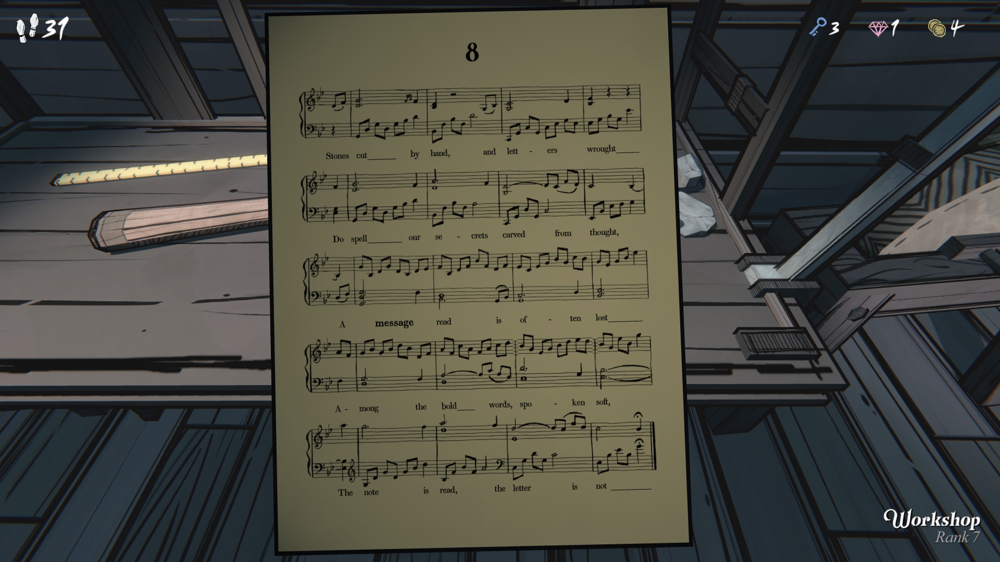

좋아요 😊
이건 Blue Prince 게임 안에서 발견되는 악보이자 시 형태의 단서예요.
악보에 적힌 가사를 한국어로 자연스럽게 번역해드릴게요.

⸻

🎼 원문

Stones cut by hand, and letters wrought  
Do spell our secrets carved from thought,  
A message read is often lost,  
Among the bold words, spoken soft,  
The note is read, the letter is not.

⸻

🇰🇷 번역

손으로 다듬은 돌, 그리고 새겨진 글자들은
우리의 생각에서 빚어진 비밀을 새긴다.
읽힌 메시지는 종종 잊혀지고,
굵은 글자들 사이의 속삭임 속에 진실이 숨어 있다.
음표는 읽히지만, 편지는 읽히지 않는다.

⸻

💡 해석 포인트

이 문장은 단순한 시가 아니라 암호나 퍼즐의 힌트예요.
	•	“A message read is often lost” → 겉으로 읽히는 문장만 보면 진짜 뜻을 놓칠 수 있다는 뜻
	•	“The note is read, the letter is not” → “악보(음표)는 읽히지만, 글자(letter)는 아니다” → 즉 음악 안에 숨겨진 글자나 순서를 찾으라는 암시예요
	•	실제로 Workshop 지역 퍼즐 중엔 악보의 음 위치, 숫자, 혹은 첫 글자로 단어를 조합하는 퍼즐이 존재합니다.

⸻

원하신다면 이 악보가 **Workshop 퍼즐에서 어떤 메커니즘(해석 방식)**으로 쓰이는지 —
예를 들어 음표 위치가 비밀번호나 문 순서와 연결되는 방식 — 까지 함께 분석해드릴까요?

